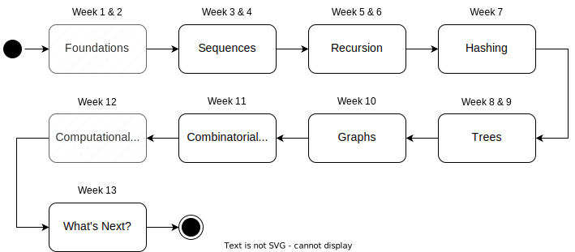

===============
Course Overview
===============

Are we going to go through a never-ending list of algorithms and
data-structure? In a sense yes, but bear in mind that the point of the
course is to practice solving problems. Algorithms and data structures
are just a means to that.

Syllabus
========

Figure `2 <#fig:syllabus>`__ details the topics we will cover. My
strategy is to start with the concepts and theories and then to go
through the data structures and algorithms that have been the most
relevant for me. The two first weeks focus on the basics: What is an
algorithm, what is a program, how does a computer executes a program,
how to measure time and memory consumption? etc. Then we apply these
again and again on basic algorithms and data structures: Records,
arrays, lists, recursion and sorting.

   The different modules we go through in 13 weeks

Then, we push on to more advanced concepts, including hashing (Week 7),
trees (Week 8, 9) and graphs (Week 10). These are all the data
structures we will study but be sure there are many more. In the
remainder we will explore two other topics where algorithms play a key
role: Combinatorial search and regular expressions. Finally we will wrap
up with looking at two other computation models: Parallel computing and
Quantum computing. The knowledge we got is very general and apply there
as well.

.. caution::

   1. This course is hard: Learning to solve computational problems
      efficiently takes practice.

   2. As you will see this course is “content-heavy”. I don’t think one
      can master the whole thing in a week or so before the final
      examination. A strongly recommend you spread your work over the 13
      weeks.
   

Why to Study This?
==================

As you may already sense, this is the foundations of Computer Science,
and in turn, of Software Engineering. Image processing, cryptography,
compilers, networks, artificial intelligence, and other “branches” of
Computer Science all develop algorithms and data structures. Consider
image processing as an example: How to detect the contour of a shape in
a bitmap? What data structure is the most suitable to represent an image
in memory? Which algorithm is the fastest? Which consume the least
memory? This course lay down the foundations to discuss, evaluate and
compare algorithms and data structures.

Besides, as a software engineer, your daily work is to solve computation
problems! Say we have to sort the score of the top players in your new
mobile game, for instance. Shall we go for a *quick sort* or a *radix
sort*? Should we roll out something of our own? It is critical to know
what already exists and where we it shines and where it falls short.

Learning Outcomes
=================

How will this course contribute to your career? By developing
competencies, skills and knowledge.

Competence
----------

Again, the point is to develop a single competence: *Solving
computational problems*, by designing algorithms and programs that a
machine can execute. This is difficult. This is not something we learn
and recite: One must practice.

Skills
------

As we practice, we will build three core skills:

#. Design algorithms and data structures tailored for a specific
   problem.

#. Argue for their correctness and be confident that the solution we
   come up with actually solves the problem at hand.

#. Compare the time and memory consumed by our algorithms to alternative
   solutions.

Knowledge
---------

This course contains a lot of knowledge, especially in the form of known
problems and their accepted solutions, which combine algorithms and data
structures. But this course is not exhaustive at all! It is just an
introduction, whose aim is only to establish the shared vocabulary and
culture to be effective as a professional. We will cover the basics:
Arrays, lists, searching, sorting, trees, graphs, hashing, etc.

.. important:: 
   The single objective of this course is to train you at solving
   computational problems. This is hard enough.

