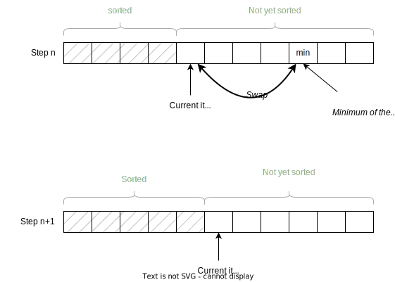
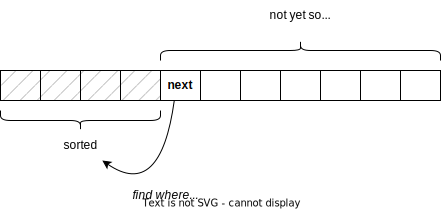

==============
Simple Sorting
==============

:Lectures: Lecture 4.4
:Objectives: Understand what is a sorted sequence and a few basic algorithms
             to sort
:Concepts: Sequences (ADT), sort stability, insertion sort
           (algorithm), selection sort (algorithm), bubble sort
           (algorithm)

Sorting is I believe *the* classical problem in Computer Science, and
especially in *algorithms and data structures*. There is probably more
than a dozen sorting algorithms, and here, we look at three simple
ones, namely selection sort, insertion sort, and bubble
sort. :numref:`sequences/sorting/overview` summarizes their runtime.

.. csv-table:: Comparison of Three Sorting Algorithms
   :name: sequences/sorting/overview
   :header: "Algorithm", "Best", "Average", "Worst"
   :widths: 20, 10, 10, 10

   "Selection Sort", ":math:`O(n)`", ":math:`O(n^2)`", ":math:`O(n^2)`"
   "Insertion Sort", ":math:`O(n)`", ":math:`O(n^2)`", ":math:`O(n^2)`"
   "Bubble Sort", ":math:`O(n)`", ":math:`O(n^2)`", ":math:`O(n^2)`"
            
What Is Sorting?
================

Intuitively, *sorting* is putting things in order. There are many
daily-life situations where we sort things. Here are a few examples:

- When we play cards and arrange our hand of cards from the smallest
  to the highest

- When we shop online, and we arrange products from the cheaper to the
  more expensive

- When we prioritize our todo-list so that we work on the most
  important item first

.. important::

   What does "bigger than" means? This depends on the problem at
   hand. Sometimes it is obvious: When we compare numbers (flight
   prices), or names, etc. Sometimes it is less obvious. For instance
   when we compare cards. Is the 8 of club "bigger" than the 2 of
   heart. It depends on the game.

For us, sorting is just another procedure of our sequence ADT. It
takes a sequence as input and yields another sequence where items are
sorted. Here is a more formal definition:

.. function:: seq.sort(s: Sequence) -> Sequence

   Returns a new sequence :math:`s'` that contains all the items from
   the given sequence :math:`s`, but ordered such that every item is
   smaller or equals than its direct follower.

   Pre-conditions:
     None

   Post-conditions:
     - (sort-1) No item is added or removed from the given sequence
       :math:`s`

       .. math::
          length(s) = length(s')
          
     - (sort-2) Every item in :math:`s'` comes from the given sequence :math:`s`

       .. math::
          \forall i \in [1, length(s)], \,
              get(s, i) \implies search(s', i) \neq 0
   
     - (sort-3) Every item in the resulting sequence :math:`s'` is
       smaller or equals than its direct follower.

       .. math::
          \forall \, i \in [1, length(s')-1], \,
             get(s', i) \leq get(s', i+1) 

Sort Stability
--------------

To illustrates sorting algorithms I use (as many) simple sequences of
integers. That's convenient, but in real-life, we often sort more
complicated data types, records especially. Consider
:numref:`sequences/sorting/stability/example` shown below, which shows
a sequence of employee records.

.. csv-table:: A sample sequence of records
   :name: sequences/sorting/stability/example
   :header: "ID", "Name", "Job Title", "Hourly Rate"
   :widths: 10, 20, 20, 15

   "00001", "Hugo First", "UX Designer",  "1650.00"
   "00002", "Pat E. Thick", "Software Engineer", "1250.00"
   "00003", "Perry Scope", "Senior Software Engineer", "1500.00"
   "00004", "Liz Erd", "Project manager", "1500.00"
   "00005", "Teri Dactyl", "Software Engineer", "1000.00"

How can we sort this table? In such case, we have to choose one field,
so called the *key*, which we will use to sort. In
:numref:`sequences/sorting/stability/example`, we used the ID field as
key.

Say we need to sort this table by hourly rate. Note that Perry and Liz
share the same rate, 1500. There are therefore two valid orderings:

- Teri, Pat, Perry, Liz, Hugo. This results from a *stable* sort,
  because for items that are equals, it preserves the their original
  ordering. Perry comes before Liz, as in
  :numref:`sequences/sorting/stability/example`.
  
- Teri, Pat, Liz, Perry, Hugo. This results from an *unstable* sort,
  because items that are equals have been shuffled. Liz comes before
  Perry, by contrast with
  :numref:`sequences/sorting/stability/example`.

In-place Sorting
----------------

Another property of sorting algorithms is whether we modify the given
sequence, or whether we output a new one, without touching the
original. When sorting affects the given sequence, we call this
*in-place* sorting.

Selection Sort
==============

.. seealso::

   - Goodrich, M. T., Tamassia, R., & Goldwasser, M. H. (2014). Data
     Structures and Algorithms in Java. 6th edition. John Wiley &
     Sons. *Section 9.4.1, p. 386*

   - Skiena, S. S. (2020). The Algorithm Design Manual. 3rd edition.
     Springer International Publishing. *Section 4.3, p. 115 -- 116*

   - `Wikipedia on Selection sort <https://en.wikipedia.org/wiki/Selection_sort>`_

The idea of the selection sort is to repeatedly extract the minimum of
the given sequence and to swap it with the first item. We can
summarize the steps as follows:

1. Mark the first item as our current position.

2. Find the position of the minimum from our current position
   (included) to the end of the sequence.

3. Swap this minimum with the current position.

4. Set our current position to the next item and return to Step 2.

:numref:`sequences/sorting/selection_sort` portrays this
process. Imagine that the given sequence is partitioned into two
segments: "Sorted" and "Not yet sorted". The "Sorted" segment contains
what we have sorted so far. It is empty when we start, but fills in as
we proceed. By contrast, the "Not yet sorted" segment contains what we
still have to sort. Initially, it contains the whole given sequence,
but gradually empties as we proceed.

.. _sequences/sorting/selection_sort:

   Selection Sort: Repeatedly swap items with the minimum of what
   remains to be sorted.
   
.. Admonition:: Selection Sort in Python

   .. code-block:: python
      :caption: A simple implementation of selection sort for the Sequence ADT.
      :name: sequences/sorting/selection_sort/python
      :linenos:
      :emphasize-lines: 4, 5
         
      def selection_sort(sequence: Sequence) -> Sequence:
          current = 1
          while current <= sequence.length:
              minimum = find_minimum(sequence, current)
              sequence.swap(current, minimum)
              current += 1
          return sequence

      def find_minimum(sequence, start) -> int:
          """
          Find the position of the minimum in the given sequence, from
          the given start position (included).
          """
          minimum = start
          current = start + 1
          while current <= sequence.length:
              if sequence.get(minimum) > sequence.get(current):
                  minimum = current
              current += 1
          return minimum

Why Does It Work?
-----------------

This *selection sort* works if it guarantees the post-conditions of its
specification. In :func:`seq.sort`, we defined the three following
ones:

- (sort-1) The resulting sequence has the same length. Selection sort
  does not add nor remove items, it simply moves them around.

- (sort-2) Every item comes from the given sequence. Again, our
  selection sort does not add nor remove any item, so this holds by
  construction.
  
- (sort-3) Every item is smaller than its direct follower. Let see how
  we can establish this.

  - To show that this is true after the loop
    (cf. :numref:`sequences/sorting/selection_sort`), we need a
    loop-invariant. Here we state the in the "sorted" segment (only),
    every item is smaller than its direct follower. This is true when
    we start as the "sorted" segment is initially empty. Besides, if
    its true after an iteration, it will be true after the next one
    because the minimum of the "not yet sorted" will be appended to
    the "sorted" items, and this minimum is necessarily greater or
    equal to the last sorted item [#fn1]_. This, of course, requires our
    :code:`find_minimum` procedure be correct as well.

.. [#fn1] Otherwise, it would have been picked by previous iterations.

How Fast Is It?
---------------

Intuitively,  the selection  sort  repeatedly searches for  :math:`n`
minimums  (provided :math:`n`  is  the length  of  the sequence)..  As
searching  for the  minimum in  a sequence  runs in  :math:`O(n)`, the
whole sorting procedure runs in :math:`O(n^2)`.

.. admonition:: Detailed Calculation
   :class: toggle

   We can use a more exhaustive approach, by counting how many
   arithmetic and logic operations.

   Let start with the :code:`find_minimum`
   procedure. :numref:`sequences/sorting/find_minimum/cost` the cost
   of every fragments and how they add up.

   .. csv-table:: Computing the runime cost of :code:`find_minimum`
      :name: sequences/sorting/find_minimum/cost
      :header: "Line", "Fragment", "Cost", "Runs", "Total"
      :widths: 5, 25, 10, 10, 10
 
      "14", ":code:`minimum = start`", "1", "1", "1"
      "15", ":code:`current = start + 1`", "2", "1", "2"
      "16", ":code:`while current <= sequence.length:`", "1", ":math:`n-s`", ":math:`n-s`"
      "17", ":code:`sequence.get(minimum) > sequence.get(current)`", "1", ":math:`n-s-1`", ":math:`n-s-1`"
      "18", ":code:`minimum = current`", "1", ":math:`n-s-1`", ":math:`n-s-1`"
      "18", ":code:`current += 1`", "2", ":math:`n-s-1`", ":math:`2n-2s-2`"
      "", "", "", "Total:", ":math:`5(n-s)-1`"

   Here I omit the cost of :func:`seq.get` and :func:`seq.length` for
   the sake of simplicity, but that does not change the validity of
   our reasoning. We end up with the function:

   .. math::
      f(n, s) = 5(n-s)-1

   We proceed the same way with the :code:`selection_sort` procedure.

   .. csv-table:: Calculating the cost of :code:`selection_sort`
      :name: sequences/sorting/selection_sort/cost
      :header: "Line", "Fragment", "Cost", "Runs", "Total"
      :widths: 5, 25, 10, 10, 10

      "2", ":code:`current = 1`", "1", "1", "1"
      "3", ":code:`while current <= sequence.length:`", "1", "n+1", "n+1"
      "4", ":code:`minimum = find_minimum(sequence, current)`", "?", "n", "?"
      "5", ":code:`sequence.swap(current, minimum)`", "1", "n", "n"
      "6", ":code:`current += 1`", "2", "n", "2n"

   What can we say about Line 4, where we call :code:`find_minimum`?
   We know that the cost depends on the parameters, :math:`f(n,s) =
   5(n-s)-1`. We also know that the variable :code:`current` increases
   by one at every iteration. We can thus calculate the total for Line 6
   as follows:

   .. math::
      g(n) & = & f(n, 1) + f(n, 2) + \ldots + f(n, n) \\
           & = & \sum_{i=1}^{n} f(n, i) \\
           & = & \sum_{i=1}^{n} 5(n-i)-1 \\
           & = & \sum_{i=1}^{n} 5n-5i - \sum_{i=1}^{n} 1\\
           & = & \left( \sum_{i=1}^{n} 5n-5i \right) - n \\
           & = & \left( 5 \sum_{i=1}^{n} n-i \right) - n \\
           & = & 5 \left(\sum_{i=1}^{n} n - \sum_{i=1}^{n}i \right) - n \\
           & = & 5 \left(n^2 - \frac{n(n+1)}{2} \right) - n \\
      g(n) & = & \frac{5n^2 - 7n}{2}

   If we plug that into the
   :numref:`sequences/sorting/selection_sort/cost`, we get a grand
   total of :math:`\frac{5n^2 + n + 4}{2}`
      
   Here we see that indeed the selection sort runs in :math:`O(n^2)`
   in the worst case.

Insertion Sort
==============

.. seealso::

   - Goodrich, M. T., Tamassia, R., & Goldwasser, M. H. (2014). Data
     Structures and Algorithms in Java. 6th edition. John Wiley &
     Sons. *Section 3.1.2, p. 110*

   - Cormen, T. H., Leiserson, C. E., Rivest, R. L., &
     Stein, C. (2009). Introduction to Algorithms. 2nd edition. MIT
     press. *Section 2.1, p. 15 -- 19*.   

   - Skiena, S. S. (2020). The Algorithm Design Manual. Springer
     International Publishing. 3rd edition. *Section 4.3.5, p. 124*.

   - `Wikipedia on Insertion sort <https://en.wikipedia.org/wiki/Insertion_sort>`_ 

As the selection sort, the insertion sort partitions the given
sequence into two segments: The first contains the items we
have sorted so far, whereas the second contains the items we still have
to sort. The insertion sort proceeds as follows:

1. We partition our sequence into two segments: *Sorted* and *Not Yet Sorted*. 
2. Initially, the first segment is empty since we have not yet
   sorted anything.
3. Let's call `next` the first item in the "not yet sorted" segment.
4. We *insert* `next` into the "sorted" segment at a position that
   preserves the ordering of the "sorted" segment. To do this, if
   `next` is smaller than its predecessor, we swap them. We do so
   until `next` lands at the correct position in the sorted segment.
5. Repeat from Step 3 until there is no more item to sort.

:numref:`arrays/sorting/insertion_sort` below illustrates this
process. We gradually sort the array by inserting each item at the
right place. As we progress, the "sorted" segment fills in while the
"not yet sorted" one gradually empties.

.. _arrays/sorting/insertion_sort:

            
   Insertion sort picks the next item and inserts it at the right
   place.

.. admonition:: A Simple Python Implementation
   :class: toggle

   :numref:`sequences/sorting/insertion_sort` shows a simple Python
   implementation of the insertion sort. I extracted the code that
   inserts items back into the sorted segment into a separate function
   :code:`insert_back`.
           
   .. code-block:: python
      :caption: Insertion Sort
      :name: sequences/sorting/insertion_sort
      :linenos:
      :emphasize-lines: 3-4, 10-12

      def insertion_sort(sequence: Sequence) -> Sequence:
          next_unsorted = 1
          while next_unsorted <= sequence.length:
              insert_back(sequence, next_unsorted)
              next_unsorted += 1
          return sequence

      def insert_back(sequence: Sequence, start: int):
          current = start
          while current > 1 \
                and sequence.get(current) < sequence.get(current-1):
              sequence.swap(current, current-1)
              current = current - 1 

              
Why Does It Work?
-----------------

When thinking about the correctness, we have to ensure the post
conditions of the :func:`seq.sort` hold.

- (sort-1) The resulting sequence has the same length. Insertion sort
  does not add new items, it simply moves them around.

- (sort-2) Every item comes from the given sequence. Again, our
  insertion sort does not add or remove any item, so this holds by
  construction.
  
- (sort-3) Every item is smaller than its direct follower. Let see how
  can we deduce this.

  - For it to hold when :code:`insertion_sort` returns, we use the
    following *loop invariant*: Items are sorted only in the sorted
    segment, that is, *up-to* the :code:`next_unsorted` item, excluded
    (cf. :numref:`sequences/sorting/insertion_sort`). As the "sorted
    segment" progressively expands, when the loop terminates, it
    eventually holds for the whole sequence. For this to be true
    however, we have to show that the :code:`insert_back` guarantees
    it.
    
  - Now we have to check that :code:`insert_back` procedure leaves the
    "sorted segment" in order. Here, our loop invariant is that the
    end of the sorted segment remains always sorted, that is from
    :code:`current` position excluded, to the :code:`start` position,
    (cf. :numref:`sequences/sorting/insertion_sort`). As we proceed
    with swapping items, this fraction expands backwards and
    eventually covers the whole sorted segment.

  
How Fast Is It?
---------------

In the worst case, insertion sort runs in :math:`O(n^2)`, where n is
the length of the given sequence. Intuitively, we have to go through
every items in the sequence, and for each item we possibly have to
"swap" them all the way back to the beginning, about :math:`n`
swaps. In total, this gives us :math:`n \times n = n^2`.

.. admonition:: Detailed Calculation
   :class: toggle

   If we want to estimate precisely the work done by the insertion
   sort implementation, we do not have to count arithmetic and logical
   operations. We can reason at a higher level: The only thing the
   insertion sort does is to "swap" items. So we will count only
   swaps. 

   Let's start with the :code:`insert_back` operation. Here we
   consider the worst case scenario, where we have to move the item
   all the way back to the first position. This takes :code:`start-1`
   swaps. We can express this as the function :math:`f(n, k)` such as

   .. math::
      f(n, k) = k-1

   Now we can move to the :code:`insertion_sort` operation. How many
   swaps does it perform? This operation does not call :code:`swap`
   directly, it only calls :code:`insert_back`. In the worst case, it
   will have to move every item back to the beginning. This happen
   when we give a sequence that is sorted the other way around, such
   as :math:`s=(4,3,2,1)`. So in this worst case, it will calls
   :code:`insert_back` as follows:

   - :code:`insert_back(sequence, 1)`
   - :code:`insert_back(sequence, 2)`
   - ...
   - :code:`insert_back(sequence, n)`

   Since we know the number of swaps each of these calls yields (i.e.,
   :math:`f(n, k)`), we can calculate their sum :math:`t(n)` as
   follows:

   .. math::
      t(n) & = & f(n, 1) + f(n, 2) + f(n,3) + \ldots + f(n,n) \\
           & = & \sum_{i=1}^{n} f(n, i) \\
           & = & \sum_{i=1}^{n} i-1 \\
           & = & \sum_{i=1}^{n} i - \sum_{i=1}^{n} 1 \\
           & = & \frac{n (n+1)}{2} - n \\
           & = & \frac{n^2 + n - 2n}{2} \\
           & = & \frac{n^2 - n}{2} \\
      t(n) & \in & O(n^2)
           
           
   

Bubble Sort
===========

.. seealso::

   - `Wikipedia on Bubble sort <https://en.wikipedia.org/wiki/Bubble_sort>`_ 
   
   - Unfortunately, in all three textbooks I recommended, *bubble
     sort* shows up in the exercises.

Bubble sort  use a simple  idea: Look repeatedly through  all adjacent
pairs  of items,  and  we swap  them  if  they are  not  in the  right
order. We keep swapping until all pairs are properly ordered. We could
summarize the steps as follows:

1. Mark the first item as our current position

2. Compare the current item with its direct successor.

3. If the two are not in order, we swap them.

4. Move the current position to the next item.

5. Continue at Step 2, until all pairs are ordered.

.. admonition:: Sample Python implementation of Bubble sort
   :class: toggle
                
   I present below a simple implementation of a bubble sort using our
   sequence ADT.

   .. code-block:: python
      :linenos:
      :emphasize-lines: 3, 7, 8
      
      def bubble_sort(sequence: Sequence) -> Sequence:
          swapped = True
          while swapped:
              swapped = False
              index = 1
              while index < sequence.length:
                  if sequence.get(index) > sequence.get(index+1):
                      sequence.swap(index, index+1)
                      swapped = True
                  index += 1
          return sequence

Why Does It Work?
-----------------

An important aspect of *bubble sort* is the behavior of its inner
loop, that is, the one that iterate over every pairs, swapping those
that are not ordered. :numref:`sequences/sorting/bubble_sort`
illustrates what happen to the largest number during on such pass.

.. _sequences/sorting/bubble_sort:

.. figure:: _static/images/bubble_sort.svg

   How bubble sort moves the largest item to the very end in one pass

What happens during one iteration of the outer loop: The
largest item gets moved to the very end. So the first iteration will
move the largest item to the end, the second iteration the
second-largest item to the next to last position, and so on and so
forth.

Indirectly, *bubble sort* also distinguishes between "sorted" and "not
yet sorted" items, but it places the "sorted items" at the end.

To prove the correctness of the bubble sort, again, we need to look
back at the three post-conditions we have defined:

- (sort-1) The resulting sequence has the same length. Bubble sort
  does not add new items, it simply moves them around.

- (sort-2) Every item comes from the given sequence. Again, our
  bubble sort does not add or remove any item, so this holds by
  construction.
  
- (sort-3) Every item is smaller than its direct follower. We need to
  look at these two nested loops.

  - As for the outer loop. we can use the following loop-invariant:
    Items in the sorted segment are always sorted (the sorted segment
    starts at position `last-current-1`, excluded). At first this
    segment is empty, so its sorted. As saw above, each iteration brings
    another item, so the segments fills in as the iterations go.

  - For this to hold, we must show that the inner loop moves the
    largest item of the "not yet sorted" segment in first position of
    the "sorted segment". Here we can use the following invariant: The
    largest item of the "not yet sorted segment remains between the
    `current` and the last position (of the not-yet-sorted
    segment). This is true before the first iteration loop, this the
    not-yet-sorted segments includes the whole sequence. This is after
    we proceed the first item: If it is the maximum, it is necessarily
    larger than its follower and will be swapped, so the invariant
    holds. Otherwise the invariant holds by definition. As the maximum
    will not be swapped beyond the beginning of the sorted segment, out
    invariant holds after the loop.

How Fast Is It?
---------------

Intuitively, in worst case, every iteration has to move the first item
all the way to the end. That would take :math:`n` swaps. As there are
:math:`n` items, that gives us an algorithm that runs in
:math:`O(n^2)`.

.. admonition:: Detailed Calculation
   :class: toggle

   As we did for the insertion sort, we can count "swaps", instead of
   diving into arithmetic and logic operations.
           
   Let us look at the inner loop first. In the worst case, it has to
   perform :math:`n-1` swap to move the first items all the way to the
   end. The first iteration would thus require :math:`n-1` swaps, the
   second one :math:`n-2`, the third :math:`n-3`, etc.

   That gives us the following total for :math:`n` elements:

   .. math::
      f(n) & = & \sum_{i=1}^{n} \left( n-i \right) \\
           & = & \sum_{i=1}^{n} n - \sum_{i=1}^{n} i \\
           & = & n^2 - \frac{n(n+1)}{2} \\
           & = & \frac{2n^2 - n^2 + n}{2} \\
           & = & \frac{n^2 + n}{2}

   We can see that indeed, bubble sort runs, in the worst case, in
   :math:`O(n^2)`.
