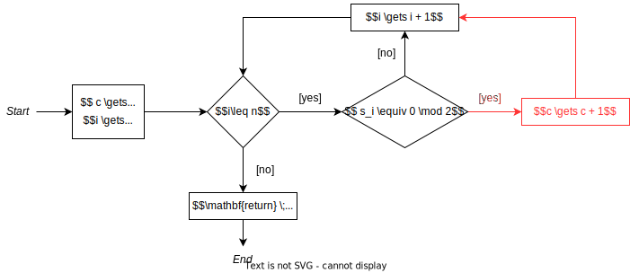
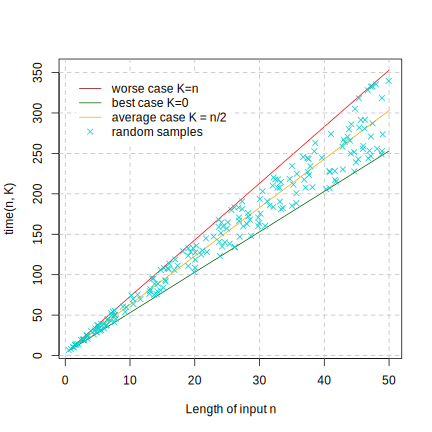

==================
Algorithm Analysis
==================

:Lecture: Lecture 1.5 :download:`(slides) <_static/analysis/algorithm_analysis.pptx>`
:Objectives: Understand how different execution scenarios of an
             algorithm
:Concepts: Best-case, worst-case, average case

A computation requires time and space, as we saw in the previous
lecture. The RAM model allows us to estimate these: The time is the
number of instructions the machine executes and the space is the number
of memory cell it uses to store intermediate results.

But what about algorithms? An algorithm solves a computational problem
and each problem instance yields its own computation. An algorithm thus
captures a family of computations, depending on the actual input that is
given.

Consider the addition algorithm we learned in primary school (see
Lecture 1.1). Adding 20 to 5 and adding to yield two different
computations. The latter takes longer because there are more digits
involved. The same goes for sorting a hand of cards. The more cards, the
longer it takes to sort.

*Algorithm analysis* (a term coined by D. Knuth in TAOCP [#taocp]_ )
helps us understand how the problem instance relates to the
performance of the computation. A detail analysis of a given algorithm
would help answer:

#. Is our algorithm equally efficient on all problem instances?

#. What kind of input are the “easiest” to solve?

#. What kind of input are the “hardest” to solve?

#. How much resources does it need for easy, hard, and average inputs?

I organized this lecture in two parts. First, we will look at how one
can model the resource consumed by an algorithm. The size of the input
is the key factor. Then we will see that often this is not feasible and
that we need to further distinguish between a worst, and best and
possible and, possibly an average case.

.. [#taocp] Knuth, D. E. (1978). The art of computer programming:
           fundamental algorithms. USA: Addison-Wesley Longman Publishing Co.
           Inc.

Modeling Algorithm Efficiency
=============================

How can we describe the relationship between the problem instances and
the computation efficiency?

A problem instance is entirely described by the associated input. For
example, to add 3 to 17, only requires these digits. At the
lowest-level, inputs and outputs are both sequences of symbols. The main
factor that affects the computation is thus the length of this sequence,
which is known as the *input size* or the *problem size*.

.. important::

   We model algorithms’ efficiency as a function from the input size to
   the measure of interest, be it time, space or something else. This
   function allows us to make predictions.

In practice though we will not reason about inputs as sequences of
symbols, but rather as data structures. This allows us to use more
meaningful input sizes. For example, if our algorithm consumes an
sequence of numbers, we will define the input size as its length. If
your algorithm consumes a matrix, the input size could be its number of
cells. If our algorithm accepts a tree structure as input, the input
size could be the number of node in the tree, etc. There is no rule of
thumb however, we are free to define the input size we see fit.

Example
-------

Consider the algorithm that computes the average of a sequence of
numbers shown on `Algorithm 1 <#alg:foundations/analysis/average>`_ . It loops
over the sequence, accumulating the total of all items it sees, and
finally divides this total by the number of items.

.. container:: algorithm
   :name: alg:foundations/analysis/average
   
   :Input: :math:`s=(s_1, s_2, \ldots, s_n)`
   :Output: :math:`\mu = \frac{1}{n} \sum_{i=1}^{n} s_i`

   .. math::
      & \mu \gets 0 \\
      & i \gets 1 \\
      & \mathbf{while} \; i \leq n \; \mathbf{do} \\
      & \quad \mu \gets \mu + s_i \\
      & \quad i \gets i + 1 \\
      & \mathbf{end} \; \\
      & \mathbf{return} \; \mu / n

Say we apply this algorithm to the sequence
:math:`\mathbf{s}=(1,1,1,1)`. :numref:`foundations/analysis/average/runtime`
breaks down the estimation of the runtime, where we account for
assignments and arithmetic and logic operations. Since the given
sequence contains four items, the loop is executed four times, which
gives a total of 24 units of time. If we give a different sequence of
the same length, say :math:`\mathbf{s}'=(2,70,32,1)`, we would still
get 24 units of time. By contrast, if we feed a longer sequence, say
:math:`\mathbf{s}''=(11,27,3,41,53,6)`, we get 34 units of time. The
longer the sequence, the longer it takes to average it. The *input
size*, which is the length of the sequence :math:`n`, directly
controls the runtime.

.. margin::

   .. figure:: _static/analysis/images/average.svg
      :name: foundations/analysis/average/wc/plot

      Runtime of the average algorithm

.. csv-table:: Estimating the runtime of our average algorithm.
   :name: foundations/analysis/average/runtime
   :header: "Line", "Runs", "Unit Cost", "Total"
   :widths: 30, 10, 10, 10

   ":math:`\mu \gets 0`", "1", "1", "1"
   ":math:`i \gets 1`", "1", "1", "1"
   ":math:`\mathbf{while} \; i \leq n \; \mathbf{do}`", "1", "n+1", "n+1"
   ":math:`\quad \mu \gets \mu + s_i`", "2", "n", "2n"
   ":math:`\quad i \gets i + 1`", "2", "n", "2n"
   ":math:`\mathbf{return} \; \mu / n`", "1", "1", "1"
   "", "","**Total**", "5n + 4"

We can model the runtime of this algorithm by a function that maps the
length of the given sequence to the time our algorithm takes. This is
our efficiency model, which we can see on
:numref:`foundations/analysis/average/wc/plot`

.. math::

   \begin{aligned}
     time : \mathbb{N} & \to \mathbb{N} \\
     time\; (n) & = 5n + 4
   \end{aligned}

We have not talk here about space and memory consumption, but the same
approach applies. One can express how the number of memory cells used
varies according to the input size. In our example, the memory does not
vary, because whatever sequence our algorithm gets, it always used two
variables :math:`i` and :math:`sum`. So we get a model like
:math:`space(n) = 2`. We will see later in the course dynamic memory
allocation and recursion yield more “interesting” memory consumption
models.

Best, Worst, and Average Cases
==============================

In many cases, we cannot directly build an efficiency model tough,
because there are things that we do not know. Consider for example the
algorithm shown on
:numref:`foundations/analysis/count_even/flowchart`, which counts the
even numbers. If we look at a specific input, we can estimate the
resources needed for the computation, because we know how many numbers
are even. But at the “algorithm” level, we do *not* know whether the
computation will go through the conditional statement (the red path on
:numref:`foundations/analysis/count_even/flowchart`).

.. margin::

   .. container:: algorithm
      :name:

      :Input: :math:`s=(s_1, s_2, \ldots, s_n)`
      :Output: :math:`c`, the number of even numbers in :math:`s`

      .. math::
         & c \gets 0 \\
         & i \gets 1 \\
         & \mathbf{while} \; i \leq n \; \mathbf{do} \\
         & \quad \mathbf{if} \; s_i \equiv 0 \! \mod 2 \; \mathbf{then} \\
         & \quad \quad c \gets c + 1 \\
         & \quad \mathbf{end} \\
         & \quad i \gets i + 1 \\
         & \mathbf{end} \; \\
         & \mathbf{return} \; c         

   An algorithm that count the numbers of the even
   numbers in a given sequence (as a flowchart).

To cope with this, we need to refine our efficiency model and
distinguish between alternative scenarios. For a given input size we
will separate:

-  The *best case*, where the least amount of resources is needed. That
   is the fastest scenario if we talk about time or the scenario that
   use the least memory.

-  The *worst case*, which requires the most resources. If we consider
   runtime, that is the slowest execution paths ; if we consider the
   memory, that is the scenario that consumes the most memory cells.

-  If we make more assumptions about what kind of inputs is most likely,
   we can identify an “average” scenario, which reflects the performance
   one should expect reasonably. It generalizes the best and worst
   cases.

.. important::

   Best, worst and average cases all assume a given input size. They
   capture additional variations (besides the input size) due to the
   actual data given.

Best & Worst Cases
------------------

What can we do if we do not know the execution paths taken by a
computation? We need to understand which “path” through the program
consumes most resources (or least) and what input triggers it.

In our example, for example we have to understand what input would
*always* exercise the “:math:`c \gets c + 1`” instruction (red path on
:numref:`foundations/analysis/count_even/flowchart`), and which input
would necessarily avoids it.

Worst Case
^^^^^^^^^^

For the count-even algorithm, the worst case implies to always
increment the :math:`count` variable. This happens only if every
single given number is even. In that case, we can fill in a cost
table, because we then know that we will increment :math:`n` times
(see in :numref:`foundations/analysis/count_even/best_worst`). We
obtain a “worst case” of :math:`time\,(n)=7n+4`.

Best Case
^^^^^^^^^

For the count-even algorithm, the best case implies that we *never*
increment the :math:`count` variable. This occurs when there no even
number at all. In that case, we can also fill our cost in
:numref:`foundations/analysis/count_even/best_worst` with 0 runs. We
obtain a “best case” of :math:`time\,(n)=5n+4`.

.. margin::

   .. figure:: _static/analysis/images/count_even.svg

      The best and the worst case

.. csv-table:: Estimating the runtime of counting even numbers.
   :name: foundations/analysis/count_even/best_worst
   :header: "Algorithm", "Best", " ",  " ", "Worst", "", " "
   :widths: 30, 10, 10, 10, 10, 10, 10

   "", "Cost", "Runs", "Total", "Cost", "Runs", "Total"
   ":math:`c \gets 0`", "1", "1", "1", "1", "1", "1"
   ":math:`i \gets 1`", "1", "1", "1", "1", "1", "1"
   ":math:`\mathbf{while} \; i \leq n \; \mathbf{do}`", "1", "n+1", "n+1", "1", "n+1", "n+1"
   ":math:`\quad \mathbf{if} s_i \equiv 0 \! \mod 2 \; \mathbf{then}`", "2", "n", "2n", "2", "n", "2n"
   ":math:`\quad\quad c \gets c + 1`", "2", "0", "0", "2", "n", "2n"
   ":math:`\quad i \gets i + 1`", "2", "n", "2n", "2", "n", "2n"
   ":math:`\mathbf{return} \; c`", "1", "1", "1", "1", "1", "1"
   "", "", "**Total:**", "5n+4", "", "**Total:**", "7n+4"

   
Average Case
------------

Now we have described the worst and best possible cases, what shall we
expect in average? Without further information about the input, we
cannot say anything for sure. We can make assumptions however.

Returning to our previous example, the only thing we know is that we
are given a sequence :math:`\mathbf{s}` of length :math:`n`, but we do
not know how many items are even. Assume we know for a minute, that is
the sequence contains :math:`k` even item. Then, we could fill our
cost table (see :numref:`foundations/analysis/count_even/best_worst`),
because the instruction :math:`c \gets c + 1` would runs exactly
:math:`k` times. To model the *average case*, we have to make a guess
at how likely it is to get an input without any even numbers, how
likely it is to get only one even number, etc.

.. important::

   The average case always requires additional assumptions that describe
   which inputs are the most likely. The analysis thus often relies on
   probabilities.

To formalize this, we will use Probability Theory. We define a random
variable :math:`K` that captures how many even numbers there are.
:math:`K` obeys the following rules:

-  By definition, :math:`K` is defined over the set of values
   :math:`\Omega_K` that are lower or equal to :math:`n`, since there
   cannot be more even number than there are numbers in the sequence.
   That is
   :math:`\Omega_K =\{ k \in \mathbb{N} \, | \, 0 \leq k \leq n \}`.

-  All values are equally probable. Formally, that means that K follows
   a uniform distribution, such that
   :math:`\mathbb{P}[K=k] = \frac{1}{n}, \; \forall \, k \in \Omega_K`.
   This the weakest assumption we can make: I see no reason to expect
   one input more than another.

This random variable :math:`K` generalizes the best and worst cases with
:math:`K=0` and :math:`K=n`, respectively. We can thus update our
efficiency model as follows:

.. math::

   \begin{aligned}
     time: \mathbb{N} \times \Omega_K & \to \mathbb{N} \\
     time\,(n, K) & = 5n + 2K + 3 
   \end{aligned}

Now the average case is given by the expected value of our model, which
we can calculate as follows:

.. math::

   \begin{aligned}
     \mathbb{E}[time(n, K)] & = \sum_{k \, \in \, \Omega_K} \mathbb{P}[K=k] \cdot time(n, k)  \\
                            & = \sum_{k=0}^n \frac{1}{n} \cdot time(n, k) \\
                            & = \frac{1}{n+1} \sum_{k=0}^{n} 5n + 2k + 3 \\
                            & = \frac{1}{n+1} \left[ \sum_{k=0}^{n} 2k + \sum_{k=0}^n 5n + 3 \right] \\
                            & = \frac{1}{n+1} \left[ n (n+1)  +  (n+1) (5n + 3) \right] \\
                            & = n + 5 n + 3 \\
                            & = 6n + 3
   \end{aligned}

:numref:`foundations/analysis/count_even/full_model` portrays the full
efficiency model.  It shows the best, the worst and the average case
as straight lines that relate the length of the given sequence to the
runtime. In addition, it shows specific “runs” as crosses with
randomly chosen numbers of even numbers.

   Visualizing the complete efficiency model for counting even numbers
   

Again, while we have not talked here about the memory, the same method
does apply. For most “simple” algorithms the memory is constant however
and it does not require any calculation besides counting variables.

Conclusions
===========

We saw here how to describe the efficiency of an algorithm using
functions that maps the size of the given inputs to time, space or any
else. A single function is however not enough to describe the whole set
of computations an algorithm yields, so we characterize this set using a
worst and best cases. We even went as far as to compute an average case
that captures how the distribution of inputs affect the performance. In
the next lecture we will see how to compare such models.
