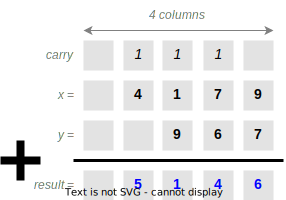
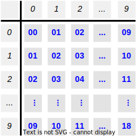
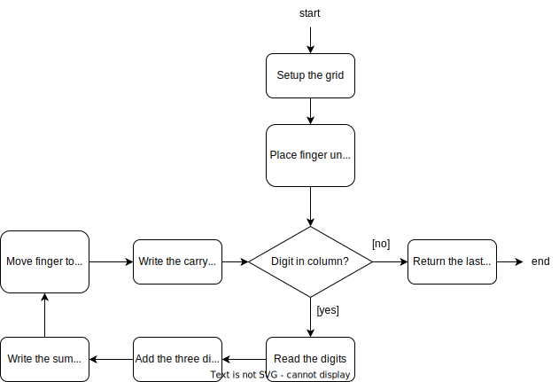

============
Computations
============

:Lecture: Lecture 1.1 :download:`(slides) <_static/computation/welcome.pptx>`
:Objectives: Understand core Computer Science concepts
:Concepts: Data, Computation, Computational Problem, Algorithm, Data Structure

Welcome! I am very happy to welcome you in this course about *Algorithms
& Data Structures*. I prepared this course as well as I could with the
time, resources and energy I had, and I do hope you will find it
relevant. Many thanks to the students who took this course in the past:
Their feedback has been very valuable. Let me know what you think!

Despite its official title, this course is first and foremost about
*solving “programming” problems*. This is the most valuable tool a
programmer has because it applies across technologies, languages and
frameworks. The things I learned 15 years ago still apply to my daily
engineering work. This is *rock-solid*. But it is also a competence that
is *hard to get*.

I would like to kick-off this course by presenting three core concepts:
Computation, algorithms, and data structures.

Computation
===========

.. index::
   single: computation
   single: data

Computer Science (CS) is all about computers—as the name says. The term
“computer” stands however for anything that “computes”, be it a person,
a machine, or something else. What CS is really about is *computation*.
But what is that? A computation is a transformation of *data*: It
consumes some data and produces some data. That leads us directly to
next question: What is *data*?

Data is an overloaded term. Intuitively, it stands for more or less
anything: Texts, numbers, pictures, audio recording, etc. In CS however,
data is anything that we can write down using *a finite set of symbols*.
For example, the word “computation” is a sequence of letters, each drawn
from the Latin alphabet. Numbers shows up as combinations of Arabic
digits. Your smart phone computes using “binary” data, encoded using
binary alphabet (0 or 1) …These are various forms of data.

.. important::

   *Data* represents anything that can be encoded using a finite
   number of symbols

Symbols vs. Concepts
--------------------

.. index:: symbol

Symbols are things that stands for something else, often a more
“abtsract” thing. For example, in the Western civilization, the symbol
☠ stands for danger or death. Numbers are another example
of “concepts” that we can write using a variety of symbols. We can write
the concept of “two tens” as a combination of Arabic digits “20”, as the
combination of Roman digits “XX”, or even with “14” in hexadecimal. We
can also use Latin alphabet like in “twenty”, etc. All those represent
the same number. CS is only concerned with symbols and not with their
interpretation, which is peculiar to human cognition.

.. important::

   A **computation** transforms of a sequence of symbols into another.

Computational Problems
----------------------

.. index:: computational problem

We use computations to solve problems, but only some problems can be
solved by a computation! These are so-called *computational problems*,
and are the focus of this course.

A computational problem defines what are the valid outputs for any given
input given. Such a problem sets the requirements for a computation.
Here is an example:

.. math::

   \begin{aligned}
     add: \mathbb{N} \times \mathbb{N} &\mapsto \mathbb{N} \nonumber \\
     add\, (x, y) & \mapsto x + y
     \label{eq:addition}
   \end{aligned}

The problem specified by Equation `[eq:addition] <#eq:addition>`__ is to
find the number that is the sum of the two given inputs :math:`x` and
:math:`y`. Note that the ’\ :math:`+`\ ’ symbol I used above does not
tell us how to actually carry out an addition. It simply denotes the
concept of “addition” and I assume that everyone recognizes it and know
what it means (associativity, neutral element, etc.). I bet you already
know a procedure to find the sum of two natural numbers. In general,
problems describe relations between concepts: natural numbers, addition,
etc. They say nothing about the symbols to use.

There are many types of computational problems. In *decision problems*
for example, the output is a Boolean value (yes or no), such as testing
whether a given number is a prime number. We will also meet search
problems, where we have to find a particular value in a larger set, such
as finding all the pairs of numbers whose sum is 10. Another type of
problem is counting, where we try to figure out the number of solutions
to a another problem. Finally there is also optimization problems, where
we search for the solution that maximizes a specific criterion. All
these problems can be described as mathematical functions.

.. important::

   A **computational problem** maps input data to output data.
   Mathematical functions clearly capture how these inputs map to the
   appropriate output.

Algorithms
==========

.. index:: algorithm

How do we solve a *computational problem*? We need a procedure, that is
a “recipe” that we can follow blindly—just like a machine—to get to the
result. These recipes or procedures are *algorithms*: Sequences of
instructions that solve a computational problem.

.. _foundations/computation/addition:

   Adding two natural numbers

Returning to the addition of two natural numbers, I have learned in
primary school an algorithm to do that.
:numref:`foundations/computation/addition` shows the setup I would
use to add to 967. Here are the steps I would follow:

#. Write down the two given numbers in a grid and align their digits by
   significance: The least significant digit on the rightmost column.
   Keep a free row on top for possible carry-overs and another row below
   for the result. Keep an extra column on the left for a possible final
   carry-over.

#. Put your finger under the rightmost column.

#. If there is no digit to read, stop here.

#. Otherwise, read the digits in this column.

#. Add these digits to get their sum and the associated carry-over.

#. Write down this sum into the bottom cell of the current column.

#. Move your finger to the next column on the left.

#. If there is a carry-over, write it down in first cell.

#. Return to Step 3.

This is our first algorithm: A recipe to add natural numbers! The notion
of algorithm is however not so well defined. I am not aware of a single
formal definition, upon which everyone agrees. In this course, I will
reuse the definition given by D. Knuth in
TAOCP [#taocp]_ where he specifies the four following
properties:

-  An algorithm has *inputs and outputs*. It consumes some data and
   produces some results. Our addition takes two natural numbers and
   outputs their sum.

-  An algorithm is *finite*: It must terminate at some point and cannot
   have an infinite number of steps. Our addition of two numbers stops
   when we have added all pairs of digits.

-  An algorithm is *well-defined*, and each step is non-ambiguous. In
   our addition, each step is about reading, adding, comparing or
   writing numbers. Children do not need to know how to add, they can
   use an addition table that gives both the result digit and the carry
   over as shown on :numref:`foundations/computation/addition_table`.

-  An algorithm is *effective* and can be carried out by either a
   machine or human with pen and paper in a finite amount of time. Each
   step must be feasible. As for the addition, children add numbers this
   way on a daily basis, in a few minutes.

.. [#Taocp] Knuth, D. E. (1978). The Art of Computer Programming
   Algorithms: Fundamental Algorithms. Vol. 1. USA: Addison-Wesley
   Longman Publishing Co., Inc.

   
.. _foundations/computation/addition_table:
   

   The *addition table*: Each cell contains two digits: the *carry
   over* and the sum.

Do not confuse algorithm and computation. As for the addition, the
*algorithm* is the list of steps to follow whereas the *computation* is
what happen when a computer (a machine or a child) goes through a
particular addition.

Data Structures
===============

.. index:: data structure

An algorithm is a sequence of steps that manipulates data to solve a
problem. It necessarily produces and transforms data and needs a place
to store it—a sort of “scratch pad” if you will. This scratch pad is the
*data structure*: How we organize the data our algorithm manipulates.

In our addition example
(see :numref:`foundations/computation/addition`) we use a “grid” that
stores all the data, including the two given numbers (the inputs), the
result (output) and the carryovers (intermediate results). This grid
has four rows and one more column than the longest given numbers has
digits.

Many data structure are possible for a given algorithm, and an
appropriate data structure enables efficient algorithms. We will discuss
various schemes such as lists, trees, graphs, etc. Each has its
strengths and its weaknesses. As for our addition, we could have written
it down as a list of symbols:

.. math:: 4179 + 967 = 5146

But that would have been harder. Primary school teachers use this grid
because it makes things easier for children: They
proceed—mechanically—by columns. Only when we become more fluent do we
get rid of the grid. The very same applies to algorithms: Appropriate
data structure is the key to their efficiency.

.. important::

   An *algorithm* is a *finite* sequence of *non-ambiguous*
   instructions, which processes its inputs to produce the solution of a
   *computational problem*. To work efficiently, algorithms store their
   data into dedicated *data structures*.

   
How to Describe an Algorithm?
=============================

Once we have solved a computational problem, we have to communicate our
solution: Explain it to our colleagues or simply to “program” a machine
to do it. So, what is the best way to describe an algorithm? If the
computer is a person our bullet list of plain English instructions may
very well do the job. If the computer is a machine however, there we
will have a hard time to get the machine understand all the nuances of
our natural languages. Let us review a few commonly used approaches:
Natural languages, flowcharts, pseudo-code and programs.

Using Natural Language
----------------------

The simplest way to describe an algorithm is to use plain English,
though this often lead to ambiguous text, which rules out the use
machines. This is what we used in the previous section for our addition
algorithm.

Using Flowcharts
----------------

.. index:: flowchart

Another human-friendly way is to use a flowchart as shown on
:numref:`foundations/computation/flowchart`. In a flowchart, the steps
of an algorithm are shown as boxes connected by arrows. The flowchart
syntax distinguishes between various type of steps such as processes,
document, decisions, references, etc using different shapes.
Figure `1 <#fig:flowchart>`__ only use “processes” (shown as
rectangles) and decisions (shown as diamond). A flowchart makes the
control structure (loops and decisions) very explicit, but the
graphical syntax is quite space consuming and may not scale to complex
algorithms.

.. _foundations/computation/flowchart:

   The grade-school addition algorithm, portrayed as a flowchart.

   
Using Pseudo-code
-----------------

.. index:: pseudocode

A third human-friendly solution is to use *pseudo-code*. The idea is to
combine control structures common in most imperative programming
languages (loops and conditional) with plain English or mathematical
notation in order to express succinctly the main idea of an algorithm.
For our addition algorithm we could write something like:

.. parsed-literal::
   :name: foundations/computation/pseudocode

   **Input** `x`: Sequence of digits
   **Input**: `y`: Sequence of digits
   **Output**: `z`: Sequence of digits such as z = x + y

   1. Setup x and y into a grid ;
   2. Place your finger under the right most column.
   3. **while** there are digits in the column do:
      a. Read these digits;
      b. Add them up to get the sum and the carry;
      c. Write down this sum in the bottom cell;
      d. Move your finger to the next column on the left;
      e. Write down this carry in the top cell;
   3. *return* the last row of the grid;

Using a Program
---------------

.. index:: program

All these representations help communicate algorithms with people, so
they all rely on natural language, which may be ambiguous. We will see
in the next Lecture how we can convert pseudo code into machine code,
that code that machine can understand.

.. important::

   There is an direct relationship between the actions we stipulate in
   an algorithm and the capabilities of the computer we use to execute
   it.

Conclusions
===========

Hopefully, you have a better grasp at what this is about. Let us get
started! There is a lot or ground to cover. Please reach out if you have
any questions or if you find mistakes in the slides, the lectures notes
or the lab sessions.
