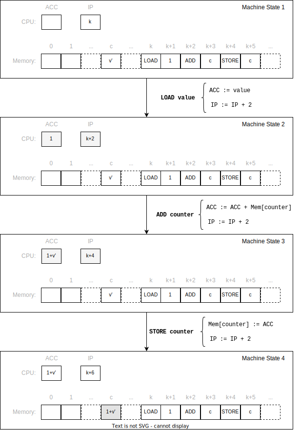
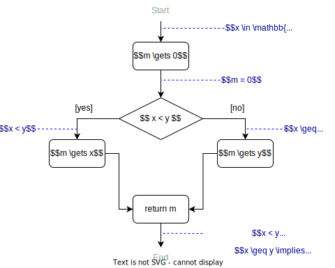
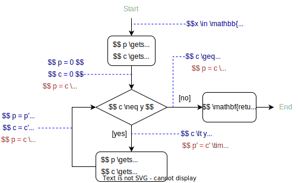

===========
Correctness
===========

:Lecture: Lecture 1.3 :download:`(slides)
          <https://studntnu-my.sharepoint.com/:p:/g/personal/franckc_ntnu_no/EbVXtGOrTcNDs276AbcjSAkBtlpMzqk6QFVf-MnTUIHulQ?e=dLbeyG>`
:Objectives: Check whether an algorithm is correct
:Concepts: termination, proof, loop invariant, test

An algorithm is the sequence of steps one must follow to solve a
computational problem. To automate that, we encode our algorithms into
*programs* that machines can execute, mechanically. We saw for example
how random access machines can load and execute programs as sequences of
8 basic instructions.

For this to work in real-life, everything must be right: Our algorithm
must solve our problem, the program must accurately *implement* our
algorithm, and the machine must not fail in middle of the execution.
That is a lot that must be correct at the same time.

*Correctness* is more important than ever. Health, energy, banks,
transportation …everything rely on software. Algorithms are embedded
everywhere into these much larger infrastructure where the smallest bug
is always expensive and sometimes—unfortunately—deadly. For example, on
June 4, 1996, the European space launch vehicle Ariane 5 exploded after
40 s. of flight because of a software error. 500 millions USD gone up in
smoke [#nuseibeh1997]_. Why do software fail? This is a
difficult question that goes way beyond the scope of this course.
Building a system is difficult and encompasses people, resources,
project management, software, hardware.

In this lecture, we focus on algorithms and we assume that both the
machine and the translation into an executable programs work just fine.
What remains is *functional correctness*: Ensuring that the algorithm
adheres to its specification. We will look at two techniques, namely
*testing* and *formal verification*, as means to establish this
functional correctness, and, in turn, to deepen our understanding of
algorithms.

.. [#nuseibeh1997] Nuseibeh, B. (1997). Ariane 5: Who Dunnit? IEEE
   Software, 14(3), 15–16.

Functional Correctness?
=======================

.. index:: correctness ; definition

.. margin::

   .. code-block:: python
      :caption: An algorithm that never terminates (as a Python
                program)
      :name: foundations/correctness/infinite_loop

      def infinite_loop():
          x = 0
          while x < 100:
              x = 1
         
We saw that an algorithm solves a computational problem. This problem is
often described by a mathematical function that tells us the which
output to expect given a valid input. This function forms *the
specifications* of our what our algorithm should do. This is the
*requirements*. To be *totally correct*, an algorithm must do two
things:

-  It must *terminate* at some point. In other words, the RAM must reach
   an ``HALT`` instruction and stops. If it does not always terminate,
   the algorithm is, at best, partially correct.
   :numref:`foundations/correctness/infinite_loop` gives an example
   of algorithm that never terminates.

-  When it terminates, it must produce a correct output for all possible
   valid inputs. A correct output satisfies the constraints set by the
   problem. An algorithm is thus *incorrect* if one can found at least
   one set of inputs for which the algorithm output is wrong.

.. important::

   Provided with valid inputs, an algorithm ...

   -  is *partially correct* when it *never* terminates with an
      incorrect result, but may not terminate.

   -  is *totally correct* when it *always* terminates with a correct
      result.

Equation :eq:`foundations/correctness/problem` gives an example of the challenge we face: How can
we be sure that an algorithm *correctly* solve a problem?  The
function defines the problem, which is to multiple to numbers
:math:`x` and :math:`y`.  :numref:`foundations/correctness/product`
shows a possible algorithm (in pseudocode) which repeatedly adds
:math:`x`, :math:`y` times.

.. math::
   :label: foundations/correctness/problem
      
   \begin{aligned}
       product: \mathbb{N} \times \mathbb{N} & \to \mathbb{N} \\
       product \, (x, y) & =  x \times y
    \end{aligned}

.. code-block::
   :caption: Pseudocode that computes the product of two given numbers
   :name: foundations/correctness/product
   
   Input x: a natural number
   Input y: a natural number
   Output p: p = x × y

   current ← 0;
   product ← 1;
   while current < x
      product ← product × y;
      current ← current + 1;
   end
   return product
   
          
.. important::

   - A *pre-condition* is what we assume to hold *before* we execute
     instructions
   
   - A *post-condition* is what we assume to hold *after* we executed
     instructions

Formal Proofs
=============

.. index:: correctness ; proof

Can we prove *functional correctness*? Establishing rigorously that our
algorithm delivers on its promises would give us a strong sense of
confidence. Let us see how to proceed.

Deduction System for Algorithms
-------------------------------

.. index:: correctness ; deduction system

A formal proof [#harrison2008]_ is *not* a natural
language argument. It is a calculation that follows precise rules. It
relies on a formal notation so that that proofs can be checked
mechanically—by a so-called *proof assistant*.

.. [#harrison2008] Harrison, J. (2008). Formal proof—theory and
   practice. Notices of the AMS, 55(11), 1395–1406.

We have all been through proofs in school.  Equation
:eq:`foundations/correctness/proof_example` below shows an example
taken from Calculus, which establishes that :math:`(x+1)^2 = x^2 +
2x + 1`.

.. math::
   :label: foundations/correctness/proof_example

   \begin{align}
         f(x) &= (x+1)^2 \\
              &= (x+1) \cdot (x+1) \tag{definition of square} \\
              &= [x\cdot(x+1)] + [1\cdot(x+1)] \tag{distributivity of $\times$ over $+$} \\
              &= [x\cdot(x+1)] + (x+1) \tag{neutral element of $\times$} \\
              &= [(x \cdot x)+ (x \cdot 1)] + (x+1) \tag{distributivity of $\times$ over $+$} \\
              &= [(x \cdot x)+ x] + (x+1) \tag{neutral element of $\times$} \\
              &= [(x^2)+ x] + (x+1) \tag{definition of square} \\
              &= x^2+ x + x + 1 \tag{associativity of $+$} \\
              &= x^2+ 2x + 1 \tag{factorization} \\
   \end{align}

Equation :eq:`foundations/correctness/proof_example` illustrates the
key components of a formal proof. A proof is a sequence of statements,
each derived by an agreed-upon *inference rule*. The first statement,
called the *premises*, captures what we assume to be true. The last
statement, called the *conclusion*, captures a new fact we logically
derive from the premises.

The same applies directly to algorithms and data structures. The
statement we make describe the state of the machine. We use the
semantic defined for RAM instructions (see
:numref:`foundations/computer/ram_instructions`) as rules to explain why
the state of the machine changes over
time. :numref:`foundations/correctness/deductive_system` portrays this
parallel between reasoning about algorithm correctness and reasoning
about numbers.

   The *deductive system* for algorithm correctness

.. important::

   The *syntax* and the *semantic* of the language (i.e., the
   computation model) are the basis of the *deduction system* we use to
   reason about the correctness of algorithm.

.. _`sec:assignment`:

Assignments
-----------

Let us go step by step. What would it mean to prove the correctness of a
single assignment? Consider the following for example.

.. math:: counter \gets counter + 1

Intuitively, if this is correct, we expect that the value :math:`v` of
our :math:`counter` variable *after* the assignment be equal to the
value of that same variable *before* it (denoted by :math:`v'`) plus
one. What we want to prove is thus :math:`v = v' + 1`.

We know from the RAM computation model, that this translates into the
following three instructions, where ``counter`` denotes the memory
address where :math:`v` is stored.

.. code-block:: asm
   :caption: A Simple Assignment in Assembly Code
   :name: foundations/correctness/assignment/asn

     LOAD  1
     ADD   counter
     STORE counter

But for the machine to execute these three instructions, the machine
should be correctly setup. We need the following assumptions:

-  Our three instructions are loaded into memory, in contiguous cells,
   say from address :math:`k` to :math:`k+5`. Remember each instruction
   occupies two memory cells, one for the operation code and one for the
   argument.

-  The machine is ready to execute the first instruction, that is
   :math:`\mathit{IP} = k`.

-  The memory contains the value :math:`v'` at address ``counter``, but
   this address cannot be in the interval :math:`[k, k+5]`.

   Correctness of assignment: Unfolding the effect of three
   instructions on machine state.
   
:numref:`foundations/correctness/machine_states` details how the
machine state changes as it progresses through our three
instructions. The first instruction resets the :math:`\mathit{ACC}`
register to 1 and increments :math:`\mathit{IP}` by 2 to move on to
the next instruction. The second instruction adds the value contained
at address :math:`c` to the :math:`\mathit{ACC}` register, and
increments the :math:`\mathit{IP}` by
2. At that point, the :math:`\mathit{ACC}` register holds
:math:`1 + v'`. Finally, the last instruction stores the value of the
the :math:`\mathit{ACC}` register at address :math:`c`. As we expected,
the counter variable thus has value :math:`1+v'`. QED.

.. important::

   Reasoning about correctness at the RAM instruction level is possible
   but tedious. From now on, we will reason at the pseudo-code level.

Conditionals
------------

.. margin::

   .. code-block:: python
      :caption: Finding the minimum between two given numbers
      :name: foundations/correctness/minimum

      def minimum(x, y):
          m = 0
          if x < y:
             m = x
          else:
             m = y
          return m

Moving on to the next pseudocode construct: The
conditional. :numref:`foundations/correctness/minimum` shows an
algorithm to select the smallest of two numbers.
:numref:`foundations/correctness/minimum/flowchart` shows the same
algorithm as a flow chart. How can we show that whatever two numbers
we give, this algorithm will return the minimum?

   Reasoning about Conditionals: Merging knowledge gained in all branches

From now on, we will reason—informally—on pseudocode (or code), but
everything could be taken on RAM assembly, should we need a formal
proof, as we did for the assignment (cf.
Section `2.2 <#sec:assignment>`__).

To prove that our algorithm is correct, we first have to expand the
definition of what is the minimum of a set. One possible definition is
that the minimum must smaller or equals to all elements, which
translates as follows:

.. math:: \forall \, (x, y) \in \mathbb{Z}^2, \; m = f(x,y) \implies m \leq x \, \land \, m \leq y

We need to show that this holds whatever is the path taken through the
conditional. We can use a *prove by cases* here, following the two cases
of the conditionals as follows.

-  if :math:`x<y`, the machine executes the *then*-clause, where we set
   :math:`m` to :math:`x`. From :math:`m \gets x` we can conclude that
   :math:`m = x`, and, since in that branch we know that :math:`x<y`, we
   can conclude that :math:`m<y`.

-  if :math:`x \geq y`, the machine execute sthe *else*-clause, where we
   set :math:`m` with :math:`y`. The semantics of this assigment (cf.
   Section `2.2 <#sec:assignment>`__) allows us to conclude that
   :math:`m = y`, and, since in this branch we know that
   :math:`x \geq y`, we know that :math:`m < x`.

Iteration
---------

.. index:: loop invariant

.. margin::

   .. code-block:: python
      :caption: Computing the product of two numbers (Python program)
      :name: foundations/correctness/product/pseudocode
                   
      def product(x, y):
          product = 0
          counter = 0
          while counter < y:
             product = product + x
             counter = counter + 1
          return product
      
Consider now a simple loop (i.e., an iteration) that computes the
product of two given numbers. Our algorithm (cf.
:numref:`foundations/correctness/product/pseudocode` and
:numref:`foundations/correctness/product/flowchart`) implements the
following definition of the product:

.. math:: x \times y = \overbrace{x+x+\ldots+x}^{y\;\mathrm{times}}

The loop is the most difficult construct because it raises the question
of *termination*: Is this an “infinite loop”? For the assignment and the
conditional, the termination directly follows from the machine following
the sequence of instructions. We will first look at the partial
correctness and then at the termination.

   Reasoning about loops: Finding the *loop invariant*

Partial Correctness
^^^^^^^^^^^^^^^^^^^

The definition of our algorithm output tells what we need to prove:
:math:`p = x \times y`. We assume that both :math:`x` and :math:`y` are
positive integers. To reason about the correctness of loops, we need to
find the loop *invariant*, a property such that:

-  We can derive our “aim” from it. In our case, we must be able to
   derive that :math:`p = x \times y`.

-  It holds *right after* the loop.

-  It holds *right before* the loop

-  It hold *before and after* the loop body

Put simply, the loop invariant is always true [#loop_invariant]_. In our case the loop
invariant is that :math:`p = c \times x`. To prove the correctness of a
loop, we must therefore prove that the invariant holds, always. This is
done by *induction*: First we show it holds before the loop ; then, we
show that if it holds before the loop body, it will hold after. We can
do that as follows:

.. [#loop_invariant] Such invariant often relates to what the loop is
                     doing and finding depends our understanding.

-  Before the loop body, we know that both :math:`p` and :math:`c` are
   equal to zero. So by definition, we get :math:`0 = 0 \times x`, which
   holds.

-  If we assume that :math:`c'` and :math:`p'` are the values before the
   loop body executes, we assume that the invariant holds, that is
   :math:`p' = c' \times x`. After the loop body, we obtain
   :math:`c = c'+1` and :math:`p=p'+x`. By direct substitution, we get
   :math:`p = (c'+1) \times x`.

It holds. Now, once the machine exits the loop, we know that
:math:`c = y` (i.e., the negation of the loop test) and that
:math:`p = c \times x` (our invariant). By substitution, we establish
that :math:`p = x \times y`. QED.

Termination
^^^^^^^^^^^

Now we know that if we exit the loop we get the correct result, but are
we sure we will ever exit the loop? Proving termination is difficult and
there are algorithms for which we do not yet know whether they terminate
of not [#collatz]_.

.. [#collatz] See for example the `Collatz conjecture
              <https://en.wikipedia.org/wiki/Collatz_conjecture>`_

One way to approach loop termination is to identify a *loop variant*,
which, just like the invariant, is a value :math:`v` that behaves as
follows:

-  :math:`v` decreases (strictly) at each time we go through the loop

-  :math:`v \geq 0` steam from the condition of the loop and the
   invariant

The idea is to show that this variant decreases as long as we remain in
the loop, and that the program exit the loop once it becomes negative,
that is, the program terminates.

Returning to our product algorithm (see
:numref:`foundations/correctness/product/flowchart`) we can define
:math:`v=y-c`.  Initially, since :math:`c` is set to zero, we got
:math:`v=y`. In each iteration, :math:`v` decreases by one, as we
increment :math:`c`. We know from the pre-condition that :math:`y \in
\mathbb{N}` so :math:`v` is necessarily positive in the loop, and will
be zero only when the loop condition breaks. This program terminate.

.. important::

   When reasoning about correctness, loops are the main obstacle.

   -  We tackle *partial correctness* by identifying a *loop invariant*,
      which is true, before, after and during the loop.

   -  We tackle *termination* by identifying a *loop variant*, which is
      a quantity that decreases with each iteration and can only be
      negative after the loop.

We see that reasoning formally about correctness is possible but non
trivial. This has been formalized by Floyd and Hoare in what is known
as *axiomatic semantics* [#axiomatic]_. We will see how the same
concepts can be use for testing our programs more pragmatically.

.. [#axiomatic] This goes beyond the scope of this course, but see the
                following if you are interested:
                
                Winskel, G. (1993). The formal semantics of
                programming languages: an introduction. MIT Press,
                Chap. 6

.. important:: Building rigorous proofs is difficult and time
               consuming Reasoning about the correctness nonetheless
               ground our understanding about why algorithm works.
                

Testing
=======

.. index :: correctness ; testing

Whereas proofs aims at showing it always work, testing aims at showing
there are case where our algorithm does not work.

In practice, proofs are used mainly in Academia and in safety-critical
systems, where lives are at stake. So what do we do in other system?
We test. That is, we run our program with selected inputs for which we
know what output to expect. We get anything else, we have found a
problem.

The Principles
--------------
      
The core idea is to prepare a set of correct input/output pairs (called
*test cases*), and to test our program against these. If our program
yields any other results, we have found a “bug”.
:numref:`foundations/correctness/product/test-cases` details four test cases
for the product algorithm. Finding good test cases is the Art of
testing.

.. csv-table:: Four test-cases for the product algorithm
   :header: "X", "Y", "Product"
   :widths: 5, 5, 10
   :name: foundations/correctness/product/test-cases
                  
   "0", "0", "0"
   "5", "1", "5"
   "42", "10", "420"
   "27", "13", "351"
   
Running the tests
^^^^^^^^^^^^^^^^^

How do we run an algorithm? It depends on what we have. If we only have
the algorithm, say some pseudocode, we go pen-and-paper and derive the
result from the semantic of our computation model. Alternatively, if we
have an actual program and a machine, we can simply run it and see what
comes out.

Test Cases Selection
^^^^^^^^^^^^^^^^^^^^

.. index:: testing ; test case selection

How many *test cases* do we need? Obviously, there is an infinity of
possible inputs :math:`(x,y) \in \mathbb{N}^2`. The more test cases our
program passes, the more confident we get but we never be able to test
them all. This is the main problem with testing: It cannot show the
absence of errors, only their presence. When all our tests pass, all we
know if that our program worked for theses cases, but we know nothing
about other cases.

Ideally, we want to test all the relevant scenarios with as few test
cases as possible. There are many *coverage criteria* that we can use to
identify relevant scenario. Here are a few common ones [#testing]_:

-  *Covering all statements* implies a set of test cases that exercises
   all the statement of our program. In our product example a single
   test case would be needed, for example :math:`(4, 3)`.

-  *Covering all edges* implies a set of test cases that exercises every
   “edge” in associated flow chart (see Figure `6 <#fig:product>`__).
   Testing our product algorithm with :math:`(0,0)` would not provide
   edge-coverage.

-  *Condition coverage* implies a set of test cases that each condition
   (or sub-condition) has been evaluated to both true and false. In our
   example, testing with :math:`(4,3)` would be sufficient because the
   condition :math:`c \neq y` would initially be false but eventually be
   true.

.. [#testing] Aniche, M. (2022). Effective Software Testing. Manning
              Publication Co. Chap 2 and 3.
  
.. _termination-1:

Termination
^^^^^^^^^^^

What happen if our program does not terminate for some of our
test-case?  We will never know. If we decide to interrupt the
machine, maybe we have been too impatient and a few more seconds might
have allowed our program to conclude? In practice, we have to decide
on a maximum duration beyond which we consider that the program will
never terminate.

.. important::

   Testing is very useful in practice, but it comes with important
   theoretical implications:

   -  It cannot show the absence of “bugs”, only their presence.

   -  It cannot show non-termination.

Diagnostic Using Assertions
---------------------------

.. index:: testing ; assertions

What should we do when a test case fails. We have found a “bug” and we
need to fix it. To do this we need to understand what has happened:
Reasoning about our program/algorithm. Fortunately, we have seen how to
do just that when looked at proofs, and the core ideas are very useful
to diagnose problems.

We instrument our programs and add assertion to verify that our
expectation are met. There is no necessity here, but the general
convention is to check the pre-condition and invariants so as to “fail
fast”. If the execution starts on a wrong premises, if often fails in
strange and unexpected manner that are difficult to debug.
:numref:`foundations/correctness/assertions` shows our Java program
instrumented with additional assertion. Not that Java has built-in
exceptions for illegal arguments (and for illegal states). We also use
the “assert” keyword whose purpose is precisely to check invariants [#assertions]_.

.. [#assertions] In Java, the :code:`assert` keyword require the JVM to
                run with :code:`--enable-assertions` option. This
                enable disabling assertions in production.

.. code-block:: java
   :caption: Implementing Assertions in Java
   :name: foundations/correctness/assertions 

     static int product(int x, int y) {
       if (x < 0)
          throw new IllegalArgumentException("x must be positive");
       if (y < 0)
          throw new IllegalArgumentException("y must be positive");
       int product = 0;
       int counter = 0;
       while (counter != y) {
         assert product == counter * x: "Broken loop invariant";
         product = product + x;
         counter = counter + 1;
       }
       return product;
     }

It may look silly to obscure our program with all these assertions. In
practice however the code will be changed soon or later and these
assertions act as “executable” documentation of our intention for the
person in charge.

Automated Testing
-----------------

.. index:: testing ; automation

In practice we do not test manually. Not only does testing take time,
but we have to test every time we change our programs. To be productive,
we need to be able to test quickly and often so that we know if we have
broken anything.

To do that, we write a separate piece of software that exercises our
program. We rely on frameworks that help us write and runs our tests,
such as `JUnit <https://junit.org/junit5/>`__ for Java,
`Mocha <https://mochajs.org>`__ or `JEST <https://jestjs.io>`__ in
JavaScript,
`unittest <https://docs.python.org/3/library/unittest.html>`__ in
Python, etc. Such *automated tests* are now the *de facto* approach in
Industry. Figure `8 <#fig:junit>`__ illustrates a possible Java
implementation of our product algorithm and a simple test case. When
turned into a program, a test case includes three steps: Arrange, act,
assert.

#. Arrange. First we prepare the input (and possible the state of
   program).

#. Act. We call our program with the selected inputs and collect the
   results.

#. Assert. We verify whether the post-condition of our program holds.

.. container:: float
   :name: fig:junit

   .. code:: java

        class MyProductTests {

          @Test
          void testProduct1() {
            assertEquals(20, product(4, 5));
          }

          @Test
          void testProduct2() {
            assertEquals(0, product(0, 0));
          }

        }

.. important::

   Proving, testing and debugging all require a detailed understanding
   of the algorithm. The concepts we use to build proof directly support
   debugging programs:

   -  Pre-conditions are checked explicitly at the beginning of
      procedures.

   -  Invariants are checked within the procedures using assertion

   -  Post conditions are checked in the automated tests.

Conclusion
==========

That is it for algorithms correctness. This was just a peak at the
problem of *Software Verification*—a field in itself. We now know
precisely how to assess the behavior of our algorithms and programs.
Keep in mind that while these techniques may seem tedious, nothing
replace them to learn and understand a new algorithm. We will then look
at comparing algorithms that solve the same problems to which one
perform better.
