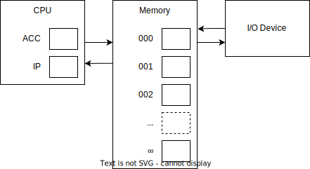
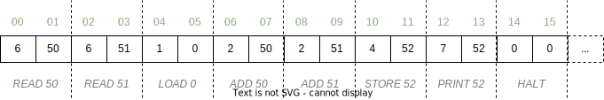
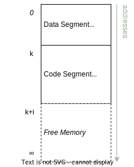
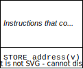
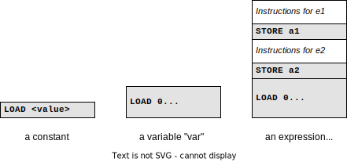
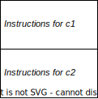
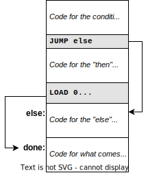
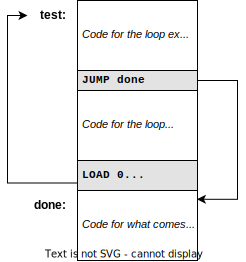

========
Computer
========

:Lecture: Lecture 1.2 :download:`(slides) <_static/computer/ram.pptx>`
:Objectives: Understand how the machine works
:Concepts: CPU, Memory, Instruction, Program

We have already clarified several important concepts: Computation, data,
algorithm and data structure. In a nutshell, a computation is a
“mechanic” transformation of input data into output data. An algorithm
is the sequence of steps that specifies what computation to carry out in
order to solve a computational problem.

What about the *computer*? We saw that anything that can run a
computation fits, but a primary school pupil and an Intel chip does not
really look the same, do they? In this lecture, we will look at these
“computing devices”. We will define a model of an “ideal” computer,
which will help us answering:

#. What capabilities does our computer has?

#. What does it mean for the computer to use any of these capabilities?

#. How can we describe an algorithm for that computer to execute?

This “ideal” computer is the *model of computation* that we will assume
in this course. It is called *random access machines* and underpins all
imperative programming languages such as C, Pascal, Ada, Java, Python,
etc. This may is a little theoretical, but this model of computation
will be quite handy when discuss the correctness and efficiency of
algorithms. Other programming paradigms such as functional programming
(e.g., LISP, Haskell, OCaml), logic programming (e.g., Prolog), hardware
circuits or parallel computing use different models of computation.

I broke down this lecture into two parts. First we look at random access
machines, how they are structured, what they can do, and how we can
instruct them using *machine code*. Then we will see how one can convert
the pseudo code we used in the first lecture into their machine code.

Random Access Machines
======================

In this course, the machine we will use is called a *random access
machine* (RAM) [#cook73]_. It closely resembles an actual “computer”,
with a CPU and a memory, which makes it the\ *de facto* standard in
algorithms and data structure course. RAM answers three questions:

#. How does the machine acquires, stores and retrieves data?

#. What elementary computation can the machine do?

#. How does the machine follow instructions?

.. [#cook73] Cook, S. A., & Reckhow, R. A. (1973). Time bounded random
   access machines. Journal of Computer and System Sciences, 7(4),
   354–375.
   
RAM is an abstract machine, a “model” of computation: It is a blueprint
for machine that carries out computation. A real computer is much more
complicated.

Architecture
------------

.. index::  RAM ; architecture

A random access machine (RAM) is a machine that mimics the behavior of
a real computer. It manipulates data encoded as symbols. It has the
three following components, also shown on
:numref:`foundations/computer/ram`.

-  An *I/O device* that the machine uses to exchange sequence of symbols
   with the user. We can think of this as a screen and a keyboard for
   example.

-  A *memory*, which contains infinitely many *cells*. Each memory cell
   can contains an arbitrary long sequence of symbols (i.e., a number)
   and has a unique identifier (so called its address) which will allow
   to read and write anywhere in this memory.

-  A central processing unit (CPU) that carries out arithmetic and
   logical operations (addition, subtraction, comparison, etc.). This
   CPU has two *registers*, namely ``ACC`` and ``IP`` which can both
   hold any arbitrary long sequence of digits.

   -  ``ACC`` is the *accumulator* and holds intermediate results.

   -  ``IP`` is the *instruction pointer*, and contains the address
      where the next instruction is located.

.. _foundations/computer/ram:

   A random access machine has three main components: A CPU, a
   memory, and I/O device

This RAM model remains a gross simplification. In a “real” computer,
both the memory cells and the register have a limited size and can only
contain a fixed number of binary digits (8, 16, 32 or 64 bits). This is
known as the *word*-size, and captures the number of symbols the machine
processes in one go. Besides, a real machine also has a limited memory,
as well as many more registers with dedicated purposed.

For the RAM to do anything, we need to tell it what to do. We can
basically instruct it to move symbols from the memory to the CPU, to
apply some elementary symbol manipulations on the CPU’s registers and to
move symbol from the CPU back to the memory.

.. _`sec:machine-code`:

Machine Code
------------

To use our RAM, we need to express our algorithm as a single list of
instructions. :numref:`foundations/computer/ram_instructions` details
the eight instructions available. Each instruction is a pair of
natural numbers, say :math:`(1, 12)` for instance. The first one is
the *operation code* (OP) and indicates which action the machine must
executed (read, write, add, etc.). The second number is the *operand*
and details what piece of data the machine must manipulate. So the
pair :math:`(1, 12)` means ``LOAD 12``, because :math:`1` is the
operation code of the ``LOAD`` instruction, and 12 is the operand. The
machine would thus override the value of the ``ACC`` register with the
sequence of symbols “12”, as explained in
:numref:`foundations/computer/ram_instructions`.

.. index::  RAM ; instructions

.. _foundations/computer/ram_instructions:

   The eight RAM instructions. ``Mem[a]`` denotes the value stored in
   memory at the address :math:`a`. Note that ``LOAD`` takes a value
   whereas all other instructions accept an address. Any OP outside
   the range :math:`[1, 7]` stops the machine.

Where are these instructions?
^^^^^^^^^^^^^^^^^^^^^^^^^^^^^

These RAM instructions are stored in the main memory, just like any
other data. Since each instruction is a pair of number, a program is
just a long list of numbers. Each instruction thus occupies two
contiguous memory cells, one holding the operation code and one holding
the operand. This number are the *machine code*.

.. important::

   The RAM model defines the actions (i.e., the 8 instructions from
   :numref:`foundations/computer/ram_instructions`) that the machine
   understand. In this course we will assume an *augmented RAM*, which
   also includes instructions for multiplication, division,
   exponentiation, etc.

Execution
---------

Let us see how does the machine computes. It reads two memory cells
from the address contained in the ``IP`` register. Then it executes
this instruction following the semantic given in
:numref:`foundations/computer/ram_instructions`, and start over. The
machine stops as soon as it meets an unknown operation code.

:numref:`foundations/computer/machine_code` shows the complete memory
layout of a tiny program that reads two numbers and print their
sum. The program stores the numbers given by the user at addresses 50
and 51 respectively. It also stores the sum at address 52.

.. _foundations/computer/machine_code:

   The *machine code* of a programs that reads two values from the I/O
   devices, add them, and print their sum back.
   

Given the memory shown by :numref:`foundations/computer/machine_code`,
provided that ``IP`` is initially set to 0, the RAM proceeds as
follows:

#. The machine reads the memory cells at address 0 and 1 and interprets
   these as ``READ 50``. It thus reads a value through the I/O device
   and stores it at the given address (i.e., 50). It then increments
   ``IP`` by 2, which now contains the value 2.

#. With ``IP`` holding 2, the machine reads addresses 2 and 3, which it
   interprets as ``READ 51``. It thus reads another value through the
   I/O device, stores it at address 51, and then increments ``IP`` by 2
   again.

#. With ``IP`` being now 4, the machine reads addresses 4 and 5, which
   it interprets as ``LOAD 0``. It thus sets the ``ACC`` register to 0,
   and then increments ``IP`` by 2.

#. ``IP`` now equals 6, The machine reads addresses 6 and 7, which it
   interprets as ``ADD 50``. It thus adds the value at address 50 to the
   ``ACC`` and then increments ``IP`` by 2.

#. ``IP`` now contains 8. The machine reads addresses 8 and 9, which it
   interprets as ``ADD 51``. It thus adds the value stored at address 51
   to the ``ACC`` register and then increase IP by 2.

#. ``IP`` is now 10 and the machine reads addresses 10 and 11, which it
   interprets as ``STORE 52``. It writes the value contained in the
   ``ACC`` register into the memory at address 52. It then increments
   ``IP`` by 2, which now holds 12.

#. It now reads addresses 12 and 13, and interprets it as ``PRINT 52``.
   The machine thus sends the value stored at address 52 to the I/O
   devices. It then increments ``IP`` by 2.

#. The next instruction, starting at address 14 stops the machine.

.. admonition:: Is this RAM powerful enough?
   :class: toggle

   RAM is a *model of computation*: It defines how we carry out
   computations. We saw however that different computational problems
   requires different algorithms, which in turn, may require different
   machines. Other models of computation exist such as Turing machines,
   finite state machines, :math:`\lambda`-calculus, cellular automata,
   etc.  If you wonder whether there is a universal machine that can
   solve all computational problems, well, yes. Turing machines is the
   most powerful computation model we know so far, and RAM and a few
   others are as powerful. This equivalence is known as the Church-Turing
   thesis. This is a theoretical question that goes beyond the scope of
   this course but we will briefly come back to that (see Lecture
   12.2). See any textbook on Computability Theory [#fernandez2009]_ if
   you are curious.

.. [#fernandez2009] Fernandez, Maribel (2009). Models of computation:
  an introduction to computability theory. Springer Science &
  Business Media.

Programming Languages
=====================

Now we have a *programmable machine*: We can give instructions as pairs
of numbers and the RAM executes them. Its instruction set is powerful
enough to compute anything computable. The problem is that writing such
long list of numbers (i.e., machine code) is painful and error prone, to
say the least.

Assembly Code
-------------

.. index:: RAM ; assembly code

.. _foundations/computer/asm_memory_layout:

   Separating data from instructions with dedicated memory
   segments. Data goes from address 0 to :math:`k−1` and code from
   :math:`k` to :math:`k+i−1`.

Machine code does not fit humans’ capabilities. We do not want to uses
addresses but rather names or labels that are meaningful to the problem
at hand. To cope with this, we can use an *assembly language* that is
better suited to us and that we can convert to machine code. An assembly
program closely resembles the underlying machine code but provides the
following:

-  *Symbolic names* for memory addresses, so that we can refer to them
   with something that is meaningful to us.

-  *Instruction mnemonics* so that we can refer to machine instructions
   by name rather than by operation code.

- *Memory Layout* that clearly delineates between memory cells that
  store program instructions from those that store program data
  (input, output, intermediate results) (See
  :numref:`foundations/computer/asm_memory_layout`).`

.. code-block:: asm
   :caption: An sample assembly program that reads two numbers and
             print their sum
   :name: foundations/computer/asm_example
                
          .data
          n1    WORD  0   
          n2    WORD  0
          sum   WORD  0
          
          .code
   main:  READ  n1       ; read two numbers n1 and n2
          READ  n2
          LOAD  0        ; add n1 to n2
          ADD   n1
          ADD   n2      
          STORE sum      ; save as "sum"
          PRINT sum      ; show the result
          HALT

:numref:`foundations/computer/asm_example` shows an “hypothetical”
assembly program for our program that reads two numbers and prints
their sum from :numref:`foundations/computer/machine_code`. It
defines a data and a code segments (denoted by ``.data`` and ``.code``
respectively) as shown on
:numref:`foundations/computer/asm_memory_layout`. The data segment
defines three variables ``n1``, ``n2``, and ``sum``, whose size is one
word and whose initial value is “0”. The code segment contains eight
instructions, using mnemonics instead of operation codes and symbolic
names instead of addresses. The entry point of the code segment is
given the name “main”. We can use this label “main” to refer to the
address of the first instruction.

Now we can use an *assembler* to convert our assembly code into
machine code and get a long list of numbers 6, 50, 6, 51, …, 0, 0 (see
:numref:`foundations/computer/machine_code`) we can feed to the
machine. The actual numbers generated depends on the where the
assembler decides to place the code and data segments into memory.

High-level Code
---------------

Still writing assembly code is not practical. What we would like is some
sort of pseudocode with control structures such as loops and conditional
statement. These are what we find in general purpose programming
languages such as C, Java or Python. Here are the most common
constructs:

- *Arithmetic and logic expressions* such as :math:`a + c \geq
  25`. They may refer to variable by name and contains explicit
  numbers (literals).

- *Assignments* such as :math:`v \gets e` which assigns the value of
  resulting from expression :math:`e` the name :math:`v`.

- *Conditionals* such as :math:`\mathbf{if} \; e \; \mathbf{then} \;
  c_1 \; \mathbf{else} \; c_2` which executes code :math:`c_1` only
  if the expression :math:`e` holds, and code :math:`c_2` otherwise.

- *Loops* such as “:math:`\mathbf{while} \; e \; \mathbf{do} \; c`”
  which executes code :math:`c` as long as the expression :math:`e`
  holds.

- *Sequence of instructions* such as :math:`c_1 ; c_2` which executes
  :math:`c_1` and then :math:`c_2`.

We need to translate these constructs into assembly code either
explicitly by a *compiler* or executed line by line by an *interpreter*.
Without diving into the nitty-gritty details of compilers it is critical
to understands this translation scheme.

.. important::

   A *program* is an algorithm encoded using *a programming language*.
   This program can be converted into *machine code*.
   
   There are *many ways* to encode a given piece of program into
   machine code. It is important to understand—at a high-level—how a
   compiler does that.

Assignments
^^^^^^^^^^^

   Layout of an assignment :math:`v \gets e`

An assignment associates a name to an expression. For example the
assignment “:math:`\mathit{age} \gets 42`” associates the label “age”
to the number 42. In the general case, the left hand side of an
assignment is an expression: A symbolic name, a number, or an
arithmetic expression (see below).
:numref:`foundations/computer/assignment` illustrates one possible
assembly code for assignments.

Expressions
^^^^^^^^^^^

Evaluating an expression consists in building a sequence of instructions
that leaves the result in ``ACC`` register. The first thing RAM compiler
would do is to break long arithmetic expressions into a sequence of
binary assignments, according to the precedence rules of arithmetic
operators. Consider the following example:

.. math::

   x + (2y + 3) \equiv \left\{
       \begin{array}{rl}
         v_1 & \gets 2 \times y \; ; \\
         v_2 & \gets v_1 + 3 \; ; \\
         \mathit{ACC} & \gets x + v_2 \; ;
       \end{array} \right.

-  If the given expression is a single number :math:`n`, then a single
   ``LOAD`` instruction suffices, and the compiler just emits
   :math:`\mathtt{LOAD} \; n`. It directly sets ``ACC`` with :math:`n`
   as shown on :numref:`foundations/computer/expressions`

- If the given expression is a symbolic name, say :math:`v` for
  instance, then, we need two instructions: One to reset the ``ACC``
  register to zero and another one to add the value contained at the
  address associated with the given
  symbol. :numref:`foundations/computer/expressions` illustrates this
  case.

- If the expression is an arithmetic operation, say “:math:`e_1 +
  e_2`” for instance, we have to first evaluate :math:`e_1`, and store
  the result in a temporary location, then evaluate :math:`e_2` and
  store the result in another temporary location and finally, add
  these two temporary values together.
  :numref:`foundations/computer/expressions` shows the assembly
  code yielded for an addition.

   Compilation of different forms of arithmetic and logical
   expressions

Sequences of Commands
^^^^^^^^^^^^^^^^^^^^^

   Compilation of a sequence :math:`c_1 ; c_2`

A sequence of code blocks “:math:`c_1 \, ;\, c_2`” specifies the
execution order of these two blocks. To this end, we either place the
ASM code for :math:`c_2` right after the one for :math:`c_1` (as shown
on :numref:`foundations/computer/sequence`, or place a ``JUMP`` in
between.

Conditionals
^^^^^^^^^^^^

   Compilation of a conditional statement such as :math:`\mathbf{if}
   \; e \; \mathbf{then} \; c_1 \; \mathbf{else} \; c_2`

A conditional selects between two blocks of code :math:`c_1` and
:math:`c_2` depending on the evaluation of an expression :math:`e`. To
compile these, we need first to compile this expression :math:`e`. In
case this expression does not hold, we “jump” to the code resulting
from the compilation of the “else” block :math:`c_2`. Otherwise we
continue with the “then” :math:`c_1` block followed by a ``JUMP`` to
the end of the conditional.
:numref:`foundations/computer/conditional` illustrates this layout.

Loops
^^^^^

              
   Compilation of a *while loop* :math:`\mathbf{while} \; e \; \mathbf{do} \; c`

Finally, a loop executes a given block of code :math:`c` as long as
the guard expression :math:`e` holds. To do that, we place the code to
evaluate the expression :math:`\neg \, e`, followed by a ``JUMP`` to
the end of the loop, in case the expression does not hold. Then, we
append the assembly code of :math:`c` followed by a ``JUMP`` back to
the evaluation of the guard expression, as shown in
:numref:`foundations/computer/loop`.

.. _`sec:example`:

Example
-------

Now we can describe an algorithm in pseudo code and understand what
assembly code and machine could possibly execute this program.

.. code-block::
   :caption: An algorithm to compute the product of two numbers
   :name: foundations/computer/product

      Input: (x,y) ∈ N2
      Output: p = x × y

      product ← 0;
      counter ← 0;
      while counter < y
      do
          product ← product + x;
          counter ← counter + 1;
      end
      return product

Returning to the multiplication of two natural numbers,
:numref:`foundations/computer/product`
and :numref:`foundations/computer/product/asm` show the pseudo code
and some possible assembly code. During the compilation, we assume
that input are read from the I/O device and output printed.

.. code-block:: asm
   :caption: Computing the product of two given numbers
   :name: foundations/computer/product/asm

           .data
           x       WORD    0
           y       WORD    0
           product WORD    0
           counter WORD    0

           .code
   main:   READ    x               ;
           READ    y               ;
   loop:   LOAD    0
           ADD     counter
           SUB     y
           JUMP    done            ; while (counter < y)
           LOAD    0               ; do
           ADD     product         ;
           ADD     x               ;
           STORE   product         ;    product <- product + x
           LOAD    1               ;
           ADD     counter         ;
           STORE   counter         ;    counter <- counter + 1
           LOAD    0               ;
           JUMP    loop            ; done
   done:   PRINT   product
           HALT

Conclusion
==========

We now know the difference (and the relationships) between a problem, an
algorithm and a program. We also know how a machine can store and
execute algorithms using programs written in machine code. Next, we will
see how one can establish the correctness of an algorithm: Providing
evidences that an algorithm actually solves a given problem.
