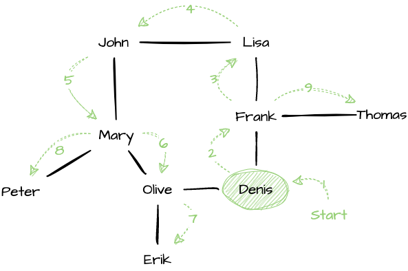
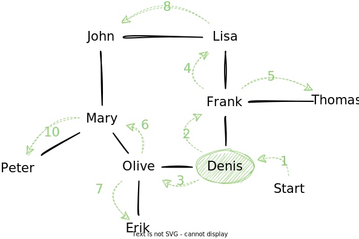

Graphs as Data Structures
=========================

.. index:: Data Structure ; Graph, Graph ; Data Structure

Besides being a mathematical concept, a graph is also a data
structure. Intuitively, the queries one runs against a graph include:

Graph ADT
---------

.. index:: Abstract Data Type ; Graph

There is no agreement on what the graph abstract data type should
be. There are indeed many operations that one can perform on a graph,
finding cycles, components, unreachable vertices, etc. Graphs are
highly application dependent. I put below what seems to me like a
common minimal set of operations:

empty
   Create a new empty graph, that is an graph with no vertex or edge.

add vertex
   Add a new vertex to the given graph.  What identifies the
   vertex, as well as the information its carries depend on the problem
   and or the selected internal representation.

remove vertex
   Delete a specific vertex from the given graph. Either this raises an
   error if the selected vertex still has incoming or outgoing edges, or
   it removes these edges as well.

add edge
   Create a new edge between the two given vertices. What identifies this
   edge as well as the information it carries depend on the problem and the
   chosen internal representation.

remove edge
   Remove the selected edge.

edges from
   Returns the list of edges whose *source* is the given vertex

edges to
   Returns the list of edges whose *target* is the given vertex

is_adjacent
   True if an only if there exist an edge between the two given vertices

Graph Representations
---------------------

There are many ways to implement the graph ADT above, from a simple
list of edges to more complicated structures using hashing. As always,
the one to use depends on the problem at hand. Let see the most common
ones.

In the general case, there is some information attached to either the
vertex, the edges, or to both. The internal representation we choose
impact however the implementation (and the efficiency) of the
operations.

.. _graph_representation:

+------------------+-------------+-------------------+-----------------------+
| Operations       | Edge List   | Adjacency List    | Adjacency Matrix      |
+==================+=============+===================+=======================+
| add vertex       | O(1)        | O(1)              |                       |
+------------------+-------------+-------------------+-----------------------+
| remove vertex    | O(V)        | O(V)              |                       |
+------------------+-------------+-------------------+-----------------------+
| add edge         | O(1)        | O(1)              |                       |
+------------------+-------------+-------------------+-----------------------+
| remove edge      | O(E)        | O(V+E)            |                       |
+------------------+-------------+-------------------+-----------------------+
| edges from       | O(E)        | O(deg(v))         |                       |
+------------------+-------------+-------------------+-----------------------+
| edges to         | O(E)        | O(deg(v))         |                       |
+------------------+-------------+-------------------+-----------------------+
| is adjacent      | O(E)        | O(1)              |                       |
+------------------+-------------+-------------------+-----------------------+

Edge List
~~~~~~~~~

The simplest solution is simply to store a sequence of edges, where
each edge includes a source vertex, a target vertex and a label. With
this design a vertex is identified by its index in the underlying list
of vertices, and an edge by its index in the underlying list of edges.

   Overview of an edge list implementation. Vertices and edges are
   records, stored into separate sequences.

While simple, the main downside of this scheme is that most of
operations on graphs rely on linear search to find either the vertex
or the edge of interest. :numref:`graphs/intro/edge_list/code`
illustrates this issue on the ``edgesFrom`` method, where we have to
iterate through all the edges to find those whose source vertex match
the given one.

.. code-block:: java
   :caption: Skeleton to implement a graph using an *edge list* in Java
   :name: graphs/intro/edge_list/code

   public class EdgeList<V, E> {
   
      class Edge {
         private int source;
         private int target;
         private E label;  
      }
      
      private List<V> vertices;
      private List<Edge> edges;

      public List<Integer> edgesFrom(int source) {
          final var result = new ArrayList<Integer>();
          for(var edge: this.edges) {
             if (edge.source == source) {
                result.add(edge);
             }
          }
          return result;
      }

      // Etc.
   }

   
Adjacency List
~~~~~~~~~~~~~~

Another possible representation is the *adjacency list*: Each vertex
gets its own list of incident edges. Often, store a hash table to
retrieve specific vertex faster. When edges have no label/payload,
each vertex is associated with the list of adjacent vertices (so the
name "adjacency list").

The benefit of the this adjacency list is that is speed up the
retrieval of incoming and outgoing edges. These are often very useful
operation, for example, to traverse the graph (see
:ref:`Graph Traversals <graph_traversals>`)

.. _adjacency_list_code:

.. code-block:: java
   :caption: Skeleton to implement a graph using an *adjacency list* in Java

   public class AdjacencyList<V, E> {

      class Edge {
         int source;
         int target;
         E payload;

         // etc.
      }
   
      class Vertex {
         V payload;
         List<Edge> incidentEdges;

         // etc.
      }

      private List<Vertex> vertices;
      private List<Edge> edges;

      public List<Integer> edgesFrom(int source) {
          final var result = new ArrayList<Integer>();
          for(var edge: this.vertices[source].incidentEdges) {
             if (edge.source == source) {
                result.add(edge);
             }
          }
          return result;
      }

      // etc.
   }

Adjacency Matrix
~~~~~~~~~~~~~~~~

.. note:: Graphs can quickly become very large. Take social media for
          instance with millions of users, or package dependencies in
          Python or JavaScript. Such large graphs requires dedicated
          storage solution, more like databases. Relational databases
          such as MySQL are however inappropriate and dedicated
          solution exists such as such as `Neo4j
          <https://neo4j.com/>`_ for instance.

          
.. _graph_traversals:
          
Graph Traversals
----------------

As we have seen for trees, one may need to *navigate* through the
structure of the graph, for instance to find whether there is a path
between two vertices.

We can adapt the two traversal strategies we have studied for trees,
namely, the *breadth-first* and the *depth-first* traversal. The only
difference is that graphs may contain cycles, and that we remember
which vertices we have already "visited" to avoid "looping" forever in a
cycle.

As we progress through a graph we need to keep track of two things:

- The vertices that we have discovered but not yet processed. We will
  name these ``pending`` vertices

- The vertices that we have already visited (i.e., processed). We will
  name these the ``visited`` vertices.

Depth-first Traversal
~~~~~~~~~~~~~~~~~~~~~

.. index:: Depth-first ; Graph Traversal

Intuitively, a depth-first traversal never turns back, except once it
reaches a dead-end, either because the vertex it has reached has no
outgoing edge, or because it has already "visited" all the surrounding
vertices.  The depth-first traversal would proceed as follows:

1. Add the entry vertex to the sequence of *pending* vertices

2. While there are pending vertices,

   1. Take out the *last* pending vertex added

   2. If that vertex is not in the set of *visited* ones

      1. Add it to the set of *visited* vertices

      2. Add all vertices that can be reached from there

:numref:`depth_first_alg` below shows a Java implementation of this
algorithm. Note the use of a stack (see Line 3) which forces the
extraction of the *last* inserted pending vertex.

.. _depth_first_alg:
   
.. code-block:: java
   :caption: Java implementation of a depth-first traversal 
   :linenos:
   :emphasize-lines: 3,7,10-12
                     
   public void depthFirstTraversal(Graph graph, Vertex entry) {
      final var visited = new HashSet<Vertex>();
      final var pending = new Stack<Vertex>();
      pending.push(entry);
      while (!pending.isEmpty()) {
          var current = pending.pop();
          if (!visited.contains(current)) {
              System.out.println(current);
              visited.add(current);
              for (var eachEdge: graph.edgesFrom(current)) {
                  pending.push(eachEdge.target)
              }
          }
      }   
   }

  
Consider for example :numref:`depth_first_example` below, which shows
a "friendship" graph. Vertex represent persons, whereas an edge between two
persons indicates they know each other. Edges are bidirectional and
can be navigated both ways. Starting from "Denis", this depth-first
traversal will reach the vertices in the following order: Denis,
Frank, Lisa, John, Mary, Olive, Erik, Peter, and Thomas.

.. _depth_first_example:

   Traversing a graph "depth-first", starting from the vertex "Denis"
   (assuming neighbors are visited in alphabetical order). This
   yields the following order: Denis, Frank, Lisa, John, Mary, Olive,
   Erik, Peter, Thomas.
  
Let see how the ``visited`` and ``pending`` variables evolve in this
example.

.. include:: depth_first_run.rst
   

Breadth-first Traversal
~~~~~~~~~~~~~~~~~~~~~~~

.. index:: Breadth-first ; Graph Traversal

The breadth-first traversal closely resembles the depth-first
traversal, but instead of pushing on forward until a dead-end, it
systematically explores all children, levels by levels. First, the
adjacent vertices, then the vertices two edges away, then those three
edges away, etc. It could be summarized as follows:

1. Add the entry vertex to the pending vertices

2. While there are pending vertices,

   1. Pick the first pending vertex (by order of insertion)

   2. If that vertex has not already been visited

      1. Mark it as visited

      2. Add to pending vertices, all vertices that can be reached
         from that vertex

The only difference with the depth-first traversal is the element we
pick from the list of pending vertices: The breadth-first traversal
uses the first inserted, whereas the depth-first traversal uses the
last inserted.

:numref:`breadth_first_java` below illustrates how a breadth-first
traversal could look like in Java. We use a ``Queue`` to ensure we
always pick the first pending vertex, by insertion order.

.. _breadth_first_java:
   
.. code-block:: java
   :caption: Java implementation of a breadth-first traversal 
   :linenos:
   :emphasize-lines: 3,7,10-12
                     
   public void breadthFirstTraversal(Graph graph, Vertex entry) {
      final var visited = new HashSet<Vertex>();
      final var pending = new Queue<Vertex>();
      pending.push(entry);
      while (!pending.isEmpty()) {
          var current = pending.remove(0);
          if (!visited.contains(current)) {
              System.out.println(current);
              visited.add(current);
              for (var eachEdge: graph.edgesFrom(current)) {
                  pending.push(eachEdge.target)
              }
          }
      }   
   }

Consider again the "friendship" graph introduced in above in
:numref:`depth_first_example` and reproduced below on
:numref:`breadth_first_example`. A breadth-first traversal starting
from "Denis" proceeds by "levels". First it looks at all the adjacent
vertices, namely Frank and Olive. Then, it looks at vertices that it
can reach from those, that is Lisa, Thomas, Mary, and Olive. And then
it continues exploring nodes one more edge away, namely John and
Peter.

.. _breadth_first_example:

   Traversing a graph "breadth-first". It enumerates vertices by
   "level", as follows: Denis, Frank, Olive, Lisa, Thomas, Erik, Mary,
   John, Peter.
