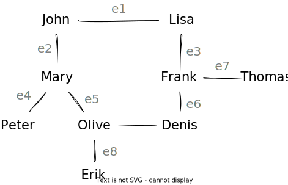

============
Graph Theory
============

:Lecture: Lecture 6.1 :download:`(slides) <_static/graphs.pptx>
:Objectives: Understand what a graph is, what data structures exists
             to represent it, and when to choose these data
             structures.
:Concepts: Graph, path, circuit, edge list, adjacency list, adjacency
           matrix, depth-first traversal, breadth-first traversal,

We started by looking at *sequences*, implemented either using arrays
or linked lists. In a sequence, each item has at most one predecessor
and one successor. We then moved on to *trees*, where each item can
have many successors, but without forming cycles. Graphs generalize
these structures: Items can have many successors, many predecessors,
cycles, etc. There is no constraint. :numref:`sequences_to_graphs`
below illustrates this evolution.

.. _sequences_to_graphs:

.. figure:: _static/images/sequences_to_graphs.svg
   :align: center

   From sequences to graphs, growing data structures in complexity

Intuitively, a graph is just a collection of "things" linked together
in a specific way. In Computer Science (and in Discrete Mathematics),
we talk about *vertices* (singular vertex) connected by *edges*. Let
see what we do with these.

.. seealso ::

   There is no need to become an expert in graph theory. Knowing the
   basic terminology has however been very useful for me. Here is a
   reference I used when I need to check something:
   
   📕 Wilson, R. J. (1996). Introduction to graph theory. 4th edition,
   Addison-Wesley.

   Chapters 1 and 2 are already more than what you need to know for
   this course.

Graphs in Real-life
===================

Graph is such a versatile concept. Whatever application domain you work
on, there is a graph laying low.

The most obvious example---I believe---comes from transportations. I
am sure you have seen buses or subways maps that show how the
different lines connect the different stations. The distances are very
often inaccurate, but the ordering of stations is enough to find our
way. See for instance the Oslo subway map aside on
:numref:`oslo_subway`. A common problem is thus to find a route between
two stations.

.. sidebar:: Oslo Subway Map

   The subway map of Oslo city is a nice example of graph! As shown on
   :numref:`oslo_subway`, although the distance are inaccurate, what
   matters for the traveler is only the order of stations. One common
   problem that arises is "route planning": What is the best route
   to go from A to B.

   .. _oslo_subway:
   
   .. figure:: _static/images/oslo_subway_map.png
      :align: center
      :width: 350px

      The subway map of Oslo. Vertices are subway stations and edges
      are possible connections.

Graphs also plays a key role in social media such as Facebook,
LinkedIn, Snapchat and the likes. The underlying data model is a
simple graph where vertices represent persons, and edges indicate
people know one another. The main problems is social network are how
many people will my "posts" reach. Who has the most followers, etc?

Internet is another example of "giant" graph. Web sites expose
documents that point to other documents using *hyperlinks*. Here the
vertices are the documents and the edges these hyperlinks. Search
engines classify web sites according to their *visibility*, an idea
that relates to the probability of a user reaching a web site out of
luck. `PageRank <https://en.wikipedia.org/wiki/PageRank>`_ is one
famous such algorithm developed by Google.

Most scientific disciplines use graphs. `Electric circuits
<https://en.wikipedia.org/wiki/Electrical_network>`_, which electrical
engineers use are also graphs in disguise. Vertices represents
electric components such as resistors, lamps, relays, etc., whereas
edges represent the wiring. Chemists also rely on graphs to describe
`chemical compounds
<https://en.wikipedia.org/wiki/Chemical_compound>`_: Vertices
represents atoms, and edges, bonds. In Biology, graphs describe
`food-webs <https://en.wikipedia.org/wiki/Food_web>`_, where vertices
are animal species and edges denote prey-predator relationship. Public
health experts uses graphs to understand how virus propagates through
our societies. Vertices are people and edges show the contagion. The
same is used by social scientists who study the `propagation of ideas
<https://en.wikipedia.org/wiki/Social_contagion>`_. The list goes on
and on...

Computer Science is not left out. The flowcharts we have used to
visualize algorithms are graphs: Nodes (of various shapes) represent
blocks of instructions whereas edges represents the *flow of
control*. In object-oriented analysis, class diagrams (say in UML) are
also graphs, where nodes represents classes and edges captures their
relationships. Entity-relationships models we use in database are also
graphs. You get the idea.

Graphs Species
==============

A graph is a very abstract concept: A set of vertices connected by
edges. In practice, there are many variations around this theme. Its
is important to choose the one that best fit the problem at hand. Let
me present the two most common ones, which we will use: Directed and
weighted graphs.

Simple Graphs
-------------

The basic form of graph, the *simple* graph, is a set of vertices and
a set of associations between them.

Formally, a simple graph :math:`G` is a structure :math:`G=(V,E)`
where :math:`V` is the set of vertices and :math:`E` is a set of
*unordered pairs* of vertices, such that :math:`E \subseteq \{ \, \{x,
y\} \, | \, x \in V \, \land \, y \in V \}`.

Consider the "friendship" graph shown below by
:numref:`friendship_graph`, which portrays a fragment of social
network. The persons connected by lines know each other.

.. _friendship_graph:
            

            A graph connecting people. Edges show who knows who.

Following the definitions above, we get:

- The set of vertices contains all the persons, that is
  :math:`V=\{D,E,F,J,L,M,O,P,T\}`.

- The set of edges includes 8 unordered pairs :math:`E=\{ \{D,F\},
  \{D,O\}, \{E, O\}, \{F, L\}, \{F, T\}, \{J, L\}, \{J, M\}, \{M, P\},
  \{M, O\} \}`.

Directed Graphs
---------------

Sometimes, the relationship between vertices is not *symmetrical*. In
the "friendship" graph above, the "knows" relationship is symmetrical,
because we assume that if John knows Lisa, then Lisa knows John
too. Contrast this with the food web shown below on
:numref:`food_web`, where the relationship "preying on" is directed
(i.e., not symmetrical). Hawks preys on rabbits, but rabbits do not
eat hawks.

.. _food_web:

.. figure:: _static/images/food_web.svg

   A simple "food web" where vertices represents species and arrows
   represents who eats what.

We call such graphs *directed graphs*, by opposition to simple graphs
(aka undirected graphs). Formally, a directed graph :math:`G` closely
resembles a simple graph: It is also a structure :math:`G=(V,E)`, but
E is here a set of *ordered pairs* such that :math:`E \subseteq \{ \,
(x, y) \, | \, (x,y) \in V^2 \, \}`.

Returning to the food web example from :numref:`food_web`, the
vertices would be :math:`V=\{F, G, H, M, R, S \}` and the edges would
be:

.. math::

   E = \{ (H,M), (H,R), (H,S), (S,R), (S,M), (M,F), (M,G),
   (R,F), (R,G) \}

Weighted Graphs
---------------

Sometimes it is necessary to capture a little more about edges and a
 straightforward approach is to equip them with a number, which
 represents a distance, a cost, a likelihood, a capacity, or any other
 quantity relevant for the problem at hand. This yields a *weighted
 graph*. For example, transportation systems often care about the
 "distance" between two locations (i.e., vertices), as shown on
 :numref:`norwegian_cities` below.

.. _norwegian_cities:

.. figure:: _static/images/norway_cities.svg

   A few Norwegian cities and the road distances that separate them

Formally, a weighted graph is a structure :math:`G=(V,E,\phi)`
where :math:`V` is the set of vertices, :math:`E`, the set of edges
(directed or not), and :math:`\phi` a function that maps every edge
to its *weight*, such that :math:`\phi : E \to \mathbb{R}`.

Given this definition, the vertex set for the Norwegian cities (see
:numref:`norwegian_cities`) is :math:`V=\{B, H, M, Op, Os, T, Å\}`,
whereas the weight function :math:`\phi` would be:

.. math::
   \begin{split}
   \phi = \{ & \{T,M\} \mapsto 220, \\
             & \{T,R\} \mapsto 260, \\
             & \{M,Å\} \mapsto 82, \\ 
             & \{Å,B\} \mapsto 425, \\
             & \{Å,Op\} \mapsto 290, \\
             & \{R, H\} \mapsto 260, \\
             & \{Op, H\} \mapsto 290, \\
             & \{Op, Os\} \mapsto 400 \}
   \end{split}

   
Other Graph Species
-------------------

There are a few other species of graph, which we won't use in this
course. I list them below for the sake of completeness.

- `Multi-graphs <https://en.wikipedia.org/wiki/Multigraph>`_ are
  graphs where to vertices can be connected by more than a single
  edge. The above definition :math:`G=(V,E)` falls short in that case,
  and other mathematical structures are needed, such as the incidence
  matrix for instance.

- `Hyper-graphs <https://en.wikipedia.org/wiki/Hypergraph>`_ are
  graphs where an edge can connect more than two vertices.

.. warning::

   The algorithms and data structures we will study in this course
   should be adjusted for such more complex species of graph.

   
The Graph Jargon
================

Besides *vertex* and *edges*, there are `various terms
<https://en.wikipedia.org/wiki/Glossary_of_graph_theory>`_ that carry
a specific meaning when it comes to graph theory. Let see the main
ones so we can understand what we are talking about..

.. index:: walk
           
walk
  A sequence of edges

.. index:: path, graph ; path
  
path
  A walk where every *vertex* appears only once. In :numref:`friendship_graph`
  the sequence "Denis, Olive, Mary" is a path.

.. index:: cycle, graph ; cycle
  
cycle
  A walk that starts where its ends. In :numref:`friendship_graph`
  the sequence "Denis, Olive, Mary, John, Lisa, Frank, Denis" is a cycle

.. index:: loop, graph ; loop
  
loop
  An edge whose two members are the same vertex. There is no such a
  loop on :numref:`friendship_graph`.

.. index:: adjacency, vertex ; adjacent
          
adjacent vertices
  Two vertices are adjacent if there exists an edge that connects them. Denis
  is only adjacent to Frank and Olive.

.. index:: incidence, edge 
  
incident edge (to a vertex)
  An edge is incident to a vertex it connects to or from this vertex.

degree (of a vertex :math:`v`)
  The number of edges that are incident to Vertex :math:`v`. A vertex
  of degree zero is called an *isolated vertex*, and a vertex of
  degree 1 is an *end-vertex*. For directed graphs, the *in-degree*
  and *out-degree* are the numbers of edges to and from, respectively.

connected graph
  A graph where every two vertices are connected by a path.

subgraph
  A subgraph of a graph :math:`G=(V,E)`, is another graph :math:`G'`
  whose vertices and edges are all included in :math:`V` and
  :math:`E`, respectively. The vertex set of :math:`G'` has to contain
  the subset of vertices incident to the selected edges.
   
component
  A "maximum" connected subgraph, that is connected subgraph, to which
  one cannot add any vertex without loosing the "connectivity"
  property

complete graph
  A graph where every pair of vertex is adjacent
  
regular graph
   A graph where every vertex has the same degree

tree
   An undirected graph that has no cycle and where every
   pair of vertex is connected by *exactly one* path.

forest
   An undirected graph that has no cycle and where every pair of
   vertex is connected by *at most one* path. In other words, a forest
   is a graph where every component is a tree.

Alternative Representations
===========================

So far we have defined a graph by its list of edges, that is a
structure :math:`G=(V, E)`, where :math:`V` is a set of *vertices* and
:math:`E` is the set of *edges*. At times, other "representations"
come up handy, namely the *adjacency matrix* and the *incidence
matrix*.

Adjacency Matrix
----------------

The *adjacency matrix* :math:`A` is an :math:`|V| \times |V|` matrix where
the cell :math:`c_{ij}` contains the number of edges between vertices
:math:`i` and :math:`j`. The adjacency matrix is, by definition, a
square matrix.

Consider again the friendship graph shown above on
:numref:`friendship_graph`. Provided we number the vertices
:math:`V=\{D,E,F,J,L,M,O,P,T\}` in alphabetical order, the adjacency
matrix would be:

.. math::
   A = \begin{bmatrix}
   0 & 0 & 1 & 0 & 0 & 0 & 1 & 0 & 0 \\
   0 & 0 & 0 & 0 & 0 & 0 & 1 & 0 & 0 \\
   1 & 0 & 0 & 0 & 1 & 0 & 0 & 0 & 1 \\
   0 & 0 & 0 & 0 & 1 & 1 & 0 & 0 & 0 \\
   0 & 0 & 1 & 1 & 0 & 0 & 0 & 0 & 0 \\
   0 & 0 & 0 & 1 & 0 & 0 & 1 & 1 & 0 \\
   1 & 1 & 0 & 0 & 0 & 1 & 0 & 0 & 0 \\
   0 & 0 & 0 & 0 & 0 & 1 & 0 & 0 & 0 \\
   0 & 0 & 1 & 0 & 0 & 0 & 0 & 0 & 0 \\
   \end{bmatrix}

Incidence Matrix
----------------

When edges have their own identity, we can use an *incidence matrix*,
which maps every vertex onto its incident edges. The incidence matrix
is therefore an :math:`|V| \times |E|` matrix :math:`I`, such that every
cell :math:`c_{i,j}` is 1 if an only if Vertex :math:`v_i` is
incident to Edge :math:`e_j`. If the graph is directed, the cell
:math:`c_{i,j}` can contains -1 if the vertex is the source, 1 if the
vertex is the target and 0 otherwise. This is one way to capture
multi-graphs and/ hyper-graphs for instance.
   
Look again at :numref:`food_web`, the dummy food web. Provided that
vertices and edges are ordered alphabetically, the incidence matrix
:math:`I` would be:

.. math::
   I = \begin{bmatrix}
       0  &   0  &   0  &   1  &   0  &   0  &   0  &   1  &  0 \\
       0  &   0  &   0  &   0  &   1  &   0  &   0  &   0  &  1 \\
      -1  &  -1  &  -1  &   0  &   0  &   0  &   0  &   0  &  0 \\
       1  &   0  &   0  &  -1  &  -1  &   1  &   0  &   0  &  0 \\
       0  &   1  &   0  &   0  &   0  &   0  &   1  &  -1  & -1 \\
       0  &   0  &   1  &   0  &   0  &  -1  &  -1  &   0  &  0 \\
   \end{bmatrix}
   

Graph Problems
==============

There are many graph problems that arises from the graph
structure. Many of them are "difficult", that is, for we only know
"inefficient algorithms" (i.e., of exponential complexity). Here is a
few well known examples:

Hamiltonian Path
   Find a Hamiltonian path in a graph, that is a path that visits
   every vertex only once. 

Shortest path
   Find the shortest path between two vertices in a weighted
   graphs. We will look at three algorithms to tackle this, namely
   Dijkstra, Bellman-Ford, and Floyd-Warshall.

Traveling Salesperson Problem (TSP)
   Given a weighted graph, find the shortest cycle that visits all the
   vertices.
   
Graph Coloring
   Find a mapping from the set of vertices to a given set of colors,
   such that there is no two adjacent vertex that map to the same
   color.
   
Minimum Spanning Tree (MST)
   Given a weighted graph, find the tree that covers all the vertices
   and has the minimum total weight.
   
Cycle Detection
   Find cycles in a given graph.

Vertex cover
   Given a graph G=(V,E), find a subset of vertices V' such that every
   edges is incident to an vertex in V'.

Independent set
   Given a graph G=(V,E), find a subset of vertices V' such that no
   vertex in V' is adjacent to a vertex in V.

.. include:: data_structure.rst

   
Appendix
========

.. toctree::
   :maxdepth: 2
   :titlesonly:
      
   ruby_edge_list
   js_adjacency_list
   c_adjacency_matrix
   
