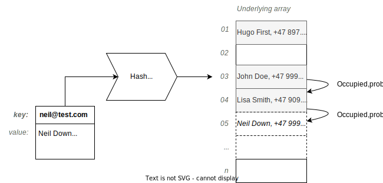

==========
Collisions
==========

:Lecture: Lecture 4.2 :download:`(slides)
          <https://studntnu-my.sharepoint.com/:p:/g/personal/franckc_ntnu_no/EWOA-ivowCFLl96rXMhX7D4BoNNjGhSHC_v0InEwDo6kjQ?e=lLXBDK>`
:Objectives: Understand the problem of collisions when using a hash
             function and how to work around it
:Concepts: Hash function, collisions, separate chaining, open addressing

What Are "Collisions"?
======================

Hash functions maps a rather very large set of keys onto a much
smaller set of array indices. The mere size difference between these
two sets implies that there will be several keys mapped onto the same
index: This a *collision*.

.. important::

   A *collision* occurs whenever a hash function maps two different
   keys onto the same index.

.. figure:: _static/collisions/images/collisions.svg
   :name: hashing/collision/idea

   A collision: Two entries whose keys unfortunately maps to the same
   index

:numref:`hashing/collision/idea` illustrates these collisions. The
first entry, whose key is the email' ``john@test.com`` maps to index
3, but a second entry, whose key is ``lisa@test.com`` maps to the very
same index. Which value should we store at that index?

This implies that a good hash function therefore minimizes the number
of collisions. But collisions will necessarily happens as soon as the
set of keys is larger than the set of indices. Otherwise, we would
talk about *perfect hashing* [#perfect-hashing]_ .

.. [#perfect-hashing] Perfect hashing is possible is the set of keys
                      is fixed and known in advance. Then one can
                      allocate enough entry in the table to ensure
                      perfect hashing.

.. margin::

   .. figure:: _static/collisions/images/probability.svg
      :name: hashing/collisions/probability

      Minimizing the probability of collisions by evenly distributing
      keys to indices.
                      
As shown on :numref:`hashing/collisions/probability`, minimizing the
probability of collision boils down to mapping evenly the keys to the
possible indices. The mathematics behind hash function relate to the
`balls into bins
<https://en.wikipedia.org/wiki/Balls_into_bins_problem>`_ problem. The
player is given :math:`n` balls, and at each step, she places a ball
into one of the :math:`m` available bins. The question that connects
with hash functions and collisions in particular is: At the end of the
game, what is the expected number of balls in a bin?

I see no need to dive into the maths here, but we shall see how can we
modify our implementation of hash tables, to guard against
collisions. There are two main strategies: *Separate chaining* and
*open addressing*

.. important::

   There are two common ways to manage collisions: Separate
   Chaining and Open addressing.

Separate Chaining
=================

So far, our hash table uses an array of values. Given a pair
key-value, the hash of the key gives us the index where we shall store
the given value. What to do to when a collision happens?

The idea of *separate chaining* is to use an array of :doc:`linked
lists </recursion/linked_list>` (as opposed to an array of
values). This way, when a collision occurs we can simply insert the
given value in the corresponding list [#list-insert]_
. :numref:`hashing/collisions/separate_chaining` illustrates that. It
shows a hash table where two keys have already collided at Index 3,
:code:`john@test.com` and :code:`lisa@test.com`. The two corresponding
values are stored in a dedicated linked list. Now we insert another
key, :code:`neil@test.com` whose hash is also 3, so it is inserted
into this same list.

.. figure:: _static/collisions/images/separate_chaining.svg
   :name: hashing/collisions/separate_chaining

   Resolving collisions using separate chaining

.. [#list-insert] Insertion in a linked list runs in :math:`O(1)` and
                  does not requires resizing.

Retrieval
---------

We need to modify our retrieval procedure :func:`map.get` to account
for these linked list of key-value pairs. We proceed as follows:

#. We retrieve the list associate with the given key;

#. If there is no such list, then the key is not in our mapped

#. Otherwise we search through that list for the given key and we
   return the associated value. if we cannot find the key, then the
   key is missing.
   
.. code-block:: java
   :caption: Retrieving the value associated with a given key under
             separate chaining
   :name: hashing/collisions/chaining/get
   :emphasize-lines: 5

   public Value get(Key key) throws NoSuchKey {
        int index = hash(key);
        var candidates = (List<Pair<Key,Value>>) entries[index];
        if (candidates == null) throw new NoSuchKey(key);
        var pair = search(candidates, key);
        return pair.value;
    }

    private Pair<Key, Value> search(List<Pair<Key, Value>> candidates, Key key) throws NoSuchKey {
        var iterator = candidates.iterator();
        while (iterator.hasNext()) {
            var pair = iterator.next();
            if (pair.key.equals(key)) return pair;
        }
        throw new NoSuchKey(key);
    }

In :numref:`hashing/collisions/chaining/get` shows how one could do
that in Java. We first retrieve the *list* associated with the given
key. If that list is :code:`null`, then the key is missing. Otherwise,
we use :doc:`linear search </sequences/arrays>` to find which item holds
the desired key. Note the iterator that speeds up traversing the list
(see the :code:`search` procedure).

How fast is this?
   Without diving into the mathematics, it takes as long as the search
   in the candidates for the selected index. So if there has not yet
   been any collisions, then its runs in :math:`O(1)` , otherwise it
   runs in :math:`O(k)` where :math:`k` is the number of "candidates"
   for that index.

Insertion
---------

To implement the :func:`map.put` function, we proceed in a similar
fashion:

#. We compute the index of the key using the hash function.

#. We retrieve the list of "candidates" for that index

#. If there is no candidate yet, we initialize a new empty list

#. We check for duplicates, that is, we search for the given key in
   the list of candidates.

#. If we find it, then, we override the value associated with the given key.

#. Otherwise, we append a new key-value pair to the list of candidates.

.. code-block:: java
   :caption: Inserting a new key-value pair under separate chaining
   :name: hashing/collisions/chaining/put
   :linenos:
   :emphasize-lines: 3-4, 8-9, 12

   public void put(Key key, Value value) {
        int index = hash(key);
        if (entries[index] == null) {
            entries[index] = new LinkedList<Pair<Key, Value>>();
        }
        var candidates = (List<Pair<Key,Value>>) entries[index];
        try {
            var pair = search(candidates, key);
            pair.value = value;

        } catch (NoSuchKey error) {
            candidates.add(new Pair<Key,Value>(key, value));

        }
    }

:numref:`hashing/collisions/chaining/put` details how we can do that
in Java. Note that we reuse the :code:`search` procedure we created
for the :code:`get` operation. If it throws an exception (see line
11), we know that the given key is missing and we then insert a new
key-value pair.

Deletion
--------

The :func:`map.remove` operation must also account for these lists. We
proceed as follows:

#. We compute the index by hashing the given key

#. If there is no candidate at that index, then the key is missing

#. Otherwise, we traverse the list of candidate and delete the pair
   that matches the given key.

#. If there is no pair with the given key, then, the key is missing.

.. code-block:: java
   :caption: Inserting a new key-value pair under separate chaining
   :name: hashing/collisions/chaining/remove
   :linenos:
   :emphasize-lines: 3-4, 8-9

   public Value remove(Key key) throws NoSuchKey {
        int index = hash(key);
        if (entries[index] == null) throw new NoSuchKey(key);
        var candidates = (List<Pair<Key, Value>>) entries[index];
        var iterator = candidates.iterator();
        while (iterator.hasNext()) {
            var pair = iterator.next();
            if (pair.key.equals(key)) {
                iterator.remove();
                return pair.value;
            }
        }
        throw new NoSuchKey(key);
    }

:numref:`hashing/collisions/chaining/remove` lays out how we can do
that in Java. To efficiently delete in a linked list, we use
an iterator and trigger the deletion directly from the node
that matches the given key.

How Fast Is It?
   Here as well, the time we spend deleting depends on the number of
   items in the list of candidates. If there is one (or none), it runs
   in :math:`O(1)` , otherwise it runs in :math:`O(k)`, where k is
   this number of candidates (because we use an iterator).

   
Wasted Space
------------

An important behaviour of separate chaining is the space it takes: For
larger hash tables, regardless or the hash function, about a third of
the table will *remain empty*.

Why is that? It relates to the mathematics of the `balls and bins
<https://en.wikipedia.org/wiki/Balls_into_bins_problem>`_. After
placing :math:`n` balls in :math:`c` bins, what is the probability of
finding an empty bin? For that to happen, we must "miss" that bin
every single time. For a given ball, the probability of missing a bin
is :math:`p=\frac{c-1}{c}`, that is, it is the probability of choosing
any of the other :math:`c-1` bins. Now, for a bin to be empty after
:math:`n` balls, we must miss every single ball, which means this
probability is now :math:`p^n`. This gives us:

.. math::
   \mathbb{P}[B_i = \varnothing] & = \left(\frac{c-1}{c}\right)^n \\
   \lim_{n\to\infty}  \left(\frac{c-1}{c}\right)^n & = \frac{1}{e} = 0.3678...

That indicates, that when using separate chaining, we must pay
attention to the *load factor*. This load factor represents the
percentage of entries (in the underlying array) that are
occupied. When this load factor approaches 66 \%, the performance will
gradually degrade: The linked list will start to grow, consuming more
memory and increasing the runtime of the :code:`put` and :code:`get`
operations.

Open Addressing
===============

*Open addressing* is another approach to handle *collisions*. With
open addressing, when facing a collision at a given index, we *probe*
another index, until we find a free entry, or until the underlying
table gets full.

   Handling collisions using *open addressing*: When an entry is
   occupied, we *probe* another one

:numref:`hashing/collisions/open-addressing` shows an example. The
hash table already contains three entries: Hugo's record at index 1,
John at index 3, and Lisa at index 4. We now try to insert Neil's
record, whose key's hash is 3. That index already contains John's
record, so we try the next one, which is also taken, so we try the
next, which is free. So we insert Neil's details at Index 5.

As a data-structure, open addressing requires less memory than
separate chaining. The downside is that the table will get full at
some point and must then be resized. Such a resizing, so called
*rehashing*, resembles resizing a dynamic array (see :doc:`Lecture 2.3
</sequences/dynamic_arrays>`) but requires to recompute the hash of
every entry, since the table has a new capacity.

Retrieval
---------

To retrieve the value associated to the given key, we proceeds as
follows:

#. Compute the "expected" index where the value should be, using the
   hash function.

#. We check the key.value pair stored at that index.

#. If there is no key-value pair at that index, the key was not defined.
   
#. If there is a key-value pair that has the given key, we return the
   value.

#. Otherwise, we check the next key-value pair in the next entry and
   we return to Step 2.

   #. If the have reached the last entry, we continue from the first one.

   #. If we are back the initial "expected" index, the key was not defined.

:numref:`hashing/collisions/open-addressing/get` details how we can do
that in Java. To simplify search, we use an :code:`offset`, which we
add to the "start" index. 
      
.. code-block:: java
   :caption: Retrieving a value from a hash table using open-addressing
   :name: hashing/collisions/open-addressing/get
   :emphasize-lines: 3-4
   :linenos:
                
   public Value get(Key key) throws NoSuchKey {
        int start = hash(key);
        for (int offset = 0; offset < entries.length ; offset++) {
            var index = (start + offset) % entries.length;
            var candidate = (Pair<Key, Value>) entries[index];
            if (candidate == null)
                throw new NoSuchKey(key);
            if (candidate.key.equals(key))
                return candidate.value;
        }
        throw new NoSuchKey(key);
    }

How Efficient Is It?
   To retrieve a keey-value pair, we have to follow a trail of
   "non-empty" entries. This is the *probing sequence* and its length
   affects the runtime. In the worst case, we have to scan the whole
   table and the runtime degrades to :math:`O(n)`.

Deletion
--------

To remove an entry from the hash table requires a bit of care. If we
simply delete the entry, we will not be able to find the keys that
were inserted beyond. Instead, we shall use a *soft deletion* (a.k.a.
tombstone), where instead of deleting the entry, we will only *mark*
it as deleted. We proceed as follows:

#. We compute the "expected" index where the value should be, using
   the hash function. This will be our starting position.

#. We check the key.value pair stored at that index.

#. If there is no key-value pair at that index, the key was not defined.
   
#. If there is a key-value pair that has the given key, we *mark* it
   as a deleted, and we are done.

#. Otherwise, we check the next key-value pair in the next entry and
   we return to Step 2.

   #. If the have reached the last entry, we continue from the first one.

   #. If we are back where we started, the key was not defined.

The Listing below illustrates how this be done in Java. We use the same
strategy as we did before to iterate through the table from an
arbitrary position, using an offset. By contrast, when we find the
key, we simply mark it as "deleted".

.. code-block:: java
   :caption: Retrieving a value from a hash table using open-addressing
   :name: hashing/collisions/open-addressing/remove
   :emphasize-lines: 3-4, 8-9
   :linenos:
                
   public Value remove(Key key, Value value) throws NoSuchKey {
       int start = hash(key);
       for (int offset = 0; offset < entries.length ; offset++) {
           var index = (start + offset) % entries.length;
           var candidate = (Pair<Key, Value>) entries[index];
           if (candidate == null)
               throw new NoSuchKey(key);
           if (candidate.key.equals(key)) {
               return candidate.markAsDeleted();
           }
       }
       throw new NoSuchKey(key);
   }

To mark a given as "deleted" we can modify the :code:`Pair` class as
shown on :numref:`hashing/collisions/open-addressing/pairs`

.. code-block:: java
   :name: hashing/collisions/open-addressing/pairs
   :caption: Key-value pair with soft deletion
   :emphasize-lines: 10-13, 15-17 
   :linenos:

   class Pair<Key, Value> {
        Key key;
        Value value;

        Pair(Key key, Value value) {
            this.key = key;
            this.value = value;
        }

        Value markAsDeleted() {
            key = null;
            return value;
        }

        boolean isDeleted() {
            return key == null;
        }
    }   

How Efficient Is It?
   To delete a keey-value pair, we also have to follow a trail of
   "non-empty" entries. The length of *probing sequence* also affects
   the runtime. In the worst case, we have to scan the whole table and
   the runtime degrades to :math:`O(n)`.
    
      
Insertion
---------

To insert a new key-value pair, we first try as the index yielded by
the hash function. If that entry is taken, we try the next entry,
until we find a free one (or one that has been marked as deleted).

#. We compute the "expected" index where the value should be, using
   the hash function. This will be our starting position.

#. We check the key.value pair stored at that index.

#. If there is no key-value pair at that index, or if the pair has
   been marked as deleted, we insert a new key-value pair here and we
   are done.
   
#. Otherwise, we check the next key-value pair in the next entry and
   we return to Step 2.

   #. If the have reached the last entry, we continue from the first one.

   #. If we are back where we started, the key was not defined.

.. code-block:: java
   :caption: Inserting a new key-value pair in a hash table using open-addressing
   :name: hashing/collisions/open-addressing/insert
   :emphasize-lines: 3-4, 6
   :linenos:
                
   public void put(Key key, Value value) {
       int start = hash(key);
       for (int offset = 0; offset < entries.length ; offset++) {
           var index = (start + offset) % entries.length;
           var candidate = (Pair<Key, Value>) entries[index];
           if (candidate == null || candidate.isDeleted()) {
               entries[index] = new Pair<Key, Value>(key, value);
               return;
           }
       }
       throw new RuntimeException("Table is full!");
   }

How Efficient Is It?
   To insert a keey-value pair, we again have to follow a trail of
   "non-empty" entries. The length of *probing sequence* again dictates
   the runtime. In the worst case, we have to scan the whole table and
   the runtime degrades to :math:`O(n)`.
   
   
Variations
----------

In the implementation above, we also probe the direct next entry, but
there are other strategies, The most common ones are linear probing,
quadratic probing, and double hashing.

Linear Probing
   With linear probing to insert a pair :math:`(k,v)` in a table of
   capacity :math:`c`, we use the following function, which computes
   the index to try for the i\ :sup:`th` attempt:

   .. math::
      \textrm{attempt}(k, i) = (\textrm{hash}(k) + i) \mod c

   This is what we have implemented above. The downside of this is
   that entries form cluster in the table. Such cluster degrades the
   performance of the operation, because insertion must scan these
   large clusters

Quadratic Probing
   With quadratic probing, we make jumps that are bigger and
   bigger. For instance, we first the entry
   :math:`\textrm{hash}(k)+1`, then :math:`\textrm{hash}(k)+4`, then
   :math:`\textrm{hash}(k) + 9`, etc. The attempt function goes as
   follows:

   .. math::
      \textrm{attempt}(k, i) = (\textrm{hash}(k) + i^2) \mod c

   Quadratic probing helps reduce clustering but places constraint on
   the capacity, which must be a prime number. 
      
Double Hashing
   With *double hashing*, the jump we make when probing is computed by
   another hash function, as follows:

   .. math::
      \textrm{attempt}(k, i) = (\textrm{hash}_1(k) + i\cdot\textrm{hash}_2(k)) \mod c
   
   This also helps reduce clustering but the two hash functions must
   be chosen carefully. Some pairs of hash function will not play well
   together and leads to more clustering.
