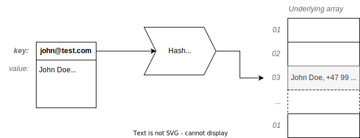

================
What Is Hashing?
================

:Lecture: Lecture 4.1 :download:`(slides) <_static/hashing/hashing.pptx>`
:Objectives: Understand what is a hash function how a hash table uses
             it offer constant time access
:Concepts: Map ADT, hash functions, hash table, insertion, deletion

Hashing is a general concepts that surfaces in cryptography, pseudo
random number generation, machine learning, etc. In this course, we
will use it to access data in constant time (i.e., :math:`O(1)`).

The *Map* ADT
=============

The *Map* ADT captures *a mapping* from a set of keys :math:`K` to a set
of values :math:`V`.  In mathematics, that corresponds to a partial
function from :math:`K` to :math:`V`.

Consider mapping names to phone numbers. The set of names is
:math:`N=\{John, Lisa, Steve, Shirley\}` and the set of phones is
:math:`P = \{ 1234, 5678 \}`.  A possible mapping :math:`m` could be:

.. math::
   m = \{ (John, 1234),
          (Lisa, 1111),
          (Shirley, 1234) \}

Note that John and Shirley share the same phone number. That works
because a single value can relate to multiple keys. By contrast, a
single key has at most one value [#partial]_ . Steve is not part of
the mapping: the underlying function is partial.

.. [#partial] Otherwise, we would not get a function, but a
              relationship, in the mathematical sense.

.. important::

   In a map, each key is associated to zero or one value.

The *map* ADT offers at least the following operations. It is based on
the keys and values domains as follows:
   
.. module:: map

.. function:: create() -> Map

   Create a new empty mapping.

   Postconditions:
     - The result mapping is empty, that is

       .. math::
          m = create() \implies size(m) = 0

   
.. function:: size(m: Map) -> Natural

   Return the number of ordered pairs in the mapping.

   Postconditions:
    - The size if the number of keys for which the key is associated
      to a value, or more formally, the cardinality of the subset of
      keys in the mapping:

      .. math::

         size(m) = | \{ k \in K, \; contains(m, k) \} |

.. function:: contains(m: Map, k: Key) -> Boolean

   Return true if the mapping has a pair :math:`(k_i, v_i)` such as
   :math:`k_i = k`.
        
   
.. function:: get(m: Map, k: Key) -> Value

   Retrieve the value associated with the given key

   Preconditions:
    - The key :math:`k` is in the mapping :math:`m`, that is:

      .. math::
         contains(m, k) \iff \exists \, v \in V, \; get(m,k) = v

.. function:: put(m: Map, k: Key, v: Value) -> Map

   Insert a new pair :math:`(k,v)` into the mapping :math:`m`

   Postconditions:
    - The key :math:`k` is now associated to the value :math:`v` in
      the mapping :math:`m`

      .. math::
         m' = put(m, k, v) \implies contains(m', k) \land get(m', k) = v
   
.. function:: remove(m: Map, k: Key) -> Map

   Remove the pair with Key :math:`k` from the mapping :math:`m` 

   Preconditions:
    - The key :math:`k` is in the mapping :math:`m`, that is:

      .. math::
         contains(m, k) \iff \exists \, v \in V, \; get(m,k) = v

   Postconditions:
    - The key is no longer part of the mapping, that is:

      .. math::
         m' = remove(m, k) \implies \neg \, contains(m', k)

In the next section, we shall see how to implement this Map ADT using
hashing so that the :func:`map.get` and :func:`map.put` runs in
:math:`O(1)`. Put simply these operations take a time that does *not*
depends on how many items are in the mapping.

.. caution::

   The map ADT shows up under a variety of names in programming
   languages. *Map* in Java, C++, modern JavaScript, *Dictionary* in
   Python, *Associative Arrays* in Perl or Php, and even *Object* in
   JSON.

What Is a "Good" Key?
=====================

Choosing a key is not an important design decision. Not everything is
a "good" key. Ideally, a key should be *unique* to a single value, it
must *never change* over time (immutability) and should be *as small
as possible*.

Consider a user profile (a record) with various fields such as display
name, email, birth date. Which one would be a good key?

- *Display name* captures the name the user would like other to see
  about him. The problem here is that this display name can change
  over time. If we insert the user record in a hash table and then,
  the user change its display name, the hash function will return a
  different value and the user record there will irrelevant or non
  existent.

- *Birth date* is better because it will never change---in principle
  at least. The problem here is uniqueness. Two users may very well
  be born on the same day, any hash function would thus return the
  same index for both.

- *Email* would be the better choice here, because if is both
  immutable in practice and is unique to a user (at least in
  principle).
   

.. important::

   A "good" key has the following properties:
   
   * Uniqueness: The key uniquely identifies a specific value
   * Immutability: The key never changes during the life of the value
     it is associated to.
   * Small: The key should be as small as possible. As we shall, the
     longer the key, the more work we need to *hash* it.

Hash Tables
===========

The hash table is the goto data structure to implement this *map*
ADT. Under the hood, a hash table is just a fixed-sized array (see
:doc:`Lecture 2.1 </sequences/adt>`). The particularity is the presence
of a hash function that decides at which index a given key gets
stored.  The hash function thus has the following signature:
:math:`hash: Key \to \mathbb{N}`.

.. important::

   The hash function decides at which index a given key is stored. It
   avoids searching for items using a linear, binary or other
   exhaustive search algorithms.

In :numref:`hashing/hashtable/idea`, we store a record of information
about user profile. We use the email of the user as a key, and the
whole record as a value. For instance, applying the hash function to
``john@test.com`` yields 3, the index where we thus store John's user
profile.
   

   The principle of hash table: Use a hash function to decide where to
   store a given value, based on the given key.

:numref:`hashing/hashtable/code` illustrates a straightforward
implementation of a generic hash table in Java. The class encapsulates
an array of Object [#generic-array]_ to hold the mapping. The size is
stored as a separate attribute.

.. [#generic-array] At the time of writing, Java does not support
                    arrays of generic type. So, one has to use an
                    array of :code:`Object` and cast whenever needed
                    (see Line 2).
   
.. code-block:: java
   :caption: Skeleton of a Java class implementing a hash table
   :name: hashing/hashtable/code
   :linenos:
   :emphasize-lines: 2, 10

   class HashTable<K,V> {
       private Object[] content;
       private int size;

       public HashTable<K,V>(int initialCapacity) {
          content = new Object[initialCapacity];
          size = 0;
       }

       private int hash(K key) {
         // ...
       }

       public int getSize() { return size; }
   }

Membership Test
---------------

To test whether a given key belongs to a mapping, we check the value
at the index indicated by the hash function. If we found any else than
a :code:`null` value, the key does exist. We proceed as follows:

#. Convert the given key into a index using the hash function ;

#. Retrieve the value stored at that index

#. Return whether that value is different from a :code:`null` value

.. code-block:: java
   :caption: Membership test implemented in Java
   :name: hashing/map/membership/code
   :emphasize-lines: 4

   public boolean contains(K key) {
      int index = hash(key);
      return content[index] != null;
   }

Correctness
   Does this comply with the specification of the :func:`map.contains`
   function? It does check the defintion, but we have to see how to
   implement the :func:`map.put` and :func:`map.remove` to check they
   all behave consistently.

Efficiency
   This is very easy and only take as much time as it take to apply
   the hash function. The important point is that this does *not*
   depend on the number capacity of the underlying array. This runs in
   :math:`O(1)`.
   

Insertion
---------

As for most operation on a hash table, the "magic" comes from the hash
function, which does the heavy lifting: Finding where we store the
given pair key-value. To insert in a hash table, we proceed as follows:

#. Compute the index by applying the hash function to the given key;

#. Store the given value at that index. Any pre existing value is
   overridden, ensuring each key pairs with at most one value.

.. code-block:: java
   :caption: Inserting in a hash table
   :name: hashing/map/insert/code
   :emphasize-lines: 2

   void put(K key, V value) {
      int index = hash(key);
      content[index] = value;
   }

Correctness
   Does this adhere to our ADT specification? Checking if a key exists
   in a value, simply requires checking the index corresponding to
   that key contains something else than null. The implementation of
   :func:`map.put` and :func:`map.remove` work together to
   guarantee that.
   
Efficiency
   There is no loop in there. However long is the underlying array, we
   simply do two things: First, we hash the given key into an index,
   and then, we store the given value at that index. This thus runs in
   constant time.

Retrieval
---------

Provided with our hash function that tells us where a given is
located, retrieving a value goes as follows:

#. Compute the index by applying the hash function to the given key ;

#. Check the value stored at that index ;

#. If that value is null, report an error: The map does not contains 
   that key ;

#. Otherwise, return that value.

   
.. code-block:: java
   :name: hashing/map/retrieval/code
   :caption: Retrieving a value from a hash table in Java
   :emphasize-lines: 2-3

   V get(K key) throws KeyError {
     int index = hash(key);
     V value = contents[index];
     if (value == null) throw new KeyError(key);
     return value;
   }

Correctness
  Is this implementation correct? Does it guarantee the pre- and
  post-conditions of our Map ADT? In fact, no and we will see later
  that there can be *collisions*, which requires additional mechanisms.

Efficiency
  How fast does that run? Intuitively, there is no loop or conditional
  so that runs in constant time. however long is the underlying
  array. This is really the strong point of hash tables, :math:`O(1)`
  access to any item.
  
Deletion
--------

The deletion follows the same principle: We use the hash function to
compute which bucket we have to clear.

#. Compute the index by applying the hash function to the given keyerror

#. Check out the value at that index

#. If that value is null, throw an error: The given key is not in the underlying mapping.

#. Otherwise, Set that index to null and return the extracted value.

.. code-block:: java
   :name: hashing/map/deletion/code
   :caption: Removing a key from a hash table in Java.
   :emphasize-lines: 2-3, 5

   V remove(k key) throws KeyError {
      int index = hash(key);
      V value = contents[index];
      if (value == null) throw new KeyError(key);
      contents[index] = null;
      return value;
   }

Correctness
   When we fetch the value associated with the given key, we throw an
   error if it is null, enforcing the pre condition of the function
   :func:`seq.remove`. By writing :code:`null` at the selected index,
   we guarantee that the arrays has only a values for the keys that
   have not been removed.

Efficiency
   Same here. There is not loop and we only hash the given key into an
   index, where we then store a null value. This runs in :math:`O(1)`.

   
Hash Functions
==============

What is this *hash* function? It maps the set of keys to indexes of
the underlying array. The challenge is that the set of possible keys
is generally very large or infinite (e.g., the set of possible
strings), whereas the set of possible indices is bounded (e.g., from 0
to 99 for an array of 100 items). Let us see how that work?

In a nutshell, a hash function does two things.

#. The maps the given key to an arbitrary integer value, irrespective
   of the range of valid indices. This is the *hashing* per se, often
   denoted by a function :math:`H(k)`.

#. It "compresses" this large integer so that it fits the range of
   valid indices. The final index is the remainder of the hash code
   divided by the number of possible entries in the hash table (i.e.,
   the capacity :math:`c`).

   .. math::

      index(k) = H(k) \mod c

Very often a hash function is a low-level procedure that operates on
raw byte.

Re-interpretation
-----------------

If the key data type has the same length than an integer, we can
simply interpret the bytes as an integer value (see :doc:`Lecture 2.1
</sequences/adt>`).

Say for instance that the key is a color :code:`rgba(74, 111, 104,
0.43)` (some sort of pale green), which is represented by four bytes
:code:`#4A6F6864`. Since 4-byte is the very size of a 32-bit integer,
we can *reinterpret* this four bytes as the value 1 248 815 214.

Unfortunately this only works when keys have a fixed length that
matches the one of an integer value.

Summation
---------

.. margin::

   .. figure:: _static/hashing/images/summation.svg
      :name: hashing/intro/summation

      Hashing by summation

If the keys are longer than an integer, say a string or an array for
instance, we can use the summation approach. As shown in
:numref:`hashing/intro/summation`, we break the given into :math:`n`
blocks the size of an integer value, which we then sum to get a single
final integer value.

.. code-block:: java
   :name: hashing/intro/summation/code
   :caption: Hashing a string with summation

   int hash(String text) {
       int hash = 0;
       for (int i = 0; i < text.length(); i++) {
           hash += text.charAt(i);
       }
       return hash;
   }

The main drawback of hashing by summation is that does not distinguish
between keys whose bytes are permuted. For instance, the Java code
shown by :numref:`hashing/intro/summation/code` yields the same hash
code for "post", "stop", "tops", and "pots".

Polynomials
-----------

.. margin::

   .. figure:: _static/hashing/images/polynomials.svg
      :name: hashing/intro/polynomials

      Hashing using a polynomial
      
To better distinguish between keys, we can use a polynomial instead of
simple summation.  We just need to weight each term of our sum with a
value that depends on the block position, as shown on
:numref:`hashing/intro/polynomials`. A simple strategy is to choose a
prime number raise to power of the block position. The equation below
summarizes this approach:

.. math::
   H(b_1, b_2, \ldots, b_n) = \sum_{i=1}^n a^i \cdot  b_1

:numref:`hashing/intro/polynomial/code` illustrates how this applies
to hashing a String object in Java, relying on `Horner's method
<https://en.wikipedia.org/wiki/Horner%27s_method>`_ for polynomial
evaluation.
   
.. code-block:: java
   :name: hashing/intro/polynomial/code
   :caption: Hashing a string with a polynomial

   int hash(String text) {
       int a = 17;
       int hash = 1;
       for (int i = 0; i < text.length(); i++) {
           hash *= a + text.charAt(i);
       }
       return hash;
   }

Cyclic Shifts
-------------

.. margin::

   .. figure:: _static/hashing/images/cyclic_shifts.svg
      :name: hashing/intro/cyclic-shifts

      Hashing using circular rotation (ROT-L) of :math:`k` bits.

Another way to hash a key of varying size is to use cyclic
shifts. Working at the byte level offers `bitwise operations
<https://en.wikipedia.org/wiki/Bitwise_operation>`_ such as
:code:`AND`, :code:`OR`, :code:`XOR`, and various forms of shifts.

We can use the cyclic left rotation (denoted as
:math:`\textrm{rot}_L`), to combine different 4-byte blocks into a
single integer value, as shown on
:numref:`hashing/intro/cyclic-shifts`. The recurrence below give
another perspective on the same calculation.

.. math::

   H(b_1, b_2, \ldots, b_n) = \begin{cases}
     \textrm{rot}_L(k, b_1) & \textrm{if } n = 1 \\
     b_n + \textrm{rot}_L(k, H(b_1,\ldots,b_{n-1})) & \textrm{otherwise}
   \end{cases}

:numref:`hashing/intro/cyclic-shifts/code` illustrates how one can
implement that in Java. The expression :code:`(sum << 5) | (sum >>>
27)`, which implementats the :math:`\textrm{rot}_L` operation using
left- and right- shifts, for a 32-bit value with :math:`k = 5`.

.. code-block:: java
   :caption: Hashing a String using cyclic shifts in Java
   :name: hashing/intro/cyclic-shifts/code
   :emphasize-lines: 4

   int hashCode(String text) {
       int sum = 0;
       for (int index = 0; index < text.length(); index++) {
           sum = (sum << 5) | (sum >>> 27); 
           sum += (int) text.charAt(index); 
       }
       return sum;
   }

Usages of Hashing
=================

Hashing is a concept that goes way beyond algorithms and data
structure. Whereas the concepts remain the same, the `hash functions
<https://en.wikipedia.org/wiki/List_of_hash_functions>`_ vary in
complexity.

File Digest
-----------

In cryptography, hashing is useful to ensure integrity, that is, be
confident that a message, sent over the network, was not modified (by
a malicious middle man or by erroneous network devices).

When we downloading from the Internet, especially large files such as
disk images, you may be offer the opportunity of also download a file
digest (e.g., MD5 file). These "digests" contain in fact the hash of
the file you want to download.

Once you have downloaded the file and its digest, you can compute the
hash of the your local download and compare it to the "digest" you
have downloaded. If they do not match your download got corrupted on
the way.

Storing Passwords
-----------------

In cryptography again, hashing also avoids storing passwords in
clear. When a user creates an account on a web site, she chooses a
password that front-end hash and only this hash reaches the back-end
where it gets stored in a database.

When the same user later logs in, the front-end requests the password
again, hashes it, and send that hash one the wire. The back-end
compare that new hash to the one that was stored previously. If the
two match, the user is authenticated.

Pseudo Random Numbers
---------------------

Hashing can also help generate pseudo random numbers. One key point of
hash functions is that they transform any input into an unrelated
integer value. They thus can provide a practical source of randomness.

The following recurrence relationship shows a simple blueprint to turn
any hash function :math:`H` into a pseudo random number generator.

.. math::

   \textrm{random}(n) = \begin{cases}
   c & \textrm{if } n=1 \\
   H(\textrm{random}(n-1)) & \textrm{otherwise}
   \end{cases}

The hash function transforms the seed :math:`c` at each step to
produce the next number in the sequence, giving the appearance of
randomness.
