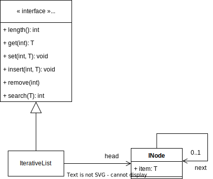

=========
Recursion
=========

:Module: Recursion
:Git Repository: `Lab 03---Recursions <https://github.com/fchauvel/aldast-lab03>`_
:Objectives:
   - Play with the concept of recursion
   - Implement a linked list in Java

Simple Recursions
=================

We start this lab session with a few small recursive algorithms. Each of
them can be written either using iteration of recursion, but we focus
here on recursive solutions.

.. exercise::
   :label: lab/recursion/power
   :nonumber:

   Write a program that raises a given value :math:`v` to a given
   positive exponent :math:`e`. Formally, the task is to write a
   function :math:`\mathit{power}(v, e) = v^e`.

   #. Identify the base and the recursive cases.

   #. Look at the file ``WarmUp.java``, and complete the method named
      ``power``, using recursion.

   #. You can use the ``PowerTest.java`` to test your solution.

.. solution:: lab/recursion/power
   :class: dropdown

   We can define the power function as the following recurrence:

   .. math::

      \mathit{power}(v, e) = \begin{cases}
            1 & \textrm{if } e = 0 \\
            v * \mathit{power}(v, e-1) & \textrm{otherwise}
      \end{cases}

   We can convert this recurrence as a Java program, as is:

   .. code:: java

          public static int power(int value, int exponent) {
            if (exponent < 0)
               throw new IllegalArgumentException("Negative exponent!");
            if (exponent == 0) return 1;
            return value * power(value, exponent-1);
          }

.. exercise::
   :label: lab/recursion/sum-array
   :nonumber:

   Write a program that sums up all the values contained in the given
   array. Use recursion.

   #. Identify the base and the recursive cases.

   #. Look at the file ``WarmUp.java``, and complete the method named
      ``sum``, using recursion.

   #. You can use the ``ArraySumTest.java`` to test your solution.

.. solution:: lab/recursion/sum-array
   :class: dropdown

   To use recursion, I define the sum of the element of the array as
   being the value in the first cell, to which I add the sum of the
   remainder of the array. I implement this recursion in a separate
   method as follows:

   .. code:: java

          public static int sum(int[] array) {
            if (array == null)
               throw new IllegalArgumentException("Cannot sum an null!");
            return doSum(array, 0);
          }

          private static int doSum(int[] array, int start) {
            if (start >= array.length) {
              return 0;
            }
            return array[start] + doSum(array, start+1);
          }

.. exercise::
   :label: labs/recursion/palindromes
   :nonumber:

   We now turn to palindromes, that is, words that are symmetrical such
   as “kayak”, “madam” or “level”. Write a recursive procedure that
   checks if a given word is indeed a palindrome.

   #. Identify the base and the recursive cases.

   #. Look at the file ``WarmUp.java``, and complete the method named
      ``isPalindrome``, using recursion.

   #. You can use the ``PalindromeTest.java`` to test your solution.

.. solution:: labs/recursion/palindromes
   :class: dropdown
   
   To check if a word is a palindrome, we check if its first character
   matches its last one. If that holds, we recurse and go check the
   remaining characters, that is, the original word minus the first and
   last characters. This gives us the following recursive procedure:

   .. code:: java

          public static boolean isPalindrome(String text) {
            return checkFrom(text, 0);
          }
          
          private static boolean checkFrom(String text, int index) {
            if (index >= text.length() / 2) return true;
            return text.charAt(index) == text.charAt(text.length()-index-1)
                   && checkPalindromeFrom(text, index+1);
          }

.. exercise::
   :label: labs/recursion/base-conversion
   :nonumber:

   Write a recursive procedure that converts a given number into a
   different base. The base of a number denotes the number of symbols
   used. For instance, in base 2, we only use two symbols
   :math:`\{0,1\}`, and for instance 10 (in base 10) is written ’1010’.
   Similarly, 5 in base 10 becomes ’12’ in base 3. We can verify that
   :math:`(1 \times 3^1) + (2 \times 3^0) = 5`.

   #. Identify the base and the recursive cases.

   #. Look at the file ``WarmUp.java``, and complete the method named
      ``toBase``, using recursion.

   #. You can use the ``BaseConversionTest.java`` to test your solution.

.. solution:: labs/recursion/base-conversion
   :class: dropdown
   
   One way to convert a given number into another base is to identify
   the first digit (the rightmost one) by dividing it by the desired
   base. This gives us a quotient and a remainder. We can map the
   remainder to a symbol using a static array, which we append to the
   quotient converted to the same base. That gives us the following Java
   program:

   .. code:: java

          public static String toBase(int number, int base) {
            if (number < base)
               return SYMBOLS[number];
            return toBase(number/base, base) + SYMBOLS[number%base];
          }

Linked Lists
============

We continue by implementing the sequence ADT as a singly linked
list. We implemented the same sequence ADT using arrays in
:doc:`Lecture 2.2 <sequences/arrays>`.

.. code:: java

   public abstract class Sequence<T> {
       int length();
       T get(int index) throws InvalidIndex;
       void set(int index, T item) throws InvalidIndex;
       void insert(int index, T item) throws InvalidIndex;
       void remove(int index) throws InvalidIndex;
       int search(T item);
       boolean isEmpty();
   }

In this lab session, we will contrast two implementations: One using
iteration, and one using recursion.

Using Iteration
---------------

We start with the iterative implementation, which is often more
“natural”. Figure `1 <#fig:iterative>`__ shows one way to implement the
``Sequence``. The ``IterativeList`` class may contain a ``Node``, which,
in turn, may refer to another ``Node``, and so on and so forth. The list
is thus formed by “linked” nodes. You will find this design in
``IterativeList.java``.

   The IterativeList implements the Sequence ADT and uses the INode
   class.
   
.. exercise::
   :label: labs/recursion/linked-list/insert
   :nonumber:

   Implement the insert method using a loop. As we saw during the
   lectures, you will the ``getNode`` method, that finds the i\
   :sup:`th` node.

   #. Implement the ``getNode`` method.

   #. Implement the ``insert`` method.

   #. The test cases from ``IterativeListTest.java`` can help you find
      issues in your algorithm.

.. solution:: labs/recursion/linked-list/insert
   :class: dropdown

   To insert at a given position I distinguish between two cases:
   Insertion in front, and insertion further into the list. To insert in
   front, I first create an initial node and set the ``head`` field with
   it. To insert further, I have to first find the node that precedes
   the insertion point, create a new node that contains the given item,
   attach it to the next node, and set the next of previous node with my
   new node. The code below summarizes this approach:

   .. code:: java

          @Override
          public void insert(int index, T item) throws InvalidIndex {
            if (index == 1) {
              head = new INode(item, head);

            } else {
              var previous = getNode(index-1);
              previous.next = new INode(item, previous.next);
              
            }
          }

          private INode<T> getNode(int index) throws InvalidIndex {
            if (index < 1) throw new InvalidIndex(index);
            int counter = 0;
            var currentNode = head;
            while (currentNode != null) {
              counter++;
              if (counter == index) return currentNode;
              currentNode = currentNode.next;
            }
            throw new InvalidIndex(index);
          }

.. exercise::
   :label: labs/recursion/insertion/runtime
   :nonumber:

   In the worst case, how many comparisons does your algorithm requires?
   What is the order of growth? Argue.

   #. What is the worst case scenario for the insertion?

   #. How many comparisons take place in the worst case (a frequency
      table may help you).

   #. Argue for an order of growth

.. solution:: labs/recursion/insertion/runtime
   :class: dropdown

   To insert we need to traverse the list up to the insertion point.
   This is the main body of work, and the problem size is therefore the
   length of the given list (denoted by :math:`\ell`).

   In the worst case, we are inserting at the very end of the list, and
   in this case the work is maximum, because we have to traverse the
   whole list.

   To count the comparisons (see
   Question `[Q:iterative-insert] <#Q:iterative-insert>`__), we have to
   count the number of comparisons that take place when we invoke the
   ``getNode`` method. This operation contains a loop, which contains a
   conditional. The loop condition is evaluated :math:`\ell+1` times,
   and the inner conditional, :math:`\ell` times. That gives us a total
   of :math:`2\ell+1`. My ``insert`` method makes one comparison before
   it invokes the ``getNode`` method, so that gives us a total of
   :math:`2\ell+2` comparisons, in the worst case.

   Without detailing the proof, we see that this worst case is linear.

.. exercise::
   :label: labs/recursion/insertion/memory
   :nonumber:
      
   In the worst case, how much memory does your solution requires?

.. solution:: labs/recursion/insertion/memory
   :class: dropdown

   Estimating the memory (i.e., the space) requires counting the
   variables created by the algorithm. As we did while counting
   comparisons, we have to also look at the ``getNode`` method, since it
   does most of the “heavy lifting” here.

   The method ``getNode`` creates two variables in all cases. For the
   ``insert`` method, we have to understand both cases to see which one
   is the worst. If we insert in front, we have to allocate a new
   ``Node`` object, which has two fields, so that is, two pieces of
   memory. Otherwise, to insert further in the list we still have to
   allocate a node, but we also need to invoke the ``getMethod`` that
   declares two variables. That is 4 cells in total.

   Overall, we see that this is constant, because it does not depends on
   the problem size, which is the length of the list.

Using Recursion
---------------

We will now use recursion to implement the same linked list. Look at
the file :code:`RecursiveList.java`. The :code:`length` method is a
simple example, shown below:
             
.. code-block:: java
   :emphasize-lines: 3, 7-9

   @Override
   public int length() {
       return lengthFrom(head);
   }

   private int lengthFrom(RNode<T> start) {
       if (start == null)
           return 0;
       return 1 + lengthFrom(start.next);
   }

Often, recursive algorithms need to accept more arguments than their
iterative counterpart. That's the role of the :code:`lengthFrom`
operation, which embodies the actual recursive implementation. The
:code:`length` operation directly calls it.

.. exercise::
   :label: labs/recursion/list/recursive/insert
   :nonumber:

   By taking inspiration on the :code:`length` method, implement the
   :code:`insert` operation in a recursive manner. Here are questions
   that might help to guide you.

   #. Can you identify self-similar sub problems. The structure of the
      linked list may help you.

   #. What are the base cases?

   #. What are the recursive cases?

      
.. solution:: labs/recursion/list/recursive/insert
   :class: dropdown

   A list is recursive by definition. It is just an item followed by
   another shorter list. We can use this definition to build a
   recursive implementation of the insert function. Insertion in 3\
   :sup:`rd` position in a list of 5 items, is the same as inserting
   in the 2\ :sup:`nd` position in the sub-sequence starting at the 2
   position. Consider these examples:

   - Inserting Z at the 3\ :sup:`rd` position of a sequence
     :math:`s=(A, B, C, D)`, is the same skipping A, and insert Z at the
     2\ :sup:`nd` position of the sequence :math:`s'=(B,C,D)`.

   - Inserting Z at the 5\ :sup:`th` position of a sequence
     :math:`s=(A, B, C, D)`, is the same skipping A, and insert Z at the
     4\ :sup:`th` position of the sequence :math:`s'=(B,C,D)`.
   
   The idea if to create a function that insert *after* a given
   position, but from a given *start* node.

   .. code-block:: java

      private void insertAfter(RNode<T> start, int index, T item) {
                   
      }

   There are two base cases:
   
   - If we insert a the beginning of the list, we need to update the
     :code:`head` field. This case occurs when the given index is zero.

   - If we have found the node that precedes the insertion points, we
     need to create a new node and wire it into the list. This case
     occurs when :code:`index` is 1.

   Finally, when index is greater than 1, it means that we have not
   yet found the node that precedes the insertion point, and we must
   place a recursive call, passing in the node that follows the
   current one, and the given index decremented by one.
   
   The following piece of code gives illustrates this idea:

   .. code-block:: java
      :emphasize-lines: 5, 18

      @Override
      public void insert(int index, T item) throws InvalidIndex {
          if (index < 1)
              throw new IllegalArgumentException("Invalid index");
          insertAfter(head, index - 1, item);
      }

      private void insertAfter(RNode<T> start, int index, T item) throws InvalidIndex {
          if (index == 0) {
              var newNode = new RNode<T>(item, start);
              head = newNode;

          } else if (index == 1) {
              var newNode = new RNode<T>(item, start.next);
              start.next = newNode;

          } else if (index > 1) {
              insertAfter(start.next, index - 1, item);

          } else {
              throw new IllegalArgumentException("Invalid Index");

          }

      }

  
.. exercise::
   :label: labs/recursion/list/recursive/comparisons
   :nonumber:

   In worst case, how many comparisons will your recursive insertion
   takes?

   #. Identify the worst case. What is it?

   #. Count the comparisons needed for each base and recursive
      cases.

   #. Write down the number of comparisons as a recurrence
      relationship.

   #. Solve this recurrence.

.. solution:: labs/recursion/list/recursive/comparisons
   :class: dropdown

   The worst case occurs when one tries to insert an item at the very
   end of the list. For instance, given a sequence
   :math:`s=(A,B,C,D)`, the worst case would be to insert in 5\
   :sup:`th` position.

   What happen in this worst case. Only two cases of the algorithm are
   exercised:

   - The base case where we have found the node that precedes the
     insertion point. In that case, we execute two comparisons.

   - The recursive case, where we propagate the insertion to the next
     node. In that case, we execute 3 comparisons, plus the
     comparisons incurred by the recursive call.

   We can formulate that using the following recurrence relationship
   :math:`t(\ell)`, where :math:`\ell` denotes the length of the
   sequence.

   .. math::

      t(\ell) = \begin{cases}
      2 & \textrm{if } \ell == 1 \\
      3 + t(\ell-1) & \textrm{otherwise} \\
      \end{cases}

   We can expand the expression :math:`t(\ell)` to see what pattern it
   yields:

   .. math::

      t(\ell) & = 3 + t(\ell-1) \\
              & = 3 + \left( 3 + t(\ell-2) \right) \\
              & = 3 + \left( 3 + \left[ 3 + t(\ell-4) \right] \right) \\
              & = \underbrace{3 + 3 + \ldots + 3}_{\ell-1 \textrm{ times}} + t(1) \\
              & = 3 (\ell-1) + 2 \\
              & = 3\ell - 1
        
.. exercise::
   :label: labs/recursion/list/recursive/insert/memory
   :nonumber:

   In the worst case, how much memory will it takes? Remember to account
   for the call stack.

.. solution:: labs/recursion/list/recursive/insert/memory
   :class: dropdown

   Just as we did for counting comparisons, we have to count the
   pieces of memory that are allocated. Each call to `insertAfter`
   requires storing three input arguments

   That gives us the following recurrence relationship :math:`m(\ell)`
   where :math:`\ell` denotes the length of the sequence.

   .. math::

      m(\ell) = \begin{cases}
            0 & \textrm{if } \ell = 1 \\
            3 & \textrm{otherwise} \\
          \end{cases}

   By solving this recurrence, we obtain :math:`m(\ell) = 3(\ell-1);`,
   which is linear. By contrast with the iterative approach, a
   recursive algorithm consumes memory on each call.

Benchmark
=========

Let see now is theory matches practice. To get some concrete evidence,
we will try to insert items in both an ``IterativeList`` and in a
``RecursiveList``. Take a look at the file ``Benchmark.java``, which
implements the above scenario.

.. exercise::
   :label: labs/recursion/benchmark/run
   :nonumber:

   Run the benchmark on your machine. What result do you get. To run the
   benchmark, you can use the command:

   .. code:: shell

          $ java -cp target/lab03-0.1-SNAPSHOT.jar \
                     no.ntnu.idata2302.lab03.Benchmark 

.. solution:: labs/recursion/benchmark/run
   :class: dropdown

   On my machine, I obtain the following:

   .. code:: shell

          $ java -cp target/lab03-0.1-SNAPSHOT.jar \
                     no.ntnu.idata2302.lab03.Benchmark
          Iterative List: 100000 item(s) inserted. 
          Recursive List: 23723 item(s) inserted. (error)

.. exercise::
   :label: labs/recursion/benchmark/why
   :nonumber:

   Why do you think happen to ``RecursiveList``? Why is it
   underperforming?

.. solution:: labs/recursion/benchmark/why
   :class: dropdown

   Most languages and OS limit the size of the call stack, so that it
   cannot grow indefinitely. Looking at the code of the benchmark, we
   are actually catching a ``StackOverflowError`` which, in Java,
   indicates that the program has used all the memory allowed for the
   call stack. That is often the main problem of recursive algorithms:
   They consume more memory. We will see further in the course, method
   to avoid that in some cases.

