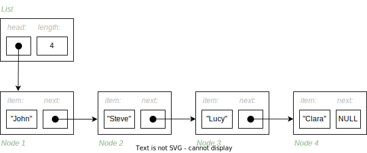
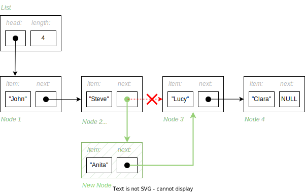
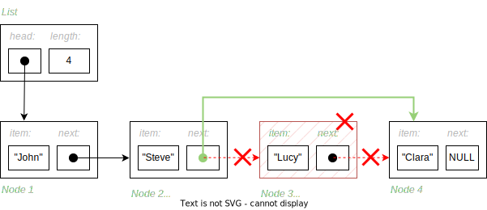
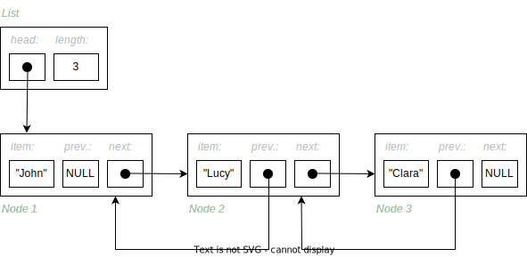
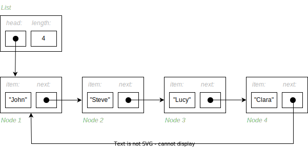
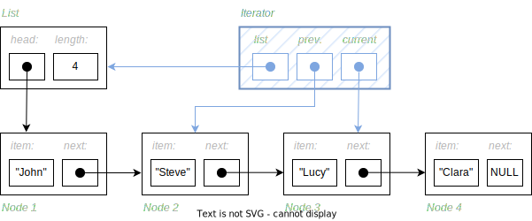

============
Linked Lists
============

:Lecture: Lecture 3.3 :download:`(slides) <https://studntnu-my.sharepoint.com/:p:/g/personal/franckc_ntnu_no/EYkbgdwxCwJIj6snFY0uOakB40JubjlbZRrAzQAWtGmwpA?e=qTxfgj>`
:Objectives: What is a linked list, and how to implement the Sequence
             ADT using a linked list
:Concepts: Linked-lists, Iterators

Now we know about :doc:`recursion </recursion/recursion>`, and how it
applies to both algorithms and data types, we can look at our first
recursive data type: The *linked List*. We will see how a linked list
yields another implementation of the :doc:`sequence ADT
</sequences/arrays>` with different efficiency as opposed to
array-based implementation. We will also briefly look at other members
of linked-list family, including the doubly linked list, and the
circular list. Finally, we will look at Iterator, a concepts that
makes linked-list shine when arrays are inefficient.

Linked Lists
============

.. margin::

   .. code-block:: c
      :name: recursion/linked_list/node
      :caption: A simple linked-list Node record in C
      :emphasize-lines: 3, 8

      typedef struct Node {
        int item;
        struct Node* next;
      } Node;

      typedef struct List {
        int length;
        Node* head;
      } List;
     

The idea behind linked lists is to store each item in a specific
record (sometimes called a *node*) that has two fields. The first hold
the item itself, and the second a reference to the record that
contains the next item. The sequence is therefore the chain made by
these records, as shown by
:numref:`recursion/linked_list/structure`. Additionally, one can also
add another `list` record that holdss a reference to the first "node",
as well as any other useful information (length, etc.). 

   Structure of a linked list of `string` items, where each node
   "points" to the next

In practice, all these references to nodes are implemented with
pointers or object references. By contrast to an array that allocates
a single continuous block of memory, a linked list is made of many
separate fragments of memory, linked using references.
   
Note that the record type of a node shown on
:numref:`recursion/linked_list/node` is a recursive data type.

Creation
--------

To implement the :func:`seq.create` we allocate a new :code:`List` record
and we initialize its fields with default values, 0 for the length,
and :code:`NULL` for the first item.

.. code-block:: c
   :name: recursion/linked_list/create/c
   :emphasize-lines: 4

   List*
   list_create ()
   {
     List* new_list = malloc(sizeof(List));
     new_list->length = 0;
     new_list->head = NULL;
     return new_list;
   }

Length
------

Computing the length of the sequence can be done easily, if store the
number of item in a dedicated field, as we did in
:numref:`recursion/linked_list/node`. :numref:`recursion/linked_list/length/c`
shows one way to do that in C.

.. code-block:: c
   :caption: Exposing the length of the sequence
   :name: recursion/linked_list/length/c

   int
   list_length(List* list) {
     assert(list != NULL);
     return list->length;
   }
   

Access
------

To implement the :func:`seq.get` function and find the i\ :sup:`th`
item, we need to follows the chain of nodes until the i\ :sup:`th` node,
and return the corresponding
item. :numref:`recursion/linked_list/get/c` shows the corresponding C
procedure.

.. code-block:: c
   :name: recursion/linked_list/get/c
   :caption: Find the i\ :sup:`th` item

   int
   list_get(List* list, int index)
   {
     assert(list != NULL);
     Node* target = find_node_at(list, index);
     return target->item;
   }

   Node*
   find_node_at(List* list, int index) {
     assert(index > 0 && index <= list->length);
     Node* current = list->head;
     int i=1;
     while (current != NULL && i != index) {
       i++;
       current = current->next;
     }
     return current;
   }

.. important::

   With a linked list, accessing the i\ :sup:`th` item is slow: It
   takes a time linear to the length of the sequence.

   
Insertion
---------

To implement :func:`seq.insert`, we allocate a new :code:`Node` record
and we link it with the appropriate nodes in the chain. In the general
case, we proceed as follows, althought care must be taken to insert in
the front of the list:

#. We create a new :code:`Node` record, that carries the given item.

#. We find the node that precedes the insertion points, so called *previous node*.
   
#. We set the next node of the new node to be the next node of previous node

#. We set the next node of the previous node to be the new node

#. We increment the length

:numref:`recursion/linked_list/insertion` shows the structure of the
list, the new node (in gray), and how the links are updated.
   

   Insertion of a new item at the 3rd position. We create a new node
   record and we update the chaining.

The listing below shows a possible implementation of this insertion
in C. To find the *previous* node, we use a separate procedure that
follows the links from node to node. Following these links requires
:math:`\Theta(n)` accesses.
   
.. code-block:: c
   :caption: Insertion in linked-list in C
   :name: recursion/linked_list/insert/c
   :emphasize-lines: 5, 12-14

   void
   list_insert(List* list, int item, int index) {
     assert(index > 0 && index <= list->length + 1);

     Node* new_node = malloc(sizeof(Node));
     new_node->item = item;

     if (index == 1) {
       list->head = new_node;

     } else {
       Node* previous = find_node_at(list, index-1); 
       new_node->next = previous->next;
       previous->next = new_node;

     }
     list->length++;
   }
   
.. important::

   The insertion in linked list runs in :math:`\Theta(n)`. As opposed
   to array-based implementation, an linked list does not require
   shifting any item. We simply creates a new node and "link it" to
   the chain. The "expensive" part is to traverse the chain to
   find the insertion point.

Deletion
--------

To implement the :func:`seq.remove` operation, we mirror the insertion
algorithm as follows (care must also be taken to delete the first
item). :numref:`recursion/linked_list/remove` illustrates this removal
process.

#. We locate the node that precedes the target (so called previous node)

#. We save the reference to the target node, to free that record

#. We set the :code:`next` field of the previous record to point to
   the :code:`next` field of the target

#. We free the target record.

   Deleting an item in a list by re-wiring the links

:numref:`recursion/linked_list/remove/c` gives a possible
implementation in C, which reuses the :code:`find_node_at` procedure
defined above.

.. code-block:: c
   :caption: A C implementation of the deletion algorithm
   :name: recursion/linked_list/remove/c
   :emphasize-lines: 10-13
             
   void
   list_remove(List* list, int index)
   {
     assert(list != NULL);
     if (index == 1) {
       free(list->head);
       list->head = NULL;

     } else {
       Node* previous = find_node_at(list, index-1);
       Node* target = previous->next;
       previous->next = target->next;
       free(target);
     }
     list->length--;
   }

Other Flavors of List
=====================

The concept of "linked list" is in fact a general idea and there are
many variations around. We look here at two common ones, doubly linked
lists and circular lists, but there are others such as skip lists,
self-adjusting lists, etc.

Doubly Linked Lists
-------------------

.. margin::

   .. code-block:: c
      :caption: A Node (record) for doubly linked list
      :name: recursion/linked_list/doubly_linked_list/node
      :emphasize-lines: 3

      typedef struct Node {
        int item;
        struct Node* previous;
        struct Node* next;
      } Node;
   

The idea of *doubly linked list* is to extend the nodes with a
reference to the previous node. This permits navigating the list in
both
direction. :numref:`recursion/linked_list/doubly_linked_list/node`
opposite, shows a C implementation of these extended nodes.

   Doubly linked list where each node points to the next and to the
   previous node.

Handling this extra reference make the insertion and deletion a little
more complex, but there is no need to search for "previous" item,
since we can now navigate the list in both direction.
   

Circular Lists
--------------

A *circular list* is a regular linked list where the last node points
back to the first one, creating a loop, as shown on
:numref:`recursion/linked_list/circular_list`.  A common use-case is
the rolling log for instance, where one continuously appends new
observation. Past a given maximum length :math:`n`, the list stops
growing and one simply overwrites the beginning, preserving only the
last :math:`n` items.

   A circular list, where the last node points towards the first one,
   creating a loop-like structure.
   
          
Iterators
=========

Consider our :doc:`Sequence ADT </sequences/arrays>`, and how one can
traverse it, say to print all items. Given the operations we
defined, one could write the program shown by
:numref:`recursion/sequence/traversal`.

.. code-block:: c
   :caption: Traversing a sequence using the operations of the ADT
   :name: recursion/sequence/traversal

   for (int i=1 ; i<=seq_length(sequence) ; i++) {
      int item = seq_get(sequence, index);
      // Do something with item ...
   }

If use an array to implement our sequence (see :doc:`Lecture 2.2
</sequences/arrays>`), this traversal would run in :math:`O(n)`. Indeed,
each access to a specific items (see :code:`seq_get()` takes
:math:`O(1)` and we will do this for each of the :math:`n` items.

However, if we used a linked list, this traversal would run in
:math:`O(n^2)`. With a linked list, each access runs in :math:`O(n)`
because we have to navigate the list from its "head" to the desired
node, and doing that for the :math:`n` items would take
:math:`O(n^2)`. But we can do better! Recall the :code:`find_node_at`,
it also traverses the sequences, and yet runs in :math:`O(n)` because
it moves from one node to the next without restarting at the
beginning, as shown on :numref:`recursion/linked_list/traversal`.

.. code-block:: c
   :caption: Traversing a linked list efficiently, from node to node.
   :name: recursion/linked_list/traversal
      
   Node* current = list->head;
   while (current != NULL) {
      int item = current->item;
      // .. do something with item
      current = current->next;
   }

The Iterator ADT
----------------

The iterator ADT captures the notion of "position within a container"
(i.e., sequences, trees, maps, etc.). It defines at least the
following operations:

.. module:: iterator

.. function:: create(s: Sequence, i: Natural) -> Iterator

   Create a new sequence iterator, setup at the given index. The
   resulting iterator is bound to the given sequence :math:`s`.

.. function:: item(i: Iterator) -> Item

   Returns the item at the known index

.. function:: hasNext(i: Iterator) -> Boolean

   Returns true if and only if there are more value beyond the
   position represented by the iterator,

.. function:: next(i: Iterator) -> Iterator

   Move the iterator from its current position to the next in the
   sequence

With this new ADT and its operations, we can now write a list
traversal as follows on
:numref:`recursion/sequence/traversal/iterator`.

.. code-block:: c
   :caption: Traversing a sequence using an iterator
   :name: recursion/sequence/traversal/iterator

   Iterator* position = iterator_create(sequence, 1);
   while (iterator_has_next(position)) {
      int item = iterator_item(position);
      // .. do something with item ...
      iterator_next(position);
   }

C Implementation
----------------

Iterators can be implemented against an array, or a linked list, as we
will do below. To implement an iterator, we must keep track of the
list of interest, the current node, and its predecessor (if any).
:numref:`recursion/linked_list/iterator/c` shows how that could look
like in C, where we use a record to hold a reference to each of these
bits and pieces.

.. margin::

   .. code-block:: c
      :caption: A record that defines an iterator
      :name: recursion/linked_list/iterator/c

      typedef struct Iterator {
        List *list;
        Node *previous;
        Node *current;
      } Iterator;
      
:numref:`recursion/linked_list/iterator/structure` shows the structure
of a list, with an iterator "pointing" at the 3\ :sup:`rd` item. The
`previous` field enables extending the set of operations, with
insertion and deletion in :math:`O(1)`.

   An iterator referencing a list and one of its node.

Linked Lists vs. Dynamic Arrays
===============================

:numref:`recursion/linked_list/vs-array` summarizes the performance of
linked lists and dynamic arrays. Regarding the memory, a linked list
requires more memory than an equivalent array, because we need to
store all these extra pointers. As for the runtime, there is no clear
winner, and using one or the other depends on the problem at hand.

.. csv-table:: Comparing runtime efficiency of linked list and dynamic
               arrays (worst cases)
   :name: recursion/linked_list/vs-array
   :header: "Scenario", "Dynamic Array", "Linked List"
   :widths: 30, 10, 10

   "Create", ":math:`O(1)`", ":math:`O(1)`"
   "Access", ":math:`O(1)`", ":math:`O(n)`"
   "Insert first", ":math:`O(n)`", ":math:`O(1)`"
   "Insert last", ":math:`O(1)*`", ":math:`O(n)`"
   "Insert (iterator)", ":math:`O(n)`", ":math:`O(1)`"
   "Remove first", ":math:`O(n)`", ":math:`O(1)`"
   "Remove last", ":math:`O(1)*`", ":math:`O(n)`"
   "Remove (iterator)", ":math:`O(n)`", ":math:`O(1)`"
   
