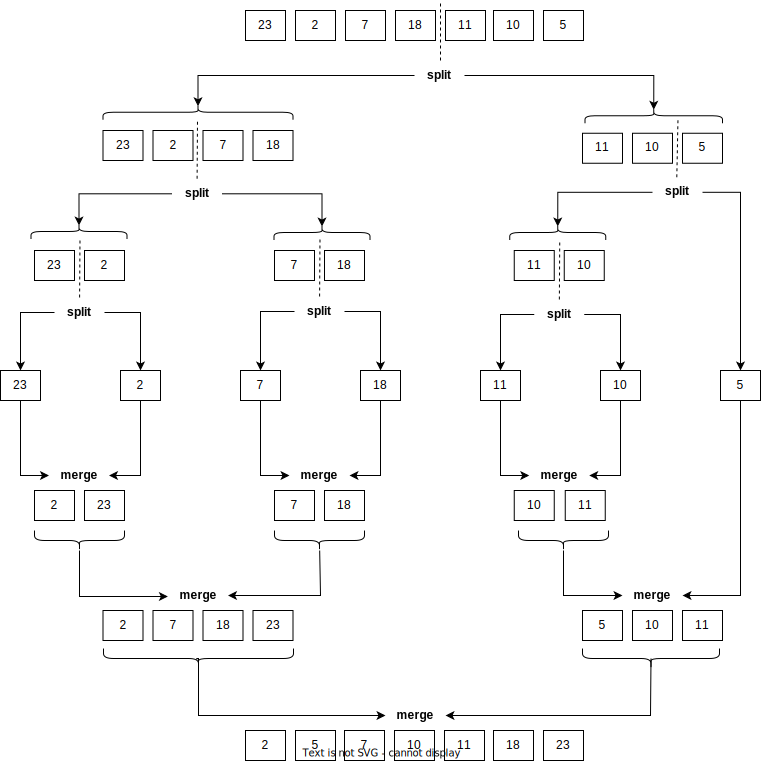
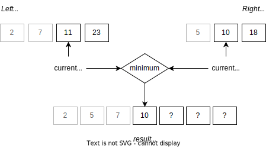

==========
Merge Sort
==========

:Lecture: Lecture 3.5 :download:`(slides)
          <https://studntnu-my.sharepoint.com/:p:/g/personal/franckc_ntnu_no/Ef7Ac-PmhwxLr7PoXB6_0u4Bo6t6_STQnBzsJYCAnBybFw?e=5URP91>`
:Objectives: Understand how does merge sort works, and why does it sort fast
:Concepts: Merge sort using split and merge, master theorem

We now look at another well known recursive sorting algorithm: Merge
sort\ [#vonNeumann]_, running among others behind
:code:`Collections.sort` in Java. In the worst case, merge sort runs
in :math:`O(n \log n)` and beats quick sort, whose runs in
:math:`O(n^2)`, in the worst case.

.. [#vonNeumann] Yet another great contribution of John Von Neumann.

Merge Sort
==========

Principle: Split & Merge
------------------------

.. margin::
   
   .. code-block:: ruby
      :name: recursion/merge_sort/merge_sort
      :caption: A (recursive) implementation of merge sort in Ruby
      :emphasize-lines: 8

       def sort (sequence)
         if sequence.length < 2
           return sequence
         end
         half = sequence.length / 2
         left = sequence.first(half)
         right = sequence.last(half)
         return merge(sort(left), sort(right))
       end      

As many recursive algorithms, merge sort is very succinct. It goes as
follows:

#. Split the sequence into two halves, namely *left* and *right*

#. Sort both *left* and *right* using merge sort

#. Merge back *left* and *right* into a single, sorted sequence

Why does that work? Conceptually, we recursively split the given
sequence until we get single-item sequences, which are sorted by
definition. Then we can merge then two by two until have sorted the
complete sequence. :numref:`recursion/merge_sort/unfolding`
illustrates this behaviour.

   Applying merge sort to the sequence :math:`s=(23,2,7,18,11,10,5)`.

The Merge Algorithm
-------------------

To merge two sorted sequences, we proceed as follows:

#. We create a new sequence, which will hold the merge

#. We keep track of our position (i.e., an iterator) for each
   sequences, say left and right. We start by pointing the two first
   items.

#. As long as we can move in both sequences:

   #. We compare the current left and right values, and we copy the
      smallest one into our result sequence.

   #. We increment the position of the sequence that yielded that
      minimum.

#. As soon as we have exhausted the items in one sequence, we copy the
   remaining items of the other into the result sequence.

The :numref:`recursion/merge_sort/merging` illustrates this
procedure. We are merging two sequences, namely :math:`\textrm{left} =
(2,7,11,23)` and :math:`\textrm{right}=(5,10,18)`. One each sequence,
we are comparing the 3\ :sup:`rd` item (10) the 2\ :sup:`nd` item
(11). As 10 is the smallest, we insert at the end of the result
sequence, and we increment the right current pointer.

   

   Merging two sorted sequences (left & right) into a new sequence

.. code-block:: ruby
   :caption: Merging two sorted sequences in Ruby
   :name: recursion/merge_sort/merge
   :emphasize-lines: 2,4,6,9

   def merge(left, right)
     result = []
     leftIndex, rightIndex = 0, 0
     while leftIndex < left.length and rightIndex < right.length
       if left[leftIndex] < right[rightIndex]
         result.append(left[leftIndex])
         leftIndex += 1
       else
         result.append(right[rightIndex])
         rightIndex += 1
       end
     end
     result.push(*left[leftIndex..])
     result.push(*right[rightIndex..])
     return result
   end
   
   
Efficiency
==========

Is there a worst case and best case? Well no. We can see that merge
sort always does the sane thing: Split the sequence in halves.

Memory
------

How much memory does merge sort consumes? Let's break it down. When
the given sequence contains only one items, it is already sorted and
there is nothing to do, so no need for any memory. However, when the
given sequence contains multiple items (say :math:`n` for instance),
we first split it into two halves: That requires :math:`2 \cdot
\frac{n}{2} = n`, we sort these two halves, and finally, we merge
these results into another sequence of, again, :math:`n` items. Note
that as we sort these two halves one after the other, the memory used
to sort the first one is released before we sort the second one, so
the memory is possibly reused.

Again---as for many recursive algorithms---we will formulate that
using a recurrence relationship :math:`m(n)` as follows:

.. math::

   m(n) = \begin{cases}
   0 & \textrm{if } n = 1 \\
   2n + m(\frac{n}{2}) & \textrm{otherwise}
   \end{cases}

Which we can simplify as follows:

.. math::

   m(n) &= 2n + m(\frac{n}{2}) \\
        &= 2n + \left[2\frac{n}{2} + m(\frac{n}{4}) \right] \\
        &= 2n +  n + \left[ 2\frac{n}{4} + m(\frac{n}{8}) \right] \\
        &= 2n +  n + \frac{n}{2} + \left[ 2\frac{n}{8} + m(\frac{n}{16}) \right] \\
        &= 2n + n + \frac{n}{2} + \frac{n}{4} + \frac{n}{8} + ... + m(1) \\
        &= 2n + \sum_{i=1}^{\log_2 n} \frac{n}{2i} \\
        &= 2n + n-1 \\
        &= 3n-1

.. important::

   We see that merge sort consumes an amount of memory that is
   proportional to the length of the given sequence.
        
Runtime
-------

Let's now turn to the time it takes for merge sort to process a
sequence of length :math:`n`. Recall that there are three steps:

#. Split the sequence in two halves

#. Sort these two halves, using merge sort

#. Merge these two sorted sequences

The overall time spent by merge sort is the sum of the time spent in
each of these steps. Let's look at each of these:

How much time do we spend splitting?
  If we assume we allocate two new smaller sequences for the left and
  the right parts, then we will spent time copying items in
  these. Overall we will copy the whole :math:`n` items.

How much time do we spend sorting the two halves?
  This is our recursive case. The time we spend is the time we
  spent sorting a sequence twice as small. But we do it twice, once
  for the right part and one for the left part, that is :math:`2 \cdot
  t(\frac{2}{n})`

How much time do we spend merging?
  As for spliting, merging is first and foremost about copying the
  items from both sides into a new sequences. If left and right
  contains :math:`n_L` and :math:`n_R`, respectively, we shall copy
  all of them regardless of which comes first. In total, we will
  spend :math:`n_L + n_R`.

On top of that, remember that when the sequence contains only one
item, we return the sequence itself, so we do not spend any extra
time.

We can formulate that using the following recurrence relationship
:math:`t(n)`:

.. math::

   t(n) = \begin{cases}
     0 & \textrm{if } n = 1 \\
     2n + 2\cdot(\frac{2}{n}) & \textrm{otherwise} 
   \end{cases}

This recurrence is a specific form, where the *master theorem*
applies. That shortcut the calculation:

.. important::

   The *master theorem* simplifies many calculations about recursive
   algorithms. It goes as follows:

   If a recurrence :math:`T(s)` has the following form, where
   :math:`a`, :math:`b` and :math:`c` are constants:

   .. math::

      T(s) = \begin{cases}
      a \cdot T(\frac{n}{b}) + f(n) & \textrm{if } n \gt 1 \\
      c  & \textrm{if } n = 1
      \end{cases}

   Then, one can conclude that:

   .. math::

      T(s) \in \begin{cases}
      \Theta(n^{\log_b a}) & \textrm{if } a > b \\
      \Theta(n \log n) & \textrm{if } a = b \\
      \Theta(n) & \textrm{if } a \lt b 
      \end{cases}

In this case, we can see that :math:`a=b=2`, :math:`c=0` and
:math:`f(n) = 2n`. Since :math:`a=b`, the master theorem tells us that
:math:`t(s) \in O(n \log n)`.
