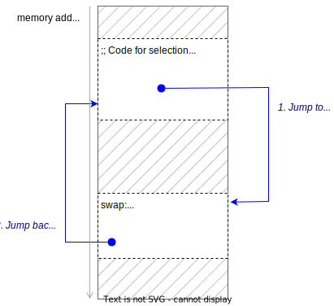
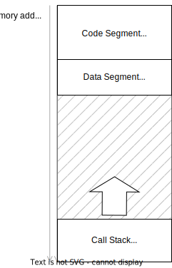
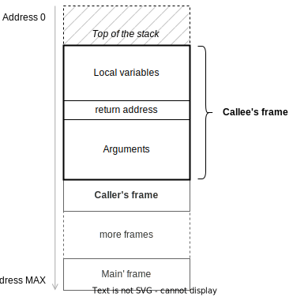

===============
Procedure Calls
===============

:Lectures: Lecture 4.1 :download:`(slides)
           <_static/procedure_calls/procedure_calls.pptx>`
:Objectives: Understand the mechanisms of procedure calls and their
             runtime and memory cost
:Concepts: call-stack, call-frame, static and dynamic memory
           allocation

So far we have used procedures here and there informally, to break
down larger algorithms/programs into more manageable pieces. Now it is
time to look more carefully to understand what happens at the
machine-level and how much resources it takes.

Why Procedure Calls?
====================

Procedure call is an early construct that helps us progress from
assembly code towards higher-level languages. They bring numerous
benefits, including:

- Better code reuse and duplication removal. If the same fragment of
  code appears in multiple place, we can extract it into a separate
  procedure and get rid of the duplicated code.  That helps with bug
  fixing in particular and avoid having to roll the same fix in
  multiple places.

- Better Code readability. Provided the procedures' name are
  meaningful, the code reads better, and the intention (the algorithm)
  becomes more visible.

- Better Separation of concerns. Procedures are handy to separate
  different concerns, parameter validation, error handling, etc. That
  makes the things clearer.

Remember for instance the :ref:`selection
sort<sequences/sorting/selection_sort/entry>`, which I reproduce below
in :numref:`recursion/calls/selection_sort`.

.. code-block:: ruby
   :caption: A Ruby implementation of the selection sort, where
             `find_minimum` and `swap` are separate procedures
   :name: recursion/calls/selection_sort
   :linenos:
   :emphasize-lines: 3, 4, 8, 18

   def selection_sort(sequence)
     for index in 0 .. sequence.length-2
        minimum = find_minimum(sequence, index)
        swap(sequence, index, minimum)
     end
   end

   def find_minimum(sequence, start)
     minimum = start
     for index in start+1 .. sequence.length-1
       if sequence[index] < sequence[minimum]
         minimum = index
       end
     end
     return minimum
   end

   def swap(sequence, left, right)
      tmp = sequence[right]
      sequence[right] = sequence[left]
      sequence[left] = tmp
   end

We extracted two procedures, namely :code:`find_minimum` and
:code:`swap`, which makes the :code:`selection_sort` algorithm much
easier to understand---at least for me. But what about efficiency? Do
procedure calls incur an extra cost in time and/or in space?

.. note:: I use the terms *caller* and *callee* to refer to the two
   sides of a call. The *caller* is the code that calls and provides
   arguments, whereas the *callee* is the procedure that is called and
   returns a result.

   In :numref:`recursion/calls/selection_sort` for instance, there is
   a procedure call Line 3, where :code:`selection_sort` is the
   *caller*, and :code:`find_minimum` is the callee.

How Does "Calling" Work?
========================

Random access machines (RAM) have no concepts of procedure. Their
memory only contains symbols, which the machine interprets either as
data or as instructions. Procedure is a programmer concept: It helps
us reduce the complexity by breaking algorithms and programs into
smaller pieces that are easier to understand.

So *procedures* is something that is handled mainly by the compiler,
which translates our higher-level programming constructs into assembly
and/or machine code. What does the compiler does with procedures
declaration and calls. There are two approaches: *inlining* and
*branching*.

Inlining
--------

The idea of *inlining* procedure calls is to replace every call to a
given procedure by itself by the code of that very procedure.

Consider again our :code:`selection_sort` algorithm shown in
:numref:`recursion/calls/selection_sort`. Inlining the calls to
:code:`find_minimum` and :code:`swap` yields the following algorithm:

.. code-block:: ruby
   :caption: Inlining the :code:`swap` and :code:`find_minimum`
             procedures in :code:`selection_sort`
   :name: recursion/calls/inlining
   :linenos:
   :emphasize-lines: 3, 10

   def selection_sort(sequence)
     for index in 0 .. sequence.length-2
        # minimum = find_minimum(sequence, index)
        minimum = index
        for i in index+1 .. sequence.length-1
          if sequence[i] < sequence[minimum]
            minimum = i
          end
        end
        # swap(sequence, index, minimum)
        tmp = sequence[minimum]
        sequence[minimum] = sequence[index]
        sequence[index] = tmp
     end
   end

In :numref:`recursion/calls/inlining` we have to rename some variables
to avoid name clashes. In this very example, Inlining shortens the
overall program (15 lines against 22 in
:numref:`recursion/calls/selection_sort`), but in practice, inlining
yields *fat code*, because there are always many calls for each
procedure declaration.

But from the efficiency standpoint, this is perfect: There is no extra
work involved and no extra memory consumed (except for the code
segment). The compiler does the heavy lifting but in the generated
machine code, there is no "calls" anymore.

.. important:: *Inlining* is very efficient and compilers may decide
   to inline some of your functions, when they see fit. C and C++ for
   instance, offer the :code:`inline` keyword that forces inlining.

Branching
---------

The idea of *branching* is to replace procedure calls by :code:`JUMP`
instructions so that the machine "branch" to the body of the procedure
and then, jumps back and resume execution right after the call, as
shown on :numref:`recursion/calls/branching`.

.. _recursion/calls/branching:

   Branching implies "jumping" back and forth between the caller and
   the callee instructions.

Unfortunately, jumping is not enough, because the caller has to pass
arguments and get a result back, if any.

To do that, we use the *call stack*: A dedicated area in memory, which
we operate as a :ref:`stack <sequences/stacks/stack>`. For each
procedure call, the caller and the callee use it to exchange
informations. The caller *pushes* its arguments and the return
address, and then jumps to callee. The callee can *pop* these
information from the stack, pushes the result, and finally jumps back
to the given return address.

The Call Stack
==============

In Practice
-----------

As developers, we get to see this *call stack* every time our programs
crash. Consider the terminal output below, where I run a Java
implementation of the selection sort that crashes. The program exits
with an :code:`ArrayOutOfBoundsException`.

.. code-block:: console

   $ java Sort.java 
   Exception in thread "main" java.lang.ArrayIndexOutOfBoundsException: Index 9 out of bounds for length 9
        at Sort.findMinimumFrom(Sort.java:16)
        at Sort.selectionSort(Sort.java:6)
        at Sort.main(Sort.java:32)

What comes right after this exception is a summary of the *call
stack*, precisely when the program crashed. Starting from the very
bottom, the :code:`main` procedure was active, the
:code:`selectionSort` was active too, and we were in the middle of the
:code:`findMinimumFrom`.

This information comes straight from the call stack. Each active
procedure has a dedicate "record", so called its *activation frame*,
which contains all the information exchanged between the caller and
the callee. When we call a procedure, a new frame is pushed onto the
stack, and gets pop out when the procedure returns. 

The Call Stack Structure
------------------------

Again, the call stack does not exist at the machine-level. It is more
like a "design pattern", which the compiler generates. The call stack
generally resides at the end of the available memory, as shown on
:numref:`recursion/calls/call_stack`, and grows towards the data
segment. If the stack grows so large that it collides with rest of the
memory (i.e., data segment), the system raises the well-known
:code:`stack overflow` error.

.. _recursion/calls/call_stack:

   Memory layout, including the call stack.

Each active procedure gets an *activation record* on the
stack. Activation records include the following, also shown on
:numref:`recursion/calls/activation_frame`:

- The arguments, that is, the value of each parameter required by the
  callee.
- The *return address*, where the callee must "jump" upon completion.
- The local variables of the callee.

.. _recursion/calls/activation_frame:
  

   Example organization of an activation frame

.. important::

   The call stack automates the allocation of memory for local
   variables. The compiler automatically allocates all local variables
   into the call stack. When a procedure returns, its activation
   record is automatically released.

Calls in Assembly RAM Code
--------------------------

To close the loop, let us see how we could extend our RAM model and
support procedure calls. In assembly, there are two addresses that we
need to track:

- the top of the stack (aka. stack pointer or :code:`SP`). It contains
  the address of the last item on the stack.

- the frame pointer (aka. :code:`FP`), which acts as a reference
  points within a single activation frame. Often, :code:`FP` points to
  the first local variable. We access other fields indirectly,
  using :code:`FP+1` to access the return address.

Our RAM model only has a single register, :code:`ACC`, which shall
contain, by convention, the result of the procedure. So we place
:code:`SP` and :code:`FP` in the last two memory cell.

To simplify the assembly code, we introduce some new features and
higher level instructions.

- Indirect addressing where we denote by :code:`[SP+1]` the address
  contained at address :code:`SP+1`. Here :code:`SP` is an address,
  where lays another address. We will use these square brackets and
  offset to indicate such indirect access (aka. pointers).

- :code:`PUSH <address>` which decrements :code:`SP` and writes the
  content at the given address on the top of the stack. That would be
  the same as the following snippet:

  .. code-block:: nasm

     LOAD       0        ;; decrement SP by one
     ADD        SP
     SUBTRACT   one
     STORE      SP
     LOAD       0        ;; Store "address" at SP
     ADD        address
     STORE      [SP]

- :code:`POP`, which increments :code:`SP`. There is no need to
  actually erase the memory.

  .. code-block:: nasm

     LOAD 1
     ADD SP
     STORE SP

Equipped with these, we can now make a call to the :code:`swap`
procedure for instance. The only extract thing we have to do is for
the callee to save the previous value of the frame pointer :code:`FP`
before to update it, and to restore it before to return. 

.. code-block:: nasm

             ;; Here is the code from the caller
             PUSH    right           ;; Push the 'right' arguments
             PUSH    left            ;; Push the 'left' arguments
             PUSH    sequence        ;; Push the 'sequence' arguments
             PUSH    return
             LOAD    0               ;; Branch to the "multiply" code
             JUMP    swap

   return:   POP                     ;; Continue here once multiply returned
             POP                
             POP
             POP
             PRINT   [SP]            ;; Print the result
             HALT

   swap:     PUSH    FP              ;; Back-up FP onto the stack
             LOAD    0               ;; Update FP
             ADD     SP
             STORE   FP
             ;; Perform the swap. Arguments are accessible using indirect addressing
             PUSH    [FP+4]          ;; tmp = sequence[right]
             LOAD    0               ;; sequence[right] = sequence[left] 
             ADD     [FP+3]         
             STORE   [FP+4]
             LOAD    0               ;; sequence[left] = tmp
             ADD     [FP-1]
             STORE   [FP+3]
             
             ;; 
             LOAD    0               ;; Restore Old "FP"
             ADD     [FP-1]
             STORE   FP
             POP                     ;; Remove FP
             LOAD    0               ;; Branch back to the "return" address
             JUMP    SP

How Much Does "Calling" Cost?
=============================
