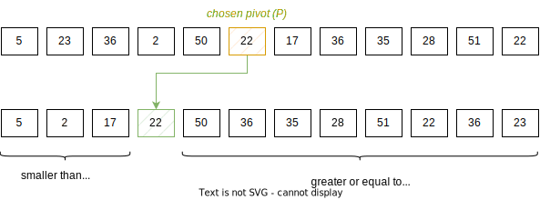
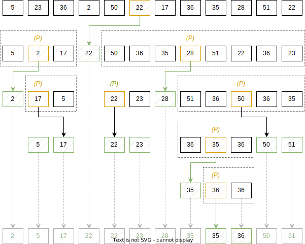
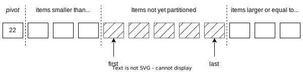

==========
Quick Sort
==========

:Lecture: Lecture 3.4 :download:`(slides) <_static/quick_sort/quick_sort.pptx>`
:Objectives: Understand how does quick sort works, and why does it sort fast
:Concepts: Sorting, recursion, pivot element

We have already looked at three sorting algorithms: Insertion sort,
selection sort, and bubble sort. All are rather slow as they run in
quadratic time (see :doc:`Lecture 2.5 <sequences/sorting>`). We will
now scrutinize one of the faster, namely *quick-sort*, implemented
among others by the :code:`qsort` operation in the C standard library.
           

Quick Sort
==========

The Idea: Partitioning
----------------------

The idea of quick sort [#hoare]_ relies on partitioning the given items around a
*pivot* item. We pick the pivot at random, and then, every item that
is smaller than pivot goes on one side, and the rest on the other
side. :numref:`recursion/quick_sort/partitioning` illustrates this
idea. We will look later at what algorithm one can use to do that.

   Partitioning a sequence around a chosen pivot, here 22

Note that partitioning is a property of a sorted sequence. Any item in
a sorted sequence is preceded by smaller items and followed larger
items.

.. [#hoare] Quick sort is attributed to C. A. R. Hoare in 1959. He
            later received the Turing award in 1980 for his
            contribution to formal verification.

The "Quick-sort" Algorithm
--------------------------

Equipped with partitioning the sequence around a chosen pivot, we can
describe quick-sort as follows:

#. Choose a *pivot* item, randomly.

#. Partition the sequence as follows: Items that are smaller than the
   pivot go to its left, and the rest to its right.

#. Apply quick-sort on the left of the pivot (recursion)

#. Apply quick-sort on the right of the pivot (recursion)

.. margin::

   .. code-block:: python
      :caption: Overview of the quick-sort algorithm
      :name: recursion/quick_sort/algorithm

      def quick_sort(sequence):
          if len(sequence) < 2:
             return
          pivot = partition(sequence)
          quick_sort(sequence[:pivot])
          quick_sort(sequence[pivot+1:])

:numref:`recursion/quick_sort/algorithm` shows a Python program that
implements quick sort, using
recursion. :numref:`recursion/quick_sort/quick_sort` shows how this
would unfold on a sequence of integers. The sequence is gradually
broken down into smaller sequences, until it gets sequences of length
that are sorted, by definition.

       

          
   Unfolding quick sort on a small sequence of integers.

.. caution:: Quick sort, when written recursively, is a fairly short
             algorithm. Its behavior is not trivial however. This is
             often the case with recursive algorithms.
            
Out-of-place Partitioning
-------------------------

How do we partition a sequence around a chosen pivot? The simplest
solution is the "out-of-place" approach, where we create a new
sequence that holds the result of the partitioning. If we accept using
this extra memory, we can proceed as follows:

#. We create a new empty sequence that will hold the result of the
   partitioning.

#. We choose a pivot index, for instance the middle item. Other
   strategies are possible.

#. We copy the pivot *item* into our result sequence.

#. We traverse the given sequence, and for every item *but the pivot*:

   #. If the current item is smaller than the pivot, we insert it in
      front of the result, that is before the pivot

   #. If the current item is greater or equal to the pivot, we insert
      it at the end of result, that is after the pivot.

:numref:`recursion/quick_sort/partitioning/out-of-place` illustrates
how that would look like in Python. Here we choose as pivot the middle
element. The `append()` function insert an item at the end of a
sequence.
      
.. code-block:: c
   :caption: Partitioning the sequence (with a new sequence)
   :name: recursion/quick_sort/partitioning/out-of-place
   :emphasize-lines: 2, 9-12

   def partition(sequence):
     pivot_index = len(sequence) // 2
     pivot = sequence[pivot_index]
     result = [pivot]
     for index in range(len(sequence)):
       if index == pivot_index:
           continue
       current = sequence[index];
       if current >= pivot:
          result.append(current)
       else:
          result.insert(0, current)
     return pivot, result

This approach is not ideal because it requires allocating a new
sequence each time we partition the array. Keep in mind, that quick
will partition sub sequences again and again. Besides, insertion in
front of a sequence runs in :math:`O(n)`, so the runtime would not great
either. A better way is the "in-place" partitioning where we only swap
items without any extra memory cost.
      
In-place Partitioning
----------------------

To partition "in-place" we rely on the swap operation, which exchanges
the position of two items in a sequence, and runs in :math:`O(1)`. To
do that, we will organize our sequence as shown on
:numref:`recursion/quick_sort/in-place_partitioning`. We will
temporarily place the pivot in front, while we will divide the rest
into smaller items on the left, larger items on the right, with the
items yet to be partitioned in between.

   Setup used to partition a sequence: The pivot is placed in front
   (temporarily), while the rest is split between the smaller items on
   the left and the larger items on the right.

As we progress, we move items from the middle to either smaller or
greater. The variable :code:`first` and :code:`last` keep track of
the remaining items yet to be partitioned. Overall, we proceed as
follows:

#. We choose a pivot item, and we swap it with first item, put it in
   "safe" place.

#. Initially, :code:`first` and :code:`last` points toward the second
   and the last item, respectively.

#. As long as last is not smaller than first:

   #. If :code:`first` is greater or equal to the pivot, we swap it with
      :code:`last` and we *decrement* last.

   #. If :code:`first` is smaller than the pivot, we simply increment
      :code:`first`.

#. We swap back the pivot with :code:`first`, to put it back in the
   right place.

.. code-block:: python
   :caption: In-place partition of sub sequences, delimited by
             :code:`lower` and :code:`upper`.

   def partition(sequence, lower, upper):
     pivot = (lower + upper) // 2
     sequence.swap(lower, pivot)
     first, last = lower+1, upper-1
     while first <= last:
          if sequence[first] <= sequence[lower]:
               first += 1
          else:
               sequence.swap(first, last)
               last -= 1
     swap(array, lower, first-1)
     return first-1

   
Efficiency
==========

Worst Case
----------

Best Case
---------

Average Case
------------
