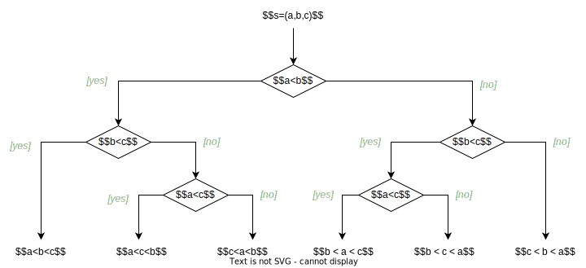
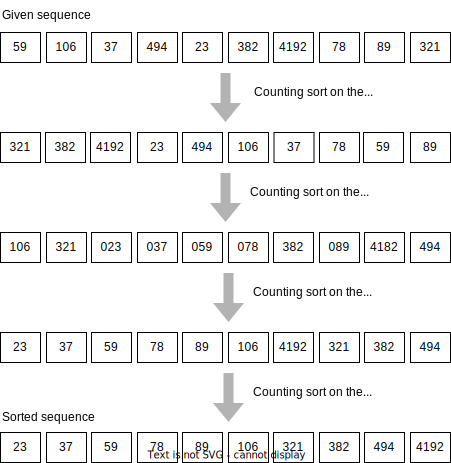

=========================
Sorting Without Comparing
=========================

:Lecture: Lecture 3.6 :download:`(slides)
          <https://studntnu-my.sharepoint.com/:p:/g/personal/franckc_ntnu_no/EeVtctkWfaBAunK1qHF0HicBDyIgESYkGpLxvYtFH4tVTA?e=OW2NYP>`
:Objectives: Understand the limit of sorting by comparing.
:Concepts: Sorting without comparing, counting sort, radix sort

We depart from recursion a bit to wrap up our discussing about sorting
algorithms. We have already looked at five: Selection sort, Insertion
sort, Bubble sort, Quick sort, and Merge sort. What is the common
trait among them? They all rely on comparisons, that is they compare
one item to another to decide where it should go. This type of sorting
is called *comparison-based*.

In this lecture look at the *problem* of sorting and its inherent
limits when one uses comparisons: No comparison-based
sorting algorithm can run faster than :math:`O(n \log n)`! To
illustrate a different approach, we shall look at *Counting sort* and
Radix sort, which offer, under specific conditions, linear runtime.

           
The Limit of Sorting by Comparing
=================================

What  is sorting?  From  a theoretical  perspective,  sorting a  given
sequence  implies finding  a permutation  of its  items so  that every
items is smaller than all its successors.

Consider the sequence :math:`s=(a, b, c)` for instance. How many
permutations exist? There are :math:`6 = 3 \times 2 \times 1 = 3!`. In
this case these six permutations are:

- :math:`s_1=(a, b, c)`

- :math:`s_2=(a, c, b)`

- :math:`s_3=(b, a, c)`

- :math:`s_4=(b, c, a)`

- :math:`s_5=(c, a, b)`

- :math:`s_6=(c, b, a)`

Given a random permutation, how can we find one of those that are
sorted [#sorted]_ ? We need to compare items one another to decide
which one is the largest, etc. :numref:`recursion/radix/decision_tree`
shows the *decision tree* that shows which finds the sorted sequence
for any given sequence :math:`s=(a,b,c)`. For instance, if we know
that :math:`a < b` and :math:`a < c`, we still need to assert that
:math:`c < b` to conclude that the sorted permutation is
:math:`s_2=(a, c, b)`.

.. [#sorted] There can be multiple permutations that are sorted, if
             several items have the same value.

   Comparisons needed to sort a sequence of three items
   :math:`s=(a,b,c)`. Each node shows a decision based on comparing two
   items.
             

The decision tree shown by :numref:`recursion/radix/decision_tree` has
a specific shape. For a sequence of :math:`n` items sitting at the top
of this decision tree, the bottom includes the :math:`n!` possible
permutations. Each decision is binary (yes or no) so the tree has a
height of :math:`\log_2 n!`. This function is bounded below by
:math:`n \log n`. In other word, the worst case cannot get any better
than :math:`n \log n`, that is :math:`\log_2 n! \in \Omega(n \log_2
n)`. This is an example of the lower bound applied to the worst case:
It will never be faster than :math:`n \log n`.

.. important::

   When sorting using comparisons, there cannot be any algorithm that
   runs faster than :math:`O(n \log n)`.

If we are not using comparisons, let us see what else we can do. We
shall look at the *counting sort* and the *radix sort*, two algorithms
that do not rely on comparisons.

Counting Sort
=============

The idea of the counting sort is to count items per category. Consider
for instance the sequence :math:`s=(0,1,1,2,0,1,1,2,0,1,1,2,0)`. It contains
only three "categories" of items: 0, 1, and 2. Provided we know the
order of these categories, we can traverse the sequence once, counting
how many items falls in each category, and finally rebuild the
sequence as follows:

.. math::

   s'=(\overbrace{0,0,0,0}^{\times 4},\overbrace{1,1,1,1,1,1}^{\times 6},\overbrace{2,2,2}^{\times 3})

In summary, counting sort proceeds as follows:

#. Traverse the given sequence, and build a *frequency table*, which
   registers how many items fall into each category.

#. Compute the cumulative frequencies

#. Adjust the given sequence, according to the cumulative frequency
   table
   

:numref:`recursion/radix/counting_sort/code` illustrate this in
Java. The :code:`countingSort` procedure accepts a sequence (as an
array) and its largest key. The largest key captures the set of
categories, implying that the given sequence will contain only values
from 0 to that largest key. The most tricky part is how we rebuild the
sorted sequence. The cumulative frequency table also capture the index
at which a given category should start. So we proceed backward and for
each item in the given sequence, we write it down at its latest
position, decrementing the count (see lines 14-18).
   
.. code-block:: java
   :caption: Java implementation of counting sort
   :name: recursion/radix/counting_sort/code
   :linenos:
   :emphasize-lines: 14-18

   int[] countingSort(int sequence[], int largestItem) {
       int[] sorted = new int[sequence.length];
       int [] frequencies = new int[largestItem + 1];

       for (int i=0 ; i<sequence.length ; i++) {
           int key = sequence[i];
           frequencies[key] += 1;
       }

       for (int key=1; key<largestItem+1 ; key++) {
           frequencies[key] += frequencies[key-1];
       }

       for (int i=sequence.length-1 ; i>=0 ; i--) {
           int key = sequence[i];
           sorted[frequencies[key]-1] = key;
           frequencies[key]--;
       }

       return sorted;
    }

Runtime Efficiency
   We see :numref:`recursion/radix/counting_sort/code` that each of
   the steps if implemented using a loop. We iterate either through
   the given sequence, or through the set of categories. As the result
   counting sort runs in :math:`O(n+k)` where :math:`n` is the length
   of the given sequence and :math:`k` is the number of categories.

Memory efficiency
   :numref:`recursion/radix/counting_sort/code` provides an out-of-place,
   where we provision a separate array to hold the result. But besides
   this, we also need some memory for the frequency table. So counting
   sort requires (i.e., :math:`O(n+k)`) memory.

Counting sort offers a first way to sort without comparing, but it has
its limitations. Counting works best when we have a few categories and
many items. For instance, sorting a sequence of 10 items between 0 and
1 000 000 would be penalized by the very large number of categories
(i.e., 1 000 000). Besides, in many practical situations, we do not
know the categories before hand. Let see how *radix sort* builds on
*counting sort* to work around these limitations.
  
Radix Sort
==========

The idea of the radix sort is to apply counting sort
repeatedly. Consider numbers such as 123 for instance. If we work on
separate digits, then the number of categories required by counting
sort is known, it's 10, for the ten digits. Since, counting sort is a
*stable* sorting algorithm, we can apply it for each digit, from the
least significant (LSD) to the most significant, without disrupting
what was sorted before. :numref:`recursion/radix/idea` illustrates
this idea.

   The Radix sort (LSD): Applying repeatedly counting sort on each
   digits, for the least significant to the most significant.

:numref:`recursion/radix/code` shows an possible implementation of
radix sort in Java. It uses a modified version of the counting sort
where the categories are "hard-coded" (i.e., the 10 digits), and that
accept the significant digit to consider. First we search for the
maximum of the given sequence, and compute its number of digits. We
can then apply counting sort as many times as there are digits in this
largest item.

.. code-block:: java
   :caption: An implementation of the Radix sort in Java
   :name: recursion/radix/code
   :emphasize-lines: 5-7

   int[] radixSort(int[] array) {
       int[] sorted = array;
       int maximum = findMaximum(array);
       int digitCount = countDigits(maximum);
       for(int digit=0 ; digit<digitCount ; digit++) {
           sorted = countingSort(sorted, digit);
       }
       return sorted;
    }
   
Runtime Efficiency
  Radix sort is basically running counting sort as many times as there
  are digits. The runtime therefore depends on the number of items in
  the sequence but also in the maximum number of digits in these
  items. Radix sort thus runs in :math:`O(d \cdot (k+n))` where
  :math:`n` is the number of items, :math:`k` the number of
  categories, and :math:`d` the number of digits.

Memory Efficiency
  Radix sort does not requires more memory than what counting sort
  does, so the space complexity of radix sort is the same,
  :math:`O(n+k)`.

.. important::

   When applicable, non-comparison sorting algorithm offer fast
   (linear runtime) alternative to more "classical" quick sort and
   merge sort.

Sorting Algorithms, Overview
============================

That concludes our dive into sorting algorithms, but there are many
more such as the heap sort or the shell sort to name a
few. :numref:`recursion/radix/sorting_summary` summarizes the
efficiency of the different sorting algorithms we have studied so far.

.. list-table:: Summary of sorting algorithms studied in this course
   :name: recursion/radix/sorting_summary
   :widths: 23 10 10 10 10
   :header-rows: 1

   * - Algorithm
     - Worst time
     - Average time
     - Space
     - Stable
   * - Insertion Sort
     - :math:`O(n^2)`
     - :math:`O(n^2)`
     - :math:`O(1)`
     - Yes
   * - Selection Sort
     - :math:`O(n^2)`
     - :math:`O(n^2)`
     - :math:`O(1)`
     - No
   * - Bubble Sort
     - :math:`O(n^2)`
     - :math:`O(n^2)`
     - :math:`O(1)`
     - Yes
   * - Quick Sort
     - :math:`O(n^2)`
     - :math:`O(n \log n)`
     - :math:`O(\log n)`
     - No
   * - Merge Sort
     - :math:`O(n \log n)`
     - :math:`O(n \log n)`
     - :math:`O(n)`
     - Yes
   * - Counting Sort
     - :math:`O(n+k)`
     - :math:`O(n+k)`
     - :math:`O(n+k)`
     - Yes
   * - Radix Sort
     - :math:`O(d (n+k))`
     - :math:`O(d (n+k))`
     - :math:`O(n+k)`
     - Yes
       
