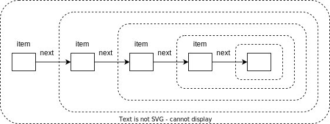
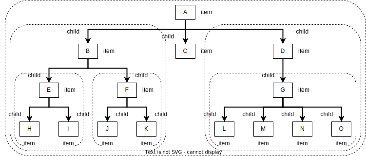

=========
Recursion
=========

:Lecture: Lecture 3.2 :download:`(slides) <_static/recursion/recursion.pptx>`
:Objectives: Understand what is recursion, how to use it, and how
             measure efficiency of recursive algorithms
:Concepts: Recursion, recursive procedure, recursive data type

In :doc:`Lecture 3.1 </recursion/procedure_calls>`, we have clarified
what takes place at the machine level when one calls a procedure. We
can now look at *recursion*, one of the most important concept in
Computer Science [#rubioSanchez2017]_ . We will look at two usage of
recursions: Recursion in data types and recursion in algorithms.

.. [#rubioSanchez2017] If the topic picks your curiosity, there are
                       many goods textbooks on recursion. See for
                       instance: *Rubio-Sánchez, Manuel
                       (2017). Introduction to recursive
                       programming. CRC Press*.

What is Recursion?
==================

Recursion, from a general angle, occurs when something is defined in
terms of itself. Another way to put this is that a whole is
self-similar to its own parts. Recursion is a very general concept
that surfaces in various domains, from nature to Mathematics, via
Computer Science.

.. margin::

   .. figure:: https://upload.wikimedia.org/wikipedia/commons/0/08/NautilusCutawayLogarithmicSpiral.jpg
              
      The structure of the nautilus shell repeats itself at smaller
      scales

Nature offers many example of recursive structures. See for instance
the Nautilus shell aside, whose structure repeats itself inside a
spiral at smaller and smaller scale. The shell contains an smaller
similar shell, which contains and even smaller shell, etc. Trees also
have a recursive structure: Each branch splits itself into more
branches, which also splits themselves into even more branches, etc.

Such recursive patterns generates interesting effects in visual
Arts. Think for instance of Russian Dolls, which contains another
smaller yet similar dolls. Another example is the `Droste effect
<https://en.wikipedia.org/wiki/Droste_effect>`_ where an image
contains itself. The key point is these self-similar inner parts.

.. margin::

   .. figure:: https://upload.wikimedia.org/wikipedia/commons/4/45/Sierpinski_triangle.svg
      :name: recursion/recursion/fractal

      Sierpinski's Triangle: An example of fractal
             
In Mathematics recursion takes many forms.  `Fractals
<https://fractalfoundation.org/>`_ for instance, are complex
geometrical patterns that are self-similar at different scales, as
illustrated by :numref:`recursion/recursion/fractal`. Another form of
recursion---a simpler one---is recurrence relationships. Equation
:eq:`recursion/factorial` defines the factorial function :math:`n! = n
\times n-1 \times \ldots \times 1` as a recurrence.  That is to
compute :math:`n!`, one must first calculate :math:`(n-1)!`

.. math::
   :label: recursion/factorial

   n! = \begin{cases}
   1 & \textrm{if} \; n=1 \\
   n \times (n-1)! & \textrm{otherwise}\\
   \end{cases}

In this course, we will focus on two key recursion: Recursion in data
types, where a compound data type refer to itself, and recursion in
algorithms, where an algorithm calls itself.
   

.. important::

   Recursion is about self-similar structures
           
Recursive Data Types
====================

Recursion is about self-similarity. Applied to data types, that yields
types that refer to themselves. We will study two examples: Lists and
Trees. Each comes in many variations.

Lists
-----

List is a data structure that we can use to implement the
:doc:`Sequence ADT <sequences/array>`, as an alternative to
arrays. The idea is to see a sequence as an element followed by
another sequence. :numref:`recursion/recursion/list` shows how one can
declare such a data type in Java [#javaRecord]_ . We create a class
`List`, with two fields. The field `item` contains a object of an
arbitrary type `T`, whereas the field `next` holds another list.
     
.. code-block:: java
   :name: recursion/recursion/list
   :caption: A simple list, implemented as a Java class. The `next`
             attribute is typed with the class itself.
                
    class List<T> {
        T item;
        List<T> next;
    }

.. [#javaRecord] In Java the classical way to implement a record would
                 be to create a class. Since version 14, Java offers
                 the concept of record, but these are immutable.

This declaration yields structures that closely resemble
:numref:`recursion/recursion/list/structure`. Each list (the dashed
boxes) points to another list. This "chain" of objects stops when a
list has `null` as next field.

   The recursive list structure: A list is an item followed by another
   list.

Trees
-----

Tree is the other family of recursive data types we will look at. Just
like a list, a tree carries an item, but, by contrast to the list, a
tree has zero or more "next" trees---so called its children.

.. code-block:: java
   :name: recursion/recursion/tree/datatype
   :caption: A basic tree data type: Each tree has many `children`

   class Tree<T> {
      T item;
      Sequence<Tree<T>> children;
   }

The declaration on :numref:`recursion/recursion/tree/datatype` yields
structure like the one shown in
:numref:`recursion/recursion/tree/structure`. Each item has links to
zero, one, or more trees. The whole looks like tree up-side down, or
like the roots of a tree.
   

   The recursive structure of trees: Each tree is made of smaller
   trees
   

Recursive Algorithms
====================

Data types are not however the only use of recursion in Computer
Science. We can also make recursive algorithms:

Consider the two formulas shown by
:numref:`recursion/recursion/iteration-vs-recursion`. They both sum up
the :math:`n` first integers, but the left one uses a summation
whereas the right one uses a recurrence relation. From an algorithmic
standpoint that yields two alternative algorithms. On the left side,
we use a loop that updates the intermediate variable `sum`. On the
right side, we use a *recursive procedure* that mirrors the recurrence
relation. Both compute the very same thing, but their efficiency are
different.

.. list-table:: Two alternative algorithms to sum up the :math:`n`
                first integers
   :name: recursion/recursion/iteration-vs-recursion
   :header-rows: 1
                
   * - (a) Using Iteration
     - (b) Using Recursion
   * -
       .. math::
          s_1(n) = \sum_{i=1}^{n} i
     -
       .. math::
           s_2(n) = \begin{cases}
             1 & \textrm{if } n = 1 \\
              n + s_2(n-1) & \textrm{otherwise} \\
           \end{cases}
   * -
       .. code:: java

          int s1 (int n) {
              int sum = 0;
              for (int i=1 ; i<=n ; i++) { 
                  sum += i;
              }
              return sum;
          }

     -
       .. code:: java

          int s2 (int n) {
              if (n == 1) return 1;
              return n + s2(n-1);
          }

When designing algorithms, *recursion* is an alternative to
*iteration*. Iteration implies the use of a loop, and some necessary
intermediate variables. By contrast, recursion yields algorithms that
invoke themselves different arguments.
          
.. important::

   Recursion is strictly as expressive as iteration. Any algorithms
   using a loop has an equivalent recursive version, and vice versa.

How to Design "Recursive" Algorithms?
-------------------------------------

Designing recursive algorithms boils down to detecting self-similar
patterns. In general we will try to follows these steps:

#. Find a self-similar sub problems / sub-structures ;

#. Identify the base cases, whose answer is known up front ;
   
#. Identify the recursive cases, where we call our algorithms with
   different arguments.

Example 1:
^^^^^^^^^^

.. margin::

   .. figure:: _static/recursion/images/sum_v1.svg
      :name: recursion/recursion/sum/v1

      Breaking down the sum of the :math:`n` first integers into
      "bars"

Consider the sum of the first :math:`n` integers we studied above. How
can we come up with such a design?
:numref:`recursion/recursion/sum/v1` portrays such a sum for
:math:`n=8`. The problem is to count the squares. Note that the
overall shape forms a triangle. If we remove the first bar on the left
hand side, we are left with another *smaller* triangle.

Base cases:
  When do we stop? When the :math:`n=1`, there is no more left hand
  side bar to be taken, and the result is one.

Recursive case:
  The height of bar on the left, is the number we start from,
  :math:`n`. So the overall sum is n plus the size of the remaining
  triangle.

That gives us the following algorithm:
  
.. code-block:: java

   int sum(int n) {
      if (n == 1) return 1;   // base case
      return n + sum(n-1);    // Recursive case
   }

Example 2
^^^^^^^^^

.. margin::

   .. figure:: _static/recursion/images/sum_v2.svg
      :name: recursion/recursion/sum/v2

      Breaking down the sum of the :math:`n=8` first integers into
      arrow-head shapes.

What other self-similar patterns can we find? If we take out the left
bar and the bottom line, we are also left with a smaller triangle, as
shown on :numref:`recursion/recursion/sum/v2`. These two together
account for :math:`n + (n-1) = 2n-1`.

Base cases:
  What are the case cases? There are two. As before, when the given
  number if 1 one, we still know the answer is 1. However, if
  :math:`n=2` there is no left-over triangle to add and the answer is
  three.

Recursive cases:
  What are the recursive cases? The sum of a triangle is the left and
  bottom bars, plus the "left-over" triangle.

That gives us the following algorithm

.. code:: java

   int sum(int n) {
      if (n <= 1) return 1;       // Base case #1
      if (n == 2) return 3;       // Base case #2
      return 2*n - 1 + sum(n-2);  // Recursive case
   }

Example 3
^^^^^^^^^

.. margin::

   .. figure:: _static/recursion/images/sum_v3.svg
      :name: recursion/recursion/sum/v3

      Breaking down the sum of the first :math:`n` integers into
      triangles

What other self-similar patterns can we find? We can break a triangle
into smaller ones, as shown on
:numref:`recursion/recursion/sum/v3`. We break the large triangles
into 3 triangles of size :math:`\frac{n}{2}` and a smaller one in the
middle.

Base cases:
  When do we stop. If :math:`n =2` this decomposition into triangles
  does not work anymore, but we know the sum is 3 in that
  case. Similarly, if :math:`n=1`, then the sum is 1.

Recursive cases:
  Here we have to be more careful, because the sizes of the triangle
  depends on whether :math:`n` is odd or even. When :math:`n` is even,
  then it yields 3 triangles of size :math:`\frac{n}{2}` and one
  triangle of height :math:`\frac{n-2}{2}`. If :math:`n` is odd, it
  yields 3 triangles of height :math:`\frac{n-1}{2}` plus one triangle
  of height :math:`\frac{n+1}{2}`.

That gives us the following *recursive* algorithm:

.. code:: java

   int sum(int n) {
       if (n <= 1) return 1;                        // Base case #1.
       if (n == 2) return 3;                        // Base case #2
       if (n % 2 == 0) {
          return 3 * sum(n/2) + sum((n-2)/2);       // Recursive case #1
       } else {
          return 3 * sum((n-1)/2) + sum((n+1)/2);   // Recursive case #2
       }
   }

.. important::

   Thinking "recursive" is a matter of practice. That said, there are
   some general steps:

   1. Break down the problem into *self-similar sub problems*. Look at
      the underlying data structure if any, is it recursive?

   2. Identify the *base cases*, that is, the cases that we can solve
      directly, without recursion.

   3. Work out the recursive cases, those that requires solving
      self-similar sub problems. What parameters do we need to pass?

Runtime Efficiency
------------------

How can we measure the efficiency of *recursive algorithms*? The main
difference is that the calculus requires solving a recurrence
relationship, which captures the recursive nature. Let see an example.

.. margin::

   .. code-block:: java
      :linenos:

      int sum(int n) {
          if (n == 1)           
             return 1;
          return n + sum(n-1);  
      }

Consider again our first algorithm that sums the :math:`n` first
integers, which I reproduce opposite.

.. csv-table:: Breaking down the runtime efficiency of a recursive sum
   :header: "Line", "Code", "Cost", "Runs", "Total"
   :widths: 5, 30, 10, 10, 10

   2, ":code:`if (n == 1)`",  "1", "1", "1"
   3, ":code:`return 1`", "1", "?", "?"
   4, ":code:`return n + sum(n-1)`", "2 + ?", "?", "?"

Our approach does not help much here. We have two challenges:

- We do not know whether we will enter the conditional statement
  
- To know the time spent computing :code:`sum(n)`, we need to know the
  time spent computing :code:`sum(n-1)`.

To work around these, we have to model the runtime as a recurrence
relationship :math:`t(n)` as follows. Let consider the base case and
the recursive case separately. In the base case, we evaluate the
conditional and we return a value. The total cost for that is 2. In
the recursive case, we still evaluate the conditional, we compute
:code:`n-1`, compute :code:`sum(n-1)`, and add :code:`n`. That is a
total of :math:`3 + t(n-1)`. We write down this recurrence as follows:

.. math::
   t(n) = \begin{cases}
    2 & \textrm{if } n = 1 \\
    3 + t(n-1) & \textrm{otherwise}
   \end{cases}
      
.. admonition:: Solving Simple Recurrences
   :class: dropdown

   To solve simple recurrences such as the one above, we can simply
   expand the calculation until a pattern emerges. In our case, we
   know that:

   .. math::
      t(n) = \begin{cases}
      2 & \textrm{if } n = 1 \\
      3 + t(n-1) & \textrm{otherwise}
      \end{cases}

   We can expand the calculation for an arbitrary size :math:`n > 1` as follows:

   .. math::

      t(n) & = 3 + t(n-1) \\
           & = 3 + 3 + t(n-2) \\
           & = 3 + 3 + 3 + t(n-3) \\
           & = 3 + 3 + 3 + \ldots + 3 + t(1) \\
           & = 3 + 3 + 3 + \ldots + 3 + 2 \\
           & = \overbrace{3 + 3 + 3 + \ldots + 3}^{n-1\textrm{ times}} + 2 \\
           & = 3(n-1) + 2 \\
           & = 3n - 3 + 2 \\
           & = 3n - 1

.. important::

   Modeling the runtime of recursive algorithms often requires using a
   recurrence relationship.

Memory Efficiency
-----------------

What about memory consumption? As we saw in :doc:`the previous lecture
<recursion/procedure_calls>`, procedure calls consume memory via the
call stack. Since recursion relies on procedure calls, recursive
algorithms consume more memory.

Consider again the first version of the sum of the :math:`n` first
integers. How much memory does that consume? As we did for the runtime
efficiency, we have to model this using a recurrence
relationship. Let's look at the base cases and the recursive cases
separately:

- The base case, there is no variable besides the input n. The memory
  consume is 0.

- In the recursive case, there is no additional variable either, but
  there is a procedure call. This procedure call requires storing the
  arguments onto the call stack. Here we have one argument :code:`n`,
  so that is a cost of 1.

That gives us the following recurrence relationships:

.. math::
   
   m(n) = \begin{cases}
   0 & \textrm{if } n = 1 \\
   1 + m(n-1) & \textrm{otherwise}
   \end{cases}
   
Which reduces to :math:`m(n) = n-1`. Interestingly, this shows that
such a simple recursive algorithm requires memory in quantity that is
proportional to the size of its input!

.. important::

   Recursive algorithms consume (in general) significantly more memory
   than their iterative equivalent, because of the underlying call
   stack, which grows as the recursion deepens.
 

           
