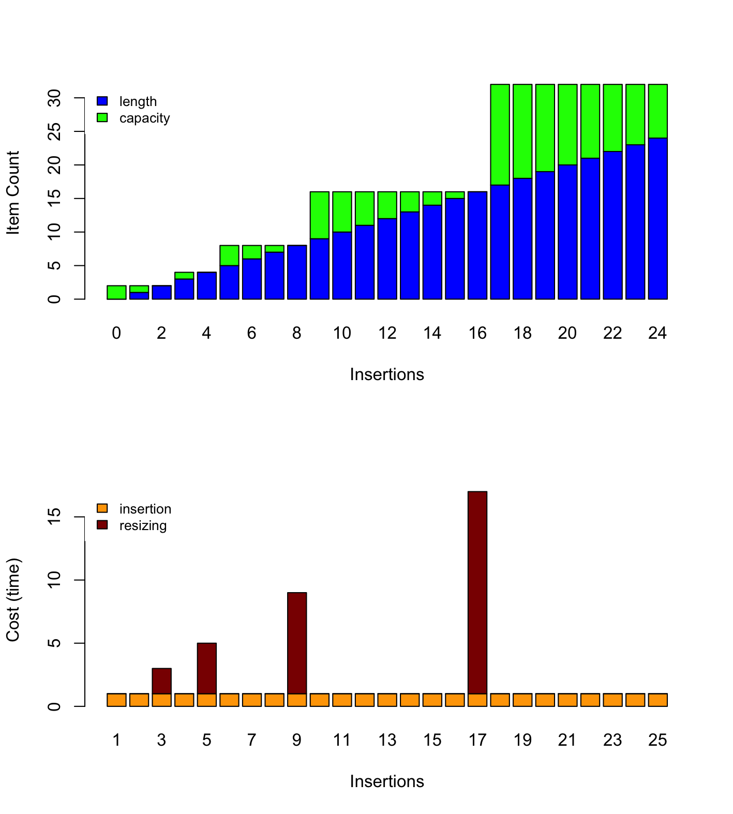

====================
Using Dynamic Arrays
====================

:Lecture: Lecture 2.3 :download:`(slides) <_static/dynamic_arrays/amortized_analysis.pptx>`
:Objectives: Understand amortized analysis and dynamic arrays
:Concepts: Amortized analysis, dynamic arrays, memory allocation

.. role:: python(code)
   :language: python
              
.. role:: c(code)
   :language: c

In the previous lecture, we implemented our sequence ADT using an
array. We overlooked however the infinite nature of sequences\ [#fn1]_
and we implemented instead fixed-capacity sequences. We will do better
here. While looking at the runtime efficiency of the insertion and
deletion, we shall introduce *amortized analysis*.

Infinite Sequences
==================

So far implementation of the sequence ADT uses a fixed capacity. Each
sequence we create can contain a predefined number of items. How can
we work around this and create sequences that hold as many items as we
need. I reproduce below the code we used for the insertion:

.. code-block:: c
   :emphasize-lines: 4
      
   void
   seq_insert(Sequence* sequence, void* item, int index) {
     assert(sequence != NULL);
     assert(sequence->length < CAPACITY);
     assert(index > 0 && index <= sequence->length + 1);
     for (int i=sequence->length ; i>=index ; i--) {
       sequence->items[i+1] = sequence->items[i];
     }
     sequence->items[index] = item;
     sequence->length++;
   }                

   
What would happen if we exceed that capacity? Consider for instance
the code below, where we create a sequence and then :func:`insert` 200
times at the end.

.. code-block:: c
   :emphasize-lines: 7, 9

   #include <stdio.h>
   #include "sequence.h"

   int main(int argc, char** argv) {
     Sequence* seq = seq_create();
     int test = 23;
     for (int i=0 ; i<200 ; i++) {
       printf("%d ", i);
       seq_insert(seq, (void*) &test, seq_length(seq) + 1);
     }
     printf("Done.\n");
   }                

The assertion we placed in the :func:`insert` fails as soon as the
given position exceeds the capacity and the program terminates with an
error.

Can we do better? Yes, when there is not enough capacity, we need to a
bigger array, copy what is already in our array, and finally release
our previous array. Similarly, when there is too much unused capacity,
we can allocate a smaller array, copy the current items, and finally
release our big unused array.

.. caution::

   This data structure, where we dynamically allocate a new array when
   the current one is too small (or too large) is often referred to as
   `dynamic arrays
   <https://en.wikipedia.org/wiki/Dynamic_array>`_. There are other
   names however such as "array lists" or "re-sizable arrays". As
   often, there is no clear consensus.
  

Memory Representation
---------------------

As opposed to our fixed-capacity implementation, we need to store the
capacity of the sequence into our *record*. We can simply update our C
structure as follows:

.. code-block:: c
   :emphasize-lines: 2

   struct sequence_s {
     int    capacity; // The current capacity
     int    length;   
     void** items; 
   };

With this new memory representation, we have to update our
implementation of the :func:`create` operation as follows. We need to
initialize the value of our new `capacity` field, and allocate the
arrays of items accordingly.

.. code-block:: c
   :emphasize-lines: 3, 5

   const int INITIAL_CAPACITY = 10;
                     
   Sequence* seq_create(void) {
     Sequence* new_sequence = malloc(sizeof(Sequence));
     new_sequence->capacity = INITIAL_CAPACITY;
     new_sequence->length   = 0;
     new_sequence->items    = malloc(INITIAL_CAPACITY * sizeof(void*));
     return new_sequence;
   }                     

   
Insertion
---------

Now we can modify our implementation of the :func:`insert`
operation. If the given sequence is "full", we need to "resize it".

To detect whether a sequence is "full", we compute its *load factor*,
as the ratio between its length and its capacity. For instance, if
the length is 5 and the capacity is 10, the load will be
0.5. Similarly, if the length is 3 and the capacity is 12, the load is
0.25. We simply use a *load threshold* to decide whether or not to
resize the underlying array.

.. code-block:: c
   :caption: insertion in a dynamic array
   :name: code-dynamic-array-insertion
   :linenos:
   :emphasize-lines: 8-10

   const double GROWTH_THRESHOLD = 1.0;
   const double GROWTH_FACTOR = 2.0;

   void
   seq_insert(Sequence* sequence, void* item, int index) {
     assert(sequence != NULL);
     assert(index > 0 && index <= sequence->length + 1);
     if (load_factor(sequence) >= GROWTH_THRESHOLD) {
       resize(sequence, GROWTH_FACTOR);
     }
     for (int i=sequence->length ; i>=index ; i--) {
       sequence->items[i+1] = sequence->items[i];
     }
     sequence->items[index] = item;
     sequence->length++;
   }

   double
   load_factor(Sequence* sequence) {
     assert(sequence != NULL);
     return sequence->length / sequence->capacity;
   }                

To resize the underlying array by a given factor, we proceed as
follows:

#. We compute the new capacity

#. We allocate a new array with the new capacity

#. We copy all the existing items from the "old" array into the new
   array

#. We attach the new array to the sequence's record

#. We free the old array 
   
.. code-block:: c
   :emphasize-lines: 8-12
      
   void
   resize(Sequence* sequence, double factor) {
     assert(sequence != NULL);
     assert(factor > 0);
     if (sequence->capacity > 1 || factor >= 1) {
       sequence->capacity = (int) sequence->capacity * factor;
       void** old_array = sequence->items;
       void** new_array = malloc( sequence->capacity * sizeof(void*));
       for(int i=0 ; i<sequence->length ; i++) {
         new_array[i] = old_array[i];
       }
       free(old_array);
       sequence->items = new_array;
     }
   }

Deletion
--------

We also have to adjust the deletion and shrink the array when the load
factor drops below a chosen *shrink threshold*. We can reuse the same
`resize` helper, but pass it a fraction such as 1/2 to halve the
array. The rest remain the very same than for the fixed-capacity
sequences.

.. code-block:: c
   :emphasize-lines: 8-10

   const double SHRINK_THRESHOLD = 0.5;
   const double SHRINK_FACTOR = 0.5;
                     
   void
   seq_remove(Sequence* sequence, int index) {
     assert(sequence != NULL);
     assert(index > 0 && index <= sequence->length + 1);
     if (load_factor(sequence) < SHRINK_THRESHOLD) {
       resize(sequence, SHRINK_FACTOR);
     }
     for(int i=index ; i<sequence->length ; i++) {
       sequence->items[i] = sequence->items[i+1];
     }
     sequence->items[sequence->length] = NULL;
     sequence->length--;
   }

   
Runtime Analysis
================

In such dynamic arrays, resizing does not always happen, but only when
it gets full. Many data structures behave that way, doing some
house-cleaning in some specific situations. Let's see where the
techniques we have studied so far fall flat.

Best-case Scenario
------------------

Consider again our insertion algorithm (see
:numref:`code-dynamic-array-insertion`) that allocates a new array
when the existing one is full. What is the best-case scenario?

The best case (for any sequence of a given length) implies that:

- The array is *not full*, so there is no extra work to re-allocate
  and copy the existing items

- The insertion occurs at the end of the sequence so there is no
  shifting of the existing items.

When these two conditions are met, our insertion runs in constant
runtime :math:`O(1)`. :numref:`insertion_best_case` details how to
count the operations our insertion performs. In the best-scenario it
always performs 6 operations (a constant).

.. csv-table:: Insertion runtime break-down
   :name: insertion_best_case
   :widths: 10, 150, 25, 25, 25
   :header: "Line", "Fragment", "Cost", "Runs", "Total"

   8, ":c:`load_factor(sequence) >= GROWTH_THRESHOLD`", 2, 1, 2
   9, ":c:`resize(sequence, GROWTH_FACTOR);`", n, 0, 0
   11, ":c:`i=sequence->length;`", 1, 1, 1
   11, ":c:`i>=index`", 1, 1, 1
   11, ":c:`i--`", 1, 0, 0
   12, ":c:`sequence->items[i+1] = sequence->items[i];`", 2, 0, 0
   14, ":c:`sequence->items[index] = item`", 1, 1, 1
   15, ":c:`sequence->length++`", 1, 1, 1
     ,,,Total:,6   
   
Worst-case Scenario
-------------------

The worst-case scenario (for any sequence of a given length) implies that:

- The array is full and we need to resize it before to proceed with
  the insertion per se.

- The insertion targets the first position, so the whole underlying
  array has to be shifted forward.

When these two conditions are met, our instertion algorithm (see
:numref:`code-dynamic-array-insertion`) runs in :math:`O(n)`.
:numref:`insertion_worst_case` details how we get so this results.
  
.. table:: Counting operations in the worst-case scenario
   :name: insertion_worst_case
           
   +----------+--------------------------+----------+----------+----------+
   |Line      |Fragment                  |Cost      |Runs      |Total     |
   +==========+==========================+==========+==========+==========+
   |8         |:c:`load_factor(sequence) |2         |1         |2         |
   |          |>= GROWTH_THRESHOLD`      |          |          |          |
   +----------+--------------------------+----------+----------+----------+
   |9         |:c:`resize(sequence,      |n         |1         |n         |
   |          |GROWTH_FACTOR)`           |          |          |          |
   +----------+--------------------------+----------+----------+----------+
   |11        |:c:`i=sequence->length;`  |1         |1         |1         |
   +----------+--------------------------+----------+----------+----------+
   |11        |:c:`i>=index`             |1         |n+1       |n+1       |
   +----------+--------------------------+----------+----------+----------+
   |11        |:c:`i--`                  |2         |n         |2n        |
   +----------+--------------------------+----------+----------+----------+
   |12        |:c:`sequence->items[i+1]  |2         |n         |2n        |
   |          |= sequence->items[i]`     |          |          |          |
   +----------+--------------------------+----------+----------+----------+
   |14        |:c:`sequence->items[index]|1         |1         |1         |
   |          |= item`                   |          |          |          |
   +----------+--------------------------+----------+----------+----------+
   |15        |:c:`sequence->length++`   |2         |1         |2         |
   +----------+--------------------------+----------+----------+----------+
   |                                     | **Grand Total:**    |6n+7      |
   +----------+--------------------------+----------+----------+----------+

Average-case Scenario
---------------------

What about the average scenario. If we assume nothing about the given
scenario, in average it depends on two things:

- Do we need to resize the underlying array (see Line 8 in
  :numref:`code-dynamic-array-insertion`).

- Where do we insert in the array? The closer to the end of the array,
  the less work we do.

If we want to formalize this, we need to define two random variables
that captures these situation. Let's go:

- :math:`F` capture whether the array if full or not. It takes two
  values, either 0 or 1, with equal probability.

- :math:`C` captures where we need to insert in the array. It takes
  any value in the interval :math:`[1, n+1]`.

We can modify our calculation accordingly to reflect these two, as shown in In :numref:`table/dynamic-array/insertion/average`
  
.. csv-table:: Counting operations executed by the insertion in the average case
   :name: table/dynamic-array/insertion/average
   :widths: 10, 150, 25, 25, 25
   :header: "Line", "Fragment", "Cost", "Runs", "Total"

   8, ":c:`load_factor(sequence) >= GROWTH_THRESHOLD`", 2, 1, 2
   9, ":c:`resize(sequence, GROWTH_FACTOR);`", n, **F**, :math:`nF`
   11, ":c:`i=sequence->length;`", 1, 1, 1
   11, ":c:`i>=index`", 1, C+1, :math:`C+1`
   11, ":c:`i--`", 1, C, :math:`C`
   12, ":c:`sequence->items[i+1] = sequence->items[i];`", 2, C, :math:`2C`
   14, ":c:`sequence->items[index] = item`", 1, 1, 1
   15, ":c:`sequence->length++`", 1, 1, 1
     ,,,Total:, :math:`nF + 4C + 6` 

To complete our calculation, we need to factor in the probability that
these two random variables take specific values. We thus compute the
*expected value* of the function :math:`f(n,F, C)=nF + 4C + 6`, which
yields :math:`2.5n + 10`

.. admonition:: Detailed Calculation of :math:`E[f(n,F,C)]`
   :class: toggle
           
   .. math::
      E[f(n, F,C)] & = \sum_{f \in F} \sum_{c \in C} P[F=f] \cdot P[C=c] \cdot f(f,c,n) \\
                   & = \sum_{f \in F} \sum_{c \in C} \frac{1}{2} \cdot \frac{1}{n+1} \cdot f(f,c,n) \\
                   & = \sum_{f \in F} \sum_{c \in C} \frac{1}{2n+2} \cdot f(f,c,n)

   Since :math:`F` only takes two values 0 or 1, we can further break
   this expression:

   .. math::
      E[f(n, F,C)] & =  \sum_{c \in C} \frac{1}{2n+2} \cdot f(0,c,n) +  \sum_{c \in C} \frac{1}{2n+2} \cdot f(1,c,n) \\
                   & =   \frac{1}{2(n+1)} \cdot \left( \sum_{c \in C} f(0,c,n) + \sum_{c \in C}  f(1,c,n) \right) \\
                   & =   \frac{1}{2(n+1)} \cdot \left( \sum_{c \in C} 4c + 6 + \sum_{c \in C}  n + 4c + 6 \right) \\

   We can look at each of the two sums in turn. We know that c takes
   values in the interval :math:`[1, n+1]`, that gives us:

   .. math::
      \sum_{c \in C} 4c + 6 & = \sum_{c=1}^{n+1} 4c + 6 \\
                            & = 6(n+1) + \sum_{c=1}^{n+1} 4c \\
                            & = 6(n+1) + 4 \cdot \sum_{c=1}^{n+1} c \\
                            & = 6(n+1) + 4 \cdot \frac{(n+1)(n+2)}{2} \\
                            & = 6(n+1) + 2(n+1)(n+2)

   We can proceed similarly with the second sum:

   .. math::
      \sum_{c \in C} n + 4c + 6 & = \sum_{c=1}^{n+1} n + 4c + 6 \\
                                & = n(n+1) + \sum_{c=1}^{n+1} 4c + 6 \\
                                & = n(n+1) + 6(n+1) + 2(n+1)(n+2)

   We can now put everything together as follows:

   .. math::
      E[f(n, F,C)] & = \frac{1}{2(n+1)} \left[ \left( 6(n+1) + 2(n+1)(n+2) \right) + \left( n(n+1) + 6(n+1) + 2(n+1)(n+2) \right) \right] \\
                   & = \frac{1}{2} \left[ \left( 6 + 2(n+2) \right) + \left( n + 6 + 2(n+2) \right) \right] \\
                   & = \frac{1}{2} \left( 12 + 4(n+2) + n \right) \\
                   & = \frac{1}{2} \left(5n + 20 \right) \\
                   & = 2.5n + 10 
   
Amortized Analysis
==================

The analysis we run above describe inserting **into a random
sequence**. In practice however, this seldom happen. The common
use-case is to create a sequence and then to insert, delete, etc. in
it.

Consider again our insertion algorithm. We do not resize all the time,
but only when it gets full. Say we start with an empty array of 2
cells and we double it only when it gets completely full. Then, only
the second, fourth, eighth, sixteenth, etc. would require extra
"resizing" work. Amortized analysis captures the average cost *over a
sequence of insertion*. :numref:`fig/dynamic-arrays/insert/cost`
illustrates this behavior.

.. _fig/dynamic-arrays/insert/cost:

   Behavior and cost of the insertion using a dynamic array

In other words, amortized analysis tells us the average cost *over a
many insertions*.
   
There are three main "methods" to approach amortized analysis:

- The Aggregate Method, often useful for understanding the concept on
  simple cases

- The Banker Method that applies to more complex cases

- The Physicist Method, which is alternative which also can be used on
  complex cases.

.. important:: **Amortized Analysis vs. Average-case Analysis**

   Average case analysis focuses on algorithms regardless of any data
   structures. By contrast, *amortized analysis* focuses on how
   algorithms perform while used repeatedly for a single data
   structure.
  
The Aggregate Method
--------------------

As we have just seen, amortized analysis tells us the average cost
over a sequence of operations *applied to single data structure*. The
*aggregate method* implements this idea by computing this average
explicitly. Provided that the cost of a single operation is
:math:`t(n)`, the aggregate method computes an average cost
:math:`t^*(k)` as follows:

.. math::
   t^*(k) = \frac{1}{k} \cdot \sum_{i=1}^{k} t(i)

Visually, this means computing the average of the bars shown on
:numref:`fig/dynamic-arrays/insert/cost`.

.. admonition:: Aggregate Method, Detailed Calculation
   :class: toggle

   For the sake of simplicity, let's assume the insertion cost 1 unit
   of time when we do not need to resize. That gives us a simpler
   cost function :math:`t(n)` such as:

   .. math::
      t(n) = \begin{cases}
          n + 1 & \textrm{if full}  \\
          1 & \textrm{otherwise}
      \end{cases}

   Now, using the *aggregate methods*, we need to compute average
   value of :math:`t(n)` when :math:`n` grows. As shown in
   :numref:`fig/dynamic-arrays/insert/cost`, if we perform :math:`k`
   insertions on the same, then there will be :math:`\left \lfloor
   \log_2 k \right \rfloor` resizings (each that costs n). The
   "trick", is that we can sum the insertions and the resizings
   separately (see the orange and red blocks on
   :numref:`fig/dynamic-arrays/insert/cost`).

   The aggregated cost, which we denote by :math:`t^*(k)` is
   therefore:

   .. math::
      t^*(s) &= \frac{1}{k} \sum_{i=1}^{k} t(i) \\
              &= \frac{1}{k} \cdot \left( k + \sum_{i=1}^{\left \lfloor \log_2 k \right \rfloor} 2^i \right) \\
              &= \frac{1}{k} \cdot \left( k + 2(k-1) \right) \\
              &= \frac{3k-2}{k}
       
   As shown below, we can see that the function :math:`t^*(k) =
   \frac{3k-2}{k}` tends towards 3 as k tends towards infinity. We can
   conclude that this function is bounded above by a constant (i.e.,
   3), that is :math:`t^*(k) \in O(1)`.

   .. figure:: _static/images/aggregate_method.png
      :align: center

      :math:`f(x) = \frac{3x-2}{x}` tends towards 3 as :math:`x` grows.
   

   
The Banker Method
-----------------

The banker methods takes a different road, but the aims is the same:
Estimate the average cost of a sequence of operations applied to a
single data structure.

The banker methods follows an analogy where costs are spent money. The
intuition is that instead of spending very little "money" on most
insertions, but much more on those few that require resizing, the
banker method imagines accumulating some extra "money" in a piggy
bank, which we could later use to compensate when a resizing is
needed. The challenge is to find how much we should save in our piggy
bank each time, so that we never run out of money.

The banker money aims at proving that there exists a small amount
(often a constant), which we can save every time and that would
compensate when expensive operations later occur. To prove that, we
proceed with *induction* in two steps:

- Show that given a starting amount of money (our initial deposit),
  and a fix saving, we can "pay for" the first expensive operation.

- Show that provided our balance was positive after an expensive
  operation, we will accumulate enough and "pay for" the next expensive
  operation.

.. admonition:: Detailed proof using the Banker method
   :class: toggle

   Consider again that we "double" the capacity array, when it is
   exactly full. If we start with an empty array of length 2, and if
   we assume that at every operation, we put 2 units in our piggy
   bank. How to prove that this is enough?

   1. First we must prove that our saving of two units will cover the
      first expensive operation, which occurs during the third insertion,
      we we must copy the existing 2 buckets. Intuitively, it works: We
      are left with 4 in our bank, since we collect :math:`3 \times 2` in
      our bank and pay 2. For this we can expand the first few steps, as
      done below in :numref:`table/dynamic-array/insertion/banker`.
          
      .. csv-table:: Expanding the first few insertions
         :name: table/dynamic-array/insertion/banker
         :header: "Insertion", "Length", "Capacity", "Saving", "Resizing Cost", "Balance"
                  
         0, 0, 2, NA, NA, 0 
         1, 1, 2, 2, 0, 2
         2, 2, 2, 2, 0, 4
         3, 3, 4, 2, 2, 4

   2. Then, we have to prove that if we have a non negative balance after
      a insertion that triggers a resizing, we will collect enough to pay
      for the next resizing.

      Note that resizing occurs at every insertion that of the form
      :math:`2^k + 1`, that is 3, 5, 9, 17, 33, etc. At each of these
      resizings, we must pay :math:`2^k`. So we must then prove that
      if our balance :math:`b` is 0 (non-negative), after resizing
      :math:`k`, the balance :math:`b'` after resizing `k+1` is also
      positive.

      .. math::
         b' &= \left[2 \cdot \left( (2^{k+1} + 1) - (2^{k} + 1) \right) \right] - 2^{k} \\
            &= 2^{k+2} + 2 - 2^{k+1} - 2 - 2^k \\
            &= 2^{k+2} - 2^{k+1} - 2^{k} \\
            &= 2^{k} \cdot (2^2 - 2^1 - 1) \\
            &= 2^{k} 

   We can thus conclude that the cost of resizing is nothing more than
   an extra constant cost of 2, that is the resizing has a constant
   *amortized* cost.

Summary
=======

We have improved our implementation of the sequence ADT by removing of
the fixed capacity, and resizing the underlying array when it needed.

This resizing operation occurs only when the array is too full
(resp. too empty) and calls for a new type of analysis: amortized
analysis, which looks at the average cost of sequences of operations
on a single data structure
. We looked into two methods: the aggregate method
and the banker's method.
   
            
.. [#fn1] In maths, sequences are possibly infinite. Consider
          for instance the sequence of prime numbers or the `Fibonacci
          sequence  <https://en.wikipedia.org/wiki/Fibonacci_sequence>`_.
