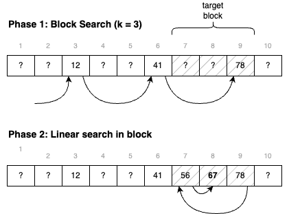
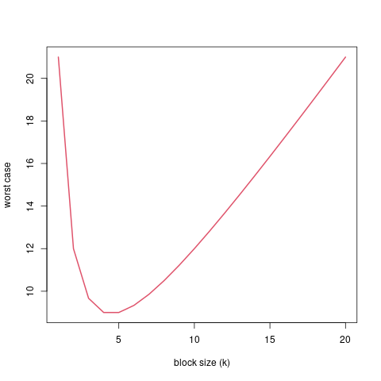

=========
Searching
=========

:Lectures: Lecture 2.4 :download:`(slides) <_static/searching/searching.pptx>`
:Objectives: Understand how "order" enables searching faster in
             sequences.
:Concepts: Sequences (ADT), jump search (algorithm), binary search
           (algorithm), interpolation search (algorithm)
     

When we looked at sequences, we specified the function
:func:`seq.search` that returns a position where the given value can
be found. 

The algorithm we looked at is called a *linear search* or *sequential
search*. It compares each item of the sequence with the desired one, and
returns the position of the first match. If there is no
match, it returns a special "not found" value (-1, 0, etc.).

Without knowing more about the given sequence, this is the best we can
do. There is no magic, and to find the position of an item in a
sequence of :math:`n` items takes :math:`O(n)` in the worst case.

To go faster, we know to assume that the given sequence is sorted,
that is, that the item come in ascending (or descending
order). Consider for instance the following examples:

- :math:`s_1 = (2, 4, 7, 10, 11, 37, 42)` is sorted in ascending
  order, i.e., from the smallest to the largest.
- :math:`s_2 = (x, s, o, g, f, c, a)` is sorted in descending order
  (alphabetical)
- :math:`s_3 = (4, 6, 3, 10, 23, 1, 2)` is not sorted.

In this lecture, we shall look at three "search" algorithm, which
assume a sorted sequence, namely the *jump search*, the *binary
search* and the *interpolation
search*. :numref:`tables/arrays/search/summary` compares all these
searching algorithms.
 
.. csv-table:: Search algorithms
   :name: tables/arrays/search/summary
   :header: "Algorithm", "Worst Case", "Average Case", "Assumptions"
   :widths: 25, 15, 15, 25

   "Linear Search", ":math:`O(n)`", ":math:`O(n)`", "None"            
   "Jump Search", ":math:`O(\sqrt(n))`", ":math:`O(\sqrt(n))`", "Sorted"
   "Binary Search", ":math:`O(\log_2 n)`", ":math:`O(\log_2 n)`", "Sorted, Bounded"
   "Interpolation Search", ":math:`O(n)`", ":math:`O(\log_2 \log_2 n)`", "Sorted, Bounded, Uniformly distributed"

.. important::

   *Why does it help to know that the sequence is sorted?* Consider
   for example the sequence shown in
   :numref:`image/arrays/search/sorting`. Say we are looking for the
   position of the value 67. We look at position 7, and we
   find 56. Since we know that items are in ascending order, we can
   therefore exclude positions 1 to 6. If 67 is in the sequence, it is
   necessarily after position 7.

   .. _image/arrays/search/sorting:
   
   .. figure:: _static/images/search_sorted.png
      :name: 

      Deciding on where to continue searching, when the given sequence
      is sorted.

Jump Search
===========

.. index:: jump search

The *jump search* idea is to improve on the linear search by making
big "jumps", instead of checking every single items. We can make these
bigger jumps *because we assume the sequence is sorted*. The jump
search goes as follows:

1. We break the given sequence into blocks of at least :math:`k`
   items.

2. For each block:

   1. We look at the last item of the block.

   2. If this item is smaller than the desired one, we move on to the
      next block.

   3. Otherwise, we perform a *linear search* with this block.

:numref:`images/arrays/search/jump_search` below illustrates this
approach. In a first phase, we search for a relevant block, then
we use linear search to explore that block. If no block match, then
we can conclude that the desired value is not there.

.. _images/arrays/search/jump_search:

   Searching for "67" using *jump search* with blocks of 3 items.

.. admonition:: Java implementation of the jump search
   :class: toggle

   I show below a possible implementation of the *jump-search* to
   search into a given array of integers. I assume there is a
   procedure `linearSearch`, which implements a linear search between
   two given indices.
           
   .. code-block:: java

      int jumpSearch(int[] sequence, int target, int blockSize) {
           if (blockSize < 1)
               throw new IllegalArgumentException("block size must be strictly positive.");
           int block = 1;
           int blockEnd = -1;
           do {
               blockEnd = Math.min(blockSize*block-1, sequence.length-1);
               if (sequence[blockEnd] == target) {
                   return blockEnd;

               } else if (sequence[blockEnd] < target) {
                   block += 1;

               } else {
                   var blockStart = blockSize*(block-1);
                   return linearSearch(sequence, target, blockStart, blockEnd);

               }
           } while (blockEnd < sequence.length-1);
           return -1;
       }

Why Does it Work?
-----------------

Let's now think about correctness and why our *jump search* adheres to
the :func:`seq.search` procedure (applied to sorted sequences). Our
specification goes as follows:

- If the given target is in the sequence, we shall return a
  position where the target can be found

- If the given target is not in the sequence, we shall return 0 (we
  have indexed sequences from 1).

Let's look at these two cases in turn.

If the target is present, then it belongs to one of the blocks. Either
we find it while we jump forward (if we land right on it), or the first item
larger than the target marks the end of the block where it hides. Then,
we backtrack and use a linear search to find its index.

Now, if the target is not in the given sequence, the linear search
will return 0. Note that we always search in a block. If the target is
smaller than the first item, we will search in the first block. If it
is larger than the last item, we search in the last block,
       
How Fast Is it?
---------------

How fast is the jump search? Let us consider the worst case. When is
it that we do most work? That includes jumping all the way to the end,
and then a complete linear search through the last block. This
occurs when the target item should be in the last block, but is in
fact not in the sequence. In that case we would have to check out one
value for each block and then check every item in the block. That
gives us a total of :math:`\frac{n}{k} + k`.

   How the block size :math:`k` affects the work to be done (for
   :math:`n=20`).
    
.. admonition:: What is the *optimal* value of :math:`k`?
   :class: toggle

   An interesting thing is that our analysis of the worst case runtime
   helps us find the optimal value for :math:`k`. To find it, we can
   minimize the expression we got for the worst case.
   
   The minimum value is where the derivative is zero. We can calculate
   this derivate as follows:

   .. math::
      
      \frac{\partial}{\partial k} \left( \frac{n}{k} + k \right) = -\frac{n}{k^2} + 1

   We can now solve this for zero as follows:
   
   .. math::
      
      -\frac{n}{k^2} + 1 = 0 \\
      1 = \frac{n}{k^2} \\
      n = k^2 \\
      \sqrt{n} = k

Now we know that the optimal value is :math:`k=\sqrt{n}`, we can plug this
back into our expression :math:`\frac{n}{k} + k` as follows:

.. math::

   \frac{n}{\sqrt{n}} + \sqrt{n} \\
   = \frac{\sqrt{n} \cdot \sqrt{n}}{\sqrt{n}} + \sqrt{n} \\
   = 2\sqrt{n}

This tells us that, in the worst case, using the optimal value
:math:`k=\sqrt{n}`, the jump search runs in :math:`O(\sqrt{n})`
      
Binary Search
=============

.. index:: binary search

The binary search also assumes the given sequence is sorted, but the
idea is different. The idea is to look at the "middle item",
we can discard half of the array, and remains only the other half. We
can do the same for the remaining half: Looking at the middle item and
discarding half of it, and continue this process until we find the
value or there is nothing remaining.

We can summarize the *binary search* as follows:

- Look at the middle item, and compare it to the target item:

  - If the value matches the target, we found it and return the index
    of this middle item.
  
  - If this middle value is greater, we discard all the items beyond
    that point.

  - if this middle value is smaller, we discard all the items before
    that point.

- Repeat this process with the remaining half, until you find the
  target or the remaining half becomes empty.

:numref:`images/sequences/search/binary_search` illustrates this
process of breaking down the given sequence in halves. As opposed to
the *linear search*, we can spot the target without looking at all the
values.
  
.. _images/sequences/search/binary_search:

.. figure:: _static/images/binary_search.png

   Searching for 67 using binary search

.. admonition:: Java Implementation of the Binary Search
   :class: toggle

   I show below a Java implementation of the *binary search* to find a
   given value in an array of integers. I use two variables `lowEnd`
   and `highEnd` to delineate the part of the array I am working
   with. As I split the array, I adjust these two until they collide.
                
   .. code-block:: java

     int binarySearch(int[] sequence, int target) {
        int lowEnd = 0;
        int highEnd = sequence.length;
        int cut = (lowEnd + highEnd) / 2;
        while (highEnd - lowEnd >= 1) {
            if (sequence[cut] == target)
                return cut;
            else if (sequence[cut] < target)
                lowEnd = cut + 1;
            else
                highEnd = cut;
            cut = (lowEnd + highEnd) / 2;
        }
        return -1;
    }
   
Why Does It Work?
-----------------

Again, the specifications are the same than for :func:`seq.search`: We
have to return a index where the given value can be found, or 0
otherwise. The difference is that we assume a sorted sequence.

Remember the process: We pick an index (often in the middle) and split
the sequence at that point. If this index holds the target, we find
its position. Otherwise if it is smaller, we discard the first half,
and, if it is larger, the second half. The target is necessarily in
the half we have selected.

Besides, this half-sequence is necessarily smaller. As we further
split it, if we we don't the target, we eventually end up with a sub
sequence of 1 element, where we can check if it is or not the target.

How Fast Is It?
---------------

As often, let us consider the worst case. When is it that we check the
most items? It happens when the given item is not in the sequence, but
still in between the first and last item. In that case. we will
"split" halves until there is nothing to split anymore.

How many time can we split? Since we consistently split the sequence
in two, we are looking for a number :math:`b` such as:

.. math::

   n = \overbrace{2 \times 2 \times \ldots \times 2}^{b \; \textrm{times}} \\
   b = \log_2 n

Since every time we split the sequence, we have to check the middle
item, we will check :math:`\log_2 n` items. That is, in the worst
case, the binary search runs in :math:`O(\log_2 n)`.

Interpolation Search
====================

.. index:: interpolation search

Say we modify the binary search so that we don't halve the sequence,
but split it at the two thirds (2/3). Would that help? If we are
lucky, we would discard 2/3 (more than a half). If we are unlucky, we
only discard one third and are left with two thirds. Not so good. In
general splitting in half is our best bet.

But there is case, where we try to guess where to split and therefore
do better than the binary search. This is the *interpolation
search*. It assumes however that not only the sequence is sorted, but
the values are uniformly distributed. By uniform distribution, we
assume that there is no "clusters" of values very close to each
other. Consider the following examples:

- :math:`s_1=(1, 3, 7, 10, 12, 15, 17, 20)` is uniformly distributed (roughly)

- :math:`s_2=(1, 5, 6, 6, 6, 7, 7, 10)` has a cluster of values
  between 5 and 7, so it is not uniformly distributed.

The idea of the interpolation search is to guess where the target value
should be. For instance, if we search for 17 in :math:`s_1`, we could
read the first and last value to get the total range, and estimate
that 17 should be at index 7, by making a linear interpolation
:math:`7 \approx 8 \times \frac{17}{20 - 1}`.

The *interpolation search* closely resemble binary search. The
difference is that we do not check the middle item, but we guess
*by interpolation* the position of the target value.

.. note::

   The interpolation search is somehow what we use when we search in an
   old fashion dictionary. If we search a word that starts with a 'z',
   we will not open the dictionary in the middle, but rather further
   towards the last pages. We do this because we assume that the words
   are roughly uniformly dictionary.

.. admonition:: Java Implementation of the interpolation Search
   :class: toggle

   I show below a Java implementation of the interpolation
   search. Compared to the binary search above, there are two changes:

   - We compute the value of the :code:`cut` variable by interpolating
     the target position from the values at the low and high ends.

   - We exit the main loop as soon as the cut goes out of the known
     low and high ends, which occurs when the value is not in the
     sequence.

   .. code-block:: java
      :linenos:
      :emphasize-lines: 4, 5, 13
                      
      int interpolationSearch(int[] sequence, int target) {
          int lowEnd = 0;
          int highEnd = sequence.length;
          int cut = interpolate(sequence, lowEnd, highEnd, target);
          while (highEnd - lowEnd > 1 &&
                 cut >= lowEnd && cut < highEnd) {
              if (sequence[cut] == target)
                  return cut;
              else if (sequence[cut] < target)
                  lowEnd = cut + 1;
              else
                  highEnd = cut;
              cut = interpolate(sequence, lowEnd, highEnd, target);
          }
          return -1;
      }

      int interpolate(int[] sequence, int low, int high, int target) {
          if (low == high) return low;
          float ratio = (target - sequence[low])
                 / (sequence[high-1] - sequence[low]);
          return low + Math.round((high-1-low) * ratio);
      }

      
Why Does It Work?
-----------------

In essence, the interpolation search is an optimization of the binary
search for situations where we know the distribution of the given
sequence. So it works for the same reasons.

How Fast Is It?
---------------

Interpolation search runs, in average, in :math:`O(\log_2 \log_2
n)`. In the worst case, it performs as bad as the *linear search*,
that is, it runs in :math:`O(n)`. The proof is beyond the scope of
this course, and I refer you to `Wikipedia
<https://en.wikipedia.org/wiki/Interpolation_search>`_ and to the
following article:

- Perl, Y., Itai, A., & Avni, H. (1978). Interpolation search—a log
  log n search. Communications of the ACM, 21(7), 550–553.

Now, regardless of the maths, when the sequence is uniformly
distributed, interpolations search outperforms binary search because
it discards more than half the sequence at each "split".
