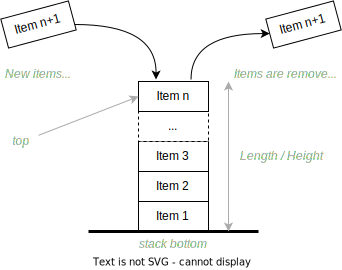

==========================
Stacks, Queues, and Deques
==========================

:Lectures: Lecture 4.6 :download:`(slides) <_static/stacks/stacks_and_queues.pptx>`
:Objectives: Know other useful ADT, including Stacks, Queues, and Deques
:Concepts: ADT, Sequences (ADT), Queue (ADT), Stack (ADT), Deque (ADT)

Sequences (See module :mod:`seq`) has been our first example of
ADT. In practice however, there are several variations around
sequences that are very convenient: Stacks, Queues and Deques. We will
present them using ADT only here.

Stacks
======

.. _sequences/stacks/stack:

.. index::
   pair: ADT ; Stack

.. seealso::

   - Goodrich, M. T., Tamassia, R., & Goldwasser, M. H. (2014). Data
     Structures and Algorithms in Java. 6th edition. John Wiley &
     Sons. *Section 6.1, p. 226*

   - Cormen, T. H., Leiserson, C. E., Rivest, R. L., & Stein,
     C. (2009). Introduction to Algorithms. 2nd edition. MIT
     press. *Section 10.1, p. 200*

   - Skiena, S. S. (2020). The Algorithm Design Manual. : Springer
     International Publishing. *Section 3.2, p. 75* 

A *stack* is a simple variation of sequences, which behaves just like
a stack of dining plates: We can only add or take plates on top of the
stack. No insertion or look up in the middle of the
stack. :numref:`sequences/stacks/stack_idea` illustrates this idea.

.. _sequences/stacks/stack_idea:

   The stack is a constrained sequence, where insertions and removals
   always happen on a single end.

.. important::

   Stacks embody the concept of "last-in, first-out" (LIFO). This is
   behavior we observe when we "stack" dining plates for instance. The
   top of the stack always contains the last item added. The "oldest"
   item is the one that is at the very bottom.

   
.. module:: stack

.. function:: create() -> Stack

   Create a new empty stack.

   Post-conditions:
     - The stack is initially empty.

       .. math::
          length(s') = 0
            
.. function:: top(s: Stack) -> Item

   Return the item on the top of the stack or raises an error is the
   stack is empty.

   Pre-conditions:
      - The stack is not empty.

        .. math::
           length(s) > 0
   
   Post-conditions:
      None
       
.. function:: length(s: Stack) -> Natural

   Return the number of items in the stack

   Pre-conditions:
      None

   Post-conditions:
      None:
              
.. function:: push(s: Stack, i: Item) -> Stack

   Add a new item on top of the stack

   Pre-conditions:
     None

   Post-conditions
     - The length of the resulting stack :math:`s'` has increased by one.
       
       .. math::
          length(s') = length(s) + 1

     - The new item :math:`i` is now on top of the stack
       
       .. math::
          top(s') = i

     - The rest of the stack is left unchanged

       .. math::
          pop(s') = s
          
.. function:: pop(s: Stack) -> Stack

   Remove the top item from the stack

   Pre-conditions:
     - The stack :math:`s` is not empty.

       .. math::
          length(s) > 0

   Post-conditions:
     - The length of the resulting stack :math:`s'` has decreased by one.

       .. math::
          length(s') = length(s) - 1

Queues
======

.. index:: 
   pair: ADT ; Queue

.. seealso::

   - Goodrich, M. T., Tamassia, R., & Goldwasser, M. H. (2014). Data
     Structures and Algorithms in Java. 6th edition. John Wiley &
     Sons. *Section 6.2, p. 238*
   
   - Cormen, T. H., Leiserson, C. E., Rivest, R. L., & Stein,
     C. (2009). Introduction to Algorithms. 2nd edition. MIT
     press. *Section 10.1, p. 201*

   - Skiena, S. S. (2020). The Algorithm Design Manual. : Springer
     International Publishing. *Section 3.2, p. 75*

Intuitively, a queue is what we see in a supermarket when we wait at
the cashier. The customers form a *queue* where the first arrived is
the first one being served. In Computer Science, the data type that
embodies this behavior is the *Queue*.

.. _sequences/stacks/queue_idea:

.. figure:: _static/stacks/images/queues.svg

   With a queue, items are added at the back, whereas they are removed
   from the front.

:numref:`sequences/stacks/queue_idea` illustrates the behavior of
such a queue. Note that, a queue does not enable insertion or deletion
in the middle. Insertions happen at the back, whereas deletion at the
front.

.. important::

   Queues embodies the concept of "first-in, first-out" (FIFO). The
   first item that enters the queue, is the first one that exits it.
   Note the contrast with stacks.

.. module:: queue

.. function:: create() -> Queue

   Create a new empty queue.

   Post-conditions:
     - The queue is initially empty.

       .. math::
          length(q') = 0
                   
.. function:: length(q: Queue) -> Natural

   Return the number of items in the queue

   Pre-conditions:
      None

   Post-conditions:
      None:
              
.. function:: enqueue(q: Queue, i: Item) -> Queue

   Add a new item at the back of the queue

   Pre-conditions:
     None

   Post-conditions
     - The length of the resulting queue :math:`q'` has increased by one.
       
       .. math::
          length(q') = length(q) + 1

     - If we dequeue all the items, the last one we dequeue is Item
       `i`, which we originally enqueued.

       .. math::
          length(q') = n \implies dequeue^n(q') = i
          
.. function:: dequeue(q: Queue) -> [Queue, Item]

   Remove the front item. It returns both a new queue, and the item
   that was extracted.

   Pre-conditions:
     - The queue :math:`q` is not empty.

       .. math::
          length(q) > 0

   Post-conditions:
     - The length of the resulting queue :math:`s'` has decreased by one.

       .. math::
          length(q') = length(q) - 1
   
Deques
======

.. index::
   pair: ADT ; Deque

.. seealso::

   - Goodrich, M. T., Tamassia, R., & Goldwasser, M. H. (2014). Data
     Structures and Algorithms in Java. 6th edition. John Wiley &
     Sons. *Section 6.3, p. 248*

   
Sometimes we need the capacity to add and remove from both ends of the
queue. For instance when working with "sliding windows", or to
implement undo/redo processes. Neither the stacks of queues ADTs apply
and we need a dedicated ADT called *double-ended queue* (or DQ), which
is has been shortened as *deque*.

.. _sequences/stacks/deque_idea:

.. figure:: _static/stacks/images/deques.svg

   Deques (double-ended queue) enable insertion and deletion from both
   ends.

.. module:: deque

.. function:: create() -> Deque

   Create a new empty deque.

   Post-conditions:
     - The new deque :math:`d'` is initially empty.

       .. math::
          length(d') = 0
                   
.. function:: length(d: Deque) -> Natural

   Return the number of items in the deque

   Pre-conditions:
      None

   Post-conditions:
      None:
              
.. function:: enqueueFront(d: Deque, i: Item) -> Deque

   Add a new item at the front of the deque

   Pre-conditions:
     None

   Post-conditions
     - The length of the resulting deque :math:`d'` has increased by one.
       
       .. math::
          length(d') = length(d) + 1

     - If dequeue the item we just enqueue, we get the item we just enqueued.

       .. math::
          d' = enqueueFront(d, i) \implies dequeueFront(d') = (d, i)

     - If we dequeue all the items from the back, the last one we dequeue is Item
       `i`, which we originally enqueued in front.

       .. math::
          length(d') = n \implies dequeueBack^n(d') = i
          
.. function:: dequeueFront(d: Deque) -> [Deque, Item]

   Remove the front item. It returns both a new deque, and the item
   that was extracted.

   Pre-conditions:
     - The deque :math:`d` is not empty.

       .. math::
          length(d) > 0

   Post-conditions:
     - The length of the resulting deque :math:`d'` has decreased by one.

       .. math::
          length(d') = length(d) - 1

.. function:: enqueueBack(d: Deque, i: Item) -> Deque

   Add a new item at the back of the deque

   Pre-conditions:
     None

   Post-conditions
     - The length of the resulting deque :math:`d'` has increased by one.
       
       .. math::
          length(q') = length(q) + 1

     - If dequeue the item we just enqueue, we get the item we just enqueued.

       .. math::
          d' = enqueueBack(d, i) \implies dequeueBack(d') = (d, i)

     - If we dequeue all the items from the back, the last one we dequeue is Item
       `i`, which we originally enqueued in front.

       .. math::
          length(d') = n \implies dequeueFront^n(d') = i
          
.. function:: dequeueBack(d: Deque) -> [Deque, Item]

   Remove the back item. It returns both a new deque, and the item
   that was extracted.

   Pre-conditions:
     - The deque :math:`d` is not empty.

       .. math::
          length(d) > 0

   Post-conditions:
     - The length of the resulting deque :math:`d'` has decreased by one.

       .. math::
          length(d') = length(d) - 1
