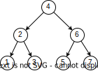
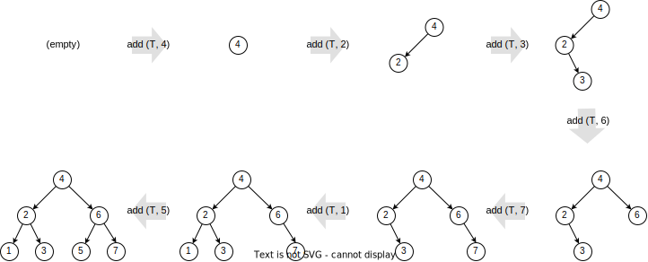
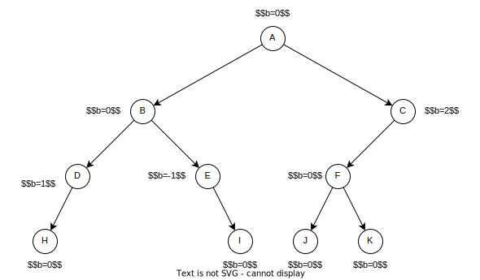
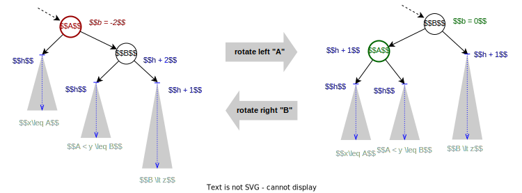
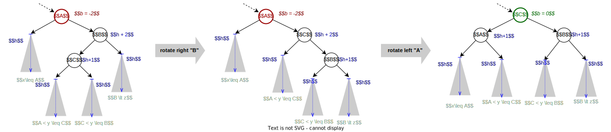

====================
Self-Balancing Trees
====================

:Lecture: Lecture 5.4 :download:`(slides) <_static/avl.pptx>`
:Objectives: Understand why BST must remain well-balanced. Understand
             how this is done in AVL trees.
:Concepts: balancing factor, tree rotations, insertion and deletion in
           AVL trees
:Implementation: Python :download:`avl.py <_static/code/avl.py>`

Binary search trees (BST) offer an overall efficient implement of the
ordered set ADT (see :doc:`Lecture 5.2 </trees/bst/index>`). In the
worst-case, yet that does not perform any better than a linked
list. Let us see how self-balancing trees fix that.

There are several types of self-balancing trees: B-Trees, Red-black
trees, scapegoat trees, etc. They differ by how they detect that the
tree is getting out of balanced. We shall look at *AVL trees*, which
control the difference between the heights of the left and right
branches.

Why BST Can Be Inefficient?
===========================

.. margin::

   .. figure:: _static/images/degenerated.svg
      :name: trees/avl/degenerated

      A degenerated tree, with just one long thin branch

All BST operations are efficient in the average scenario (i.e.,
:math:`O(\log n)`), whereas in the worst case, they run in linear time
(see :doc:`Lecture 5.2 </trees/bst/index>`). What is this average case?
It depends on the overall "shape" of the tree. Contrast the two trees
shown below on :numref:`trees/avl/degenerated` (opposite) and
:numref:`trees/avl/well_balanced`, respectively.

   A well balanced binary search tree

:numref:`trees/avl/well_balanced` shows a "well-balanced" tree: All
branches have the same length. The tree has a height of 2, and the
lesser the height, the faster operations such as :func:`oset.contains`
become. By contrast, the tree from :numref:`trees/avl/degenerated` is
just one long thin "zig-zag" branch, with a height of 6. This is a linked
list in disguise.

.. important::

   The order in which we add items to a BST decides the shape of the
   tree, and in turn how efficient will be the operations.

Both trees contains exactly the same set of items. What governs the
shape is the order in which one adds these items. The well balanced
tree from :numref:`trees/avl/well_balanced` result from a sequence of
insertions such as :math:`s = (4, 2, 3, 6, 7, 1, 5)` as shown on
:numref:`trees/avl/insertions` below. If we insert items in a
different order, say :math:`s'=(1, 7, 2, 6, 3, 4, 5)`, we would get the
degenerated tree from :numref:`trees/avl/degenerated`.

   Growing a binary search tree one item at a time.

Insertion sequences in ascending or descending order for instance,
necessarily yield "degenerated" trees. Consider for example
:math:`s=(1,2,3,4,5,6,7)`.

AVL Trees
=========

If we want BST to be *always* efficient, we need to find a way to
maintain the "balance" of the tree. There are several strategies to
build such *self-balancing* trees, such as:

* AVL Trees: Maintain balance by correcting difference in the height
  of subtrees.

* Scapegoat Trees: Maintain balance by correcting difference in the
  size of subtrees.

* Red-black Trees: Maintain balance by ensuring that the longest path
  from the root to a leaf is no more than twice the length of the
  shortest path. This is done assigning colors (red or black) to nodes
  and enforcing specific constraints.

* B-Trees: Generalize the idea of search trees to n-ary trees (see
  :doc:`Lecture 5.5 </trees/btrees>`)

In the remainder, we look at AVL [#avl] trees and see how to implement the
:func:`oset.add` and :func:`oset.remove` operations.

.. [#avl] Named after the two persons who invented this it:
          Adelson-Velsky and Landis. See their 1962 article:

           * Adelson-Velsky, Georgy; Landis, Evgenii (1962). "An
             algorithm for the organization of
             information". Proceedings of the USSR Academy of Sciences
             (in Russian). 146: 263--266. English translation by
             Myron J. Ricci in Soviet Mathematics - Doklady,
             3:1259--1263, 1962

.. important::

   The idea of AVL trees is to *quantify* how well a tree is *balanced*,
   and to adjust the tree whenever the balance falls outside the
   accepted interval. To adjust the tree, we use a special operation
   named a *rotation*.

Measuring Balance
-----------------

How can we detect when a tree is well balanced, or when it starts to
degenerate into a linked list? The idea of AVL tree is to contrast the
height of both sub trees (left and right). Recall that the *height* of
a tree is the depth of its deepest descendant.

Let's define a binary tree as a triplet :math:`T=(r, L, R)` where
:math:`r` is the root, :math:`L` the left sub tree, and :math:`R`
the right sub tree. We define the *height* of a tree as a function
:math:`h(T)` such that:

.. math::

   h(T) = \begin{cases}
      -1 & \textrm{if } T = \varnothing \\
      1 + \max(h(L), h(R)) & \textrm{if } T = (r, L, R)
   \end{cases}

We now define the *balance factor* :math:`b` as the difference in
height between the left and right subtree, or more formally a function
:math:`b(T)` such that:

.. math::
   b(T) = \begin{cases}
        0 & \textrm{if } T = \varnothing \\
        h(L) - h(R) & \textrm{otherwise}
   \end{cases}

.. admonition:: Python Implementation
   :class: dropdown, hint

   A natural way to implement the height and balance calculation is to
   equip our ``Node`` class with two methods ``height`` and
   ``balance`` that closely follow their definition.

   .. code-block:: typescript
      :linenos:

      class AVLNode:

          @property
          def height(self):
              left_height = self._left.height if self.has_left else -1
              right_height = self._right.height if self.has_right else -1
              return 1 + max(left_height, right_height)

          @property
          def balance_factor(self):
              left_height = self._left.height if self.has_left else -1
              right_height = self._right.height if self.has_right else -1
              return left_height - right_height

          @property
          def is_balanced(self):
              return -2 < self.balance_factor < 2

   For the sake of simplicity, I define this *balancing factor* as a
   "computed property", but it would be more efficient to store it
   into the node, and adjust it only whenever we know it has changed.

With this definition, a *well-balanced* tree has a balance factor of
zero, a *left-heavy* tree has a positive balance factor, and a
*right-heavy* tree a negative balance factor. Consider
:numref:`trees/avl/balance` for example. At the root, the tree is
well-balanced, although it is not complete. Both sub trees B and C
have a height of 2, despite their different shape. B is well-balanced
as well, but C is left-heavy.

   A binary tree annotated with balance information for each node

Rotation to Restore Balance
---------------------------

Now we know when the tree starts to degenerate, we must reorganize its
items, to improve the balance. In an AVL tree, each node must have a
balance factor within the interval :math:`[-1,1]`. Whenever the
balance factor lands below or above, we must adjust the tree. AVL
trees (and other types of search trees) rely on *rotations*:
Re-organizations of nodes that preserves the BST invariant
[#invariant]_.

.. [#invariant] Any node is larger or equals to any of its left
                descendants, and smaller than any of its right
                descendants.

.. important::

   An AVL tree maintains the balance factor of every node in the range
   :math:`[-1, 1]`. Should the balance factor falls outside of this
   interval, we shall apply one or more rotation to correct it.

So we take action whenever the balance factor becomes either 2 or
-2. The balance factor grows by one on every insertion. Let's first
consider the cases where the balance factor is -2. The case where the
balance factor is 2 are symmetrical. There are two cases:

* One child is *outer heavy*, shown below on :numref:`trees/avl/outer`:
  Either the right child is right-heavy (:math:`b=-2` shown below) or
  the left child is left-heavy (:math:`b=2`, symmetric). Node A has a
  balance factor :math:`b = -2`. Its left child is a tree of height
  :math:`h`, but its *right* child is a tree of height :math:`h + 2`
  because of its own *right* child that has a height of :math:`h+1`
  itself.

  .. figure:: _static/images/outer.svg
     :name: trees/avl/outer

     One child is "outer-heavy"

* One child is *inner heavy*, shown below on :numref:`trees/avl/inner`:
  Either the right child is left-heavy (:math:`b=-2`, shown below), or
  the left child is right-heavy (:math:`b=2`, symmetric). Node A still
  has a balance factor of :math:`b=2`, but here, it is the left child
  (inner) of Node B that has a height of :math:`h+1`

  .. figure:: _static/images/inner.svg
     :name: trees/avl/inner

     One child is "inner-heavy"

Repairing the Outer Case
........................

We solve the outer case shown by :numref:`trees/avl/outer` using a
single rotation, as shown on :numref:`trees/avl/rotation`. On the left
hand side, the tree is outer-heavy, as we saw on
:numref:`trees/avl/outer`. To correct this, we *rotate A to the
left*. This rotation "lifts up Node B" as a the root of the tree, with
Node A as a left child. It moves the subtree :math:`A < x \leq B` to
be a right child of Node A. The result, on the right hand side, is a
tree whose balance factor is zero.

   Applying rotation to restore balance

Note that the resulting tree (on the right hand side) preserves the
BST invariant. Despite moving around subtrees, the ordering of nodes
and subtrees is still correct. The inverse operation is to *rotate
Node B to the right* (on the right hand side of
:numref:`trees/avl/rotation`).

.. admonition:: Python Implementation
   :class: hint, dropdown

   We implement these two dual rotation operations as two separate
   methods of the ``Node`` class.

   .. code-block:: python
      :name: trees/avl/rotations/code
      :linenos:

      class AVLNode:

          def rotate_right(self):
              new_root = self.left
              self.left = new_root.right if new_root.has_right else None
              new_root.right = self
              return new_root

          def rotate_left(self):
              new_root = self.right
              self.right = new_root.left if new_root.has_left else None
              new_root.left = self
              return new_root

.. caution::

   The direction of these rotations is a matter of convention. I define a
   "left rotation" as the operation that lift up the right child, and
   a *right rotation* as the operation that lifts up the left
   child. Other may do the other way around.

Repairing the Inner Case
........................

Restoring the balance in the *inner configuration* (see
:numref:`trees/avl/inner` requires two
rotations. :numref:`trees/avl/double_rotation` illustrates it. On the
left hand, we expanded the inner case of :numref:`trees/avl/inner`,
and revealed the inner subtree of Node B: Its root is Node C, which
has two subtree of height :math:`h`. To return to a configuration with
a balance factor of zero, we first rotate "B" to the right, which
bring us back to the outer case, which we know how to solve. We then
rotate A to the left.

   Restoring the inner case using two rotations in sequence

Both rotation are the same operation we have used for the outer
case. The first rotation target the child (Node B) whereas the second
rotation targets the root of the tree (Node A).

The "rebalance" Procedure
.........................

To re-balance a node, we must first identify whether we are in the
inner or in outer case, and whether this happens on the left or on
the right child.

One way to distinguish between these cases is to look at the balance
factor: If it is positive, then the problem lays on the left child,
if it is negative, on the right child.

There are all together four following:

* Outer left: The node :math:`n` is left heavy, and its left child is also
  left heavy. We can fix this by a right rotation

* Inner left: The node :math:`n` is left heavy, and its left child is
  right heavy We can fix this by a left rotation of the left child
  followed by a right rotation of Node :math:`n`

* Outer right: The node :math:`n` is right heavy and its right child
  is also right heavy. We can fix that by a left rotation of Node :math:`n`

* Inner right: The node :math:`n` is right heavy and its right child
  is left heavy. We can fix that by a right rotation of the right
  child followed by a left rotation of Node :math:`n`

.. admonition:: Python Implementation
   :class: hint, dropdown

   The Python implementation directly express these four scenarios:
           
   .. code-block:: python
      :linenos:
         
      class AVLNode:
         
          def rebalance(self):
              if self.is_balanced:
                  return self
              if self.is_left_heavy and self.left.is_left_heavy:
                  return self.rotate_right()
              elif self.is_left_heavy and self.left.is_right_heavy:
                  self.left = self.left.rotate_left()
                  return self.rotate_right()
              elif self.is_right_heavy and self.right.is_left_heavy:
                  self.right = self.right.rotate_right()
                  return self.rotate_left()
              else:
                  return self.rotate_left()

Insertion
---------

Now we are able to rebalance the tree should it starts to degenerate,
we need to rebalance it after every insertion. Every insertion will
deepen by one the height of some subtrees, and all these subtrees
(along the path that leads to the new node) may need "re-balancing".

.. admonition:: Python Implementation
   :class: hint, dropdown

   The Python implementation below simply re-balance the tree once the
   new item has been inserted. Remember our re-balancing procedure
   does nothing is the node is well balanced. If we omit the call to
   `rebalance` we are left with the regular BST insertion.
           
   .. code-block:: python
      :emphasize-lines: 16
      :linenos:

      class AVLNode:

          def insert(self, key, item):
              if key == self.key:
                  raise ValueError(f"Duplicate Key: {key}")
              elif key < self.key:
                  if self.has_left:
                      self.left = self.left.insert(key, item)
                  else:
                      self.left = AVLNode(Entry(key, item))
              else:
                  if self.has_right:
                      self.right = self.right.insert(key, item)
                  else:
                      self.right = AVLNode(Entry(key, item))
              return self.rebalance()

               
Deletion
--------

Recall the deletion algorithm for BST: We first find the node
delete. If it has two children, we replace it with its predecessor. If
it has only one child, we replace it with that child, otherwise, we
just delete the node.

Like the insertion, the deletion modifies the height of all the nodes
along the "path" to the node that we want to delete, and all these
node may need to be re-balanced. As we recursively descend along this
path, we need to call our `rebalance` procedure.

.. admonition:: Python Implementation
   :class: hint, dropdown

   This is a recursive implementation of the BST delete
   operation. After each "recursive" case, where we delete the
   deletion to a subtree, we invoke our `rebalance` procedure

   .. code-block:: python 
      :name: trees/avl/delete/code
      :emphasize-lines: 17, 20
      :linenos:
         
      def delete(self, key):
          if self.key == key:
              if self.has_left and self.has_right:
                  predecessor = self.predecessor(key)
                  self.delete(predecessor.key)
                  predecessor.left = self.left if self.has_left else None
                  predecessor.right = self.right if self.has_right else None
                  return predecessor
              elif self.has_left:
                  return self.left
              elif self.has_right:
                  return self.right
              else:
                  return None
          elif key < self.key and self.has_left:
              self.left = self.left.delete(key)
              return self.rebalance()
          elif self.key < key and self.has_right:
              self.right = self.right.delete(key)
              return self.rebalance()
          else:
              raise ValueError(f"No such key {key}")

