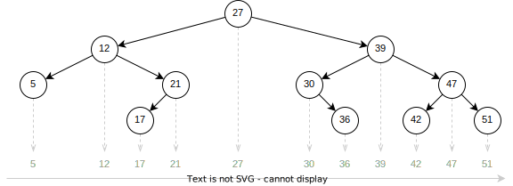
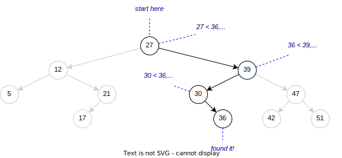
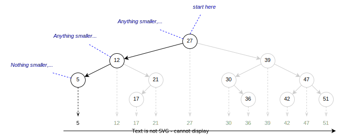
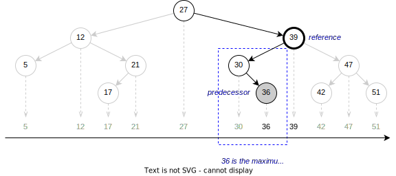
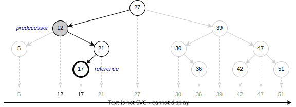
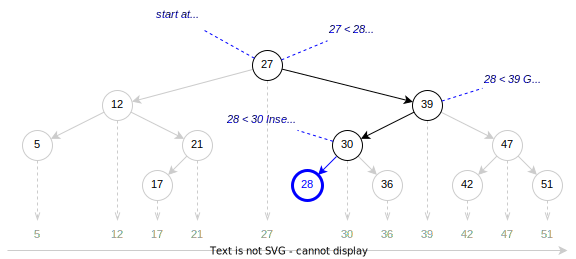

===================
Binary Search Trees
===================

:Lecture: Lecture 5.2 :download:`(slides)
          <https://studntnu-my.sharepoint.com/:p:/g/personal/franckc_ntnu_no/EW2z8u3JLjRNr3GYw-Pr9mgBL28wX_tBfmGJOAetBUyyYA?e=NNV4z3>`
:Objectives: Understand how to implement an ordered set using a binary
             search tree
:Concepts: Ordered Set ADT, insertion, deletion, min/max,
           predecessor/successor in a BST

We focus here on the *binary search tree* (BST), a tree data structure
that implements *ordered sets* where items shall remain in a specific
order at all times. Although the BST in its simplest form is *not*
very efficient, we will later add :doc:`*self-balancing* (see Lecture
5.4) </trees/avl/index>` to make it "production-ready".

Ordered Sets
============

An ordered set is a collection of unique items with a logical
order. Take for instance books on a shelf, we could order them by
title, provided there is not two books with the same title. The table
below list some examples:

.. csv-table:: Ten famous books ordered by title
   :header: "Title", "Author", "Pages"
   :widths: 15, 20, 5
   :name: trees/bst/oset/books
                  
   1984,George Orwell,328
   Crime and Punishment,Fyodor Dostoevsky,671
   Moby-Dick,Herman Melville,720
   One Hundred Years of Solitude,Gabriel García Márquez,417
   Pride and Prejudice,Jane Austen,279
   The Catcher in the Rye,J.D. Salinger,234
   The Great Gatsby,F. Scott Fitzgerald,180
   The Lord of the Rings,J.R.R. Tolkien,1178
   To Kill a Mockingbird,Harper Lee,281
   War and Peace,Leo Tolstoy,1225

Note that every book (the physical instances on the shelf) is unique,
but I can order them in various ways: By title, by author, or by page
count, etc.
   
Historical events is another example of "things" that are
both unique and naturally ordered.

Formal Definition
.................

In mathematics an ordered set :math:`O` is a pair :math:`O=(S, \leq)`,
where:

* :math:`S` is a set
  
* :math:`\leq\; \in S \times S` is an ordering relationship over :math:`S`
  such that:

  * :math:`S` is *reflexive*, that is :math:`\forall a \in S, a \leq a`
    
  * :math:`S` is *transitive*, that is
    
    .. math::
       \forall (x,y,z) \in S³, \;  x \leq y \land y \leq z \implies x \leq z
       
  * :math:`S` is *antisymmetric*, that is:
    
    .. math::
       \forall (x,y) \in S², \; a \leq b \land  b \leq a \iff a = b

    
  * :math:`S` is *total*: It applies to every possible pair of items
    from :math:`S`,
    
    .. math::
       \forall (x,y) \in S², \; a \leq b \lor b \leq a

Returning to the books listed on :numref:`trees/bst/oset/books`, the
book are the set :math:`O`, whereas the order I choose to organize my
shelf is the relationship :math:`\leq`.

       
Abstract Data Type
..................
       
We define the :mod:`oset` :doc:`ADT (see Lecture 2.1)
</sequences/adt>` to represent ordered sets. I focus here on
operations that distinguish an ordered set from a "classical" set, but all
other set operations such as union, intersection, difference,
etc. remain meaningful.
 
.. module:: oset

.. function:: create() -> OrderedSet

   Create an new empty ordered set :math:`o`.

   Post-conditions
      * The ordered set :math:`o` is empty, that is:

        .. math::
           o = create() \implies cardinal(o) = 0

.. function:: cardinal(o: OrderedSet) -> Natural

   Returns the number of items in the given ordered set :math:`o`

.. function:: contains(o: OrderedSet, i: Item) -> Boolean

   Returns true if and only if :math:`i` is a member of :math:`o`.

   
.. function:: minimum(o: OrderedSet) -> Item

   Find the smallest item :math:`\alpha` of the given ordered set :math:`o`.

   Pre-conditions
      * The ordered set :math:`o` is not empty, that is:

        .. math::
           cardinal(o) > 0

   Post-conditions
      * There is no other item in :math:`o` less than to
        :math:`alpha`, that is:

        .. math::
           \alpha = minimum(o) \implies \nexists\,i, \; contains(o, i) \land i < \alpha
   
.. function:: maximum(o: OrderedSet) -> Item

   Find the largest item :math:`\omega` of the given ordered set :math:`o`.

   Pre-conditions
      * The ordered set :math:`o` is not empty, that is:

        .. math::
           cardinal(o) > 0

   Post-conditions
      * There is no other item :math:`i` in :math:`o` greater than to
        :math:`alpha`, that is:

        .. math::
           \omega = maximum(o) \implies \nexists\, i, \; contains(o,i) \land \omega < i
   
.. function:: successor(o: OrderedSet, i: Item) -> Item

   Find the item :math:`j` directly greater than the given item :math:`i` in the
   ordered set :math:`o`.

   Pre-conditions
      * The ordered set :math:`o` contains the given item :math:`i`,
        that is:
   
        .. math::
           contains(o, i)

      * There exists at least one item in :math:`o` that is greater
        than the given item :math:`i`.

        .. math::
           \exists k, i < k \land contains(o, k)

   Post-conditions
      * The successor :math:`j` is also a member of :math:`o`, that is:

        .. math::
           j = successor(o, i) \implies contains(o, j)
           
      * There is no other item :math:`k` in :math:`o` in between
        :math:`i` and :math:`j`, that is:

        .. math::
           j = successor(o, i) \iff \nexists\, k , \; contains(o, k) \land  i < k < j
   
.. function:: predecessor(o: OrderedSet, i: Item) -> Item

   Find the item :math:`h` directly smaller than the given item :math:`i` in the
   ordered set :math:`o`.

   Pre-conditions
      * The ordered set :math:`o` contains the given item :math:`i`,
        that is:
   
        .. math::
           contains(o, i)

      * There exists at least one item :math:`k` in :math:`o` that is smaller
        than the given item :math:`i`.

        .. math::
           \exists k, k < i \land contains(o, k)

   Post-conditions
      * The predecessor :math:`h` is also a member of :math:`o`, that is:

        .. math::
           h = predecessor(o, i) \implies contains(o, h)
           
      * There is no other item :math:`k` in :math:`o` in between
        :math:`h` and :math:`i`, that is:

        .. math::
           h = predecessor(o, i) \iff \nexists\, k , \; contains(o, k) \land  h < k < i
   

.. function:: add(o: OrderedSet, i: Item) -> OrderedSet

   Insert a new item in a given ordered set

   Post-conditions
      * The given item :math:`i` is added to the set :math:`o` only if
        it is not already present, that is:
        
        .. math::
           o' = insert(o, i) \implies & contains(o', i) \\
                                      & \land (\neg contains(o,i) \iff cardinal(o') = cardinal(o) + 1)
           

.. function:: remove(o: OrderedSet, i: Item) -> OrderedSet

   Remove an item :math:`i` from the given ordered set :math:`o`.

   Pre-conditions
      * The ordered set :math:`o` is not empty, that is:

        .. math::
           cardinal(o) > 0

   Post-conditions
      * The given item :math:`i` is removed from the set :math:`o` only if
        it is already present, that is:
        
        .. math::
           o' = remove(o, i) \implies & \neg\, contains(o', i) \\
                                      & \land (contains(o, i) \iff cardinal(o') = cardinal(o) - 1)
           
Ordered Set Using a Binary Search Tree
======================================

A binary search tree (BST) is a tree data structure that offers an
efficient implementation of the operations that characterize an ordered
set, namely 

.. Csv-Table:: Summary of the Ordered Set Operations Efficiencies Using a BST
   :header: "Operation", "Best-case", "Worst-case", "Average case"
   :widths: 10, 10, 10, 10
   :name: trees/bst/efficiency/summary
                  
   ":func:`oset.cardinal`", ":math:`O(n)`", ":math:`O(n)`", ":math:`O(n)`"
   ":func:`oset.contains`", ":math:`O(1)`", ":math:`O(n)`", ":math:`O(\log n)`"
   ":func:`oset.add`", ":math:`O(1)`", ":math:`O(n)`", ":math:`O(\log n)`"
   ":func:`oset.remove`", ":math:`O(1)`", ":math:`O(n)`", ":math:`O(\log n)`"
   ":func:`oset.minimum`", ":math:`O(1)`", ":math:`O(n)`", ":math:`O(\log n)`"
   ":func:`oset.maximum`", ":math:`O(1)`", ":math:`O(n)`", ":math:`O(\log n)`"
   ":func:`oset.predecessor`", ":math:`O(1)`", ":math:`O(n)`", ":math:`O(\log n)`"
   ":func:`oset.successor`", ":math:`O(1)`", ":math:`O(n)`", ":math:`O(\log n)`"

.. What is a binary search tree. What is the invariant.

A BST is a binary :doc:`tree (see Lecture 5.1) </trees/intro/index>`:
Every node has at most two children, often denoted as "left" and
"right". Besides its children, each node carries a item of the ordered
set the tree represents.

.. important::

   Every node carries an item that is greater than or equals to all
   the item in its left sub tree, and strictly smaller than all the
   items in its right sub tree.
   
   .. figure:: _static/images/invariant.svg
      :name: trees/bst/invariant
               
      The invariant enforced by all BST nodes

Consider the BST shown below on :numref:`trees/bst/example`. It
captures the ordered set formed by a few natural numbers. Take the
root node: It carries 27 and every node on its left carries a smaller
value, and every node on its right carries a larger value. Note how
the tree reflects the natural ordering of numbers.
      

   A BST build from a few natural numbers

.. admonition:: Typescript Implementation
   :class: dropdown, hint

   Following our blue print to implement trees (see Lecture 5.1) use a
   facade object that expose our ADT's operations and access the root of
   the tree. :numref:`trees/bst/design` illustrates this approach using a
   UML class diagram.

   .. figure:: _static/images/design.svg
      :name: trees/bst/design

      General implementation of a BST (UML class diagram)

   We are free to implement these operations using either iteration or
   recursion. Let see how that would look like in Typescript.

   .. code-block:: typescript

      type Order<T> = (left: T, right: T) => boolean;

      class OrderedSet<Item> {

          private _order: Order<Item>;
          private _root: Node<Item> | null;

          constructor(
              order: Order<Item>,
              root: Node<Item> | null) {
              this._order = order;
              this._root = root;
          }

      }

      class Node<Item> {

         item: Item;
         left: Node<Item> | null;
         right: Node<Item> | null;

         constructor (
             item: Item,
             left: Node<Item> | null,
             right: Node<Item> | null
         ) {
             this.item = item;
             this.left = left;
             this.right = right;
         }

      }

Cardinal
........

Let's start with the simplest query: :func:`oset.cardinal`, which
returns the number of items in set. The simplest way to compute it
against a BST is to iterate over the nodes of the tree, using a DFS or
a BFS (see :doc:`Lecture 5.1 </trees/intro/index>`).

.. admonition:: Typescript Implementation
   :class: dropdown, hint

   I use below a depth-first strategy (DFS), implemented using a loop
   and stack.

   .. code-block:: typescript
      :linenos:

      cardinal (): number {
          if (this.isEmpty) return 0;
          let cardinal = 0;
          const stack: Array<Node<Item>> = [this._root!]
          while (stack.length > 0) {
              const current = stack.pop();
              cardinal += 1;
              for (const eachChild of current!.children) {
                  stack.push(eachChild)
              }
          }
          return cardinal;
      }

This solution takes a time proportional to the number of nodes in
tree. A faster approach is to store this count and to modify the
:func:`oset.add` and :func:`oset.remove` commands to update this
count. The :func:`oset.cardinal` then runs in constant time, in
exchange of a negligible extra work when modifying the tree.

Membership
..........

How can we implement the :func:`oset.contains` using a BST? Why not
just iterate through the nodes, checking whether any matches? That
would work but would take as long as there are items in the tree
(i.e., :math:`O(n)`). We can do better if we leverage the structure of
the BST.

Consider again a BST shown on :numref:`trees/bst/example` and say we
are searching for 36. When we look at the root (i.e., 27) we know
where to continue: 27 is smaller than 36, 36 has to be on the right
subtree (if it is in the tree). As shown :numref:`trees/bst/contains`,
we can exploit this to navigate "straight" to the target.

   Searching for Item 36

This algorithm can be summarized as:

#. Take the root as our current node;

#. We compare the item of our current node to our target;

#. If this node has the item we are looking for, then we found it!

#. If this item is smaller than our target, we set our current node to
   the left child, and continue at Step 2. If there is no left child, the target is not in
   the tree.

#. If this item is larger than our target, we set our current node to
   the right child and continue at Step 2. If there is no right child,
   our target is not in the tree.

.. admonition:: Typescript Implementation
   :class: dropdown, hint

   I continue below the Typescript implementation we started
   earlier. Here is the body oft

   .. code-block:: typescript
      :name: trees/bst/contains/code
      :linenos:

      class OrderedSet<Item> {
         
          contains (target: Item): boolean {
               if (this.isEmpty) return false;
               let node = this._root;
               while (node != null) {
                   if (this._order(node.item, target)) {
                       if (node.item == target) {
                           return true;

                       } else {
                           node = node.right;

                       }
                   } else {
                       node = node.left;

                   }
               }
               return false;
           }

       }

Why Is This Correct?
   Our specification of :func:`oset.contains` returns true
   if and only if there exists a node that carries the given item
   :math:`i`.  I would think recursively, and prove correctness by
   induction, as trees are recursive by definition. Let's consider the
   base cases first:

   * If the tree *is empty*, we return false, which is correct: An
     empty tree contains nothing.
     
   * If the tree boils down to a single leaf node, then we return true
     if and only if the that node contains the given item.

   Now we can make the induction step. Let's assume our algorithm is
   correct for a tree of height :math:`h`, and show it works for a
   slightly larger tree of height :math:`h+1`. There are there cases:

   * If the root carries an item :math:`k` that equals the given item
     :math:`i`, we return true. That is correct.

   * If the tree carries an item :math:`k` smaller than the given item
     :math:`i`, then we apply our algorithm to its right subtree. This
     is correct by assumption: This right subtree has a height
     :math:`h`.

   * If the tree carries an item :math:`k` that is larger than
     :math:`i`, then apply our algorithm to the left subtree. This is
     correct by assumption: The left subtree has a height :math:`h`.

   Now we know that our algorithm works for a tree height 1 (the base
   cases) and, that given a tree of height :math:`h` it would work for
   any tree of height :math:`h+1` (the induction step), we therefore
   know it works for trees of any height.
   
How Efficient Is This?
   This is the very same as the :doc:`binary search algorithm (Lecture
   2.4) </sequences/searching>`. Here is the efficiency depends on the
   *depth* of the branch we are navigating. In the best case, this
   branch is very short (we are searching for the root), and the
   search takes constant time (i.e., :math:`O(1)`). In the worst case,
   the tree is one single long branch and the search takes as long as
   there are items in the tree (i.e., :math:`O(n)`). In average
   however, the branch is a long as the height of the tree so the
   search takes logarithmic time (i.e., :math:`O(\log n)`).

.. exercise:: Recursive membership
   :label: trees/bst/contains/recursive

   How would you implement the :func:`oset.contains` operation against
   a BST using recursion instead of iteration? Look at the discussion
   about correctness for some inspiration.

Minimum and Maximum
...................

How could we find the minimum and the maximum items of an ordered set
against a BST? We could traverse the tree (i.e., use a DFS or BFS) but
that would yield a linear runtime in all cases. We can be faster if we
exploit the structure of the BST, which adheres to the ordering of
items. The minimum is always the furthest on the left, and the maximum
the furthest on the right.

As shown on :numref:`trees/bst/minimum`, finding the minimum boils
down to following the left branch as far as possible. Finding the
maximum works the same way: We always "go right".

#. We start at the root, and make it our current node.

#. If the current node has a left child,

   * *Then*, we update our current node, and return at Step 2.

   * *Otherwise*, we return the item carried by the current node.

   Finding the minimum in a BST by always going "left"

.. admonition:: Typescript Implementation
   :class: dropdown, hint

   Our Typescript implementation closely resembles the ``contains``
   operation, but looks simpler as we always continue along the left
   branch.
                
   .. code-block:: typescript
      :name: trees/bst/minimum/code
      :emphasize-lines: 4-5, 11-12 
      :linenos:

      class OrderedSet<Item> {
                   
          minimum (): Item {
            if (this.isEmpty) {
                throw new Error(
                    "Invalid state: An empty ordered set has no minimum."
                );
                
            }
            let node = this._root;
            while (node != null && node.hasLeft) {
                node = node.left;
            }
            return node!.item;
         }

      }

Why Is This Correct?
  Again, I would argue by induction over the recursive tree
  structure. Let's start by the base case, there is only one.

  * When the tree is a single leaf node, the minimum is necessarily
    the value that this node carries, and that is what we return.

  Now if we assume that our algorithm works for any tree of height
  :math:`h`, and that we are given a tree of height :math:`h+1`, there
  is only one case:

  * We return the minimum of the left subtree, which is correct,
    because it is necessarily smaller or equals than the item carried
    by the current node.

  Since it works for the base case (leaves) and, if it works for trees
  of height :math:`h`, it also works for trees of height :math:`h + 1`
  (inductive step), then, by structural induction, it works for all
  BSTs.

How Efficient Is This? 
  As for most queries on trees, it depends on the depth of the node
  that carries the desired item.

  * In *the best case*, this node is the root, and finding the minimum
    takes constant time.

  * In *the worst case*, the whole tree is a long thin left branch,
    and finding the minimum takes linear time.

  * In average, it takes a time that is proportional to the height of
    the tree, that is :math:`O(\log n)`.

.. exercise:: Maximum

   The :func:`oset.maximum` is the symmetric of the
   :func:`oset.minimum`. How would you design it?
    

Predecessor and Successor
.........................

Given a reference item, where is the predecessor located in a BST? It
is the closest node to the left. There are however three
possibilities:

* It may be located among the descendants of the reference
  
* It may be located among the ancestors of the reference
  
* It may not exist, if the given reference is the minimum

Consider first :numref:`trees/bst/predecessor/descendants` below, where
we are looking for the predecessor of 39, which is 36. Since 39 has a
left child, its predecessor is necessarily in the interval :math:`(27,
39]`, which is its left subtree. Further, the predecessor is the
maximum of this subtree, that is, the right-most node.
   

   Finding the predecessor when the reference node has a left child: 36
   is the maximum of the left subtree of 39.

Consider now :numref:`trees/bst/predecessor/ancestor` below, where we
are looking for the predecessor of 17, which is 12. Since 17 has no
left subtree, its predecessor is necessarily its closest
left-ancestor. This first left-ancestor, is necessarily the closest
predecessor due to the BST invariant (see
:numref:`trees/bst/invariant`).

   Finding the predecessor when the reference node has no left
   subtree: 12 is the predecessor of 17.

We can thus summarize the algorithm as follows:
   
#. Find the node that carries the given item;

#. If this node has a left subtree:

   * *Then*, we return the maximum of its left subtree;

   * *Otherwise* we return the first ancestor that is smaller than the
     current node (starting from the parent), or none if there is no
     such parent.

.. admonition:: Typescript Implementation
   :class: dropdown, hint

   Below is my Typescript implementation of the
   :func:`oset.predecessor` operation. It closely follows the
   algorithm I outlined above.

   .. code-block:: typescript
      :linenos:

      predecessorOf (item: Item): Item | undefined {
           if (this.isEmpty) {
               throw new Error(`Invalid state: Ordered set is empty.`)

           }
           const path = this.findPathTo(item);
           if (path[path.length-1].item != item) {
               throw new Error(`Invalid state: Item '${item}' is not a member.`);

           } else {
               const node = path.pop();
               if (node!.hasLeft) {
                   return this.maximumFrom(node!.left!);

               } else {
                   return this.firstSmallerAncestor(path, item);

               }
           }
      }

   There are two "variations" around the code I presented so far:

   * Line 6, I use the ``findPathTo`` helper, which returns the list
     of ancestor to a given items, ordered from the root node. This
     simplifies search for the first smaller ancestor later on. If the
     given item cannot be found, it returns a path to the insertion
     point.

     .. code-block:: typescript
        :linenos:

         private findPathTo(target: Item): Array<Node<Item>> {
             const path: Array<Node<Item>> = [];
             if (this.isEmpty) return path;
             let node = this._root;
             while (node != null) {
                 path.push(node);
                 if (this._order(node.item, target)) {
                     if (node.item == target) {
                         break;
                     } else {
                         node = node.right;
                     }
                 } else {
                     node = node.left;
                 }
             }
             return path;
         }

   * Line 13, I use a ``findMaximumFrom`` operation that accepts a
     "root" node. That permits reusing the "maximum" algorithm on any
     node.

     .. code-block:: typescript
        :linenos:

        private maximumFrom(root: Node<Item>) {
            let node = root;
            while (node != null && node.hasRight) {
                node = node.right!;
            }
            return node!.item;
        }
                     
         
   * Line 16, I use the ``firstSmallerAncestor`` helper operation,
     which goes through a given path and find the first ancestor
     (starting from the end) that is smaller than the given item.

     .. code-block:: typescript
        :linenos:
           
        private firstLesserAncestor(
            path: Array<Node<Item>>,
            item: Item
        ): Item | undefined {
            while (path.length > 0) {
                const parent = path.pop();
                if (this._order(parent!.item, item)) {
                    return parent!.item;
                }
            }
            return undefined;
        }

Why Is This Correct?
  Because of the structure of BSTs, for any node, its predecessor is
  necessarily the "closest node to the left". This "closest" node can
  be either amongst the ancestors or the descendants. Should both
  exist, the one in the descendants is always "closer" to the
  reference, and should thus be considered first. See the distances
  shown on :numref:`trees/bst/predecessor/proof` below.

  .. figure:: _static/images/predecessor_proof.svg
     :name: trees/bst/predecessor/proof

     Closest left-node: Why ancestors are necessarily further away
     then descendants.

How Efficient Is This?
  Again, it depends on the shape of the tree.
  
  * In the best case, the reference is the root and its predecessor is
    the left child. That runs in constant time.
    
  * In the worst case, the tree is a single long and thin left branch,
    the reference is the next to last node, and its predecessor is the
    minimum. That runs in linear time.
    
  * In average, the reference is somewhere along a branch and the
    predecessor is either further down towards the leaves or amongst
    the ancestors. In that case, it runs in :math:`O(\log n)`.

.. exercise:: Successor

   The :func:`oset.successor` is the symmetric of the
   :func:`oset.predecessor`. How would you design it?

Addition
........

Let's now look at the commands that modify the structure of
tree. :func:`oset.add` is the first one: It adds a new item.

As we use a BST, we must guarantee that every node carries an item
larger than any of its left subtree and smaller than any of its right
subtree. To do that, we proceed as follows:

#. We search for the right "parent" node by navigating the tree until
   we cannot progress anymore.

#. If the item to insert is smaller or equals to parent

   * *Then* insert a new node as the left child

   * *Otherwise* insert a new node as the right child

:numref:`trees/bst/add` gives an example. To insert 28, we start from
the root and navigate down the tree until we cannot progress anymore
(just as the :func:`oset.contains` would do). We get stuck on Node 30,
which has only a right subtree. Since 28 is smaller than 30, we insert
it as a new left child.
     

   Insertion in a BST: 28 is placed as the left child of 30.

.. admonition:: Typescript Implementation
   :class: dropdown, hint

   I reuse below the ``findPathTo`` which returns the path to the
   insertion point. The last node is the parent we have to modify. If
   the given item is smaller, I insert on the left, otherwise on the
   right.

   .. code-block:: typescript
      :linenos:

      add (newItem: Item) {
          if (this.isEmpty) {
              this._root = new Node<Item>(newItem, null, null);

          } else {
              const path = this.findPathTo(newItem);
              const parent = path[path.length-1];
              if (this._order(newItem, parent.item)) {
                  if (parent.item != newItem) {
                      parent.left = new Node<Item>(newItem, null, null)
                      this._cardinal += 1
                  }

              } else {
                  parent.right = new Node<Item>(newItem, null, null);
                  this._cardinal += 1

              }
          }
      }
   

Why is it correct?
  Our :func:`oset.add` specification requires that add be added if and
  only if it is not already present. We check for equality and before
  to insert on the left subtree.

  However, The meaning of correctness is different for queries to
  commands. Not only the shall commands adhere its ADT specification,
  but commands shall also maintain the BST invariant.

  This invariant requires that any node item be larger than any of its
  left subtree items, and smaller than any of its right subtree
  items. We assume that this invariant holds before the addition. Our
  procedure finds a parent that guarantees this invariant, and we add
  according to the invariant, so the invariant is preserved by the
  addition.

How efficient is it?
  It depends on the structure of the tree, and the given item,

  * In the best case, the root is the parent and the insertion runs in
    constant time.

  * In the worst case, the tree is a single long thin branch, which we
    traverse all the way to its end to insert and the insertion takes
    a time linear to the size of the tree.

  * In average, the parent node has a depth that is proportional to
    the height of the tree, and the insertion runs in :math:`O(\log
    n)`.

.. caution::

   What about **duplicates**? Intuitively, in a set, there is no
   duplicates but the ordering relationship :math:`\leq` allows
   that. This ordering only decides precedence and not duplication,
   which is decided by the set itself. Take calendar events for
   instance: One can be "double booked" with two events at the same
   time, say Monday at 14:00. From the ordering perspective, these two
   events are equals, but these two events represents two different
   meetings, they are not duplicates. By default, a BST place
   duplicate on the left subtree as shown below:

   .. figure:: _static/images/duplicates.svg
      :name: trees/bst/duplicates

      Adding duplicates in a BST. 27 has been is added three times,
      but the tree remains a valid BST.

  
Removal
.......

Removing an item from a BST is the most complicated procedure, because
have to maintain the invariant of BST. When we delete a node we have
to modify the tree for its subtrees to remain properly
connected. There are two cases:

* If the node to delete has only one child. We then connect the parent
  directly to the child of the deleted node (or null if there is no such
  child). In :numref:`trees/bst/delete/one_child` illustrates the
  deletion of Node 21, which has only one child. We connect its
  parents (Node 12) to its child (Node 17) and remove Node 21.

  .. figure:: _static/images/delete_one_child.svg
     :name: trees/bst/delete/one_child

     Deleting a node that has only one child, by connecting the child
     directly to its ancestor.

* If the node to delete has two children, we replace it by its
  predecessor. :numref:`trees/bst/delete/two_children` shows the
  deletion of Node 39. We replace it by its predecessor, Node 36,
  which we delete.

  .. figure:: _static/images/delete_two_children.svg
     :name: trees/bst/delete/two_children

     Deleting a node with two children by replacing it by its
     predecessor and deleting the predecessor
  
I would summarize the algorithm as follows:

#. We navigate down the tree to locate the item to delete

#. Depending on the structure of this node

   (a) If it has zero or one children

       * We connect its parents directly to the child node, or to
         nothing if there is no child node.

   (b) If it has two children,

       #. We retrieve its predecessor

       #. We remove the predecessor (triggers necessarily Step 2.a)

       #. We replace the item by the predecessor   

.. admonition:: Typescript Implementation
   :class: dropdown, hint

   The implementation below closely follows the algorithm outlined
   above. The main difference is that we first check if the tree is
   empty.

   .. code-block:: typescript
      :name: trees/bst/delete/code
      :emphasize-lines: 13, 22
      :linenos:

      remove(item: Item) {
          if (this.isEmpty) {
              throw new Error("Invalid state: Ordered set is empty.");

          } else {
              const path = this.findPathTo(item);
              const node = path.pop()
              if (node!.item != item) {
                  throw new Error(`Invalid state: No item ${item}`);

              } else {
                  const parent = path.pop()
                  if (node!.children.length < 2) {
                      if (parent) {
                          parent.drop(node!)

                      } else {
                          this._root = node!.children[0];

                      }

                  } else {
                      const predecessor = this.predecessorOf(node!.item);
                      this.remove(predecessor!);
                      node!.item = predecessor!;

                  }
              }
          }
      }

   I encapsulate changing the parent node in the ``drop`` operation,
   that follows:

   .. code-block:: typescript
      
      class Node<Item> {

          drop (child: Node<Item>) {
              const descendant = child.isLeaf ? null : child.children[0];
              if (this._left == child) {
                  this._left = descendant;
              }
              if (this._right == child) {
                  this._right = descendant;
              }
          }
      
      }

     
Why Is It Correct?
  How does that aligns with our definition :func:`oset.remove`? We
  remove item in the tree in all possible cases: When it is a leaf,
  when it has one child, and when it has two children. The next call
  to ``contains`` would return false. Now if the given item cannot be
  found, the tree is left unchanged.

  Again, for the command :func:`oset.remove` we must also show that it
  guarantees the BST invariant. Let's review the different cases:

  (a) If the target node has no children, we just remove the
      node. This does not impact that ordering of the remaining nodes.

  (b) If the target node has one child, we connect its parent to its
      child. Here for our algorithm to be correct, we update the left
      "pointer" of the parent whenever the target was its left child and
      the right pointer otherwise. If we update the left pointer, its
      "grandchild" was necessarily smaller, so that works. If we update
      the right side, the "grandchild" was necessarily larger. That
      works.

  (c) If the target has two children, we replace it by its predecessor,
      which we delete. There are two possible positions for the
      predecessor: Either among the descendants, or amongst the
      ancestors. In our case, we know that our node has two children, so
      the predecessor is necessarily amongst the descendants. This
      predecessor is by definition the only value smaller than our node,
      also larger than all the other value in its left subtree. That
      would not change the ordering. Besides, when we delete this
      predecessor we know it cannot have two children (otherwise one if
      its right descendants would be the predecessor), so the deletion
      will be handled by a case (a) or (b). Note as well that the
      predecessor always exists, because deleting the minimum is handled
      by the case (a) or (b).

How Efficient Is This?
  As for other operations, it depends on the "shape" of the tree. Let
  see the different scenario.

  * In the best case, we delete a leaf item in a short branch. This
    runs in constant time.

  * In the worst case, we delete the last item of a very long and thin
    branch. This runs in linear time.

  * In the average case, it depends on the height of the tree, as we
    often have to reach to the bottom of the branch to delete the
    node, either because we are deleting a leaf or because we are
    finding its predecessor.
  
.. exercise:: Recursive Implementation

   How would you arrange a recursive version of this removal
   algorithm? Remember a tree is a recursive structure by definition.
