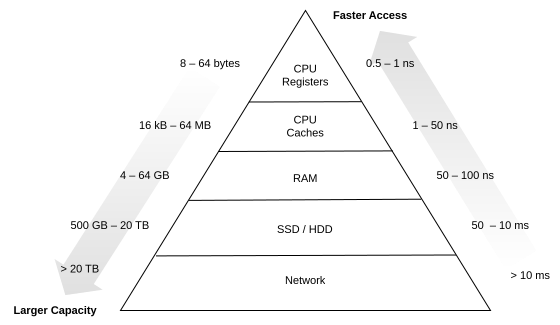
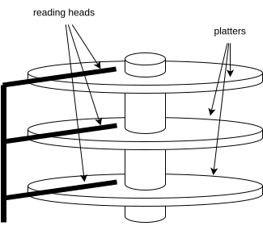
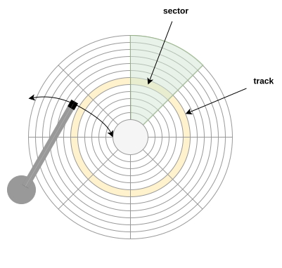
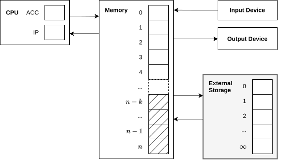

=======
B-Trees
=======

:Lecture: Lecture 5.5 :download:`(slides) <_static/btrees.pptx>`
:Objectives: Understand what is a B-tree, and how and when it helps
             reduce disk usage
:Concepts: Disk-access Model (DAM), B-Tree principle, insertion and
           deletion in a B-Tree

           
External Storages
=================

So far, our assumption has been that our algorithms execute on the
:doc:`RAM </foundations/ram>`: A machine with a CPU, an I/O device and
an infinite amount of memory. RAM is *a gross simplification*: A real
computer has only a limited amount of memory available. This memory is
organized into various layers.

The Memory Hierarchy
--------------------

As shown on
:numref:`trees/btree/memory`, the faster are the tiny CPU registers
with lightning fast access. Further away from the CPU are the caches
(L1, L2 and L3) with larger capacity but longer access time. Even
further are the RAM, then the hard drive, and finally other remote
storages. The rule is that the further away from the CPU, the slower,
but the larger.

   The menory hierarchy: From fast tiny CPU registers to slow but
   large external storages

Example: Hard Disk Drives
-------------------------

.. margin::

   .. figure:: https://upload.wikimedia.org/wikipedia/commons/thumb/c/ca/Apertura_hard_disk_04.jpg/1920px-Apertura_hard_disk_04.jpg
      :name: trees/btree/harddrive/photo

      A real hard-drive (from wikipedia)
               
Let's look at an example: The old-fashion *hard disk drive*. On a hard
drive, data are stored on magnetic discs called "platters". Each hard
drive contains many platters mounted on a rotating axis as shown on
:numref:`trees/btree/hard_drive`. Separate *reading head* can read
from the platter.

   High level structure of a hard disc: Multiple "platters" mounted on
   a rotating axis.

Each platter is divided concentric circles called *tracks*, and each
track is divided into *sectors*. The basic read-write unit is the
sector, which represents generally 512 bytes. The reading arm can move
from the center of the disk to the outside, and as the disk can also
rotate, this enables reading every sector. Note that the reading heads
of the different platters are not independent and one cannot move one
head without also moving the other ones. The disk firmware decides how
the data are written to the different platters.

   Subdivisions of a platter into tracks and sectors

The challenge with accessing hard drives is the necessary mechanical
motions. The firmware convert the "logical address" into "physical
address" and control the reading head and the rotation of the disks
accordingly. There is two steps:

#. Moving the arm and disks to the desired track. The is the
   "seek time",

#. Once the reading head are the right track, the disk must rotate to
   bring the right sector under the head: This is the rotational
   delay.

#. Reading the data at from the sector(s), the read time or transfer
   time.
   
These delays add up and results in the very large latency between a
CPU register, in nanoseconds and hard drive in milliseconds. The ratio
is the same a between a sludge and F16 aircraft.

The Disk-access Model (DAM)
===========================

The memory hierarchy of a real computer is very complex and not
relevant for the design of algorithms and data structure. To reason
about algorithms and data structure that exploits an external storage,
we use the *disk access model* (DAM).

When using the DAM, the objective is to design algorithms that
minimize the number of disk accesses, because they take much longer
than regular "main memory" accesses.

.. important::

   The disk-access model is only useful to reason about algorithms that uses
   an external storage such as database engines.

   The disk-access model: Adding an external storage to the RAM
            
            
:numref:`trees/btree/dam` shows the DAM architecture. It closely
resembles the RAM, except for

- The memory is not infinite. We only have :math:`n` memory cells

- The system is equipped with an external storage, an additional memory
  of infinite capacity.

- The CPU cannot directly access this storage: It has to load *blocks*
  into a dedicated area of memory of :math:`k` cells, `(from cell
  :math:`n-k` to :math:`n`) using specific instructions ``READ_BLOCK``
  and ``WRITE_BLOCK``.

The DAM reuse all the instruction from the RAM, but adds two new ones,
namely ``READ_BLOCK`` and ``WRITE_BLOCK``, that move data between the
memory and the external
storage. :numref:`trees/btree/dam/instructions` below summarizes them,
along with the cost model.

.. list-table:: The DAM instruction set
   :name: trees/btree/dam/instructions
   :widths: 10 25 50 10
   :header-rows: 1

   * - Code
     - Instruction
     - Description
     - Cost
   * - 1
     - ``LOAD <constant>``
     - Set the ``ACC`` register with the given constant
     - 0
   * - 2
     - ``ADD <address>``
     - Add the value contained at the given address to the ``ACC``
       register
     - 0
   * - 3
     - ``SUB <address>``
     - Subtract the value contained at the given address from the ``ACC``
       register
     - 0
   * - 4
     - ``STORE <address>``
     - Write the content of the ``ACC`` register into the memory at
       the given address
     - 0
   * - 5    
     - ``PRINT <address>``
     - Send the value contained at the given address to the I/O device
       for display
     - 0
   * - 6
     - ``READ <address>``
     - Read a value from the I/O device and stores it in memory at the
       given address
     - 0
   * - 7
     - ``JUMP <address>``
     - Set the ``IP`` register with the given address, if and only if
       the ``ACC`` register contains 0.
     - 0
   * - 8
     - ``READ_BLOCK <address>``
     - Load a :math:`k`-block from the external storage to the
       memory. The block is written in at a fixed location at the end
       of the memory, from memory cell :math:`n-k` to cell :math:`n`.
     - **1**
   * - 9
     - ``WRITE_BLOCK <address>``
     - Write the last :math:`k`-cells of memory to the external
       storage at the given address.
     - **1**
   * - 10
     - ``HALT``
     - Stop the machine
     - 0

Traditionally, the cost model associated with the DAM is that all
instructions cost nothing, except those that access the external
storage. This reflect the fact that difference of access time is so
huge, that we can consider all CPU computation as free and focus on
minimizing the number of external storage accesses.

B-Tree
======

The B-tree (shorthand for *broad* or *balanced* tree) is probably the
most common data-structure optimized for disk access. It is used by
many database engines to implement indexes.

- What is a B-tree: a n-ary search tree. It is very similar to the
  BST, but each node can have up to :math:`k` children

- B-trees are self-balancing

- Each node is as large as a block and can be read or written in one
  disk access.

- Rules of the B-tree
  
  
File-based Data Structure
-------------------------

- The file layout
  
- Address to file offset in bytes

  

Search
------

Insertion
---------

Deletion
--------
