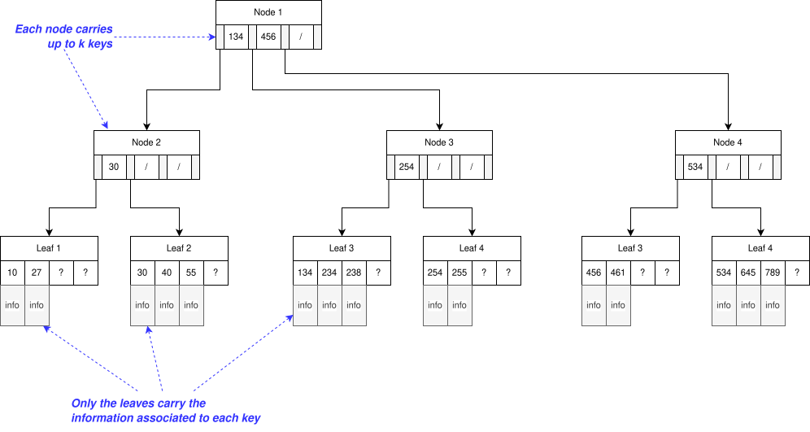
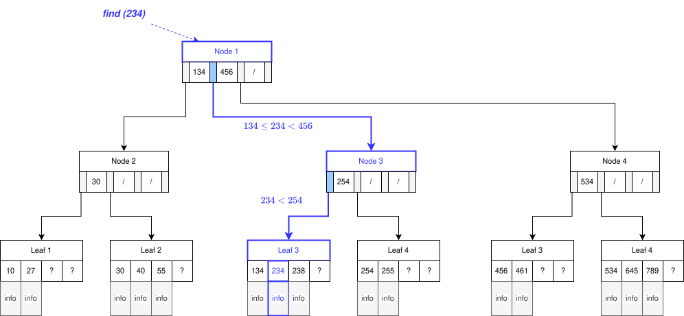
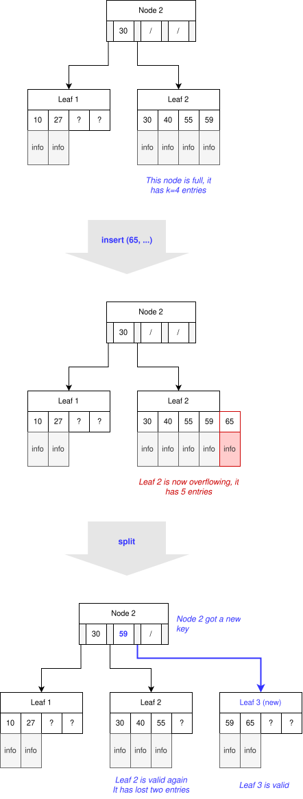
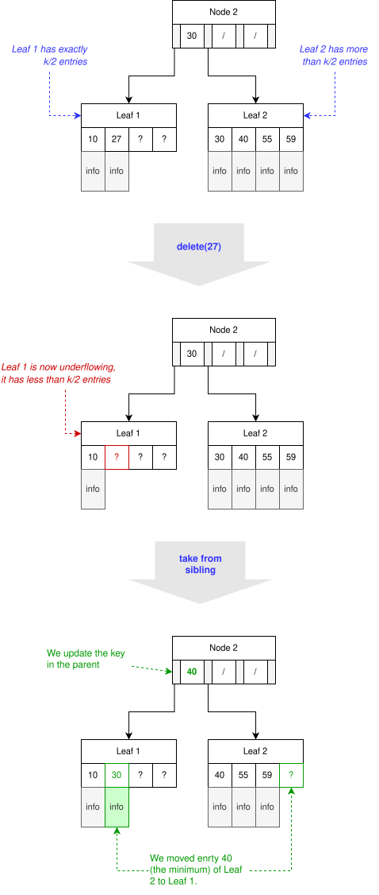
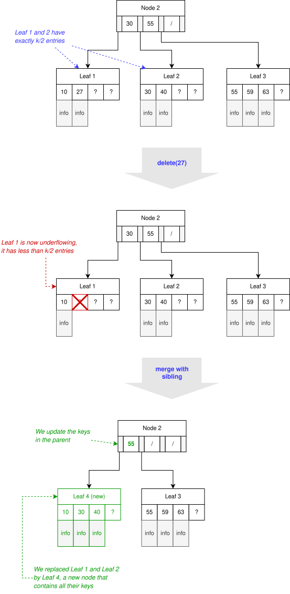

=======
B-Trees
=======

:Lecture: Lecture 5.5 :download:`(slides) <_static/btrees.pptx>`
:Objectives: Understand what is a B-tree, and how and when it helps
             reduce disk usage
:Concepts: Disk-access Model (DAM), B-Tree principle, insertion and
           deletion in a B-Tree
:Implementation: in Ruby :download:`btree.rb <_static/code/btree.rb>`

           
External Storages
=================

So far, our assumption has been that our algorithms execute on the
:doc:`RAM </foundations/ram>`: A machine with a CPU, an I/O device and
an infinite amount of memory. Remember however that this is *a gross
simplification*: A real computer has only a limited amount of memory
available. This memory is organized into various layers.

The Memory Hierarchy
--------------------

As shown on :numref:`trees/btree/memory`, the faster are the tiny CPU
registers with lightning fast access. Further away from the CPU are
the caches (L1, L2 and L3) with larger capacity but slightly longer
access time. Even further are the RAM, then the hard drive, and
finally other remote storages. The rule is that the further away from
the CPU, the slower, but the larger.

.. figure:: _static/images/memory_hierarchy.svg
   :name: trees/btree/memory

   The menory hierarchy: From fast tiny CPU registers to slow but
   large external storages

Example: Hard Disk Drives
-------------------------

.. margin::

   .. figure:: https://upload.wikimedia.org/wikipedia/commons/thumb/c/ca/Apertura_hard_disk_04.jpg/1920px-Apertura_hard_disk_04.jpg
      :name: trees/btree/harddrive/photo

      A real hard-drive (from wikipedia)
               
Let's look at an example: The old-fashion *hard disk drive*. On a hard
drive, data are stored on magnetic discs called "platters". Each hard
drive contains many platters mounted on a rotating axis as shown on
:numref:`trees/btree/hard_drive`. A separate *reading heads* can read
from each platter.

.. figure:: _static/images/hard_disk.svg
   :name: trees/btree/hard_drive

   High level structure of a hard disc: Multiple "platters" mounted on
   a rotating axis.

Each platter is divided into concentric circles called *tracks*, and
each track is divided into *sectors*. The basic read-write unit is the
sector, which represents generally 512 bytes. The reading arm can move
from the center of the disk to the outside, and as the disk can also
rotate, this enables reading every possible sector. Note that the
reading heads of the different platters are not independent and one
cannot move one head without also moving the other ones. The disk
"firmware" decides how the data are written to the different platters.

.. figure:: _static/images/platter.svg
   :name: trees/btree/platter

   Subdivisions of a platter into tracks and sectors

The challenge with accessing hard drives is the necessary mechanical
motions. The firmware converts the "logical address" (i.e. known by
the machine/OS) into a "physical address" (only known by the firmware)
and controls the reading head and the rotation of the disks
accordingly. There is two steps:

#. Move the arm and disks to the desired track. The is the "seek
   time",

#. Once the reading heads are the right track, the disk must rotate to
   bring the right sector under the head: This is the rotational
   delay.

#. Reading the data at from the sector(s), the read time or transfer
   time.
   
These delays add up and results in the very large latency, which
explains the huge difference between a CPU register, whose access is
in nanoseconds and a hard drive, whose access is in milliseconds. The
ratio is the same a between a sludge and F16 aircraft.

The Disk-access Model (DAM)
===========================

The memory hierarchy of a real computer is very complex and not
relevant for the design of algorithms and data structure. To reason
about algorithms and data structure that exploits an external storage,
we use the *disk access model* (DAM).

When using the DAM, the objective is to design algorithms that
minimize the number of disk accesses, because they take much longer
than regular "main memory" accesses.

.. important::

   The disk-access model is only useful to reason about algorithms
   that uses an external storage such as database engines.

   
.. figure:: _static/images/dam.svg
   :name: trees/btree/dam

   The disk-access model: Adding an external storage to the RAM
            
            
:numref:`trees/btree/dam` shows the DAM architecture. It closely
resembles the RAM, except for

- The memory is **not** infinite. We only have :math:`n` memory cells

- The system is equipped with an external storage, an additional
  memory. Only this additional memory has an infinite capacity.

- The CPU cannot directly access this external storage: It has to load
  *blocks* into a dedicated area of memory of :math:`k` cells, `(from
  cell :math:`n-k` to :math:`n`) using specific instructions
  ``READ_BLOCK`` and ``WRITE_BLOCK``.

The DAM uses all the instruction from the RAM, but adds two new ones,
namely ``READ_BLOCK`` and ``WRITE_BLOCK``, that move data between the
memory and the external
storage. :numref:`trees/btree/dam/instructions` below summarizes them,
along with the cost model.

.. list-table:: The DAM instruction set
   :name: trees/btree/dam/instructions
   :widths: 10 25 50 10
   :header-rows: 1

   * - Code
     - Instruction
     - Description
     - Cost
   * - 1
     - ``LOAD <constant>``
     - Set the ``ACC`` register with the given constant
     - 0
   * - 2
     - ``ADD <address>``
     - Add the value contained at the given address to the ``ACC``
       register
     - 0
   * - 3
     - ``SUB <address>``
     - Subtract the value contained at the given address from the ``ACC``
       register
     - 0
   * - 4
     - ``STORE <address>``
     - Write the content of the ``ACC`` register into the memory at
       the given address
     - 0
   * - 5    
     - ``PRINT <address>``
     - Send the value contained at the given address to the I/O device
       for display
     - 0
   * - 6
     - ``READ <address>``
     - Read a value from the I/O device and stores it in memory at the
       given address
     - 0
   * - 7
     - ``JUMP <address>``
     - Set the ``IP`` register with the given address, if and only if
       the ``ACC`` register contains 0.
     - 0
   * - 8
     - ``READ_BLOCK <address>``
     - Load a :math:`k`-block from the external storage to the
       memory. The block is written in at a fixed location at the end
       of the memory, from memory cell :math:`n-k` to cell :math:`n`.
     - **1**
   * - 9
     - ``WRITE_BLOCK <address>``
     - Write the last :math:`k`-cells of memory to the external
       storage at the given address.
     - **1**
   * - 10
     - ``HALT``
     - Stop the machine
     - 0

Traditionally, the cost model associated with the DAM is that all
instructions cost nothing, except those that access the external
storage. This reflect the fact that difference of access time is so
huge, that we can consider all CPU computation as free and focus on
minimizing the number of external storage accesses.

B-Trees
=======

The B-tree (shorthand for *broad* or *balanced* tree) is probably the
most common data structure designed to minimize disk accesses. It is
used by many database engines to implement indexes for instance.

The Structure of a B-tree
-------------------------

Like the :doc:`binary search tree (BST) </trees/bst>`, a B-tree
implements the ordered set ADT. That is, a B-tree represents a set of
things ordered in some predefined ways. A *time series* (a set of
observations indexed by time/date) a good example of ordered set. If
we were measuring the temperature, we could get something like
:numref:`tress/btrees/temperature`. These temperature readings a
naturally ordered by time but there cannot be two average temperature
at the same day: It is an ordered set.

.. csv-table:: A sample time series, showing daily average temperature
  :header: "Date", "Temperature"
  :widths: 10, 5
  :name: trees/btrees/temperature

  "Sep. 12 2024", "15 °C"
  "Sep. 13 2024", "14.5 °C"
  "Sep. 16 2024", "9.3 °C"
  "Sep. 17 2024", "10.7 °C"

In a B-tree each node has a limited number of children: Up to a chosen
value :math:`k`. :numref:`trees/btree/structure` shows an example
where :math:`k=4`. Note that only the leaf nodes carry actual
information (e.g., temperatures in our previous example), the other
nodes only have :math:`k-1` keys.

Just like for a BST, the children nodes in a B-tree obey a n ordering
rules. Consider a node that has :math:`k` keys :math:`K = (k_1, k_2,
\ldots, k_n)`. Its children nodes :math:`(n_1, n_2, \ldots, n_{n+1})`
are organized such that the node :math:`n_i` at position :math:`i`
only carries keys :math:`k'` such that :math:`k_{i-1} \leq k' < k_{i}`.
  

   The structure of B-tree, where :math:`k = 4`

For instance, :numref:`trees/btree/structure` shows a B-tree with where the
root has two keys, namely 134 and 456. The first children (Node 2)
contains all the keys up to 134, whereas the second child (Node 3),
contains all the keys up to 456, and the third children all the keys
larger than that.
   
.. important::

   B-tree is a generalization of the concept of binary search trees, a
   kind of "n-ary" search tree. There are two key differences,
   however:

   1. In a B-tree, each node has at most :math:`k` children, whereas a
      node has at most 2 children in a BST. These children are
      "separated" by :math:`k-1` keys, as opposed to one single key in
      a BST. If :math:`k=2`, then a B-tree becomes a BST (at least for
      the search part).

   2. In a B-tree, only the leaf nodes carry information. The internal
      nodes do not, but only carry (or compute) keys.

What value for :math:`k`?
  How can we decide how many keys/children a node can have at most?
  Recall a B-tree is designed to minimize the number of disk
  accesses. To do that we will choose a value k such that :math:`k`
  keys can be loaded from the external storage in one instruction
  (i.e., `READ_BLOCK`). This way, when traversing the tree, we will
  only triggers as many `READ_BLOCK` as there are levels in the
  tree. More formally, if the tree contains :math:`n` entries, we will
  only need :math:`log_k(n)` disk accesses. The direct consequences is
  that B-tree have a large branching factor and are shallow, with a
  few levels as possible.
  
Search
------

The search in a B-tree closely resembles searching in a BST. The
difference is that at, each node, we have to "locally" search which of
the children contains the key of interest.

In a nutshell, the search algorithm goes as follows:

1. Start at the root node.

2. Search among the children for the one key range contains the
   desired key.

3. a) If that child is a leaf node,

      - search among the available entry for one whose key matches the
        target. If the key cannot be found, they the given key is not
        in the ordered set.

   b) Otherwise the node is a "branch" (i.e., an internal node)

      - We continue searching from that node (see Step 2)

   Searching for a value in a B-tree. From the root, we go down the
   tree, following the children whose key range contains the target
   key.

.. admonition:: Ruby Implementation
   :class: dropdown, hint

   There are many ways to implement a B-tree, depending especially on
   how we implement the keys. In the following, I show a simpler but
   not really efficient solution, where the keys are computed from the
   children not (as their minimum/maximum)

   .. code-block:: ruby

      class Branch < Node

         def find(key)
           branch, index = pick_branch(key)
           return branch.find(key)
         end

         # Search for the first child whose minimum is strictly greater than
         # the given key. Return both the branch and its index
         private
         def pick_branch(key)
           index = @branches.find_index{| b | b.minimum_key > key }
           if index.nil?
             return @branches.last, @branches.count - 1
           elsif index == 0
             return @branches.first, index
           else
             return @branches[index-1], index-1
           end
         end

      end

      
      class Leaf < Node

        def find(key)
          match = @entries.find{|e| e.key == key}
          if match.nil?
             return nil      
          else 
             return match.item 
          end
        end

      end

Insertion
---------

The insertion in a B-tree also resembles the insertion in a BST, but...

.. important::

   A B-tree is a self-balancing tree (as is the :doc:`AVL tree
   </trees/avl/index>`) and that's where the resemblance stops. To
   ensure a B-tree remains "balanced" we enforce the following
   constraint:

   - Every node (except the root node) must have no less than
     :math:`\lfloor k/2 \rfloor` children.

   Every insertion and deletion must guarantee that this constraint is
   satisfied, for the tree to remain balanced.
  

To insert a new entry in a B-tree, we proceed as follows:

1. We start at the root node.

2. We search for a child whose key range contains the new key to insert

3. a. If that child is a leaf node

      - We insert into that node a new entry

   b. Otherwise,

      - We continue inserting from that child (see Step 2)

4. If the node where we have inserted is "overflowing" (i.e., it has
   :math:`k+1` children), we split it in two. 

:numref:`trees/btree/split` illustrates how we can split a node that
overflows. We consider here a small B-tree (:math:`k=4)` where the
root directly contains two leaves, namely Leaf 1 and Leaf 2. Before
the insertion, Leaf 2 is "full" as it already contains four
entries. We now insert a new entry :math:`(65, \dots)`. It lands in
Leaf 2, which now has 5 entries. It is overflowing after this
insertion, we must re-balance the tree and ensure every node has no
more than 4 children (or entries for leaf nodes).

To fix this issue, we split Leaf 2 in two, by moving half of its
entries into a new node (Leaf 3). Consequently, we add a new key (59)
to the root (Node 2) so that it knows the key range of that new
node. Every nodes has between 2 and 4 children, as it must be.

Note that the parent, who gets a new child, may overflow as well and
the "splitting" may propagate all the way to the root of the tree.

   Splitting a node that overflows. Here we split a leaf node that has
   two many entries.

.. admonition:: Ruby Implementation
   :class: dropdown, hint

   In the code example below, we can detect an overflow by simply
   comparing the "size" of the node with its capacity. The node
   overflows whenever its size exceeds its capacity.

   For the leaves, the need to preserve the ordering of entries with
   respect to their key. So inserting a new entry requires finding the
   correct insertion position.

   The splitting is simply to create two new nodes, each containing
   half of the entries.

   
   .. code-block:: ruby

      class Node

        def is_overflowing
          size > @capacity
        end

      end
                   
      class Leaf < Node

         def insert(key, item)
           index = 0
           inserted = false
           until inserted or index >= @entries.count
             entry = @entries[index]
             if entry.key > key
               @entries.insert(index, Entry.new(key, item))
               inserted = true
             end
             index += 1
           end
           @entries.push(Entry.new(key, item))
         end
      
        def split
          raise RuntimeError.new("Not overflowing") unless is_overflowing
          half = @entries.count / 2
          return Leaf.new(@capacity, @entries.take(half)),
                 Leaf.new(@capacity, @entries.drop(half))
        end
      
      end

   When inserting into a branch, we must check whether the insertion
   made the node overflow. In that case, we trigger the split
   operation, as shown below.
      
   .. code-block:: ruby
                   
      class Branch < Node

        def insert(key, item)
          branch, index = pick_branch(key)
          branch.insert(key, item)
          if branch.is_overflowing
            left, right = branch.split
            @branches[index,1] = [left, right]
          end
        end

        def split
          if not is_overflowing
            raise RuntimeError.new("Only split when overflowing!")
          end
          half = @branches.count / 2
          return Branch.new(@capacity, @branches.take(half)),
                 Branch.new(@capacity, @branches.drop(half))
        end

      end

   
Why Is This Correct?
   How can we show the tree is always balanced after an insertion. As
   often we can show that by induction over a series of
   insertions. Let's start the *base case*, where the tree is
   empty. We will then look at the non-empty case, right after.

   When the tree is empty, its root is a leaf node that contains no
   entry. This is valid, because only the root node is allowed to have
   less than :math:`k/2` entries. In that case, the insertion add a
   new entry and the root node now has a single entry.

   If the tree is not empty, we know the insertion will necessarily
   first add an entry to a leaf node, say :math:`n`, (only leaf node carry
   entries). There are several scenarios here:

   - This node :math:`n` is the root has room for another entry (it
     has at most :math:`k-1` entries). The tree is still valid with
     new entry.

   - This node is already full, then the insertion makes it
     overflow. The node necessarily ends up with :math:`k+1` entries
     and gets split in two valid nodes, with less than :math:`k/2`
     entries [#split]_. What could happen is that its parent, who get
     a new node, may also overflow consequently, and will get split as
     well. This splitting process can cascade all the way to the top,
     where the root node get split too, in which case a new parent is
     created to gather two nodes.

   Since the insertion adheres to the constraint when the tree is
   empty and also preserves it whenever it held before the insertion,
   we can conclude that the insertion guarantees the every node will
   have no more than :math:`k` children/entries.

.. [#split] Note that if a node has :math:`k+1` entries, splitting it
            in two non empty nodes necessarily yields two nodes with
            less than ::math:`k`, since

            .. math::
               \bigg\lceil \frac{k+1}{2} \bigg\rceil \leq k

How Efficient Is It?
   We see that to insert a node in a B-tree, we must first locate the
   leaf node that will carry the new key-value pair. This process
   requires checking all the nodes along the single path from the root
   to that leaf node. There will therefore be :math:`O(\log_k(n)`
   read-accesses, in order to load these nodes from the external
   storage. Possibly these nodes may be split and written back to the
   storage, which would cost another :math:`\log_k(n)`
   write-accesses. Altogether, we get:

   .. math::
      O(\log_k(n)) + O(\log_k(n)) = O(\log_k(n))

Deletion
--------

To delete an entry in a B-tree, we will have to make sure that every
node in the tree keeps at least
:math:`\big\lfloor\frac{k}{2}\big\rfloor` children/entries.

To delete a key :math:`k`, we proceed as follows:

1. We start at the root node.

2. We search for a child whose key range contains the new key to insert

3. a. If that child is a leaf node, but does *not* contain the key :math:`k`

      - The key is not in the set

   b. If that child is a leaf and does contain the key :math:`k`

      - We search locally and remove the corresponding entry

   b. Otherwise (from internal nodes),

      #. We delete from that child (see Step 2)

      #. If that child is now "onderflowing" (i.e., it has strictly less than
         :math:`\big\lfloor\frac{k}{2}\big\rfloor` children)

         a. If that child has a preceding/following sibling :math:`s`
            with some extra keys

            - We take a key from that sibling node. If the sibling
              :math:`s` is on the left we take its largest key, if it is
              on the right, we take its minimum key.

         b. Otherwise

            - If all siblings have exactly
              :math:`\big\lfloor\frac{k}{2}\big\rfloor` children, we
              merge with either the preceeding or the following
              sibling. The original child and its merged sibling are
              deleted, and a new node with all their keys replace them.

Let see examples of this deletion procedure. There are two main
scenarios: Either we can "steal a node" from a sibling or we merge
with a sibling.

   Fixing underflowing nodes by stealing a key from a sibling. Here we
   steal the minimum key of the following sibling.

:numref:`trees/btree/borrow` illustrates the process of stealing a key
from the siblings. Again we assume a B-tree, where :math:`k = 4`. At
the start, Node 2 (the root) has two children, name Leaf 1 and
Leaf 2. Leaf 1 has exactly :math:`\big\lfloor\frac{k}{2}\big\rfloor =
2` node, whereas Leaf 2 has 4 keys. We then delete key 27, which is
carried by Leaf 1, who is left with a single key now, and therefore
breaks the B-tree rule.

To repair this, we can steal from the following sibling since it has
some extra keys. We thus steal the minimum key [#stealing]_. As a
result, Leaf 1 has 2 keys, and Leaf 2 has 3, and both adhere to the
constraint of the B-tree. Note also that key that separate Leaf 1 from
Leaf 2 in Node 2 has been updated.

.. [#stealing] We would have stolen the minimum if we had borrowed from
               the preceding sibling.

Let's now look at an example where we merge with a sibling node (Step
3.b.2.b), as shown on :numref:`trees/btree/merge` below.

   Fixing underflowing nodes by merging with a sibling node.

We start with a root node that contains three leaves: Leaf 1 and Leaf
2 have exactly :math:`\frac{k}{2}`, whereas Leaf 3 has three
keys. Now, we delete key 27, which is carried by Leaf 1. As a result,
Leaf 1 is underflowing because it has now only 1 key.

To fix that, we cannot steal from sibling nodes. Leaf 1 has only one
sibling, Leaf 2, who has no extra key. Our only solution is thus to
merge Leaf 1 and Leaf 2 [#merging]_. That gives us a new node, Leaf 4,
with 3 keys (one from Leaf 1 and the two from Leaf 2). We update the
key recorded in the parent (Node 2) and we are done. Node that by
merging two nodes, the parent looses one child and may therefore
underflow as well. In the worst case, the merging process cascade all
the way to the root, which is the only node allowed to have less than
:math:`\big\lfloor\frac{k}{2}\big\rfloor` children.

.. [#merging] Since we only merge node that have exactly
              :math:`\big\lfloor\frac{k}{2}\big\rfloor` keys, we
              cannot end up with new node that have more than
              :math:`k` keys

.. admonition:: Ruby Implementation
   :class: dropdown, hint

   Let see how we could implement that in Ruby. First we need to add a
   couple of capabilities on all nodes,

   .. code-block:: ruby

      class Node

        def remove(key)
          raise "Error: Abstract method"
        end

        def has_extra
           return sice > minimum_size
        end

        def minimum_key
          raise "Error: Abstract method"
        end

        def maximum_key
          raise "Error: Abstract method"
        end

        def merge_with(other_node)
          raise "Error: Abstract method"
        end

        def take_maximum_from(node)
          raise "Error: Abstract method"
        end

        def take_minimum_from(node)
          raise "Error: Abstract method"
        end
      
      end

   Let's start with the leaf node. Deleting in a leaf node boils down
   to searching the key locally and deleting it if it exist. Note that
   most all the operation we defined are called by the parent node
   (see further down the Branch class implementation)

   .. code-block:: ruby

      class Leaf < Node

        def minimum_key
          if is_empty
            raise RuntimeError.new("Empty leaf has no minimum key")
          end
          return @entries.first.key
        end

        def maximum_key
          if is_empty
            raise RuntimeError.new("Empty leaf has no maximum key")
          end
          return @entries.last.key
        end

        def remove(key)
          @entries.reject!{|e| e.key == key }
        end

        def merge_with(other)
          if other.is_underflowing or self.is_underflowing
            return Leaf.new(@capacity, @entries + other.entries)
          end
          raise "Neither node is underflowing"
        end

        def take_maximum_from(node)
          unless node.is_a?(Leaf)
            raise "A leaf can only take from another leaf"
          end
          @entries.insert(0, node.maximum_entry)
        end

        def take_minimum_from(node)
          unless node.is_a?(Leaf)
            raise "A leaf can only take from another leaf"
          end
          @entries.push(node.minimum_entry)
        end
      end

   Let's now turn to the internal nodes (the ``Brancj`` class), which
   implements these operation as follows:

   .. code-block:: ruby

      class Branch < Node

        def remove(key)
          branch, index = pick_branch(key)
          branch.remove(key)
          if branch.is_underflowing
            repair_underflow(branch, index)
          end
        end

        private
        def repair_underflow(underflowing, index)
          preceding, following = siblings_of(index)
          if preceding and preceding.has_extra
            underflowing.take_maximum_from(preceding)
          elsif following and following.has_extra
            underflowing.take_minimum_from(following)
          elsif preceding
            @branches[index-1, 2] = preceding.merge_with(underflowing)
          elsif following
            @branches[index, 2] = underflowing.merge_with(following)
          else
            raise "Could not merge with or take from either side"
          end
        end

        private
        def siblings_of(index)
          if index == 0
            return nil, @branches[index+1]
          elsif index == @branches.count - 1
            return @branches[index-1], nil
          else
            return @branches[index-1], @branches[index+1]
          end
        end

        def take_minimum_from(node)
          unless node.is_a? Branch
            raise "Can only take from another Branch node!"
          end
          @branches.push(node.branches.shift)
        end

        def take_maximum_from(node)
          unless node.is_a? Branch
            raise "Can only take from another Branch node?"
          end
          @branches.insert(0, node.branches.pop)
        end

        def merge_with(other)
          return Branch.new(capacity, branches + other.branches)
        end

      end
                    
Why Is This Correct?
  What would be a correct deletion procedure? It has to obey the
  specifications of the deletion in an :doc:`Ordered set ADT
  </foundations/trees/bst>`, but also has to guarantee that it does
  not break the b-tree constraint: Every node but the root must have
  at least :math:`\big\lfloor\frac{k}{2}\big\rfloor`
  entries/children.

  Let see why the later hold. We assume that before the deletion, all
  nodes have at least :math:`\big\lfloor\frac{k}{2}\big\rfloor`
  entries/children. Our deletion procedure starts by locating the
  leaf that carries the entry to delete. Initially it therefore
  affects only one leaf node.

  If that leaf node is the root, and the root underflows, the rule is
  not broken because only the root node is allowed to have less than
  :math:`\big\lfloor\frac{k}{2}\big\rfloor` entries.

  If it is not the root, the parent node checks and corrects any
  underflow situation. If a key is stolen from a sibling, then
  nothing else happen and the tree is left in a valid state. With the
  node is merged with either of its preceding or following sibling,
  the parent node looses a key and may underflow as well.  If that
  happens, there are two cases

  a) If the parent is the root node, then the underflow does not
     matter has it is allowed to have less than
     :math:`\big\lfloor\frac{k}{2}\big\rfloor` children.
      
  b) If the parent is an internal node, then its own parent detects
     and correct the underflows, which can either be resolved by
     stealing from or merging with sibling nodes. In the worst case,
     the merging process cascade all the way up to the root node,
     which is allowed to underflow.

How efficient is it?
  In the worst case, the entry we delete makes the leaf node
  underflows and that leaf has no sibling with extra keys from which
  we could steal, so we have merge. Worse, this merge makes the parent
  underflow as well, and this merging process cascade all the way up
  to the root node.

  So to locate the leaf node, we will have to load from the external
  storage all the nodes that are along the path from the root to the
  leaf that carries the target key. That is as many nodes as there are
  levels in the tree, so :math:`O(\log_k(n)` ``READ_BLOCK``
  instructions. Besides, at all levels, a node underflows and must be
  merged with one of its siblings. So at every level a node has to be
  updated and written back to the external storage, that is another
  :math:`O(\log_k(n)` ``WRITE_BLOCK`` instructions. Altogether that
  gives us a total of :math:`O(\log_k(n)` disk accesses.`

..  
  File-based Data Structure
  =========================

  - The file layout

  - Address to file offset in bytes

