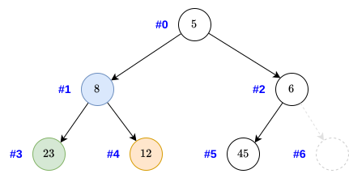
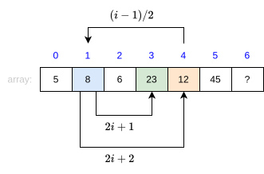
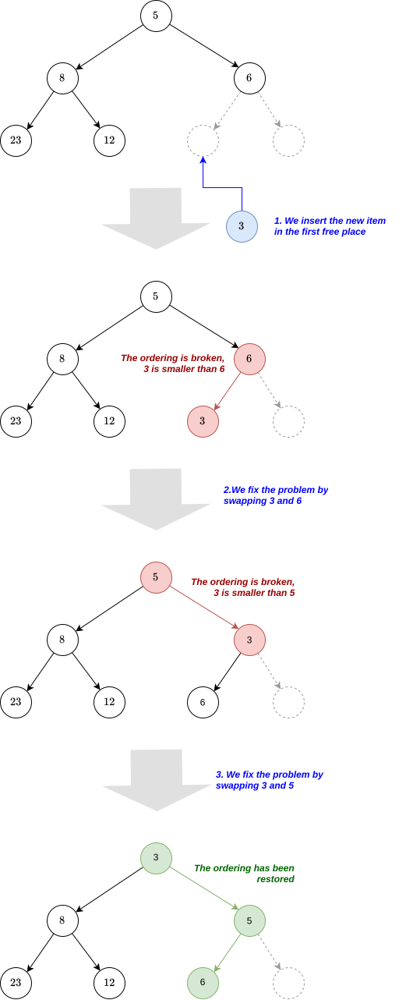
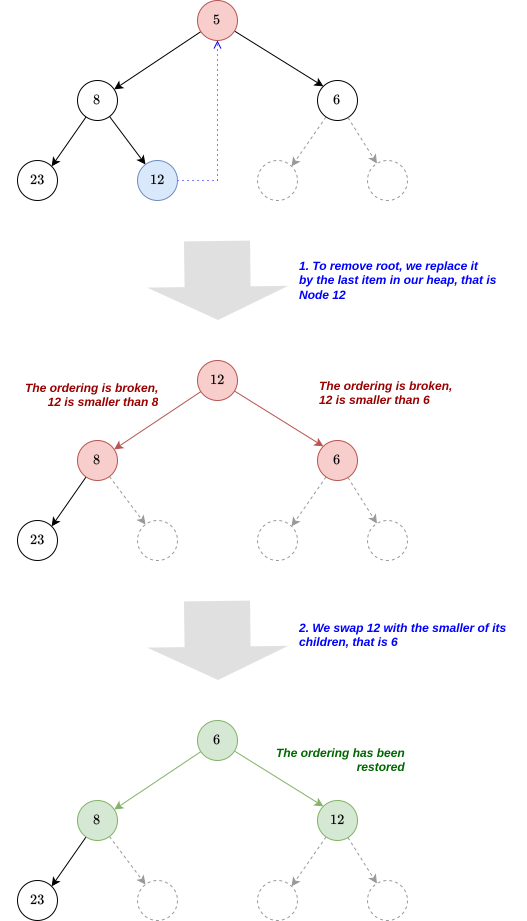
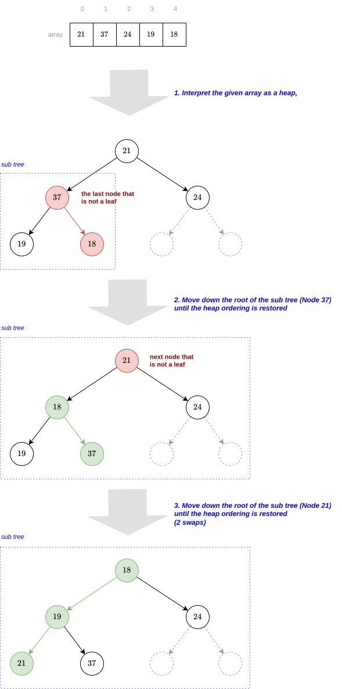

============
Binary Heaps
============

:Lecture: Lecture 5.3 :download:`(slides) <_static/heaps.pptx>`
:Objectives: Understand how to implement a priority queue using binary heap
:Concepts: Priority queue ADT, insertion, minimum extraction,
           "heapification".
:Implementation: Ruby :download:`heap.rb <_static/code/heap.rb>`

We explore here the "binary heap", a tree structure use to implement
the priority queue ADT. Binary heap are also a classical example of
tree implemented using an array underneath. We also take a brief look
at the *heap sort* algorithm: An alternative to :doc:`merge sort
</recursion/merge_sort>` and :doc:`quick sort </recursion/quick_sort>`
that uses a binary heap.

The Priority Queue ADT
======================

We looked at the Queue ADT in :doc:`Lecture 2.6
</sequences/stacks>`. Queues follow a first-in-first-out policy
(FIFO), like the queue of persons waiting at the cashier in the
supermarket. By contrast, the *priority queue* we will study now
orders its items according to a given priority. This resembles the
*triage area* in a hospital, where patients are sorted according to the
severity of their condition. Patients that cannot wait will be treated
first, regardless on when they have arrived. Here the severity is the
priority.

There are two kinds of priority queue:

- *maximum priority queue*, where items are returned by decreasing
  priority, that is, the highest priority comes first.

- *minimum priority* queue where items are returned by ascending
  priority, that is, the lowest priority comes first.

Intuitively, a priority queue maintains order. Consider the following
minimum queue :math:`q = ((1,A), (5,D), (7, B))`. There are three main
operations on priority queue, which we will detail shortly.

.. module:: pq

.. function:: create() -> PQueue 

   Create an empty priority queue, denoted as :math:`q`. 

   Preconditions:
      None

   Postconditions:
    - The resulting queue :math:`q` is empty, that is

      .. math::
         q = create() \implies size(q) = 0 \, \land \, \nexists (i, p), \, contains(q, i, p)
    
    
.. function:: enqueue(q: PQueue, i: Item, p: Priority) -> PQueue

   Add the given item :math:`i` to the queue :math:`q` with the given
   priority :math:`p`. For instance, if :math:`q = ((1,A), (5,C), (7,
   B))`, adding the Item :math:`D` with priority 2, would yield
   :math:`q'=((1,A), (2,D), (5,C), (7, B))`.

   Preconditions:
     - The given item :math:`i` is not already associated with the
       given priority :math:`p`

       .. math::
          \neg \, contains(q, p, i)

   Postconditions:
     - The queue :math:`q` now contains the given item :math:`i` with the given
       priority :math:`p`, that is

       .. math::
          enqueue(q, i, p) = q' \implies contains(q', i, p)

     - The size of the priority queue has increased by one.

       .. math::

          size(q) = n \land enqueue(q, i, p) = q_2 \implies size(q_2) = n+1

.. function:: peek(q: PQueue) -> Item, Priority

   Returns, but does not remove, the item with the minimum/maximum
   priority. For instance, peeking the first item of the queue
   :math:`q=((1,A),(5,C),(7,B))` would yield :math:`(1,A)` but the
   queue :math:`q` would remain unchanged.

   Preconditions:
    - The given queue :math:`q` is not empty, that is

      .. math::
         size(q) > 0

   Postconditions:
    - The resulting item is necessarily in the given :math:`q`

      .. math::
         peek(q) = (i, p) \implies contains(q, i, p)
   
    - There is no other item in the queue :math:`q` with a strictly
      higher priority, that is:

      .. math::
         peek(q) = (i,p) \implies \nexists \,(i_2, p_2),\; contains(q, i_2, p_2) \,\land\, p_2 > p

         
.. function:: dequeue(q: PQueue) -> PQueue, Item, Priority

   Returns *and removes* the item :math:`i` with the minimum/maximum
   priority. For instance, peeking the first item of the queue
   :math:`q=((1,A),(5,C),(7,B))` would yield :math:`(1,A)` but the
   queue would then be :math:`q = ((5,C), (7,B))`.

   Preconditions:
    - The given queue :math:`q` cannot be empty, that is:

      .. math::
         size(q) > 0

   Postconditions:
    - The resulting item was necessarily in the queue before

      .. math::
         dequeue(q) = (q',i,p) \implies contains(q, i, p)

   
    - The resulting item is no longer in the queue

      .. math::
         dequeue(q) = (q',i,p) \implies \neg \, contains(q', i, p)
         
   
    - The size of queue decreases by one, that is:

      .. math::

         size(q) = n \, \land \, dequeue(q) = (q', i, p) \implies size(q') = n-1
      
    - There is no other item in the queue :math:`q` with a strictly
      higher priority, that is:

      .. math::
         dequeue(q) = (q',i,p) \implies \nexists \,(i', p'),\; contains(q, i', p') \,\land\, p' > p

For the sake of completeness, we also introduce the
:func:`pq.contains` and :func:`pq.size` which we have used to
formalized our ADT.

.. function:: size(q: PQueue) -> Natural

   Returns the number of items currently in the given priority queue
   :math:`q`.

   Preconditions:
     None

   Postconditions:
     None

.. function:: contains(q: Queue, i: Item, p: Priorty) -> Boolean

   Returns true if an only if the given queue :math:`q` contains the
   item :math:`i` with the priority :math:`p`.

   Preconditions:
     None

   Postconditions:
     None
     
What Is a Binary Heap?
======================

The binary heap is the "goto" data structure when it comes to
implementing a priority queue. It gives the following runtime
complexities (in the worst case):

.. list-table:: Comparing different implementation of the priority queue ADT 
   :widths: 50 25 25 25
   :header-rows: 1

   * - Operation
     - Naive Array
     - AVL Tree
     - Binary heap
   * - :func:`pq.enqueue`
     - :math:`O(n)`
     - :math:`O(\log n)`
     - :math:`O(\log n)`
   * - :func:`pq.dequeue`
     - :math:`O(n)`
     - :math:`O(\log n)`
     - :math:`O(\log n)`
   * - :func:`pq.peek`
     - :math:`O(n)`
     - :math:`O(\log n)`
     - :math:`O(1)`

Intuitively, a binary heap is a tree where the smallest or largest
item is at the root. Accessing it is therefore easy but insertion and
deletion both requires moving things around.

       
A binary heap is a binary tree: Every node has *at most* two
children. Yet, not every binary tree is a binary heap. 

.. important::

   To be a binary heap, a tree has to adhere to the following two
   invariants:

   Ordered:
     Every node must carry a key greater than all the key of its
     descendants

   Complete:
      - In a complete binary tree, every level, except the last, must
        be completely filled, and all nodes at the last level must be
        as far *left* as possible
     
Note that the ordering rule varies according to the kind of priority
queue one needs, The one above is to implement a *maximum priority
queue*. To implement a *minimum priority queue*, the node of the heap
must carry a value smaller than those of its descendants.

Ordering
  Consider the two trees shown below. On the left hand side (see
  :numref:`trees/heap/valid_ordering`), the tree is valid because
  every node contains a value that is smaller than all the values of
  its descendants. Contrast this with the right hand side (see
  :numref:`trees/heap/invalid_ordering`) where two nodes violates the
  ordering: Node 8 cannot be a child of node 12, and Node 5 cannot be
  child of Node 6.

  .. list-table:: 
     :widths: 50, 50

     * -
         .. figure:: _static/valid_heap_ordering.svg
            :name: trees/heap/valid_ordering

            A tree that adheres to the (minimum) heap ordering

       -
         .. figure:: _static/invalid_heap_ordering.svg
            :name: trees/heap/invalid_ordering

            A tree that violates the (minimum) heap ordering

Completeness
  As explained above a complete tree but "filled", except
  on the last level. In other words, the paths from the root to every
  leaf should differ in length by at
  least 1. :numref:`trees/heap/complete` illustrates a complete binary
  tree: All levels except the last one are fully filled, and the last
  level is left packed.

  .. figure:: _static/images/complete_tree.svg
     :name: trees/heap/complete

     A complete binary tree: All levels but the last one are fully
     filled, and the last level is left-packed

  Contrast this with :numref:`trees/heap/not_filled` below where the tree is not fully filled
  because we miss a not node at level 2.

  .. figure:: _static/images/not_filled.svg
     :name: trees/heap/not_filled

     This is not a complete binary tree: The tree is not filled

  Compare as well the complete tree (:numref:`trees/heap/complete`)
  with :numref:`trees/heap/not_left-packed` below where the last level
  is not left-packed. There are two nodes (52 and 53) on right hand
  side of missing nodes.
     
  .. figure:: _static/images/not_left_packed.svg
     :name: trees/heap/not_left-packed

     This is not a complete binary tree: The tree is not left-packed
     
              
Binary Heap Using an Array
==========================

Heaps are generally implemented using an array instead of a node-based
data structure, like we did for the binary search tree (BST). To place
the node of the heap tree into an array we will number them from top
to bottom and left to right as shown in
:numref:`trees/heap/numbering`. We then use these number as the index
where we store each node [#numbering]_.

.. [#numbering] This numbering is only possible because of the
                *completeness* invariant, which ensures there is no
                "hole" in the array

   Numbering the nodes of a heap

   
Storing nodes in an array according to this numbering scheme permits
to quickly retrieve either the parent or the children of any node by
computing their indices (see :numref:`trees/heap/representation`). if
a node is a position :math:`i`, then:

- Its parent is at index :math:`(i-1) / 2`
- Its left child is at index :math:`2i + 1`
- Its right child is a index :math:`2i + 2`

   Placing the nodes of a heap into an array, according to indices
   from :numref:`trees/heap/numbering`

.. admonition:: Ruby Implementation
   :class: dropdown, hint

   A simple way to implement an array-based minimum heap in Ruby is to
   create a class that encapsulates a dynamic array. In the snippet
   below, we also define a few helper methods to retrieve the parent,
   the left child, and the right child at any index.

   We can now implement the two queries :func:`pq.contains` and
   :func:`pq.size` we used in our specification.
        
   .. code-block:: ruby
      :linenos:

      class MinimumHeap

        # Create a new heap with the given entries as underlying entries
        def initialize(initial_entries=[])
          @nodes = initial_entries.map{|item, priority| Node.new(item, priority) }
        end

          # Return the number of items in the heap
        def size()
          return @nodes.count
        end

        # Return true if the heap contains the given item associated with
        # the given priority
        def contains(item, priority)
          return @nodes.any? { |e| e.item == item and e.priority == priority}
        end

        # Other methods will come here ...
        
      end

Insertion
---------

To :func:`pq.enqueue` a new item into the heap we proceed as follows:

#. Create a new node that carries both the given item and its priority

#. Append this new node at the end of the array

#. While the new node priority is smaller than the priority of its
   parent

   #. Swap the node :math:`n` and its parent

   #. Return back to Step 3, with the parent as Node :math:`n`

   Adding a new item in the heap by placing it first at then
   "bubbling" it upwards until the heap ordering is restored.

Why Is This Correct? 
   For our algorithm to be correct, we must establish that
   it respects the post-conditions we specified and that it
   preserves the heap-ordering invariant.

   The first postcondition demands that the enqueued item be
   contained. Our :func:`pq.contains` scans the underlying array
   and returns the first pair that matches the item and its
   priority. It therefore picks up the new items if it was not
   there before or possibly an older one if any.

   The second postcondition requires the :func:`pq.size` increase
   by one. Our implementation of the size operation simply returns
   the size of the underlying array. Since we append the given item
   to the underlying array and we do not remove any other item, the
   size increases by one.

   As for the heap-ordering, we fix it by swapping the node with its
   parent if the parent is larger. If the node is smaller than its
   parent, it is also smaller than its siblings, which is necessarily
   larger than the parent (by transitivity). This swap therefore never
   affects the sibling. When the swapping process stops, the node is
   thus necessarily larger than all its ancestors, otherwise it would
   have been swapped further. The node is also smaller than all its
   descendants, otherwise it would not have been swapped that far..

How Efficient Is This?
   In the best case, we append the given item at the end of the
   underlying array, and it does not break the heap ordering. That
   runs in :math:`O(1)`. In the worst case however, we are inserting a
   new "minimum" and this node must to moved all the way up the
   tree. That takes a number of swaps that is proportional to the
   height of the tree, that is, :math:`O(\log_2 n)`.

.. admonition:: Ruby Implementation
   :class: hint, dropdown

   .. code-block:: ruby
      :linenos:
      :emphasize-lines: 6,7

      # Append a new node to the array and move it up until the heap
      # ordering is restored.
      def enqueue(item, priority)
        @nodes.push(Node.new(item, priority))
        node = last_node
        until is_root(node) or is_valid_child(node)
          node = move_up(node)
        end
      end

      # Returns the last node
      private def last_node
        return size - 1
      end

      # Returns true if the given node has no parent, i.e., is the root
      # of the heap
      private def is_root(node)
        return parent_of(node) == nil
      end
      
      # Return true if the node at the given index and its parent adhere
      # to the heap ordering
      private def is_valid_child(node)
        parent = parent_of(node)
        return @nodes[node].priority >= @nodes[parent].priority
      end

      # Swap a the given node with its parent and return its new index
      private def move_up(node)
        parent = parent_of(node)
        swap(node, parent)
        return parent
      end
         
      

Getting the Minimum
-------------------

To check what is the item with the minimum priority, the priority
queue ADT exposes the :func:`pq.peek`, which returns it without
removing it.

We the heap structure, it suffices to return the root node, which is
guaranteed to be the minimum, because of the heap invariant.

Why Is This Correct?
  The first postcondition of the :func:`pq.peek` operation specifies
  that result is necessarily contained in the heap. This is correct as
  we return the first item of the underlying array and our contains
  implementation searches this very array.

  The second postcondition demands that there be no other item with
  higher priority. This is guaranteed by the heap ordering invariant,
  which is enforced by our implementation of the
  :func:`pq.enqueue`. It ensures that the root item has the higher
  priority.
  
How Efficient Is This?
  This is a very efficient operation, which runs in constant time
  :math:`O(1)`. Regardless of how many items are stored in the heap,
  we simply check the size, which takes :math:`O(1)` and then access
  the first entry of the array, which also takes :math:`O(1)`. That
  gives us :math:`O(1) + O(1) = O(1)`.

.. admonition:: Ruby Implementation
   :class: hint, dropdown

   We simply return the first item in the array, checking first that
   there is at least one item in there.

   .. code-block:: ruby
      :linenos:

      def peek()
        abort_if_empty
        return @nodes[0]
      end

      private def abort_if_empty
        if is_empty
          raise "Invalid state: Empty queue"
        end
      end

      # Return true if the there is no item in the heap
       def is_empty
        return size <= 0
      end

      
  
Removal
-------

To implement the :func:`pq.dequeue`, we use the following procedure:

#. Swap the root :math:`r` with the last node :math:`n` (i.e., swap
   the first and the last item of the underlying array)
   
#. Remove :math:`r` (now the last item) and save it for later.
   
#. Restore the ordering:
   
   #. As long as node :math:`n` breaks the heap ordering and has children,
      swap it with the smallest of its children

:numref:`trees/heap/removal` illustrates this process. We first move
the Node 12 as a new root. This breaks the heap ordering because 12 is
greater than both Nodes 6 and 8. To fix that, we swap it with the
smallest of its children, that is 6. Now 6 is a the root, and 12 has
no children. We have restored the heap ordering. We now return the old
root, that is, Node 5.

   Extracting the root from a binary heap. We replace it by the last
   node, which we move down until the ordering is restored

Why Is This Correct?
  Our implementation is correct if and only if we can show that the
  preconditions and the heap ordering holds.

  - The resulting item must not be in the queue anymore. We return the
    "old" root, which we swapped with the last item and then removed
    from the array. Since our implementation of :func:`pq.contains`
    scan the array, it will not find it anymore.

  - The size of the queue must have decreased by one. We measure the
    size by returning the size of the underlying array. Because we
    have removed one item from the array, the size has necessarily
    decreased.

  - There is no other item in the queue whose priority is lower. We
    assume than the heap ordering invariant hold before we dequeue an
    item [#invariant]_ . Then, the root of the heap, which is the item
    we return, necessarily hold the item with the smallest priority.

  - The heap ordering must have been restored. If the ordering is
    compromised, we will move down the new root until it has no
    children it does not conflict with its children anymore. First,
    when we move it down, we swap with the *smallest* of its children,
    and the child that is "promoted" is necessarily smaller than its
    sibling. Besides when we stopped moving it down, the node is
    necessarily smaller than all its descendants. We only broke the
    heap ordering locally, so we know that if the node is smaller than
    its children (otherwise we would move it further down), it is
    necessarily also smaller than all its descendants (by transitivity).

.. [#invariant] Recall an invariant always holds, that is before and
                after every operation. It may briefly not hold during
                the execution of an operation, but it must be restored
                before the operation completes.

How Efficient Is This?
  How much work do we need? In the best case, we only swap the first
  and the last item of the array, and remove the last one. Yet, the
  heap ordering still holds, so we are good. This only takes
  :math:`O(1) + O(1) = O(1)`. In the worst case however, we need also
  to move the new root all the way down to the bottom of the
  tree. That represents a number of "swaps" that is proportional to
  the height of the tree, so :math:`O(1) + O(1) + O(\log_2 n) =
  O(\log_2 n)`.

.. admonition:: Ruby Implementation
   :class: hint, dropdown

   .. code-block:: ruby
      :linenos:
      :emphasize-lines: 8-9, 34, 39-44

      # Remove the node with the lowest priority and restore the heap
      # ordering
      def dequeue()
        abort_if_empty
        swap(first_node, last_node)
        minimum = @nodes.pop
        index = 0
        until is_leaf(index) or is_valid_parent(index)
            index = move_down(index)
        end
        return minimum
      end

      # Return the index of the first node, that is 0
      private def first_node
        return 0
      end

      # Returns the last node
      private def last_node
        return size - 1
      end

      # Returns true if the given node has no child, i.e., is a leaf
      # node
      private def is_leaf(node)
        return children_of(node).empty?
      end

      # Returns true if an only if the given parent has as a lower
      # priority than its children
      private def is_valid_parent(parent)
        children = children_of(parent)
        return children.all? { |c| @nodes[c].priority >= @nodes[parent].priority }
      end

      # Swap the given parent with its child with the minimum priority
      # and returns that child's index
      private def move_down(parent)
        children = children_of(parent)
        chosen = children.min_by{ |i| @nodes[i].priority }
        swap(parent, chosen)
        return chosen
      end
   
      
Heapification
=============

Another important operation, is to create a binary heap from a
predefined array of values, so called "heapification". Obviously, we
could create an empty binary heap and enqueue one by one the items
from the given array. Since the :func:`pq.enqueue` operation runs in
:math:`O(\log_2 n)`, the whole process would take :math:`O(n \log_2
n)`, as opposed to the "heapify" procedure below which runs in
:math:`O(n)`.

This "heapify" procedure goes as follows:

#. Without making any change to the given array, we interpret it as
   binary heap (using the numbering of node).

#. Locate the last node that is not a leaf node. It is the last node
   that has children, or, in other words, the parent of the last node.

#. We set it as our *current* node as we iterate through all the
   non-leaf nodes

#. If the current node conflict with the heap ordering, we move it
   down as we have done in the :func:`pq.dequeue` operation.

#. If the current node has a parent, we the current node to the next
   non-leaf node and we continue at step 4.

:numref:`trees/heap/heapify` below gives an example with a array that
contains the values :math:`(21, 37, 24, 19, 18)`. The first non-leaf
node is Node 37, and it conflicts with its children, so we swap it
with Node 18. Now we move the next non-leaf node, which happen to be
Node 21, the root of the whole heap. This one also conflicts with its
children, so we move all the way down, swapping it first with Node 18,
and then, with Node 19. Now the heap ordering is back.
   

   The "heapify" procedure: Iterate from the bottom over the
   non-leaf nodes and move them down until the heap ordering is restored.

Why Is This Correct?
  The point of the "heapify" procedure is to restore the heap ordering
  in a random array. We process only the non-leaf node, because the
  leave nodes already adhere to the ordering by construction (they
  have no child). We start from the bottom level, and we progress
  level by level. At the bottom level, the node we look at are the
  roots of sub trees of height 1, and their children already respect
  the heap ordering as we just saw. So by moving down these roots (if
  they break the ordering), we get correct sub binary heaps. We then
  move onto the next level up, and look at sub trees of height 2, and
  we fix any faulty root there. Eventually we end up at the level 0
  with a complete and correct binary heap.

.. margin::

   .. figure:: _static/images/heapify_helper.svg
      :name: trees/heap/15_node_tree

      A complete binary tree with :math:`k=3` levels and 15
      nodes. The number of node is given by :math:`2^{k+1}-1`
  
  
How Efficient Is This?
  In the best case, the given array is already a heap and there is not
  much work to done, except checking the ordering of the non-leaf
  nodes. That is obviously less than checking all the nodes, but still
  proportional to the number of nodes in the tree, so :math:`O(n)`.

  In the worst case, we have to move down nodes. Consider a tree with
  4 levels, from 0 to 3 (see :numref:`trees/heap/15_node_tree` aside):

  - At level :math:`\ell=3`, there are only leave nodes so we do
    nothing.

  - At level :math:`\ell=2`, there are :math:`2^2=4` sub trees of
    height 1. In the worst case, we have to move 4 roots one level
    down. So the work done at that level is :math:`w_{\ell=2} = 2^2 \times
    1`

  - At level :math:`\ell=1`, there are :math:`2^1=2` sub trees of
    height :math:`h=2`. In the worst case we have to move 2 roots 2
    levels down. The work done is :math:`w_{\ell=1} = 2^1 \times 2`

  - At level :math:`\ell=0` (the top level), there is :math:`2^0=1`
    sub tree of height :math:`h=3`. We have to move one root three
    level down. The work done is :math:`w_{\ell=0} = 2^0 \times 3`
    
  In general, if we sum up the work done for :math:`k` levels, we get
  a total work :math:`w` of

  .. math::
     w &= w_{\ell=0} + w_{\ell=1} + w_{\ell=2} + \ldots + w_{\ell=k-1} \\
     w &= \sum_{\ell=0}^{k-1} 2^\ell \times (k-\ell) \\
     w &= 2^{k+1} -k -2

  Now in a complete binary tree with :math:`k` levels there are
  :math:`n = 2^{k+1}-1` nodes. So we see that the work done is
  necessarily smaller than the number of nodes:

  .. math::
     O(w) &\in O(2^{k+1}-k-2) \\
          &\in O(2^{k+1}) \\
          &\in O(n)  

.. admonition:: Ruby Implementation
   :class: dropdown, hint

   .. code-block:: ruby
      :linenos:

      # Build restore the heap ordering in the whole underlying array
      def heapify
        node = parent_of(last_node)
        while is_defined(node)
          until is_leaf(node) or is_valid_parent(node)
            node = move_down(node)
          end
          node = previous_of(node)
        end
      end

      # Return true is given index
      private def is_defined(index)
        index >= 0 and index < @nodes.size
      end

      # Returns the node that precedes the given one
      private def previous_of(node)
        return node - 1
      end          

Heap Sort
=========

Before to conclude this chapter on heap, let's look briefly to the
*heap sort*, an efficient sorting algorithm that uses a binary heap.

We saw in the :doc:`recursion module </recursion/index>` several fast
sorting algorithms, namedly the :doc:`quick sort
</recursion/quick_sort>` and the :doc:`merge sort
</recursion/merge_sort>`, which both runs in :math:`O(n \log n)`. Heap
sort is another sorting algorithms that runs as fast.

The idea of the heap sort is the following.

#. Take the unsorted array and *heapify* it to get a binary heap

#. While this is not empty,

   #. Use :func:`pd.deqeue` to get the minimum element

Why Is This Correct?
  The :func:`dq.dequeue` is guaranteed to return th smallest item (in
  a minimum heap). So by building a heap, and retrieving all the
  items, we are guaranteed to get them in ascending order.

How Efficient Is It?
  The heap sort uses two steps: First we heapify, and then we dequeue
  all the items. The heapification runs in :math:`O(n)` and the
  :func:`pq.dequeue` runs in :math:`O(\log n)`. So in total we get

  .. math::
     t & \in O(n) + n \times O(\log n) \\
       & \in O(n) + O(n \log n) \\
       & \in O(n \log n)

.. admonition:: Ruby Implementation
   :class: hint. dropdown
           
   .. code-block:: ruby
      :linenos:
      :emphasize-lines: 4, 6-7

      # Sort the given array of tuples (item, priority) by ascending priority
      def self.heapsort(array)
        heap = MinimumHeap.new()
        heap.heapify
        sorted = []
        until heap.is_empty
          sorted.push(heap.dequeue)
        end
        return sorted
      end
