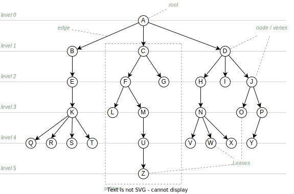
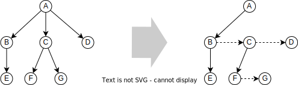
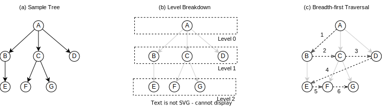
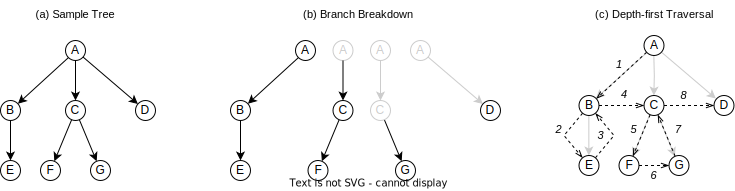

=======
 Trees
=======

:Lecture: Lecture 5.1 :download:`(slides) <_static/trees.pptx>`
:Objectives: Understand the concept of trees and how to traverse a tree
:Concepts: Tree, tree representation, depth-first traversal,
           breadth-first traversal

What Is a Tree?
===============

A natural way to approach trees is as an extension of linked lists. In
a linked list, each node has *at most one* successor. By contrast, in
a tree, each node can have zero, one, or more successors, as shown
below by :numref:`trees/intro/trees_vs_lists` below.

.. figure:: _static/images/trees_vs_lists.svg
   :name: trees/intro/trees_vs_lists

   Contrasting lists and trees: In a tree a node can have zero, one, or
   many successors.

Such tree structures are a natural way to organize things: Family
trees, taxonomies, enterprise organizations, etc. often have a
tree-like structure. Let's review a few common examples.

Family Tree
  In a family tree, each person has two "parents" as shown
  :numref:`trees/intro/family_tree`. At the bottom, Franck's parents
  are Bertrand and Catherine. Bertrand's parents are Bernard and
  Suzanne, and Catherine's parents are Roger and Jenny. This
  relationship between persons forms a tree structure.

  .. figure:: _static/images/family_tree.svg
     :name: trees/intro/family_tree

     A sample family tree showing three generations. Arrows represent
     the parent-to-child relationship.

Taxonomies
  Taxonomies is another classical example of tree structure. In
  Biology, life species are classified into various groups, nested one
  into another, as illustrated below on
  :numref:`trees/intro/life_taxonomy`. At the top level, life is split
  into "domains" (eukarya, bacteria, etc.), which are sub-divided into
  "kingdoms" (plants, animals, fungi, etc.), in turn sub-divided into
  groups, and so on and so forth.

  .. figure:: _static/images/life_taxonomy.svg
     :name: trees/intro/life_taxonomy

     Classification of life forms into domains, kingdoms, phylums, etc.

Decision Tree
  A *decision tree* is another common example. Decision trees capture
  investigations: What are the questions to ask and in what order in
  order to reach a given conclusion. Decision trees are used in
  operational research, medicine, engineering, often for diagnostic or
  planning. :numref:`trees/intro/decision_tree` below portrays a
  decision tree to help diagnose a car that does not start.

  .. figure:: _static/images/decision_tree.svg
     :name: trees/intro/decision_tree
        
     A small decision tree to diagnose a car that won't start. Final
     "nodes" are the conclusions.

.. important::

   Tree is one of the important concepts in Computer Science, as trees
   show up everywhere.
   
   * Files and folders on a computer forms a tree structure;
   * Compilers heavily rely on trees to make sense of your programs;
   * Random forest (i.e., decision trees) is one approach to machine
     learning;
   * In HTML/JavaScript, the *document object model* (DOM) forms a tree;
   * Databases use dedicated tree structures to optimize storage;
   * etc.
   

Tree Terminology
----------------

Trees come with their own vocabulary. Below are a few definitions that
will help us talk without ambiguity. :numref:`trees/intro/terminology`
illustrates the most important concepts.

   
   A sample tree

   
Node
   The main components of the tree. In
   :numref:`trees/intro/terminology`, they are the 26 letters of the
   English alphabet.

Children (of a node)
  The nodes that are directly reachable from a given node. For
  example, Node A has three "children", nodes B, C, and D.

Degree (of a node)
  Also known as *branching factor*, the degree of a node is the number
  of children of a given node. For instance, in
  :numref:`trees/intro/terminology`, Node C has a branching factor of
  2, whereas Node K has a branching factor of 4.

Descendants (of a node)
  Given a node, its descendants are all the nodes further away
  from the from root, starting with its children, its grand-children
  etc. :numref:`trees/intro/terminology` the descendants of C are F,
  G, L, M, and U.

Parent (of a node)
  Given a node, its parent is the closest node towards the root. For
  instance, :numref:`trees/intro/terminology` the parent of Node F is
  Node C, the parent of Node B is Node A, the parent of Node Q is Node
  K, etc.

Ancestors (of a node)
  Given a node, its ancestors are all the nodes on the way to the
  root. In :numref:`trees/intro/terminology`, the ancestors of Node
  U are M, F, C, and A.

Siblings (of a node)
  Given a node, its siblings are the nodes that share the same
  parent. In :numref:`trees/intro/terminology`, nodes B, C, and D
  are siblings.
  
Root (of a tree)
  The only node that has no parent. In
  :numref:`trees/intro/terminology`, the root is Node A.

Leaf Node
  A node is a *leaf* if and only if it has no child. For instance,
  in :numref:`trees/intro/terminology`, nodes Q, R, S, T, L, U, G,
  V, W, X, I, O, Y, and Z are leaves.

Subtree
  A subtree is a node and all its descendants. For instance, in
  :numref:`trees/intro/terminology`, the subset C, F, G, L, M, U, Z is
  a subtree, as is the subset M, U, Z.

Depth (of a node)
  The number of edges to the root. In
  :numref:`trees/intro/terminology`, Nodes B, C, and D have a depth
  of 1, whereas Nodes N, O, and P have a depth of 3.

Level
  The subset of nodes that are have the same depth. For instance,
  in :numref:`trees/intro/terminology`, B,C,and D are at the same
  level.

Height (of a tree)
   The depth of the deepest leaf. In
   :numref:`trees/intro/terminology`, the height of the tree is 5, the
   depth of Node Z.
  
Width (of a tree)
   The cardinality (number of nodes) of the largest level. In
   :numref:`trees/intro/terminology`, the largest level is Level 4,
   which contains 9 nodes. 

Formal Definition
-----------------

Formally, a tree :math:`t` over a set :math:`S` is defined
[#definitions]_ as an ordered pair :math:`t = (r, c)` where:

* :math:`r \in S` denotes the *root* of the tree

* :math:`c = (t_1, t_2, \ldots, t_n)` is a *sequence* of *disjoint*
  "children" trees over :math:`S`
  
.. [#definitions] There are many ways to formalize the notion of
   tree. I choose the "recursive" one, which I found the most
   concise. We will see an alternative when we discuss :doc:`graphs
   </graphs/intro/index>`.

.. margin::

   .. figure:: _static/images/small_sample.svg
      :name: trees/intro/small_sample

      A sample tree with seven nodes

Consider for instance the tree shown aside on
:numref:`trees/intro/small_sample`, following our definition above:

* This tree is built over the set :math:`S = \{A,B,C,D,E,F,G\}`;
* The whole tree is a pair :math:`t_A=(A, (t_B, t_C, t_D))`;
* The subtree whose root is B is defined as :math:`t_B = (B, (t_E))`;
* The subtree whose root is E is defined as :math:`t_E = (E, \varnothing)`;
* etc.

The fact that children trees are *disjoint* yields four important
properties:

No *cycle*
  Since there can be only one path between any pair of nodes, there
  cannot be cycles in a tree. The following example, would not be a
  valid tree. :numref:`trees/intro/cycle` illustrates this property
  with a structure that is not a tree because it has an edge from E to
  A that forms a cycle.

  .. figure:: _static/images/cycle.svg 
     :name: trees/intro/cycle

     Invalid tree that includes a cycle

Parent Uniqueness
  Except for the root, every node *has exactly
  one parent*. :numref:`trees/intro/dag` illustrates this property
  with a structure that is not a tree because one of its node has
  multiple parents.

  .. figure:: _static/images/dag.svg
     :name: trees/intro/dag

     Invalid tree where Node F has multiple parents
                 
Trees are *connected*
  A tree is a connected structure, that is there is no node or
  subtree that is pending or disconnected from the
  rest. :numref:`trees/intro/disconnected` illustrate this: Node F
  is not connected to the rest of the tree so this is not a valid
  tree.

  .. figure:: _static/images/disconnected_tree.svg
     :name: trees/intro/disconnected

     Invalid tree where Node F is disconnected from the rest

Uniqueness of Path
   In a tree, there exists *exactly one* "path" between every
   pairs of node. Such paths navigate either from parents to child
   or from child to parent, possibly through the root.,

   
Tree Implementations
====================

What data structure can we use to implement trees? As we will see
later in this module, specific type of trees have specific
implementation, but in general there are two main strategies:

* Each node has a sequence of children, as in our formal definition ;

* Each node has a reference to its first child and its first sibling.

For both, we will use again the approach we have used for :doc:`linked
lists (see Lecture 3.3) </recursion/linked_list>`, that is, to
separate the tree from its nodes. Our ``Tree`` data type acts as a
facade exposing any procedure of interest, whereas the ``Node`` type
will be the internal implementation.
  
Sequence of Children
--------------------

A first solution is to represent the children of a node using a
sequence, as shown on :numref:`trees/intro/list_of_children` above,
where each dashed boxes represents a sequences of children.

.. figure:: _static/images/list_of_children.svg
   :name: trees/intro/list_of_children

   Representing the children of a node as a sequence

In Typescript, we would create a class ``Node`` using the ``Array``
type, the JS/Typescript implementation of :doc:`dynamic arrays (see Lecture 3.3)
</sequences/dynamic_arrays>` as follows.

.. code-block:: typescript
   :emphasize-lines: 4
   :linenos:

   class Node<T> {

       readonly item: T;
       private _children: Array<Node<T>>;

       constructor(item: T, children: Array<Node<T>>) {
          this.item = item;
          this._children = children;
       }

   }

Note that our ``Node`` class forms a :doc:`recursive data type (see Lecture 3.1)
</sequences/adt>`.

Left-most Child and next Sibling
--------------------------------

An alternative is to represent each node with only two "pointers":
One to its left-most child, and one to the "next" sibling. This boils
down to encoding the children of a node as a linked
list. :numref:`trees/intro/with_siblings` illustrates this approach.

   Encoding with a tree with left-most child and next sibling

Here, dashed lines represent connection with the "next" siblings,
whereas solid lines represents connection with first child. In
Typescript for instance, we could therefore define a node class as
follows.

.. code-block:: typescript
   :emphasize-lines: 4,5
   :linenos:

   class Node<T> {
   
       public readonly item: T;
       private _child: Node<T> | null;
       private _sibling: Node<T> | null;

       constructor(item: T, child: Node<T> | null, sibling: Node<T> | null) {
           this.item = item;
           this._child = child;
           this._sibling = sibling;
       }

   }

This Node class forms a :doc:`recursive data type </sequences/adt>`,
as it refers to itself. We use `null` to represent the absence of
node, for both the first child and the next sibling.

.. note::

   This alternative representation reveals something more theoretical:
   Any tree, of whatever degree, can be represented by a binary tree,
   that is, a tree with a maximum degree of 2.

Other Representations
---------------------

There are other representations, but their is somehow less common in
my opinion. Here are some examples:

* As for linked-lists, we can use "double links" to navigate both ways
  from parents to children and from children to parent. This
  complicates operations that modify the tree.
* We can also simply store a single link to the parent node. This can
  save some memory for large trees, but complicate traversal from the
  root.
* When the tree is equivalent to a complete binary tree, we can also
  use an array to store nodes as we will do with :doc:`Heap trees
  (Lecture 5.3) </trees/heap>`.

Tree Traversals
===============

A common requirement is to list the values stored in a tree. Maybe we
are converting the tree to a sequence, checking if it contains a
specific item, or serializing the tree on disk, etc. To navigate
through these items we need to agree on an order, but which one? There
are two main strategies:

* The *breadth-first strategy* (BFS) visit nodes level by level;
* The *depth-first strategy* (DFS) visit nodes branch by branch.

In the remainder, we will consider the ``flatten`` operation, which
converts a tree into a sequence.

Breadth-first
-------------

The idea of the *breadth-first strategy* (BFS) is to visit nodes
level by level. Levels are subsets of nodes that share the same
depth, as shown on :numref:`trees/intro/bfs`.

   The breadth-first approach

On the tree from :numref:`trees/intro/bfs`, the breadth-first
approach proceeds as follows:

#. We start in Node A, the root. This our first level. Node A has
   no siblings, so we proceed the next level, that is ts children,
   where B comes first.
#. Node B has one child and a sibling C. We record its child for the
   next level, and we continue with its sibling C.
#. Node C has two children F and G, and a sibling D. We record F & G
   for the next level and we continue with D.
#. Node D has no children and no sibling. So we continue with nodes on the
   next level, the first one we have recorded is E.
#. Node E has no sibling, so we continue with the remaining nodes
   on the level, that is F.
#. Node F has no children, so we continue with its sibling G.
#. Node G has no children nor siblings. There is no more nodes on
   the level, nor on the next level. We are done.

Consider for example the ``flatten`` procedure below, implemented in
Java using this breadth-first approach. Applied to
:numref:`trees/intro/bfs`, it yields the sequence :math:`s=(A, B, C,
D, E, F, G)` provided that children nodes are pulled in alphabetical
order.
 
.. code-block:: java
   :name: trees/intro/bfs/iterative
   :linenos:
   :emphasize-lines: 2

   List<T> flatten() {
      var sequence = new ArrayList<T>();
      Queue<Node<T>> next = new LinkedList<Node<T>>();
      next.add(this.root);
      while (!next.isEmpty()) {
         var currentNode = next.remove();
         sequence.add(currentNode.item);
         for (var eachChild: currentNode.children()) {
            next.add(current);
         }
      }
      return sequence;
   }

   
Depth-first
-----------

The idea of the depth-first strategy (DFS) is to visit nodes branch by
branch. Here, a branch is a path from the root to a leaf, as detailed
on :numref:`trees/intro/dfs` below. The common part of each branch
(grayed-out) is not repeated.

   Depth-first Traversal

On the tree from :numref:`trees/intro/dfs`, the depth-first strategy
navigates as follows:

#. We start in Node A, the root. Provided we retrieve children
   in alphabetical order, we then visit B, the first child.
#. Node B has a child, E, and two siblings C and D. We go visit E..
#. Node E has no child, so we back track to B.
#. Node B has no more children to visit, but two siblings, C and D. So we
   engage into the next sibling, C.
#. Node C has two children, so we visit the first one, F
#. Node F has no children, but a sibling, G, so we continue in G
#. Node G has neither children nor siblings, so we backtrack to C
#. Node C has no more children, so we visit the next sibling, D.
#. Node D has neither children nor siblings, so we backtrack in A,
   which has no more sibling either.

Considering again the ``flatten`` operation, the DFS can be
implemented in Java as follows:
 
.. code-block:: java
   :linenos:
   :emphasize-lines: 2

   List<T> flatten() {
      var sequence = new ArrayList<T>();
      Stack<Node<T>> next = new LinkedList<Node<T>>();
      next.add(this.root);
      while (!next.isEmpty()) {
         var currentNode = next.pop();
         sequence.add(currentNode.item);
         for (var eachChild: currentNode.children()) {
            next.push(current);
         }
      }
      return sequence;
   }

Applied on the tree from :numref:`trees/intro/dfs`, this ``flatten``
procedure yields the sequence  :math:`s=(A, B, E, C, F, G, D)`.

.. important::

   The only difference between the DFS and the BFS is the use of a
   stack or queue to keep track of the node that should be visited
   next.

Recursive Implementations
.........................

The depth-first strategy directly follows our recursive definition of
trees, so it is natural to write it in a recursive way. For instance,
the ``flatten`` procedure above can be rewritten as follows:

.. code-block:: java
   :caption: Depth-first strategy implemented recursively
   :name: trees/intro/dfs/recursive
   :emphasize-lines: 4, 8, 10
   :linenos:
      
   class Tree<T> {
      
      List<T> flatten() {
         return collectItems(root, new ArrayList<T>());
      }

      private List<T> collectItems(Node<T> current, List<T> sequence) {
         sequence.add(current.item);
         for (var eachChild: current.children()) {
             collectItems(eachChild, sequence);
         }
         return sequence;
      }

   }
                
Given a node :math:`v`, our recursive procedure ``collectItems`` adds
the item carried by :math:`v` to the union of the items of all its
children.

In :numref:`trees/intro/dfs/recursive` we can also add the current
item to the sequence *after* we have looked at its children (i.e.,
insert Line 8 after Line 11). The moment we insert the current node
decide the final order of the sequence:

Pre-order
   A node is placed (or processed) *before* its children, as done on
   :numref:`trees/intro/dfs/recursive`. The result is a sequence
   :math:`s=(A, B, E, C, F, G, D)`.

Post-order
   A node is placed (or processed) *after* its children. The result is
   the sequence :math:`s=(E, B, F, G, C, D, A)`. A common example is
   the deletion of folders on disk, where a folder can be deleted only
   if its content have been already deleted.
   

