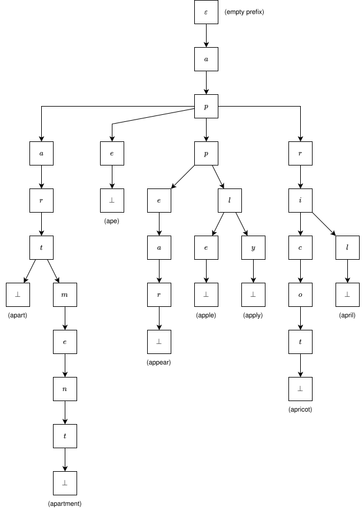

=======================
Prefix and Suffix Trees
=======================

:Lecture: Lecture 5.6 :download:`(slides)
          <https://studntnu-my.sharepoint.com/:p:/g/personal/franckc_ntnu_no/EVJ8rMN7JHdKgxTb2gWmKEwBwvMNLvO0i0k-495CCmBlJw?e=70ie5r>`
:Objectives: Understand what is a prefix and what is a suffix tree
:Concepts: Insertion, deletion and search into a Prefix-tree

.. margin::

   .. figure:: _static/images/completion.png
      :name: trees/tries/completion

      Auto-completion in a text editor based on the words already typed
      in.
           
As a last example of tree data structures, we shall look at *prefix*
and *suffix* trees. These are data structures used to speed up text
search such as auto completion in a text editors, or in text box on
modern apps and websites. :numref:`trees/tries/completion` shows an
example of "default completion", where the editor make suggestions
based on words already in the document.

Prefixes vs. Suffixes
   What are prefixes and suffixes?  Intuitively, we can say the are
   just "beginning" and "ending" of sequences. More formally, given a
   sequence of characters :math:`s = (c_1, c_2, \dots, c_n)` any
   shorted sequence :math:`s' = (c_1, \dots, c_k)` where :math:`0 \leq
   k \leq n` is a prefix of :math:`S`. For instance, the word
   "algorithm" has the following prefixes (ordered by length):

   .. math::
      P = \{ '',\, 'a',\, 'al',\, 'alg',\, 'algo',\, 'algor',\, 'algori',\,
      'algorit',\, 'algorith',\, 'algorithm' \}

   Note that the set of prefixes includes the empty sequence and the
   complete word itself.

   Similarly, suffixes are possible endings. Formally, and sequence
   :math:`s' = (c_k, \dots, c_n)` is a suffix of :math:`s`. The word
   algorithm therefore admits the following suffixes:

   .. math::
      S = \{ '',\, 'm',\, 'hm',\, 'thm',\, 'ithm',\, 'rithm',\,
      'orithm',\, 'gorithm',\, 'lgorithm', \, 'algorithm' \}
   
   

Prefix Trees
============

How can we implement such auto-completion mechanisms efficiently? What
we need is kind of :doc:`Map ADT </hashing/index>` that could give us
all the word that starts by the "prefix2 the user has typed. For
instance, given a set of words already typed,one could index them by
prefix, using a hash table. 

Structure of Prefix Trees
-------------------------

A prefix tree is built over a set of words where paths from the root
to the leaves represent different prefixes. At the end of each path,
the tree holds all the words that start with the corresponding
prefix.

A prefix tree is a :math:`n`-ary tree where every leaf node holds a
complete word. Every internal node identifies each of its children
with a single character, so that the path from the root to any leaf
(i.e., word) represents the shortest prefix that distinguishes that
word from all the others (also known as the shortest common prefix, or
LCP). :numref:`trees/tries/prefix_tree` below gives an example of
prefix tree built over the set of words:

.. math::
    S = \{'apart', \, 'ape', \, 'apear',\, 'apple',\,
    'apple',\, 'apply',\, 'apricot',\, 'april' \}`

Consider the word "apart" for instance. It is the only word among
these eight words that has the prefix "apa". Consequently, starting
from the root, the path that corresponds to the prefix "apa" leads to
"apart".

   A prefix tree built on the set of eight words :math:`S = \{'apart', \,
   'ape', \, 'apear',\, 'apple',\, 'apple',\, 'apply',\, 'apricot',\,
   'april' \}`

In this example, if we need all the words that start with the prefix
"apr", we can follow the corresponding path from the root and we land
a the root of a subtree where every leaves starts with that
prefix. The path "apr" ends on Node 5, and this subtree contains the
words "apricot" and "april", the only two words that start with "apr".
   
What about word-prefixes?
  We use a sentinel character

Compression
  How can we compress the tree

Lookup
------

Insertion
---------

Deletion
--------

Suffix Trees
============
